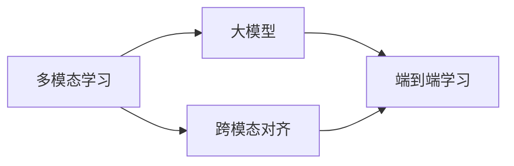

# 多模态大模型：技术原理与实战 部署环境准备

## 1. 背景介绍
### 1.1 多模态大模型概述
多模态大模型是近年来人工智能领域的一个重要突破和研究热点。它通过将不同模态的数据如文本、图像、音频等融合到一个统一的模型架构中,实现了跨模态的信息理解和生成。多模态大模型具有强大的学习能力和泛化能力,在自然语言处理、计算机视觉、语音识别等领域取得了显著的进展。

### 1.2 多模态大模型的应用前景
多模态大模型在实际应用中展现出巨大的潜力。例如,在智能客服领域,多模态大模型可以同时处理用户的文本询问和图片上传,提供更加准确和全面的回答;在医疗诊断领域,多模态大模型可以综合分析患者的病历文本、影像数据和生理指标,辅助医生做出诊断决策;在教育领域,多模态大模型可以根据学生的学习行为、作业内容和互动数据,提供个性化的学习反馈和推荐。

### 1.3 多模态大模型的部署环境准备
为了将多模态大模型应用到实际生产环境中,需要进行必要的部署环境准备工作。这包括硬件设施的配置、软件框架的选择、数据的收集和预处理等。合理的部署环境准备可以保证模型的高效运行和可靠性,同时也为后续的模型优化和更新提供了基础。

## 2. 核心概念与联系
### 2.1 多模态学习
多模态学习是指利用不同模态的数据进行联合学习的过程。不同模态的数据可以互补彼此的信息,帮助模型构建更加全面和准确的认知。例如,文本数据可以提供语义信息,图像数据可以提供视觉信息,音频数据可以提供声学信息。多模态学习的目标是找到不同模态之间的关联和映射关系,从而实现跨模态的信息融合和理解。

### 2.2 大模型
大模型是指参数量极其庞大的深度学习模型。通常,大模型的参数量可以达到数亿甚至数十亿的量级。大模型通过海量的数据训练,可以学习到丰富的知识和复杂的模式。与传统的小模型相比,大模型具有更强的表达能力和泛化能力,在许多任务上取得了显著的性能提升。但是,大模型也带来了训练和推理的巨大开销,需要采用特殊的优化技术和硬件加速手段。

### 2.3 跨模态对齐
跨模态对齐是指在不同模态的表示空间中找到语义上等价的表示。由于不同模态的数据具有不同的特征和分布,直接在原始特征空间中进行对齐是困难的。因此,需要通过特征变换和映射的方式,将不同模态的数据映射到一个共同的语义空间中。常见的跨模态对齐方法包括对抗学习、度量学习、注意力机制等。

### 2.4 端到端学习
端到端学习是指将原本由多个子模块组成的系统整合为一个统一的模型,并通过端到端的梯度反向传播来优化整个系统。与传统的流水线方式相比,端到端学习可以避免子模块之间的信息损失和误差传播,同时也简化了系统的设计和实现。在多模态大模型中,端到端学习可以将不同模态的特征提取、跨模态对齐、任务预测等环节整合到一个统一的框架中,实现高效和可扩展的学习。

### 核心概念与联系总结
下面是核心概念与联系的 Mermaid 流程图:


## 3. 核心算法原理与具体操作步骤
### 3.1 多模态融合
多模态融合是多模态大模型的核心算法之一。其目的是将不同模态的信息进行有效的整合,形成一个统一的表示。常见的多模态融合方法包括:

1. 特征级融合:将不同模态提取的特征向量拼接或相加,形成一个联合特征向量。
2. 决策级融合:对不同模态的预测结果进行加权平均或投票,得到最终的预测结果。
3. 模型级融合:设计特殊的网络结构如多头注意力机制,将不同模态的信息在模型内部进行交互和融合。

具体操作步骤如下:
1. 对不同模态的数据进行预处理,如文本分词、图像归一化等。
2. 使用独立的编码器对每种模态的数据进行特征提取,得到各自的特征表示。
3. 根据选定的融合策略,将不同模态的特征进行融合,得到联合表示。
4. 将联合表示输入到后续的任务模型中,如分类器、生成器等,进行训练和预测。

### 3.2 预训练-微调范式
预训练-微调范式是大模型训练的重要范式。其基本思想是先在大规模无标注数据上进行自监督的预训练,学习通用的语言知识和模式;然后在特定任务的小规模标注数据上进行微调,使模型适应具体的应用场景。

具体操作步骤如下:
1. 收集大规模的无标注数据,如网页文本、图像等。
2. 设计合适的预训练任务和损失函数,如掩码语言模型、对比学习等。
3. 在预训练数据上训练模型,得到初始化的模型参数。
4. 根据具体任务的需求,收集和标注少量的数据作为微调集。
5. 在预训练模型的基础上,使用微调数据进行训练,更新部分或全部的模型参数。
6. 在测试集上评估微调后的模型性能,进行必要的调优和迭代。

### 3.3 对比学习
对比学习是一种无监督的表示学习方法,通过最大化正样本对的相似度和最小化负样本对的相似度,来学习数据的语义表示。在多模态场景下,对比学习可以用于实现跨模态的对齐和映射。

具体操作步骤如下:
1. 构建正样本对和负样本对,其中正样本对是不同模态的同一语义实体,负样本对是随机采样的不同语义实体。
2. 使用编码器将样本对映射到共同的语义空间中,得到它们的语义表示。
3. 计算正样本对的相似度和负样本对的相似度,构建对比损失函数。
4. 最小化对比损失函数,更新编码器的参数,使得正样本对的相似度最大化,负样本对的相似度最小化。
5. 重复步骤1-4,直到模型收敛或达到预设的迭代次数。

## 4. 数学模型和公式详细讲解举例说明
### 4.1 注意力机制
注意力机制是多模态大模型中广泛使用的一种机制,它可以帮助模型在不同模态之间建立对齐和关联。以文本-图像跨模态任务为例,给定一个文本序列 $\mathbf{w}=\{w_1,w_2,\dots,w_n\}$ 和一个图像特征矩阵 $\mathbf{v}=\{\mathbf{v}_1,\mathbf{v}_2,\dots,\mathbf{v}_m\}$,注意力机制可以计算文本中每个词与图像中每个区域之间的注意力权重:

$$
\alpha_{ij} = \frac{\exp(f(\mathbf{w}_i, \mathbf{v}_j))}{\sum_{k=1}^m \exp(f(\mathbf{w}_i, \mathbf{v}_k))}
$$

其中,$f(\cdot)$ 是一个对齐函数,用于计算文本特征 $\mathbf{w}_i$ 和图像特征 $\mathbf{v}_j$ 之间的相似度。常见的对齐函数包括点积、拼接、双线性映射等。

有了注意力权重后,可以计算文本序列在图像上的注意力表示:

$$
\mathbf{a}_i = \sum_{j=1}^m \alpha_{ij} \mathbf{v}_j
$$

$\mathbf{a}_i$ 表示第 $i$ 个词在图像上的注意力表示,融合了图像中与该词相关的区域信息。最终,可以将注意力表示与原始文本特征拼接,送入后续的模型中进行预测。

### 4.2 对比损失函数
对比损失函数是对比学习中常用的一种损失函数,用于度量正样本对的相似度和负样本对的相似度。以文本-图像对比学习为例,给定一个文本编码器 $f_t(\cdot)$ 和一个图像编码器 $f_v(\cdot)$,对于一个正样本对 $(t_i, v_i)$,其对比损失为:

$$
\mathcal{L}_i = -\log \frac{\exp(\mathrm{sim}(f_t(t_i), f_v(v_i))/\tau)}{\sum_{j=1}^N \exp(\mathrm{sim}(f_t(t_i), f_v(v_j))/\tau)}
$$

其中,$\mathrm{sim}(\cdot)$ 是相似度函数,常用的有余弦相似度、点积等;$\tau$ 是温度超参数,用于控制分布的平滑度;$N$ 是负样本的数量。

直观地理解,对比损失函数鼓励正样本对的相似度尽可能大,同时鼓励负样本对的相似度尽可能小。通过最小化所有正样本对的对比损失,可以学习到跨模态的语义对齐表示。

### 4.3 掩码语言模型
掩码语言模型是一种自监督的预训练任务,通过随机掩盖部分词语,预测被掩盖的词语,来学习语言的上下文表示。以 BERT 模型为例,其掩码语言模型的损失函数为:

$$
\mathcal{L}_{\mathrm{MLM}} = -\sum_{i=1}^n m_i \log p(w_i|\mathbf{w}_{\backslash i})
$$

其中,$m_i$ 是掩码指示变量,表示第 $i$ 个词是否被掩盖;$p(w_i|\mathbf{w}_{\backslash i})$ 是给定上下文 $\mathbf{w}_{\backslash i}$ 的情况下,预测第 $i$ 个词的概率。

通过最小化掩码语言模型的损失函数,可以学习到词语的上下文表示,捕捉词语之间的语义关系。在多模态场景下,可以将不同模态的数据视为不同的"词语",通过掩码语言模型来学习它们之间的关联和对齐。

## 5. 项目实践：代码实例和详细解释说明
下面是一个基于 PyTorch 实现的多模态对比学习的简单示例:

```python
import torch
import torch.nn as nn
import torch.nn.functional as F

# 文本编码器
class TextEncoder(nn.Module):
    def __init__(self, vocab_size, embed_dim, hidden_dim):
        super().__init__()
        self.embedding = nn.Embedding(vocab_size, embed_dim)
        self.fc = nn.Linear(embed_dim, hidden_dim)
        
    def forward(self, x):
        x = self.embedding(x)
        x = torch.mean(x, dim=1)
        x = self.fc(x)
        return x

# 图像编码器  
class ImageEncoder(nn.Module):
    def __init__(self, input_dim, hidden_dim):
        super().__init__()
        self.fc1 = nn.Linear(input_dim, hidden_dim)
        self.fc2 = nn.Linear(hidden_dim, hidden_dim)
        
    def forward(self, x):
        x = F.relu(self.fc1(x))
        x = self.fc2(x)
        return x

# 对比损失函数
def contrastive_loss(text_feat, img_feat, tau=0.5):
    # 计算文本和图像特征之间的相似度
    sim_matrix = torch.matmul(text_feat, img_feat.t())
    sim_matrix = sim_matrix / tau
    
    # 构建标签矩阵,对角线为1,其余为0
    labels = torch.arange(sim_matrix.size(0))
    labels = labels.to(sim_matrix.device)
    labels = (labels.expand(sim_matrix.size(0), sim_matrix.size(1)) == labels.view(-1, 1)).float()
    
    # 计算对比损失
    loss = nn.CrossEntropyLoss()(sim_matrix, labels