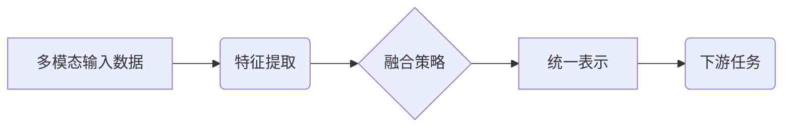
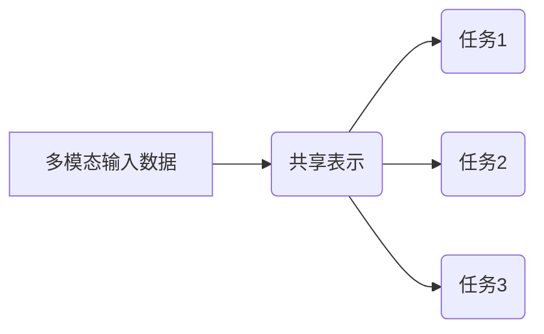
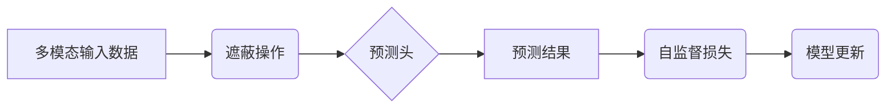
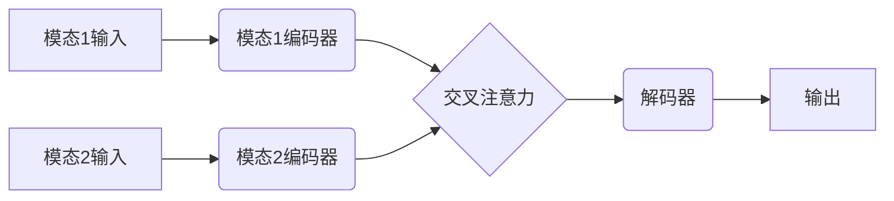
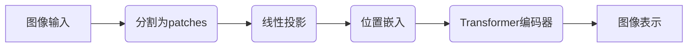
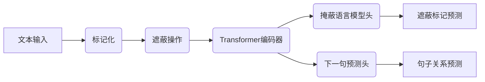
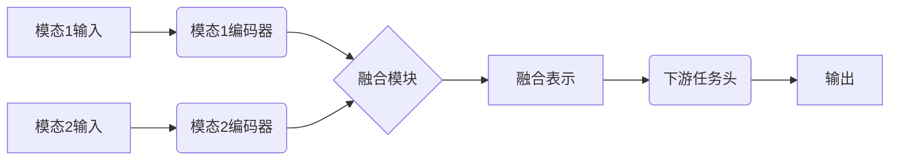

# 多模态大模型：技术原理与实战 部署过程中常见的问题总结

## 1.背景介绍

### 1.1 人工智能的发展历程

人工智能(AI)的发展经历了几个重要阶段。早期的人工智能系统主要基于规则和逻辑推理,但由于知识库的局限性和缺乏学习能力,其应用范围有限。随着机器学习和深度学习技术的兴起,人工智能进入了一个新的发展阶段。

### 1.2 深度学习的兴起

深度学习技术能够从大量数据中自动学习特征表示,并在计算机视觉、自然语言处理等领域取得了突破性进展。然而,传统的深度学习模型通常专注于单一模态(如文本或图像),无法充分利用多种模态之间的相关性。

### 1.3 多模态学习的兴起

为了更好地理解和模拟人类的认知过程,多模态学习应运而生。多模态学习旨在从不同模态(如文本、图像、视频和音频)中融合信息,以获得更全面、更丰富的表示。这种方法更接近于人类的感知和理解方式,为人工智能系统带来了新的发展机遇。

### 1.4 大模型的崛起

近年来,随着计算能力的提高和大规模数据集的出现,训练大型神经网络模型成为可能。这些被称为"大模型"的巨型神经网络能够在各种任务上取得出色表现,成为人工智能领域的一个重要发展方向。

多模态大模型将多模态学习和大模型的优势结合起来,旨在构建能够处理多种模态输入并产生多种模态输出的统一模型。这种模型具有巨大的潜力,可以在各种复杂的人工智能任务中发挥作用。

## 2.核心概念与联系

### 2.1 多模态表示学习

多模态表示学习是多模态大模型的核心概念之一。它旨在从不同模态的输入数据中学习一种统一的表示,捕捉不同模态之间的相关性和互补性。这种表示应该能够编码各个模态的信息,并且在不同的任务中具有很强的泛化能力。

上图展示了多模态表示学习的基本流程。首先,从不同模态的输入数据中提取特征。然后,使用适当的融合策略(如早期融合、晚期融合或混合融合)将不同模态的特征融合成一种统一的表示。最后,这种统一的表示可以用于各种下游任务,如分类、检测或生成等。

### 2.2 多任务学习

多任务学习是另一个与多模态大模型密切相关的概念。它旨在同时优化多个相关任务的性能,利用不同任务之间的相关性来提高每个单个任务的泛化能力。

在多模态大模型中,多任务学习可以帮助模型更好地捕捉不同模态之间的关系,并提高模型在各种任务上的性能。例如,一个多模态大模型可以同时进行图像分类、文本生成和视频描述等任务,这些任务之间存在一定的相关性。

上图展示了多任务学习在多模态大模型中的应用。不同模态的输入数据首先被编码为一种共享的表示。然后,这种共享表示被用于多个相关任务的优化,每个任务都有自己的专用头部。通过共享底层表示,模型可以利用不同任务之间的相关性,提高整体性能。

### 2.3 自监督学习

自监督学习是一种无需人工标注的学习范式,它通过从原始数据中构建预测任务来训练模型。在多模态大模型中,自监督学习可以用于从大量未标注的多模态数据中学习有效的表示。

一种常见的自监督学习策略是遮蔽(Masking),即在输入数据中随机遮蔽部分信息,然后要求模型预测被遮蔽的部分。例如,在处理图像和文本的多模态任务中,可以将图像的一部分遮蔽,并要求模型根据文本和其他图像部分预测被遮蔽的像素值。

上图展示了自监督学习在多模态大模型中的应用流程。首先,对原始的多模态输入数据进行遮蔽操作。然后,模型需要预测被遮蔽的部分。预测结果与原始数据进行比较,计算自监督损失。最后,根据这个损失更新模型参数。通过这种方式,模型可以从大量未标注的数据中学习有效的表示。

## 3.核心算法原理具体操作步骤

### 3.1 Transformer 模型

Transformer 是多模态大模型中广泛使用的一种核心架构。它基于自注意力(Self-Attention)机制,能够有效地捕捉输入序列中的长程依赖关系。

Transformer 的基本构建模块是编码器(Encoder)和解码器(Decoder)。编码器将输入序列编码为一系列表示,解码器则根据这些表示生成输出序列。在多模态场景下,不同模态的输入可以被并行编码,然后通过交叉注意力(Cross-Attention)机制融合不同模态的信息。

上图展示了 Transformer 在多模态场景下的工作流程。不同模态的输入分别被对应的编码器编码,然后通过交叉注意力机制融合不同模态的表示。最后,解码器根据融合后的表示生成输出。

Transformer 的自注意力机制使其能够有效地捕捉不同模态之间的相关性,因此在多模态任务中表现出色。此外,Transformer 的并行性质也使其能够高效地处理大规模数据,这对于训练大型多模态模型至关重要。

### 3.2 Vision Transformer (ViT)

Vision Transformer (ViT) 是 Transformer 在计算机视觉领域的一种应用,它将图像分割为一系列patches(图像块),并将每个patch投影为一个向量序列,然后使用标准的 Transformer 编码器对这些向量序列进行建模。

ViT 的工作流程如下:

1. 将输入图像分割为一系列固定大小的patches。
2. 将每个patch映射为一个向量(通过线性投影)。
3. 为这些向量添加位置嵌入(Positional Embedding),以保留patch在原始图像中的位置信息。
4. 将这些嵌入向量输入标准的 Transformer 编码器,进行自注意力计算和特征提取。
5. 对编码器的输出进行归一化,得到图像的最终表示。

上图展示了 ViT 的基本工作流程。ViT 将图像视为一系列patches的序列,并使用 Transformer 编码器对这些序列进行建模,从而学习图像的有效表示。

ViT 在许多计算机视觉任务中表现出色,并且由于其并行性质,可以高效地处理大规模图像数据。在多模态大模型中,ViT 常被用作图像编码器,与其他模态(如文本)的编码器结合,实现多模态融合和建模。

### 3.3 BERT 和其变体

BERT (Bidirectional Encoder Representations from Transformers) 是一种基于 Transformer 的自然语言处理模型,它通过掩蔽语言模型(Masked Language Model)和下一句预测(Next Sentence Prediction)任务进行预训练,学习到了丰富的语义和上下文表示。

BERT 的预训练过程如下:

1. 对输入文本进行标记化,将其表示为一系列标记(token)序列。
2. 随机遮蔽部分标记,要求模型预测被遮蔽的标记。
3. 对相邻的两个句子进行二元分类,判断它们是否连续。
4. 使用 Transformer 编码器对标记序列进行编码,并优化掩蔽语言模型和下一句预测任务的损失函数。

上图展示了 BERT 的预训练过程。通过掩蔽语言模型和下一句预测任务,BERT 学习到了丰富的语义和上下文表示,这些表示可以用于各种自然语言处理任务,如文本分类、问答系统等。

在多模态大模型中,BERT 及其变体(如 DistilBERT、RoBERTa 等)常被用作文本编码器,与其他模态(如图像、视频)的编码器结合,实现多模态融合和建模。

### 3.4 多模态融合策略

在多模态大模型中,如何有效地融合不同模态的信息是一个关键问题。常见的融合策略包括:

1. **早期融合(Early Fusion)**:在特征提取阶段,将不同模态的原始输入数据连接(或级联)在一起,然后使用单一的编码器对连接后的数据进行编码。这种策略的优点是简单,但可能无法充分捕捉不同模态之间的相关性。

2. **晚期融合(Late Fusion)**:对每个模态单独进行特征提取,然后将不同模态的特征向量连接(或级联)在一起,作为后续任务的输入。这种策略能够保留每个模态的独特特征,但融合过程可能不够紧密。

3. **混合融合(Hybrid Fusion)**:结合早期融合和晚期融合的优点。在特征提取阶段,不同模态的输入被单独编码,然后使用交叉注意力(Cross-Attention)或其他机制融合不同模态的特征表示。这种策略能够在保留每个模态独特特征的同时,实现更紧密的多模态融合。

上图展示了混合融合策略在多模态大模型中的应用。不同模态的输入首先被对应的编码器编码,然后通过融合模块(如交叉注意力)融合不同模态的表示。融合后的表示被输入到下游任务头,生成最终的输出。

选择合适的融合策略对于多模态大模型的性能至关重要。一般来说,混合融合策略能够更好地捕捉不同模态之间的相关性,因此被广泛采用。

## 4.数学模型和公式详细讲解举例说明

### 4.1 自注意力机制

自注意力(Self-Attention)是 Transformer 模型的核心机制,它允许模型捕捉输入序列中任意两个位置之间的依赖关系。

给定一个输入序列 $X = (x_1, x_2, \dots, x_n)$,其中每个 $x_i$ 是一个向量,自注意力机制计算每个位置 $i$ 的输出向量 $y_i$ 如下:

$$y_i = \sum_{j=1}^n \alpha_{ij}(x_jW^V)$$

其中,

- $W^V$ 是一个可学习的