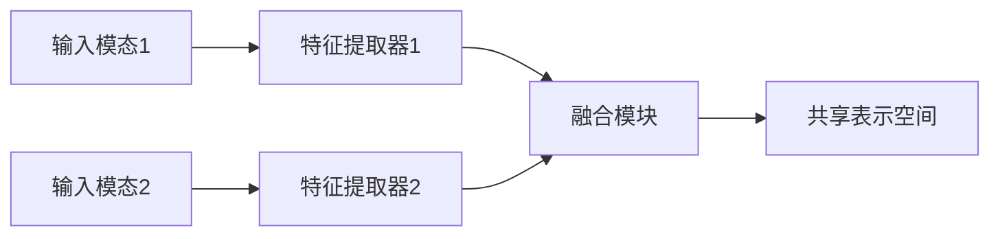
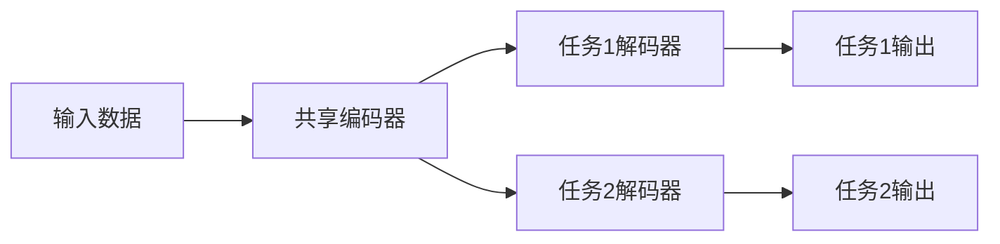
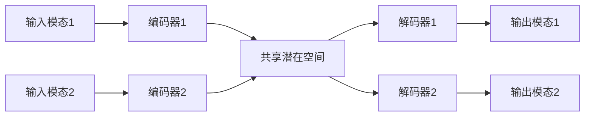

# 多模态学习原理与代码实战案例讲解

## 1.背景介绍

在当今信息时代,数据呈现多种形式,如文本、图像、视频、语音等。传统的机器学习方法通常只关注单一模态数据,但现实世界中的数据通常包含多种模态。为了更好地利用这些多模态数据,多模态学习(Multimodal Learning)应运而生。

多模态学习旨在从不同模态的数据中捕获相关信息,并将这些信息融合以获得更准确、更鲁棒的模型表示。它在许多领域有着广泛的应用,如计算机视觉、自然语言处理、多媒体分析等。

### 1.1 什么是多模态数据?

多模态数据是指包含多种形式的异构数据,如文本、图像、视频、语音等。每种模态都提供了对同一个实体或事件的不同视角和补充信息。例如,一张图像可以显示物体的视觉特征,而相关文本可以提供语义描述。将这些不同模态的信息融合,可以获得更全面、更丰富的表示。

### 1.2 多模态学习的重要性

相比单一模态的数据,多模态数据具有以下优势:

1. **信息互补性**: 不同模态提供了互补的信息,可以弥补单一模态数据的不足。
2. **鲁棒性增强**: 通过融合多个模态,模型可以减少单一模态数据的噪声和不确定性的影响,从而提高鲁棒性。
3. **语义理解增强**: 多模态数据可以提供更丰富的语义信息,有助于机器更好地理解和表示复杂的概念和场景。

因此,多模态学习在计算机视觉、自然语言处理、多媒体分析等领域发挥着重要作用,有助于提高模型的性能和泛化能力。

## 2.核心概念与联系

### 2.1 多模态表示学习

多模态表示学习(Multimodal Representation Learning)是多模态学习的核心任务之一。它旨在从多个异构模态中学习一种统一的表示,捕获不同模态之间的相关性和互补性。

一种常见的方法是将不同模态的数据映射到同一个共享的潜在空间,在该空间中,不同模态的相似数据点彼此靠近。这种共享表示可以用于各种下游任务,如分类、检索、生成等。

上图展示了多模态表示学习的基本流程。不同模态的输入数据首先通过对应的特征提取器提取特征,然后将这些特征融合到一个共享的表示空间中。

### 2.2 多模态融合

多模态融合(Multimodal Fusion)是多模态学习中另一个关键问题。它涉及如何有效地将来自不同模态的信息融合在一起,以获得更好的表示和性能。

常见的融合策略包括:

1. **早期融合(Early Fusion)**: 在特征提取阶段,直接将不同模态的原始数据拼接在一起,然后使用单一的模型进行处理。
2. **晚期融合(Late Fusion)**: 首先分别从每个模态中提取特征,然后在较高层次上将这些特征进行融合。
3. **核心融合(Kernel Fusion)**: 在核心空间中融合不同模态的核函数。
4. **张量融合(Tensor Fusion)**: 将不同模态的特征表示为张量,然后在张量空间中进行融合。

不同的融合策略适用于不同的场景,需要根据具体任务和数据特点进行选择。

### 2.3 多任务学习

多任务学习(Multi-Task Learning)是另一个与多模态学习密切相关的概念。它旨在同时学习多个相关任务,利用不同任务之间的相关性来提高模型的泛化能力。

在多模态学习中,常常会涉及多个相关的任务,如图像分类、图像描述生成等。通过多任务学习,可以共享不同任务之间的知识和表示,从而提高模型的性能和效率。

上图展示了一个多任务学习的示例。输入数据首先通过一个共享的编码器提取特征,然后将这些特征输入到不同任务的解码器中,得到相应任务的输出。通过共享编码器,不同任务可以共享底层的表示,从而提高模型的泛化能力。

## 3.核心算法原理具体操作步骤

### 3.1 多模态自编码器

多模态自编码器(Multimodal Autoencoder)是一种常用的多模态表示学习模型。它通过重构不同模态的输入数据,学习一种共享的潜在表示。

1. **输入数据**: 包含多个模态的异构数据,如图像和文本。
2. **编码器**: 将每个模态的输入数据映射到一个共享的潜在空间,得到潜在表示向量。
3. **解码器**: 从潜在表示向量重构每个模态的输出数据。
4. **损失函数**: 通常使用重构损失,即输出数据与原始输入数据之间的差异。
5. **优化**: 通过梯度下降等优化算法,最小化重构损失,从而学习到最优的潜在表示。

上图展示了多模态自编码器的基本结构。不同模态的输入数据通过对应的编码器映射到共享的潜在空间,然后通过解码器重构输出数据。通过最小化重构损失,可以学习到一种捕获不同模态相关性的潜在表示。

### 3.2 多模态注意力机制

注意力机制(Attention Mechanism)是多模态学习中一种常用的技术,它可以帮助模型关注输入数据中最相关的部分,从而提高模型的性能。

在多模态场景下,注意力机制可以用于捕获不同模态之间的相关性。具体步骤如下:

1. **特征提取**: 从每个模态的输入数据中提取特征向量。
2. **相似性计算**: 计算不同模态特征向量之间的相似性,通常使用点积或其他相似性度量。
3. **注意力权重计算**: 根据相似性得分计算每个模态的注意力权重。
4. **加权求和**: 将不同模态的特征向量根据对应的注意力权重进行加权求和,得到融合后的表示向量。

$$
\begin{aligned}
    a_{ij} &= \text{Similarity}(f_i, f_j) \\
    \alpha_i &= \text{Softmax}(a_i) \\
    h &= \sum_{i} \alpha_i f_i
\end{aligned}
$$

其中 $f_i$ 和 $f_j$ 分别表示不同模态的特征向量, $a_{ij}$ 是它们之间的相似性得分, $\alpha_i$ 是归一化后的注意力权重, $h$ 是融合后的表示向量。

通过注意力机制,模型可以自适应地关注不同模态之间最相关的部分,从而获得更好的表示和性能。

### 3.3 对比学习

对比学习(Contrastive Learning)是一种无监督表示学习的方法,它通过最大化相似样本之间的相似性,最小化不相似样本之间的相似性,来学习数据的潜在表示。

在多模态学习中,对比学习可以用于捕获不同模态之间的相关性。具体步骤如下:

1. **数据增强**: 对每个模态的输入数据进行数据增强,生成多个视图(views)。
2. **编码器**: 将每个视图输入到对应的编码器中,得到潜在表示向量。
3. **对比损失计算**: 计算同一个样本不同视图之间的相似性得分(正样本),以及不同样本视图之间的相似性得分(负样本)。
4. **损失函数**: 最大化正样本的相似性得分,最小化负样本的相似性得分。
5. **优化**: 通过梯度下降等优化算法,最小化对比损失,从而学习到最优的潜在表示。

$$
\mathcal{L}_i = -\log \frac{\exp(\text{sim}(z_i, z_j) / \tau)}{\sum_{k \neq i} \exp(\text{sim}(z_i, z_k) / \tau)}
$$

其中 $z_i$ 和 $z_j$ 是同一个样本的两个视图的表示向量, $z_k$ 是其他负样本的表示向量, $\text{sim}(\cdot, \cdot)$ 是相似性函数(如点积), $\tau$ 是温度超参数。

通过对比学习,模型可以学习到捕获不同模态相关性的表示,而无需显式的监督信号。

## 4.数学模型和公式详细讲解举例说明

### 4.1 多核学习

多核学习(Multiple Kernel Learning, MKL)是一种将多个核函数融合在一起的方法,它可以用于多模态数据的表示和建模。

在多核学习中,每个模态都有一个对应的核函数 $k_m(\cdot, \cdot)$,用于计算该模态数据之间的相似性。然后,这些核函数被线性组合,形成一个综合核函数:

$$
K = \sum_{m=1}^M \eta_m K_m
$$

其中 $K_m$ 是第 $m$ 个模态的核矩阵, $\eta_m$ 是对应的组合权重,满足 $\sum_{m=1}^M \eta_m = 1$。

这个综合核函数可以用于各种核方法,如支持向量机(SVM)、核岭回归等。通过学习最优的组合权重 $\eta_m$,可以获得最佳的多模态表示和性能。

例如,在多模态分类任务中,可以使用多核 SVM:

$$
\begin{aligned}
    \min_{\mathbf{w}, b, \boldsymbol{\xi}, \boldsymbol{\eta}} \quad & \frac{1}{2} \|\mathbf{w}\|^2 + C \sum_{i=1}^n \xi_i \\
    \text{s.t.} \quad & y_i \left(\sum_{m=1}^M \eta_m \langle \mathbf{w}_m, \phi_m(\mathbf{x}_i^m) \rangle + b\right) \geq 1 - \xi_i, \quad \xi_i \geq 0, \quad \sum_{m=1}^M \eta_m = 1
\end{aligned}
$$

其中 $\mathbf{x}_i^m$ 是第 $i$ 个样本的第 $m$ 个模态数据, $\phi_m(\cdot)$ 是对应的特征映射函数, $\mathbf{w}_m$ 是每个模态的权重向量, $\eta_m$ 是组合权重。

通过优化上述目标函数,可以同时学习分类器参数和最优的模态组合权重,从而获得最佳的多模态分类性能。

### 4.2 张量融合

张量融合(Tensor Fusion)是一种将多个模态的特征表示为张量,然后在张量空间中进行融合的方法。

假设有 $M$ 个模态,每个模态的特征向量维度分别为 $d_1, d_2, \ldots, d_M$。我们可以将这些特征向量拼接成一个张量 $\mathcal{T} \in \mathbb{R}^{d_1 \times d_2 \times \cdots \times d_M}$。

然后,我们可以在张量空间中进行各种操作,如张量外积、张量投影等,来实现多模态融合。

一种常见的张量融合方法是张量外积:

$$
\mathcal{T} = \mathbf{v}_1 \otimes \mathbf{v}_2 \otimes \cdots \otimes \mathbf{v}_M
$$

其中 $\mathbf{v}_m \in \mathbb{R}^{d_m}$ 是第 $m$ 个模态的特征向量,张量外积 $\otimes$ 是按元素相乘的