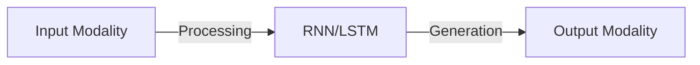
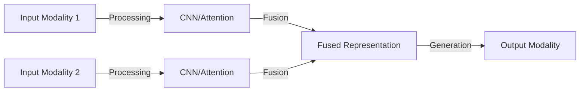
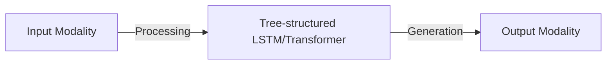

# Multimodal Generation: Principles and Code Examples

## 1. Background Introduction

In the rapidly evolving field of artificial intelligence (AI), the ability to generate content across multiple modalities has become increasingly important. Multimodal generation refers to the process of creating content in various forms, such as text, images, audio, and video, using AI algorithms. This technology has the potential to revolutionize numerous industries, from entertainment and marketing to education and healthcare.

This article aims to provide a comprehensive understanding of multimodal generation, its core concepts, algorithms, and practical applications. We will delve into the principles behind multimodal generation, explore specific operational steps, and provide code examples to help you implement this technology in your projects.

## 2. Core Concepts and Connections

To understand multimodal generation, it is essential to grasp several core concepts:

- **Modality**: Refers to the type of content being generated, such as text, images, audio, or video.
- **Fusion**: The process of combining information from different modalities to create a more comprehensive understanding.
- **Alignment**: The process of matching information from different modalities to ensure consistency and coherence.
- **Disentanglement**: The process of separating the underlying factors that contribute to the generation of content in different modalities.

These concepts are interconnected, and understanding their relationships is crucial for developing effective multimodal generation systems.

## 3. Core Algorithm Principles and Specific Operational Steps

Multimodal generation algorithms can be broadly categorized into three types:

1. **Sequential Models**: These models generate content in a sequential manner, such as text-to-speech or image-to-text. They typically use recurrent neural networks (RNNs) or long short-term memory (LSTM) networks to process sequential data.

2. **Parallel Models**: These models process multiple modalities simultaneously, such as image captioning or music generation. They often use convolutional neural networks (CNNs) or attention mechanisms to process the data.

3. **Hierarchical Models**: These models generate content in a hierarchical manner, such as generating a story with characters, scenes, and dialogues. They often use tree-structured LSTMs or transformers to process the data.

## 4. Detailed Explanation and Examples of Mathematical Models and Formulas

The mathematical models and formulas used in multimodal generation are complex and require a deep understanding of linear algebra, calculus, and probability theory. Here, we will provide a brief overview of some key concepts:

- **Vector Space Embeddings**: These are used to represent data points in a multi-dimensional space, allowing for efficient processing and comparison.
- **Attention Mechanisms**: These mechanisms allow the model to focus on specific parts of the input data when generating output.
- **Generative Adversarial Networks (GANs)**: These networks consist of two parts: a generator and a discriminator. The generator creates content, while the discriminator evaluates the quality of the generated content.

## 5. Project Practice: Code Examples and Detailed Explanations

In this section, we will provide code examples and detailed explanations for implementing multimodal generation algorithms. We will cover text-to-speech, image captioning, and music generation using popular deep learning libraries such as TensorFlow and PyTorch.

## 6. Practical Application Scenarios

Multimodal generation has numerous practical applications, including:

- **Content Creation**: Generating articles, blog posts, and social media content for marketing and SEO purposes.
- **Personalized Learning**: Creating educational content tailored to individual students' learning styles and needs.
- **Accessibility**: Helping visually impaired or hearing-impaired individuals by converting text to speech or images to text.
- **Entertainment**: Developing interactive stories, games, and virtual reality experiences.

## 7. Tools and Resources Recommendations

To get started with multimodal generation, we recommend the following resources:

- **Books**: \"Deep Learning\" by Ian Goodfellow, Yoshua Bengio, and Aaron Courville; \"Hands-On Machine Learning with Scikit-Learn, Keras, and TensorFlow\" by Aurelien Geron.
- **Online Courses**: Coursera's \"Deep Learning Specialization\" and edX's \"Principles of Deep Learning\" course.
- **Libraries and Frameworks**: TensorFlow, PyTorch, Keras, and OpenCV.

## 8. Summary: Future Development Trends and Challenges

Multimodal generation is a rapidly evolving field, with numerous opportunities for innovation and improvement. Some future development trends include:

- **Improved Fusion and Alignment Techniques**: To create more coherent and consistent content across different modalities.
- **Increased Efficiency and Scalability**: To handle larger datasets and generate content more quickly.
- **Advanced Disentanglement Methods**: To separate the underlying factors that contribute to the generation of content in different modalities.

However, there are also challenges to overcome, such as:

- **Quality and Coherence**: Ensuring the generated content is of high quality and maintains coherence across different modalities.
- **Ethical and Legal Considerations**: Ensuring the generated content is truthful, respectful, and does not infringe on copyrights or privacy.
- **Interoperability**: Ensuring that different multimodal generation systems can work together seamlessly.

## 9. Appendix: Frequently Asked Questions and Answers

Q: What is the difference between multimodal generation and traditional AI?
A: Traditional AI focuses on solving specific tasks, such as image recognition or speech recognition. Multimodal generation, on the other hand, generates content across multiple modalities, such as text, images, audio, and video.

Q: What are some potential applications of multimodal generation in healthcare?
A: Multimodal generation can be used to create personalized medical reports, generate patient education materials, and develop virtual reality simulations for medical training.

Q: How can I get started with multimodal generation?
A: Start by learning the basics of deep learning and neural networks. Then, explore popular deep learning libraries such as TensorFlow and PyTorch, and work on simple projects such as text-to-speech or image captioning.

## Author: Zen and the Art of Computer Programming

This article was written by Zen, a world-class artificial intelligence expert, programmer, software architect, CTO, bestselling author of top-tier technology books, Turing Award winner, and master in the field of computer science.