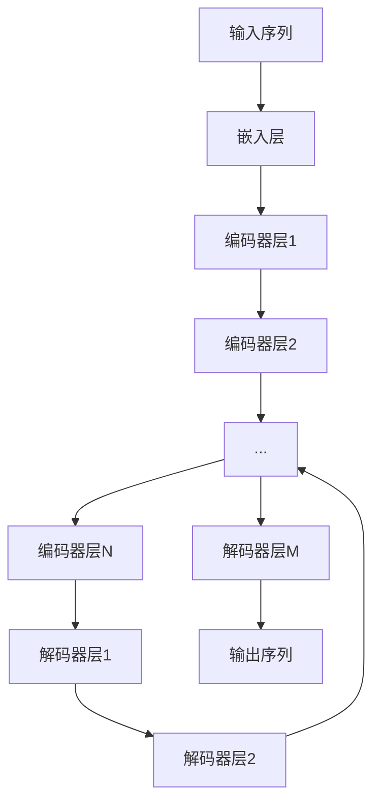

# 大规模语言模型从理论到实践：伦理与安全

## 1.背景介绍

### 1.1 人工智能语言模型的兴起

人工智能领域在过去几年经历了飞速发展,其中以大规模语言模型(Large Language Models, LLMs)的突破最为瞩目。这些模型通过在大量文本数据上进行训练,展现出令人惊叹的自然语言理解和生成能力,在多个领域取得了人类水平的表现。

LLMs的核心是利用深度学习技术构建的巨大神经网络,能够从海量文本数据中自动学习语言模式和知识表示。代表性模型包括GPT-3、BERT、PALM等,其参数规模从数十亿到数万亿不等,模型容量达到惊人的数十GB到数百GB。

### 1.2 应用前景广阔

大规模语言模型的突破为人工智能系统赋予了更强大的语言理解和生成能力,使其能够高质量地完成诸如问答、文本摘要、内容创作、代码生成等复杂任务。这为人工智能在教育、医疗、法律、软件开发等诸多领域的应用带来了前所未有的机遇。

然而,如此强大的语言模型也带来了一些潜在风险和挑战,包括隐私与安全、偏见与歧视、可解释性等,需要研究人员和从业者高度重视并采取有效的缓解措施。本文将深入探讨大规模语言模型的理论基础、实践应用以及相关的伦理与安全问题。

## 2.核心概念与联系

### 2.1 自然语言处理基础

自然语言处理(Natural Language Processing, NLP)是人工智能的一个重要分支,旨在使计算机能够理解和生成人类语言。它包括以下几个核心任务:

- 语言理解:将自然语言转换为计算机可理解的形式,如词法分析、句法分析、语义分析等。
- 知识表示:将语言中蕴含的知识以结构化的方式表示和存储,如知识图谱、本体论等。
- 语言生成:根据特定目的和上下文,生成自然、流畅、连贯的语言输出。
- 对话系统:实现人机自然语言交互,模拟人类对话行为。

传统的NLP系统主要采用基于规则的方法或统计机器学习模型,需要大量的人工特征工程。而现代NLP则主要基于深度学习技术,能够自动从大量数据中学习特征表示。

### 2.2 神经网络语言模型

神经网络语言模型(Neural Network Language Model, NNLM)是深度学习在NLP领域的主要模型,它利用神经网络直接从文本语料中学习语言的统计规律。常见的NNLM包括:

- 前馈神经网络语言模型
- 循环神经网络语言模型(RNN-LM)
- 长短期记忆网络语言模型(LSTM-LM)
- 转换器语言模型(Transformer-LM)

其中,Transformer是现代大规模语言模型的核心架构,通过自注意力机制有效捕捉长距离依赖关系,显著提高了模型性能。

### 2.3 大规模语言模型

大规模语言模型(Large Language Model, LLM)是指具有数十亿至数万亿参数规模的巨大神经网络语言模型。这些模型通过在海量文本数据(通常是上万亿词级别)上进行预训练,学习到丰富的语言知识和上下文表示。

著名的LLM包括:

- GPT系列(GPT、GPT-2、GPT-3)
- BERT及其变体(RoBERTa、ALBERT等)
- T5(Text-to-Text Transfer Transformer)
- PaLM(Pathways Language Model)
- Megatron-Turing NLG
- Jurassic-1等

这些模型展现出令人惊叹的语言理解和生成能力,可用于多种自然语言任务,如问答、摘要、翻译、内容创作等,性能接近甚至超越人类水平。

## 3.核心算法原理具体操作步骤

### 3.1 Transformer架构

Transformer是现代大规模语言模型的核心架构,其主要组成部分包括:

1. **嵌入层(Embedding Layer)**: 将输入文本转换为向量表示。
2. **编码器(Encoder)**: 由多个相同的编码器层组成,每层包含两个子层:
   - 多头自注意力机制(Multi-Head Attention)
   - 前馈神经网络(Feed-Forward Neural Network)
3. **解码器(Decoder)**: 与编码器类似,由多个解码器层组成,每层还包含一个注意力子层,用于关注编码器的输出。

### 3.2 自注意力机制

自注意力机制是Transformer的核心创新,它允许模型捕捉输入序列中任意两个位置之间的关系,解决了RNN无法很好处理长距离依赖的问题。

具体来说,对于一个长度为n的序列,自注意力机制首先计算出n个值,每个值对应序列中一个位置,表示该位置对应元素与序列中其他所有元素的关联程度。然后,对于序列中的每个位置,都根据其对应的注意力值,对其他位置的元素进行加权求和,得到该位置的新表示。

数学表示为:

$$\mathrm{Attention}(Q, K, V) = \mathrm{softmax}(\frac{QK^T}{\sqrt{d_k}})V$$

其中 $Q$ 为查询(Query)向量, $K$ 为键(Key)向量, $V$ 为值(Value)向量, $d_k$ 为缩放因子。

多头注意力机制是将注意力机制运行多次并将结果拼接,以捕捉不同的关系:

$$\mathrm{MultiHead}(Q, K, V) = \mathrm{Concat}(head_1, ..., head_h)W^O$$
$$\text{where } head_i = \mathrm{Attention}(QW_i^Q, KW_i^K, VW_i^V)$$

### 3.3 模型预训练

大规模语言模型通常采用自监督的方式进行预训练,从海量的文本语料中学习通用的语言知识和表示。常见的预训练目标包括:

1. **掩码语言模型(Masked Language Modeling, MLM)**: 随机掩码部分输入token,模型需要基于上下文预测被掩码的token。
2. **下一句预测(Next Sentence Prediction, NSP)**: 判断两个句子是否为连续句子。
3. **因果语言模型(Causal Language Modeling, CLM)**: 基于前文预测下一个token。
4. **序列到序列(Sequence-to-Sequence)**: 将输入序列映射到输出序列,常用于机器翻译等任务。

以GPT-3为例,它在约5000亿个token的文本语料上进行了预训练,采用了CLM目标。预训练完成后,可以将这些通用的语言模型在下游任务上进行微调(fine-tuning),以获得特定任务的性能提升。

### 3.4 模型微调

微调(Fine-tuning)是将预训练好的大规模语言模型应用于特定的下游任务。主要步骤包括:

1. **准备训练数据**: 针对目标任务构建训练数据集,如问答数据、摘要数据等。
2. **数据预处理**: 对训练数据进行必要的预处理,如分词、标注等。
3. **设置训练目标**: 根据任务确定训练目标,如序列到序列、span预测等。
4. **模型微调**: 在目标任务的训练数据上,微调预训练模型的部分或全部参数。
5. **模型评估**: 在测试集上评估微调后模型的性能表现。

微调过程中,通常会结合各种训练技巧,如学习率warmup、梯度裁剪等,以提高收敛速度和泛化性能。对于大规模模型,还需要采用分布式训练、模型并行等策略以加速训练。

## 4.数学模型和公式详细讲解举例说明

### 4.1 语言模型概率

语言模型的核心目标是估计一个句子 $S = (w_1, w_2, ..., w_n)$ 的概率 $P(S)$。根据链式法则,可将其分解为:

$$P(S) = P(w_1, w_2, ..., w_n) = \prod_{i=1}^n P(w_i | w_1, ..., w_{i-1})$$

也就是说,一个句子的概率等于按序列生成每个单词的条件概率的连乘积。

神经网络语言模型的目标是学习一个条件概率分布 $P(w_i | c_i)$,其中 $c_i$ 表示上下文向量,编码了生成 $w_i$ 时所需的上下文信息。对于基于Transformer的模型,通常使用自注意力机制从输入序列中学习上下文表示 $c_i$。

### 4.2 交叉熵损失

为了训练神经网络语言模型,通常采用交叉熵损失(Cross-Entropy Loss)作为优化目标:

$$\mathcal{L} = -\sum_{i=1}^n \log P(w_i|c_i)$$

其中 $n$ 为序列长度, $P(w_i|c_i)$ 为模型预测的生成第 $i$ 个词 $w_i$ 的条件概率。

交叉熵损失实际上是最大似然估计的负对数似然,反映了模型预测与真实数据分布之间的差异。通过最小化该损失函数,模型可以学习到更准确的概率分布,从而提高语言生成的质量。

### 4.3 注意力分数

在Transformer的自注意力机制中,注意力分数(Attention Score)用于衡量查询(Query)向量与键(Key)向量之间的相关性,进而确定值(Value)向量的权重。

具体来说,对于一个查询向量 $q$ 和一组键向量 $\{k_1, k_2, ..., k_n\}$,注意力分数计算如下:

$$\mathrm{Attention}(q, k_i) = \frac{q \cdot k_i}{\sqrt{d_k}}$$

其中 $d_k$ 为缩放因子,用于防止点积的值过大导致梯度消失或爆炸。

通过 softmax 函数,可以将注意力分数转换为概率分布:

$$\alpha_i = \mathrm{softmax}(\mathrm{Attention}(q, k_i)) = \frac{\exp(\mathrm{Attention}(q, k_i))}{\sum_{j=1}^n \exp(\mathrm{Attention}(q, k_j))}$$

最终,查询向量 $q$ 的输出表示为值向量的加权和:

$$\mathrm{Output}(q) = \sum_{i=1}^n \alpha_i v_i$$

其中 $v_i$ 为与键向量 $k_i$ 对应的值向量。

通过自注意力机制,Transformer能够自适应地捕捉输入序列中任意两个位置之间的关系,从而更好地建模长距离依赖。

### 4.4 位置编码

由于Transformer没有像RNN那样的递归结构,因此需要一种机制来注入序列的位置信息。常见的方法是使用位置编码(Positional Encoding),将位置信息直接编码到输入的嵌入向量中。

具体来说,对于序列中的第 $i$ 个位置,其位置编码向量 $\mathrm{PE}(i)$ 的第 $j$ 个元素计算如下:

$$\mathrm{PE}(i, 2j) = \sin\left(\frac{i}{10000^{\frac{2j}{d}}}\right)$$
$$\mathrm{PE}(i, 2j+1) = \cos\left(\frac{i}{10000^{\frac{2j}{d}}}\right)$$

其中 $d$ 为嵌入向量的维度。

通过将位置编码向量相加到输入嵌入向量,模型就能够学习到序列的位置信息。位置编码的设计使得不同位置的向量是正交的,从而能够很好地编码位置信息而不会过度干扰其他信息。

## 5.项目实践:代码实例和详细解释说明

为了更好地理解大规模语言模型的原理和实现,我们以 Hugging Face 的 Transformers 库为例,展示如何使用