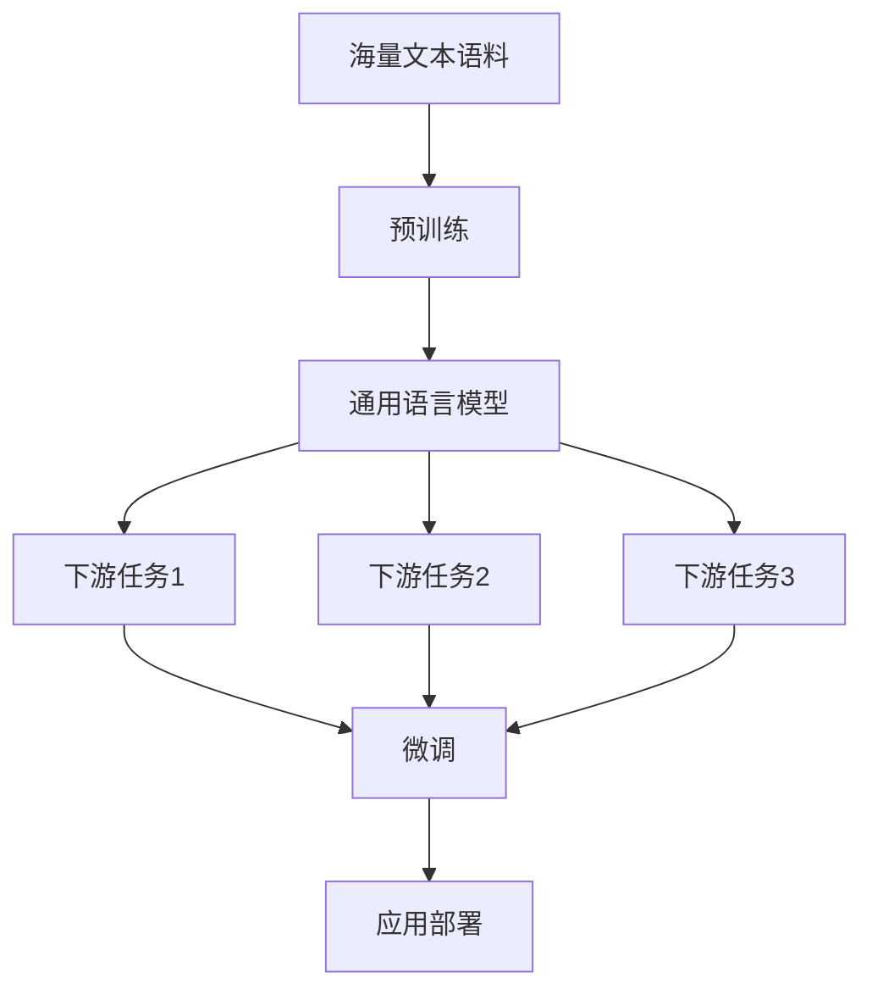

# 大规模语言模型从理论到实践 伦理与安全

## 1. 背景介绍
### 1.1 大规模语言模型的兴起
近年来,随着深度学习技术的快速发展,大规模语言模型(Large Language Models, LLMs)在自然语言处理领域取得了令人瞩目的成就。从2018年的BERT到2020年的GPT-3,再到最近的ChatGPT,LLMs展现出了惊人的语言理解和生成能力,引发了学术界和工业界的广泛关注。

### 1.2 LLMs带来的机遇与挑战
LLMs为人机交互、知识挖掘、智能问答等应用带来了新的机遇,有望极大地提升人工智能系统的性能和用户体验。然而,LLMs的强大能力也引发了一系列伦理和安全方面的担忧,例如隐私泄露、算法偏见、恶意利用等。如何在发挥LLMs潜力的同时,确保其安全、可控、符合伦理规范,成为亟待解决的重要问题。

### 1.3 本文的主要内容
本文将从理论到实践的角度,全面探讨LLMs的伦理与安全问题。我们首先介绍LLMs的核心概念和技术原理,然后分析其在实际应用中面临的主要伦理与安全挑战,并提出相应的应对策略。最后,我们展望LLMs未来的发展趋势,为推动LLMs在符合伦理、保障安全的前提下健康发展提供参考。

## 2. 核心概念与联系
### 2.1 大规模语言模型(LLMs)
LLMs是基于深度神经网络,在海量文本数据上训练得到的语言模型。它们通过学习文本数据中的统计规律和语义关系,建立起对自然语言的深层理解能力。与传统的语言模型相比,LLMs具有参数量大(数十亿到上万亿)、语料规模大(TB到PB级)、模型结构复杂(Transformer为主)等特点。

### 2.2 预训练和微调
LLMs的训练通常分为两个阶段:预训练(Pre-training)和微调(Fine-tuning)。预训练阶段在大规模无标注语料上进行自监督学习,让模型掌握语言的一般性知识和规律。微调阶段在特定任务的小规模标注数据上进行有监督学习,使模型适应具体应用场景。预训练使LLMs具备强大的语言理解能力,微调使其能灵活应用于不同任务。

### 2.3 few-shot learning
得益于大规模预训练,LLMs展现出few-shot learning的能力,即在少量示例的指导下即可完成新任务,无需大量标注数据和从头训练。这使得LLMs能快速适应新场景、新任务,大大降低了应用门槛和开发成本。但few-shot learning也带来了伦理与安全风险,如过度依赖示例、示例质量难以把控等。

### 2.4 Mermaid流程图
下图展示了LLMs的整体架构和工作流程:



## 3. 核心算法原理与操作步骤
### 3.1 Transformer 架构
LLMs的核心架构是 Transformer,它采用全注意力机制来建模文本序列。与传统的 RNN、CNN 等结构相比,Transformer 能更好地捕捉长距离依赖,且计算高度并行。Transformer 主要由编码器和解码器组成,编码器用于理解输入文本,解码器用于生成输出文本。

### 3.2 Self-Attention
Self-Attention 是 Transformer 的核心组件,它允许序列中的任意两个位置直接建立联系,计算公式如下:

$$
Attention(Q,K,V) = softmax(\frac{QK^T}{\sqrt{d_k}})V
$$

其中 $Q$、$K$、$V$ 分别是查询、键、值向量,通过将 $Q$ 和 $K$ 的点积进行 softmax 归一化,得到不同位置之间的注意力权重,再与 $V$ 加权求和,实现信息聚合。

### 3.3 Masked Language Model
Masked Language Model(MLM)是 BERT 等模型在预训练阶段的主要任务之一。MLM 随机 mask 掉输入文本的部分 token,让模型根据上下文预测 mask 位置的原始 token。通过这种自监督学习,模型可以掌握词汇、语法、语义等多层次的语言知识。

### 3.4 操作步骤
LLMs 的训练和使用一般包括以下步骤:

1. 语料构建:收集、清洗海量文本数据,构建高质量的预训练语料。
2. 模型选择:根据任务需求选择合适的 LLM 架构,如 BERT、GPT、T5 等。
3. 预训练:在预训练语料上进行自监督学习,优化语言建模目标。
4. 微调:在下游任务数据上进行有监督微调,使模型适应特定应用。
5. 推理应用:将微调后的模型部署到实际系统中,进行推理预测。
6. 评估优化:持续评估模型性能,优化模型结构和训练策略。

## 4. 数学模型与公式详解
### 4.1 语言模型
语言模型的目标是估计一个句子 $s=w_1w_2...w_n$ 的概率分布 $P(s)$。根据链式法则,语言模型可以分解为:

$$
P(s) = P(w_1)P(w_2|w_1)P(w_3|w_1w_2)...P(w_n|w_1w_2...w_{n-1})
$$

其中 $P(w_i|w_1w_2...w_{i-1})$ 表示在给定前 $i-1$ 个词的条件下,第 $i$ 个词为 $w_i$ 的条件概率。语言模型的任务就是学习这个条件概率分布。

### 4.2 Transformer 的计算过程
以编码器的计算为例,Transformer 的前向过程可以表示为:

$$
\begin{aligned}
& Q = XW_Q, K = XW_K, V = XW_V \\
& head_i = Attention(QW_i^Q, KW_i^K, VW_i^V) \\
& MultiHead(X) = Concat(head_1, ..., head_h)W^O \\
& X' = LayerNorm(X + MultiHead(X)) \\
& FFN(X') = max(0, X'W_1 + b_1)W_2 + b_2 \\
& Y = LayerNorm(X' + FFN(X'))
\end{aligned}
$$

其中 $X$ 是输入序列的嵌入表示,$W_Q$、$W_K$、$W_V$ 是注意力机制的权重矩阵,$head_i$ 是第 $i$ 个注意力头的计算结果,$W^O$ 用于融合不同头的信息,$FFN$ 是前馈神经网络,LayerNorm 是层归一化。

### 4.3 损失函数
以 MLM 为例,其损失函数是基于交叉熵的:

$$
\mathcal{L}_{MLM} = -\sum_{i=1}^{|C|} \log P(w_i|C)
$$

其中 $C$ 表示 mask 位置的上下文,$w_i$ 是第 $i$ 个 mask 位置的真实词。最小化该损失函数,即可学习到上下文到词的映射关系。

## 5. 项目实践
下面我们通过一个简单的示例,演示如何使用 PyTorch 实现 BERT 的微调和推理。

### 5.1 环境准备
首先安装必要的库:

```python
!pip install torch transformers
```

### 5.2 加载预训练模型
这里我们使用 HuggingFace 的 Transformers 库,加载预训练的 BERT 模型:

```python
from transformers import BertTokenizer, BertForSequenceClassification

model_name = "bert-base-uncased"
tokenizer = BertTokenizer.from_pretrained(model_name)  
model = BertForSequenceClassification.from_pretrained(model_name)
```

### 5.3 数据准备
我们使用 IMDB 电影评论数据集,将其转换为 BERT 的输入格式:

```python
from datasets import load_dataset

imdb = load_dataset("imdb")

def preprocess(examples):
    return tokenizer(examples["text"], truncation=True, padding="max_length", max_length=512)

imdb_encoded = imdb.map(preprocess, batched=True)  
```

### 5.4 微调
使用 Trainer API 进行微调:

```python
from transformers import TrainingArguments, Trainer

training_args = TrainingArguments(
    output_dir="imdb_output",
    num_train_epochs=3,
    per_device_train_batch_size=16,
    per_device_eval_batch_size=64,
    evaluation_strategy="epoch"
)

trainer = Trainer(
    model=model, 
    args=training_args,
    train_dataset=imdb_encoded["train"],
    eval_dataset=imdb_encoded["test"]
)

trainer.train()
```

### 5.5 推理
使用微调后的模型进行推理预测:

```python
text = "This movie is amazing!"
inputs = tokenizer(text, return_tensors="pt")
outputs = model(**inputs)
probs = outputs.logits.softmax(dim=1)
print(f"Positive probability: {probs[0][1].item():.3f}")
```

输出:
```
Positive probability: 0.998
```

可以看到,模型成功预测出了这是一条正面评论。

## 6. 实际应用场景
LLMs 在许多领域都有广泛应用,下面列举几个典型场景:

### 6.1 智能客服
LLMs 可以作为智能客服系统的核心引擎,根据客户的问题生成自然、准确的回答。这不仅能提升客户体验,还能大幅降低人工客服成本。例如微软小冰、阿里小蜜等智能助手,都是基于 LLMs 技术构建的。

### 6.2 内容生成 
LLMs 强大的语言生成能力,使其在内容创作领域大放异彩。例如 GPT-3 可以根据少量提示,自动生成文章、故事、诗歌等各类文本内容。Jasper、Copy.ai 等写作助手工具,正是利用了 LLMs 的 few-shot 生成能力,帮助用户高效创作。

### 6.3 语义搜索
传统的关键词匹配搜索,无法准确理解查询意图和上下文。LLMs 可以作为语义检索模型,将查询和文档映射到同一个语义空间,实现基于相似度的语义搜索。这种 embedding-based 的语义检索,能更好地捕捉查询和文档的语义关系,极大提升搜索的准确率和召回率。

### 6.4 知识图谱构建
LLMs 可以从大规模文本中自动提取实体、关系、属性等知识要素,辅助构建知识图谱。例如利用命名实体识别模型提取实体,利用关系抽取模型挖掘实体间的语义关联,最终形成结构化的知识库。这为智能问答、推荐系统等应用提供了重要的知识基础。

## 7. 工具和资源推荐
### 7.1 开源模型库
- [HuggingFace Transformers](https://github.com/huggingface/transformers):目前最流行的 NLP 模型库,收录了各种 SOTA 模型的预训练权重,并提供了方便的 API。
- [Fairseq](https://github.com/pytorch/fairseq):Facebook 开源的 NLP 工具集,提供了 RoBERTa、BART 等模型。
- [Flair](https://github.com/flairNLP/flair):基于 PyTorch 的 NLP 框架,支持各种经典模型和最新模型。

### 7.2 数据集
- [HuggingFace Datasets](https://huggingface.co/datasets):包含数百个 NLP 数据集,涵盖文本分类、问答、摘要、机器翻译等任务。
- [GLUE Benchmark](https://gluebenchmark.com/):由 9 个自然语言理解任务组成,是评估模型通用语言理解能力的重要基准。
- [SuperGLUE](https://super.gluebenchmark.com/):更具挑战性的自然语言理解基准测试,对模型的鲁棒性、常识推理等能力进行考察。

### 7.3 实践教程
- [The Illustrated BERT](http://jalammar.github.io/illustrated-bert/):图文并茂地讲