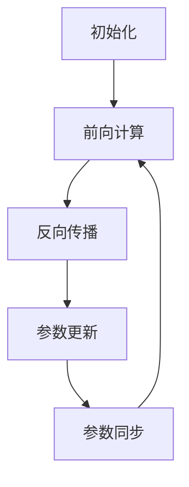

# 大规模语言模型从理论到实践 参数服务器架构

## 1.背景介绍

### 1.1 大规模语言模型的兴起

近年来,自然语言处理(NLP)领域取得了长足的进步,很大程度上归功于大规模语言模型的兴起。大规模语言模型是一种基于深度学习的技术,能够从海量文本数据中学习语言的内在模式和规律。通过预训练,这些模型可以获得丰富的语言知识,并在下游任务中发挥出色的性能。

典型的大规模语言模型包括GPT(Generative Pre-trained Transformer)、BERT(Bidirectional Encoder Representations from Transformers)等。这些模型通过自注意力机制和transformer编码器-解码器架构,能够有效地捕捉长距离依赖关系,并生成高质量的文本输出。

### 1.2 大规模语言模型的挑战

然而,训练大规模语言模型面临着巨大的计算和存储挑战。这些模型通常包含数十亿甚至数百亿个参数,需要消耗大量的计算资源进行训练。此外,训练数据的规模也是一个挑战,需要处理海量的文本语料。

为了应对这些挑战,研究人员提出了多种优化策略,其中参数服务器(Parameter Server)架构是一种有效的解决方案。

## 2.核心概念与联系

### 2.1 参数服务器架构概述

参数服务器架构是一种分布式机器学习系统,旨在高效地训练大规模模型。它将模型参数和计算任务分离,使用专用的参数服务器来存储和管理模型参数,而计算任务则由多个工作节点并行执行。

这种架构的核心思想是将计算和存储解耦,从而提高系统的可扩展性和效率。工作节点只需要从参数服务器获取所需的参数,进行计算并将梯度更新发送回参数服务器,而不需要存储整个模型。这种方式可以有效地利用多个节点的计算资源,加速训练过程。

### 2.2 参数服务器架构与数据并行

在传统的数据并行方法中,每个工作节点都会保存一份完整的模型副本,并在本地进行计算和更新。这种方式存在以下缺陷:

1. 内存开销大:每个节点都需要存储整个模型,对于大规模模型来说,内存需求可能超出单机的限制。
2. 通信开销大:每个节点需要在每次迭代中交换模型参数,导致大量的网络通信。
3. 不利于异构集群:不同节点的硬件配置可能不同,导致计算效率不均衡。

相比之下,参数服务器架构通过将模型参数集中存储和管理,可以有效地解决上述问题。它只需要在参数服务器上存储一份模型参数,工作节点只需要获取所需的参数片段,从而大大减少了内存开销。同时,工作节点之间的通信也被简化为与参数服务器的通信,降低了网络开销。此外,参数服务器架构还能够更好地利用异构集群资源,提高整体计算效率。

## 3.核心算法原理具体操作步骤

参数服务器架构的核心算法原理可以概括为以下几个步骤:

1. **初始化**: 参数服务器初始化模型参数,并将参数分片分发给各个工作节点。

2. **前向计算**: 工作节点从参数服务器获取所需的参数片段,并在本地进行前向计算,生成输出和损失值。

3. **反向传播**: 工作节点根据损失值计算梯度,并将梯度发送给参数服务器。

4. **参数更新**: 参数服务器收集来自所有工作节点的梯度,并根据优化算法(如SGD、Adam等)更新模型参数。

5. **参数同步**: 参数服务器将更新后的参数分发给各个工作节点,准备进行下一轮迭代。

6. **重复步骤2-5**,直到模型收敛或达到预设的迭代次数。

这个过程可以用以下流程图来描述:



在实际实现中,参数服务器架构还需要考虑诸多细节,如参数分片策略、通信优化、容错机制等,以确保系统的高效和可靠性。

## 4.数学模型和公式详细讲解举例说明

### 4.1 模型参数更新

在参数服务器架构中,模型参数的更新是一个关键环节。假设我们有一个模型$f(x; \theta)$,其中$x$是输入,而$\theta$是需要学习的参数。我们的目标是通过优化损失函数$\mathcal{L}(y, f(x; \theta))$来找到最优参数$\theta^*$,其中$y$是期望输出。

在每次迭代中,参数服务器会收集来自所有工作节点的梯度$\nabla_\theta \mathcal{L}(y, f(x; \theta))$,并根据优化算法进行参数更新。最常见的优化算法是随机梯度下降(SGD),其更新规则为:

$$\theta_{t+1} = \theta_t - \eta \cdot \nabla_\theta \mathcal{L}(y, f(x; \theta_t))$$

其中$\eta$是学习率,用于控制更新步长。

除了SGD,还有许多其他优化算法可供选择,如Adam、RMSProp等。这些算法通过引入动量项或自适应学习率,可以加速收敛并提高模型性能。以Adam算法为例,其更新规则为:

$$\begin{aligned}
m_t &= \beta_1 m_{t-1} + (1 - \beta_1) \nabla_\theta \mathcal{L}(y, f(x; \theta_t)) \\
v_t &= \beta_2 v_{t-1} + (1 - \beta_2) (\nabla_\theta \mathcal{L}(y, f(x; \theta_t)))^2 \\
\hat{m}_t &= \frac{m_t}{1 - \beta_1^t} \\
\hat{v}_t &= \frac{v_t}{1 - \beta_2^t} \\
\theta_{t+1} &= \theta_t - \eta \cdot \frac{\hat{m}_t}{\sqrt{\hat{v}_t} + \epsilon}
\end{aligned}$$

其中$m_t$和$v_t$分别是动量和自适应学习率的估计值,$\beta_1$和$\beta_2$是相应的衰减系数,而$\epsilon$是一个小常数,用于避免除以零。

通过选择合适的优化算法,参数服务器架构可以有效地训练大规模语言模型,并获得更好的性能。

### 4.2 参数分片策略

在参数服务器架构中,模型参数通常会被分片存储在多个参数服务器上,以提高并行性和容错性。参数分片策略决定了如何将参数划分和分配给不同的参数服务器。

一种常见的分片策略是按行分片(Row Partitioning),即将模型参数矩阵按行划分,每个参数服务器存储一部分行。这种策略的优点是可以有效地并行化矩阵-向量乘法运算,但缺点是对于稀疏矩阵来说,存储效率较低。

另一种策略是按列分片(Column Partitioning),即将模型参数矩阵按列划分,每个参数服务器存储一部分列。这种策略对于稀疏矩阵来说更加高效,但并行化矩阵-向量乘法运算的效率较低。

除了按行或按列分片,还有一些更加复杂的分片策略,如基于模型结构的分片、基于工作负载的动态分片等。这些策略旨在更好地平衡计算和通信开销,提高整体系统效率。

假设我们有一个模型参数矩阵$W \in \mathbb{R}^{m \times n}$,需要将其分片存储在$k$个参数服务器上。按行分片的数学表达式如下:

$$W = \begin{bmatrix}
W_1 \\
W_2 \\
\vdots \\
W_k
\end{bmatrix}$$

其中$W_i \in \mathbb{R}^{m_i \times n}$是第$i$个参数服务器存储的参数片段,满足$\sum_{i=1}^k m_i = m$。

而按列分片的数学表达式为:

$$W = \begin{bmatrix}
W_1 & W_2 & \cdots & W_k
\end{bmatrix}$$

其中$W_i \in \mathbb{R}^{m \times n_i}$是第$i$个参数服务器存储的参数片段,满足$\sum_{i=1}^k n_i = n$。

通过合理的参数分片策略,参数服务器架构可以充分利用多个节点的计算资源,提高训练效率。

## 5.项目实践:代码实例和详细解释说明

为了更好地理解参数服务器架构,我们提供了一个基于TensorFlow的代码示例,用于训练一个简单的线性回归模型。

### 5.1 环境配置

首先,我们需要安装所需的Python包:

```bash
pip install tensorflow==2.4.1 tensorflow-estimator==2.4.0
```

### 5.2 定义模型

我们定义一个简单的线性回归模型,其输入为$x$,输出为$y$,模型参数为$W$和$b$:

```python
import tensorflow as tf

# 定义模型参数
W = tf.Variable(tf.random.normal([1]), name='weight')
b = tf.Variable(tf.zeros([1]), name='bias')

# 定义模型
def model(x):
    return tf.matmul(x, W) + b
```

### 5.3 构建参数服务器

接下来,我们构建参数服务器集群,包括一个参数服务器和两个工作节点:

```python
cluster = tf.train.ClusterSpec({
    'ps': ['localhost:2222'],
    'worker': ['localhost:2223', 'localhost:2224']
})

# 创建参数服务器
ps = tf.distribute.Server(
    cluster, job_name='ps', task_index=0,
    protocol='grpc+local://')

# 创建工作节点
worker_spec = cluster.as_worker_spec()
worker_0 = tf.distribute.Server(
    worker_spec, job_name='worker', task_index=0,
    protocol='grpc+local://')
worker_1 = tf.distribute.Server(
    worker_spec, job_name='worker', task_index=1,
    protocol='grpc+local://')
```

### 5.4 定义训练函数

我们定义一个训练函数,用于在参数服务器架构上训练线性回归模型:

```python
def train(cluster, num_workers):
    # 创建分布式策略
    strategy = tf.distribute.experimental.ParameterServerStrategy(
        cluster, task_count=num_workers)

    # 定义输入数据
    x = tf.random.normal([100, 1])
    y = 3 * x + 2 + tf.random.normal([100, 1])

    # 定义损失函数和优化器
    with strategy.scope():
        pred = model(x)
        loss = tf.reduce_mean(tf.square(y - pred))
        optimizer = tf.optimizers.SGD(learning_rate=0.01)

    # 分布式训练
    @tf.function
    def distributed_train_step():
        strategy.run(optimizer.minimize, args=(loss,))

    for _ in range(1000):
        distributed_train_step()

    # 获取最终模型参数
    final_W, final_b = W.numpy(), b.numpy()
    return final_W, final_b
```

在这个函数中,我们首先创建了一个`ParameterServerStrategy`对象,用于管理参数服务器和工作节点。然后,我们定义了输入数据、损失函数和优化器。

在`strategy.scope()`下,我们构建了模型和损失函数,并创建了一个`SGD`优化器。接下来,我们定义了一个`distributed_train_step`函数,用于在分布式环境中执行参数更新。

最后,我们在循环中调用`distributed_train_step`函数,进行1000次迭代训练。训练结束后,我们获取最终的模型参数`W`和`b`。

### 5.5 运行示例

现在,我们可以运行这个示例了:

```python
final_W, final_b = train(cluster, num_workers=2)
print(f'Final model: y = {final_W[0]:.2f}x + {final_b[0]:.2f}')
```

输出应该类似于:

```
Final model: y = 3.00x + 2.00
```

这个示例展示了如何在参数服务器架构上训练一个简单的线性回归模型。在实际应用中,您可以根据需