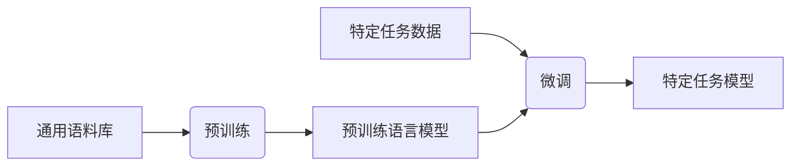

# 大规模语言模型从理论到实践 垂直领域评估

## 1.背景介绍

### 1.1 语言模型的发展历程

语言模型是自然语言处理领域的基础技术之一,旨在捕捉语言的统计规律。早期的语言模型主要基于 N-gram 模型,利用有限长度的历史上下文来预测下一个词的概率。随着深度学习技术的兴起,神经网络语言模型(Neural Network Language Model, NNLM)逐渐取代了传统的 N-gram 模型,展现出更强的语言建模能力。

### 1.2 大规模语言模型的兴起

近年来,受益于算力和数据的飞速增长,大规模语言模型开始崭露头角。这些巨大的语言模型通过在海量文本数据上进行预训练,学习到丰富的语言知识,并可以通过微调等方式迁移到下游任务中。代表性的大规模语言模型包括 GPT、BERT、XLNet 等,它们在自然语言理解、生成、推理等任务中表现出色,推动了自然语言处理领域的快速发展。

### 1.3 垂直领域语言模型的需求

尽管通用的大规模语言模型展现出了强大的能力,但它们主要是在通用语料库上训练的,难以很好地捕捉特定领域的语言特征。因此,针对垂直领域构建专门的语言模型就显得尤为必要。垂直领域语言模型可以更好地理解和生成该领域的语言,从而在相关的应用场景中发挥更大的作用。

## 2.核心概念与联系

### 2.1 语言模型的核心任务

语言模型的核心任务是估计一个句子或文本序列的概率,即 $P(w_1, w_2, ..., w_n)$,其中 $w_i$ 表示该序列的第 i 个词。根据链式法则,该概率可以分解为:

$$P(w_1, w_2, ..., w_n) = \prod_{i=1}^{n}P(w_i|w_1, ..., w_{i-1})$$

因此,语言模型的关键在于学习条件概率 $P(w_i|w_1, ..., w_{i-1})$,即给定历史上下文,预测当前词的概率。

### 2.2 自回归语言模型

自回归语言模型(Autoregressive Language Model)是一种常见的语言模型架构,它将条件概率 $P(w_i|w_1, ..., w_{i-1})$ 直接建模,利用序列中前面的词来预测当前词。典型的自回归语言模型包括 GPT 系列模型。

### 2.3 自编码语言模型

自编码语言模型(Autoencoding Language Model)采用了 BERT 等模型的 Masked Language Modeling (MLM) 预训练任务。它将输入序列中的部分词随机掩码,然后让模型基于其余的上下文词预测被掩码的词。这种方式允许模型双向地利用上下文信息。

### 2.4 生成式与判别式语言模型

生成式语言模型(Generative Language Model)直接对序列的联合概率 $P(w_1, w_2, ..., w_n)$ 进行建模,例如自回归语言模型。而判别式语言模型(Discriminative Language Model)则是对条件概率 $P(w_i|w_1, ..., w_{i-1})$ 建模,例如 N-gram 模型。生成式模型更加灵活,但计算复杂度较高;判别式模型则更加高效,但灵活性较差。

### 2.5 语言模型的评估指标

常见的语言模型评估指标包括:
- 困惑度(Perplexity):基于模型对测试集的概率估计,反映了模型的整体质量。
- 词错误率(Word Error Rate, WER):用于评估语音识别任务的性能。
- 精度(Accuracy)、精确率(Precision)、召回率(Recall)、F1 分数等:常用于评估分类、命名实体识别等任务。

## 3.核心算法原理具体操作步骤  

### 3.1 Transformer 模型

Transformer 是当前主流的序列到序列(Seq2Seq)模型架构,广泛应用于机器翻译、语言模型等任务。它完全基于注意力机制,避免了 RNN 的局限性。Transformer 的核心组件包括:

1. **多头注意力(Multi-Head Attention)**:将查询(Query)与键(Key)序列进行注意力计算,得到与值(Value)序列的加权和作为输出。
2. **位置编码(Positional Encoding)**:由于 Transformer 没有递归结构,因此需要显式地编码序列的位置信息。
3. **层归一化(Layer Normalization)**:对输入进行归一化,加速收敛并提高模型性能。
4. **残差连接(Residual Connection)**:将输入直接与子层的输出相加,以缓解梯度消失问题。

Transformer 的编码器和解码器都由多个相同的层组成,每层包含多头注意力和前馈网络。解码器还引入了掩码多头注意力,以防止关注到未来的位置。

### 3.2 预训练与微调

大规模语言模型通常采用两阶段策略:预训练和微调。

**预训练阶段**:在大规模通用语料库上训练模型,让它学习通用的语言知识。常见的预训练目标包括:

- 掩码语言模型(Masked Language Modeling, MLM):随机掩码部分输入词,预测被掩码的词。
- 下一句预测(Next Sentence Prediction, NSP):判断两个句子是否相邻。
- 因果语言模型(Causal Language Modeling):基于前文预测下一个词。

**微调阶段**:将预训练模型的参数作为初始化,在特定任务的数据上进行进一步训练,以适应该任务。微调过程通常只需少量的标注数据和较少的训练步骤。

### 3.3 生成式预训练

生成式预训练(Generative Pre-training)是一种常见的大规模语言模型预训练范式,旨在学习生成自然语言的能力。典型的生成式预训练目标包括:

1. **因果语言模型(Causal Language Modeling)**:给定文本序列的前缀,预测下一个词的概率分布。这是自回归语言模型的核心任务。
2. **序列到序列预训练(Seq2Seq Pre-training)**:将输入序列映射到目标序列,常用于机器翻译等任务。
3. **生成式对抗网络(Generative Adversarial Networks, GANs)**:通过生成器和判别器的对抗训练,生成高质量的文本序列。

生成式预训练的优点是可以直接优化语言生成的目标,但训练过程相对复杂,需要处理曝光偏差等问题。

### 3.4 判别式预训练

判别式预训练(Discriminative Pre-training)则关注于理解自然语言的能力。常见的判别式预训练目标包括:

1. **掩码语言模型(Masked Language Modeling, MLM)**:随机掩码部分输入词,预测被掩码的词。这是 BERT 等模型的核心预训练任务。
2. **下一句预测(Next Sentence Prediction, NSP)**:判断两个句子是否相邻,捕捉句子之间的关系。
3. **句子排序(Sentence Ordering)**:给定一个打乱顺序的句子集合,预测它们的原始顺序。

判别式预训练的优点是训练过程相对简单,但无法直接优化生成的目标。通常需要将判别式预训练模型进一步微调,以适应生成类任务。

### 3.5 提示学习

提示学习(Prompt Learning)是一种新兴的范式,旨在更好地利用大规模语言模型的知识。其核心思想是将任务输入重新格式化为一个"提示"(Prompt),使其看起来像是模型在预训练时遇到的数据,从而可以直接利用预训练模型生成所需的输出。

提示可以是手工设计的,也可以通过梯度优化等方式自动学习得到。提示学习避免了从头开始训练模型的需求,可以在少量数据的情况下快速适应新任务。

## 4.数学模型和公式详细讲解举例说明

### 4.1 自回归语言模型

自回归语言模型的目标是最大化语料库中所有序列的联合概率:

$$\max_{\theta} \sum_{x} \log P_{\theta}(x)$$

其中 $x = (x_1, x_2, ..., x_T)$ 表示长度为 T 的序列, $\theta$ 是模型参数。根据链式法则,该联合概率可分解为:

$$\log P_{\theta}(x) = \sum_{t=1}^{T} \log P_{\theta}(x_t | x_{<t})$$

即最大化在给定前缀 $x_{<t}$ 的条件下,预测当前词 $x_t$ 的条件概率。

对于基于 Transformer 解码器的自回归语言模型,我们可以使用掩码多头注意力来计算 $P_{\theta}(x_t | x_{<t})$。具体来说,令 $h_t$ 为时间步 t 的隐状态,则:

$$P_{\theta}(x_t | x_{<t}) = \text{softmax}(W_o h_t)$$

其中 $W_o$ 是输出词表的权重矩阵。$h_t$ 通过注意力机制从前缀 $x_{<t}$ 中捕获相关信息。

### 4.2 掩码语言模型

掩码语言模型的目标是最大化被掩码词的条件概率:

$$\max_{\theta} \mathbb{E}_{x, m} \left[ \log P_{\theta}(x_m | x_{\backslash m}) \right]$$

其中 $x$ 是原始序列, $m$ 是被掩码的位置集合, $x_{\backslash m}$ 表示除去掩码位置的剩余序列。

对于基于 Transformer 编码器的掩码语言模型,我们可以使用标准的多头注意力来计算 $P_{\theta}(x_m | x_{\backslash m})$。令 $h_m$ 为掩码位置 m 的隐状态,则:

$$P_{\theta}(x_m | x_{\backslash m}) = \text{softmax}(W_o h_m)$$

其中 $W_o$ 同样是输出词表的权重矩阵。由于注意力机制可以双向获取上下文信息,因此掩码语言模型比自回归模型更加高效。

### 4.3 注意力机制

注意力机制是 Transformer 模型的核心,允许模型动态地关注输入序列的不同部分。给定查询 $Q$、键 $K$ 和值 $V$,标量注意力可以表示为:

$$\text{Attention}(Q, K, V) = \text{softmax}\left(\frac{QK^T}{\sqrt{d_k}}\right)V$$

其中 $d_k$ 是缩放因子,用于防止内积过大导致梯度饱和。

多头注意力则是将多个注意力头的结果拼接:

$$\text{MultiHead}(Q, K, V) = \text{Concat}(head_1, ..., head_h)W^O$$
$$\text{where } head_i = \text{Attention}(QW_i^Q, KW_i^K, VW_i^V)$$

其中 $W_i^Q$、$W_i^K$、$W_i^V$ 和 $W^O$ 是可学习的投影矩阵,用于将 $Q$、$K$、$V$ 映射到不同的表示空间。

### 4.4