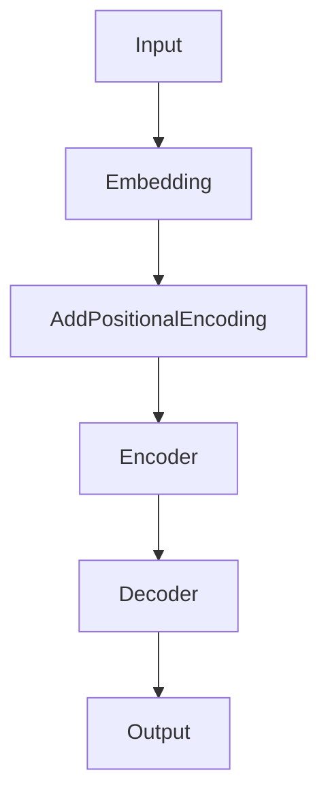

# 大规模语言模型从理论到实践 实践思考

## 1. 背景介绍

### 1.1 大规模语言模型的兴起

近年来,随着深度学习技术的飞速发展,大规模语言模型(Large Language Models, LLMs)成为了自然语言处理(NLP)领域的研究热点。从2018年的BERT到2020年的GPT-3,再到最近的ChatGPT,LLMs不断刷新着NLP任务的性能上限,展现出了惊人的语言理解和生成能力。

### 1.2 LLMs的应用前景

LLMs强大的语言能力使其在智能问答、机器翻译、文本摘要、对话系统等多个NLP应用场景中得到广泛应用。同时,LLMs也为构建通用人工智能(AGI)系统奠定了基础。探索LLMs的理论基础和实践应用,对于推动人工智能的发展具有重要意义。

### 1.3 本文的主要内容

本文将从理论到实践的角度,对LLMs进行全面探讨。内容涵盖LLMs的核心概念、原理、数学模型、代码实现、应用场景等多个方面。旨在为读者提供一个系统、深入的LLMs学习指南,帮助大家掌握这一前沿技术。

## 2. 核心概念与联系

### 2.1 语言模型的定义

语言模型是一种对语言概率分布进行建模的方法。给定一个单词序列 $S=(w_1,w_2,...,w_T)$,语言模型的目标是计算该序列出现的概率 $P(S)$。

### 2.2 大规模语言模型的特点

LLMs是基于海量语料和深度神经网络构建的语言模型。相比传统的n-gram语言模型,LLMs具有参数量大(百亿到千亿级)、建模能力强、泛化性好等特点。代表模型有BERT、GPT、T5、Switch Transformer等。

### 2.3 Transformer 架构

Transformer是构建LLMs的核心架构。它基于自注意力机制(Self-Attention),可以有效捕捉词与词之间的长距离依赖关系。Transformer包含编码器(Encoder)和解码器(Decoder)两部分,可用于各类NLP任务。



### 2.4 预训练和微调

LLMs通常采用"预训练-微调"(Pre-training & Fine-tuning)的学习范式。首先在大规模无标注语料上进行自监督预训练,习得通用语言知识;然后在下游任务的标注数据上进行微调,完成特定任务。这种范式有利于知识的迁移和泛化。

## 3. 核心算法原理具体操作步骤

### 3.1 Transformer的计算过程

Transformer的核心是自注意力机制和前馈神经网络(FFN)。假设输入序列的词嵌入为 $X=(x_1,x_2,...,x_n)$,具体计算步骤如下:

1. 计算 Query/Key/Value 矩阵:
$$
\begin{aligned}
Q &= X \cdot W^Q \\
K &= X \cdot W^K \\
V &= X \cdot W^V
\end{aligned}
$$
其中 $W^Q, W^K, W^V$ 是可学习的参数矩阵。

2. 计算注意力权重:
$$A = \text{softmax}(\frac{QK^T}{\sqrt{d_k}})$$
其中 $d_k$ 是 $K$ 的维度。

3. 计算注意力输出:
$$\text{Attention}(Q,K,V) = A \cdot V$$

4. 计算多头注意力:
$$
\begin{aligned}
\text{MultiHead}(Q,K,V) &= \text{Concat}(\text{head}_1,...,\text{head}_h) \cdot W^O \\
\text{head}_i &= \text{Attention}(QW_i^Q, KW_i^K, VW_i^V)
\end{aligned}
$$
其中 $h$ 是注意力头数, $W_i^Q, W_i^K, W_i^V, W^O$ 是可学习的参数矩阵。

5. 前馈神经网络:
$$\text{FFN}(x)=\max(0, xW_1 + b_1) \cdot W_2 + b_2$$

6. 残差连接和层归一化:
$$
\begin{aligned}
x &= \text{LayerNorm}(x + \text{MultiHead}(x)) \\
x &= \text{LayerNorm}(x + \text{FFN}(x))
\end{aligned}
$$

通过堆叠多个Transformer块,即可得到完整的Transformer模型。编码器和解码器的结构类似,区别在于解码器多了一个"编码-解码注意力"的模块。

### 3.2 BERT的预训练任务

BERT采用了两个预训练任务:

1. Masked Language Model(MLM):随机遮挡一部分输入词,让模型根据上下文预测这些被遮挡的词。
2. Next Sentence Prediction(NSP):给定两个句子,让模型判断它们是否前后相邻。

通过这两个任务,BERT可以习得词汇、句法、语义等多个层面的语言知识。

### 3.3 GPT的生成式预训练

GPT使用单向语言模型进行预训练。给定前缀词序列 $w_{<t}=(w_1,...,w_{t-1})$,GPT的目标是最大化下一个词 $w_t$ 的概率:

$$\mathcal{L}(\theta)=\sum_{t=1}^T \log P(w_t|w_{<t};\theta)$$

其中 $\theta$ 是模型参数。相比BERT,GPT的生成能力更强,适合应用于文本生成任务。

## 4. 数学模型和公式详细讲解举例说明

本节将详细讲解Transformer中的几个关键公式,并给出具体的例子。

### 4.1 注意力权重计算

注意力权重 $A$ 的计算公式为:

$$A = \text{softmax}(\frac{QK^T}{\sqrt{d_k}})$$

其中 $Q,K$ 分别是 Query 和 Key 矩阵, $d_k$ 是 $K$ 的维度。这个公式的物理意义是计算每个 Query 和所有 Key 的相似度,然后通过 softmax 归一化得到权重分布。

举例说明:假设有3个长度为2的序列,词嵌入维度为4。那么 $Q,K$ 的维度都是 $3 \times 4$。设

$$
Q=\left[
\begin{matrix}
1 & 0 & 1 & 0\\
0 & 1 & 0 & 1\\
1 & 1 & 0 & 0
\end{matrix}
\right], \quad
K=\left[
\begin{matrix}
1 & 1 & 0 & 0\\
0 & 0 & 1 & 1\\
1 & 0 & 1 & 0
\end{matrix}
\right]
$$

则

$$
QK^T=\left[
\begin{matrix}
2 & 1 & 1\\
1 & 2 & 1\\
2 & 1 & 2
\end{matrix}
\right]
$$

再除以 $\sqrt{d_k}=2$,并应用 softmax,得到

$$
A=\left[
\begin{matrix}
0.47 & 0.24 & 0.29\\
0.24 & 0.47 & 0.29\\
0.41 & 0.20 & 0.39
\end{matrix}
\right]
$$

这就是最终的注意力权重矩阵。

### 4.2 多头注意力

多头注意力的计算公式为:

$$
\begin{aligned}
\text{MultiHead}(Q,K,V) &= \text{Concat}(\text{head}_1,...,\text{head}_h) \cdot W^O \\
\text{head}_i &= \text{Attention}(QW_i^Q, KW_i^K, VW_i^V)
\end{aligned}
$$

其中 $h$ 是注意力头数, $W_i^Q, W_i^K, W_i^V, W^O$ 是可学习的参数矩阵。多头注意力相当于同时计算 $h$ 个不同的注意力,然后再将它们拼接起来。

举例说明:假设有2个注意力头,每个头的输出维度为3。设第一个头的注意力输出为

$$\text{head}_1=\left[
\begin{matrix}
1 & 2 & 3\\
4 & 5 & 6\\
7 & 8 & 9
\end{matrix}
\right]$$

第二个头的输出为

$$\text{head}_2=\left[
\begin{matrix}
2 & 3 & 5\\
1 & 4 & 2\\
6 & 0 & 3
\end{matrix}
\right]$$

拼接后得到一个 $3 \times 6$ 的矩阵:

$$\text{Concat}(\text{head}_1,\text{head}_2)=\left[
\begin{matrix}
1 & 2 & 3 & 2 & 3 & 5\\
4 & 5 & 6 & 1 & 4 & 2\\
7 & 8 & 9 & 6 & 0 & 3
\end{matrix}
\right]$$

最后乘以输出矩阵 $W^O$,得到多头注意力的最终输出。多头注意力能捕捉到更丰富、多样的语义信息。

### 4.3 残差连接和层归一化

残差连接和层归一化是Transformer的重要组成部分,它们的计算公式为:

$$
\begin{aligned}
x &= \text{LayerNorm}(x + \text{MultiHead}(x)) \\
x &= \text{LayerNorm}(x + \text{FFN}(x))
\end{aligned}
$$

残差连接能够缓解深度网络中的梯度消失问题,使得模型可以构建得很深。层归一化则有助于稳定训练过程,加速收敛。

举例说明:假设输入 $x$ 为

$$x=\left[
\begin{matrix}
1 & 2 & 3\\
4 & 5 & 6\\
7 & 8 & 9
\end{matrix}
\right]$$

多头注意力的输出为

$$\text{MultiHead}(x)=\left[
\begin{matrix}
2 & 3 & 5\\
1 & 4 & 2\\
6 & 0 & 3
\end{matrix}
\right]$$

则残差连接后的结果为

$$x+\text{MultiHead}(x)=\left[
\begin{matrix}
3 & 5 & 8\\
5 & 9 & 8\\
13 & 8 & 12
\end{matrix}
\right]$$

最后再经过层归一化,得到归一化后的输出。层归一化可以看作是对每一层的输出进行标准化,使其均值为0,方差为1。

以上就是Transformer中几个关键公式的详细讲解和举例说明。掌握了这些公式,就能更好地理解Transformer的工作原理。

## 5. 项目实践：代码实例和详细解释说明

本节将给出一个基于PyTorch实现的简单Transformer模型,并对关键代码进行详细解释说明。

### 5.1 导入依赖库

```python
import torch
import torch.nn as nn
import torch.nn.functional as F
import math
```

这里导入了PyTorch的基本库以及数学库math。

### 5.2 定义Transformer模型

```python
class TransformerModel(nn.Module):
    def __init__(self, ntoken, ninp, nhead, nhid, nlayers, dropout=0.5):
        super(TransformerModel, self).__init__()
        self.pos_encoder = PositionalEncoding(ninp, dropout)
        encoder_layers = nn.TransformerEncoderLayer(ninp, nhead, nhid, dropout)
        self.transformer_encoder = nn.TransformerEncoder(encoder_layers, nlayers)
        self.encoder = nn.Embedding(ntoken, ninp)
        self.ninp = ninp
        self.decoder = nn.Linear(ninp, ntoken)

        self.init_weights()

    def generate_square_subsequent_mask(self, sz):
        mask = (torch.triu(torch.ones(sz, sz)) == 1).transpose(0, 1)
        mask = mask.float().masked_fill(mask == 0, float('-inf')).masked_fill(mask == 1, float(0.0))
        return mask

    def init_weights(self):
        initrange = 0.1
        self.encoder.weight.data.uniform_(-initrange, initrange)
        self.decoder.bias.data.zero_()
        self.decoder.weight.data.uniform_(-initrange, initrange)

    def forward(self, src, src_mask):
        src = self.encoder(src) * math.sqrt(self.ninp)
        src = self.pos_encoder(src)
        output = self.transformer_encoder(src, src_mask)
        output = self.decoder(output)
        return output
```

这里定义了一个简单的Transformer模型,主要包括以下几个部分:

- `__init__`: 初始化模型参数,包括词嵌入维度 `ninp`