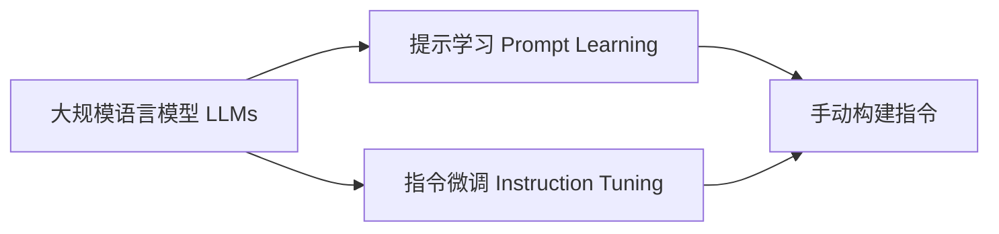

# 大规模语言模型从理论到实践 手动构建指令

## 1. 背景介绍
### 1.1 大规模语言模型的兴起
近年来,随着深度学习技术的快速发展,大规模语言模型(Large Language Models, LLMs)在自然语言处理(Natural Language Processing, NLP)领域取得了突破性进展。从2018年的BERT到2020年的GPT-3,再到最近的PaLM、Chinchilla等模型,LLMs展现出了惊人的语言理解和生成能力,引发了学术界和工业界的广泛关注。

### 1.2 LLMs的应用前景
LLMs强大的语言能力使其在许多实际应用中展现出巨大潜力,如智能对话、文本摘要、机器翻译、内容生成等。特别是随着提示学习(Prompt Learning)和指令微调(Instruction Tuning)等新范式的出现,LLMs可以更好地适应不同的下游任务,进一步拓宽了其应用场景。

### 1.3 手动构建指令的意义
尽管LLMs展现出了强大的能力,但如何有效地利用和引导LLMs完成具体任务仍然是一个挑战。通过手动构建高质量的指令,可以更好地发挥LLMs的潜力,提高其在实际应用中的表现。本文将从理论到实践的角度,系统地介绍如何为LLMs手动构建指令,帮助读者掌握这一重要技能。

## 2. 核心概念与联系
### 2.1 大规模语言模型(LLMs) 
LLMs是基于海量文本数据训练的深度神经网络模型,具有数亿到数千亿的参数规模。它们通过自监督学习(如掩码语言建模)来学习语言的统计规律和语义知识,从而获得强大的语言理解和生成能力。代表性的LLMs包括BERT、GPT系列、T5、PaLM等。

### 2.2 提示学习(Prompt Learning)
提示学习是一种利用LLMs进行下游任务的新范式。其核心思想是将任务转化为语言模型的输入提示(Prompt),引导模型生成所需的输出。通过精心设计提示模板和示例,可以有效地利用LLMs的语言能力,而无需对模型进行微调。

### 2.3 指令微调(Instruction Tuning) 
指令微调是在LLMs的基础上,使用大量的指令-响应对数据对模型进行微调,使其能够更好地理解和执行自然语言指令。经过指令微调的模型如InstructGPT、FLAN等,展现出更强的指令遵循能力和鲁棒性。

### 2.4 概念之间的关系


如上图所示,LLMs是提示学习和指令微调的基础。而手动构建高质量的指令,是有效应用提示学习和指令微调范式的关键。通过系统地掌握指令构建的方法和技巧,可以更好地发挥LLMs在实际任务中的潜力。

## 3. 核心算法原理与具体操作步骤
### 3.1 提示模板构建
#### 3.1.1 任务分析与提示格式设计
首先需要对目标任务进行分析,明确输入和输出的格式。然后根据任务特点设计提示模板,将任务描述、输入数据、示例等信息整合到提示中。常见的提示格式包括问答型、填空型、生成型等。

#### 3.1.2 示例选择与插入
在提示中加入示例可以为LLMs提供任务的上下文信息,引导其生成所需的输出。示例的选择需要考虑代表性和多样性,覆盖任务的不同场景。将示例插入到提示模板中,构成完整的提示。

#### 3.1.3 提示优化与迭代
构建好初始提示后,需要在实际任务中进行测试和优化。通过分析LLMs的输出,识别提示中的不足之处,如歧义、不完整等问题。然后对提示进行迭代优化,如调整示例、修改措辞等,不断提高提示的质量和效果。

### 3.2 指令微调数据构建 
#### 3.2.1 指令-响应对的收集
指令微调需要大量的指令-响应对数据。可以从现有的数据集中筛选,如 Super-Natural Instructions、FLAN等。也可以针对特定任务,手动撰写指令和对应的响应。指令需要覆盖任务的各种情况,响应需要符合任务要求。

#### 3.2.2 数据清洗与格式化
收集到的指令-响应对数据可能存在噪声和不一致的问题,需要进行清洗。如去除无效字符、修正拼写错误、统一格式等。然后将清洗后的数据组织成标准的格式,如JSON、CSV等,方便后续的处理和使用。

#### 3.2.3 数据增强与平衡
为了提高指令微调的效果,可以对数据进行增强,如通过回译、同义替换等方法生成更多的指令变体。同时需要关注数据的平衡性,避免某些类别的指令过多或过少,影响模型的泛化能力。

### 3.3 模型微调与测试
#### 3.3.1 微调框架选择
常用的指令微调框架包括Hugging Face的Transformers、OpenAI的GPT-3 API等。选择合适的框架,根据任务需求配置模型架构和超参数。

#### 3.3.2 微调过程与策略
将构建好的指令-响应对数据划分为训练集、验证集和测试集。使用训练集对LLMs进行微调,并在验证集上评估模型性能。可以尝试不同的微调策略,如学习率调度、早停等,以获得最佳效果。

#### 3.3.3 模型评估与分析
在测试集上评估微调后的模型,使用适当的评估指标,如准确率、F1值、BLEU等。分析模型的输出,识别存在的问题,如生成的指令响应不够准确、连贯等。根据分析结果,对指令数据和微调过程进行改进。

## 4. 数学模型与公式详解
### 4.1 语言模型的概率基础
LLMs本质上是一种概率语言模型,通过计算文本序列的概率来实现语言理解和生成。给定一个文本序列 $x=(x_1,\dots,x_T)$,语言模型的目标是估计其概率分布 $p(x)$。根据链式法则,序列的概率可以分解为:

$$p(x)=\prod_{t=1}^T p(x_t|x_{<t})$$

其中,$x_{<t}$ 表示 $x_t$ 之前的所有标记。语言模型通过学习这个条件概率分布,来预测下一个标记。

### 4.2 Transformer 架构
LLMs大多基于 Transformer 架构。Transformer 由多层的编码器(Encoder)和解码器(Decoder)组成,核心是自注意力机制(Self-Attention)。自注意力允许模型在处理当前标记时,关注序列中的任意位置。

对于编码器中第 $l$ 层的自注意力,其计算过程为:

$$\text{Attention}(Q,K,V)=\text{softmax}(\frac{QK^T}{\sqrt{d_k}})V$$

其中,$Q$,$K$,$V$ 分别是查询(Query)、键(Key)、值(Value)矩阵,$d_k$ 是键向量的维度。解码器的自注意力类似,但引入了掩码机制以避免看到未来的信息。

### 4.3 指令微调的损失函数
指令微调的目标是最小化模型在指令-响应对数据上的交叉熵损失。对于一个指令-响应对 $(x,y)$,其损失函数为:

$$\mathcal{L}(x,y)=-\sum_{t=1}^T \log p(y_t|y_{<t},x)$$

其中,$y_t$ 是响应中的第 $t$ 个标记。模型通过最小化所有指令-响应对的平均损失来学习执行指令的能力:

$$\mathcal{L}=\frac{1}{N}\sum_{i=1}^N \mathcal{L}(x^{(i)},y^{(i)})$$

其中,$N$ 是训练数据的总数。

## 5. 项目实践:代码实例与详解
下面是一个使用 Hugging Face 的 Transformers 库进行指令微调的 PyTorch 代码示例:

```python
from transformers import AutoTokenizer, AutoModelForCausalLM, TrainingArguments, Trainer

# 加载预训练的语言模型和分词器
model_name = "gpt2-large"
tokenizer = AutoTokenizer.from_pretrained(model_name)
model = AutoModelForCausalLM.from_pretrained(model_name)

# 准备指令-响应对数据
train_instructions = [
    {"instruction": "请用一句话概括文章的主要内容", "response": "这篇文章主要介绍了如何手动为大规模语言模型构建高质量的指令。"},
    {"instruction": "请列出几个提高写作技巧的方法", "response": "1. 多阅读优秀作品,学习其写作技巧; 2. 勤加练习,坚持写作; 3. 寻求他人的反馈,不断改进; 4. 扩充知识面,丰富写作素材。"},
    # 更多的指令-响应对...
]

# 对数据进行编码
train_encodings = tokenizer(
    [item["instruction"] for item in train_instructions],
    [item["response"] for item in train_instructions],
    padding=True,
    truncation=True,
    return_tensors="pt"
)

# 定义训练参数
training_args = TrainingArguments(
    output_dir="./results",
    num_train_epochs=3,
    per_device_train_batch_size=4,
    logging_steps=100,
    save_steps=500,
    warmup_steps=100,
    learning_rate=5e-5,
)

# 定义 Trainer 并开始微调
trainer = Trainer(
    model=model,
    args=training_args,
    train_dataset=train_encodings,
)

trainer.train()

# 保存微调后的模型
trainer.save_model("./fine_tuned_model")
```

这个示例中,我们首先加载了预训练的 GPT-2 模型和对应的分词器。然后准备了一些指令-响应对作为训练数据,并使用分词器对其进行编码。接着定义了训练参数,如训练轮数、批大小、学习率等。最后,我们创建了一个 Trainer 对象,传入模型、训练参数和编码后的数据,调用 `train()` 方法开始微调。微调完成后,可以将模型保存下来以备后续使用。

在实际项目中,我们可以根据任务需求,调整模型架构、训练数据和超参数,以获得最佳的微调效果。同时,还需要在验证集和测试集上对微调后的模型进行评估,以确保其泛化能力和鲁棒性。

## 6. 实际应用场景
手动构建指令在许多实际应用中都发挥着重要作用,下面列举几个典型场景:

### 6.1 智能客服
在智能客服系统中,我们可以为不同类型的客户问题手动构建指令和响应模板。通过指令微调,LLMs 可以学会根据客户的问题生成准确、有帮助的回复,提高客服的效率和质量。

### 6.2 个性化推荐
在个性化推荐场景下,我们可以将用户的历史行为和偏好转化为指令,引导 LLMs 生成符合用户兴趣的推荐内容。通过手动构建多样化的指令,可以为用户提供更加精准和个性化的推荐服务。

### 6.3 智能写作助手
对于智能写作助手,我们可以手动构建各种写作任务的指令,如文章摘要、段落扩写、文本改错等。经过指令微调的 LLMs 可以为用户提供写作建议和辅助,提高写作效率和质量。

### 6.4 知识问答系统
在知识问答系统中,手动构建指令可以帮助 LLMs 更好地理解用户的问题意图,并从海量知识库中检索出相关的答案。通过优化指令和答案的匹配度,可以提高问答系统的准确性和用户满意度。

## 7. 工具与资源推荐
### 7.1 开源语言模型
- BERT: Google 推出的预训练语言模型,在多个 NLP 任务上取得了 SOTA 