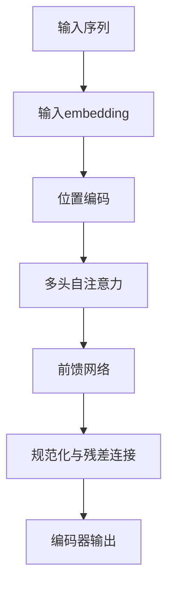
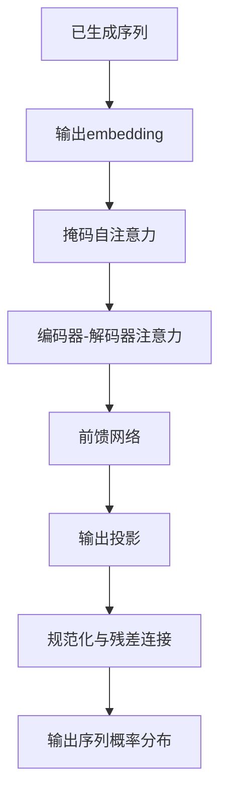

# 大规模语言模型从理论到实践 推理规划

## 1.背景介绍

### 1.1 人工智能的发展历程

人工智能(Artificial Intelligence, AI)是一个跨学科的研究领域,旨在创造出能够模仿人类智能行为的智能机器系统。自20世纪50年代AI概念被正式提出以来,已经经历了多个发展阶段。

早期的AI系统主要集中在特定领域的专家系统和机器学习算法上。随着计算能力和数据量的不断增长,AI逐渐向通用人工智能(Artificial General Intelligence, AGI)的目标迈进。近年来,深度学习技术的兴起推动了AI在计算机视觉、自然语言处理、决策系统等领域取得了突破性进展。

### 1.2 大规模语言模型的兴起

语言模型是自然语言处理领域的核心技术之一,旨在学习和捕捉语言的统计规律。传统的语言模型通常基于n-gram模型或神经网络模型,但受限于计算能力和数据规模,很难捕捉复杂的语义和上下文信息。

随着深度学习技术的发展和硬件计算能力的提升,大规模语言模型(Large Language Model, LLM)应运而生。这些模型通过在海量文本数据上进行预训练,学习到丰富的语言知识和上下文信息,从而在下游任务中表现出卓越的性能。

典型的大规模语言模型包括GPT(Generative Pre-trained Transformer)系列、BERT(Bidirectional Encoder Representations from Transformers)系列、XLNet、RoBERTa等。这些模型通过自注意力机制和transformer架构,能够有效捕捉长距离依赖关系,并在机器翻译、文本生成、问答系统等任务中取得了令人瞩目的成绩。

## 2.核心概念与联系

### 2.1 自注意力机制(Self-Attention Mechanism)

自注意力机制是transformer架构的核心,它允许模型捕捉输入序列中任意两个位置之间的关系,而不受位置距离的限制。这种机制通过计算查询(Query)、键(Key)和值(Value)之间的相似性来确定注意力权重,从而聚焦于最相关的信息。

自注意力机制可以被形式化为:

$$\mathrm{Attention}(Q, K, V) = \mathrm{softmax}(\frac{QK^T}{\sqrt{d_k}})V$$

其中,Q、K和V分别表示查询、键和值,通过线性投影从输入序列中获得。$d_k$是缩放因子,用于防止点积过大导致的梯度消失问题。

### 2.2 transformer架构

transformer架构是一种全新的序列到序列(Sequence-to-Sequence)模型,它完全基于注意力机制,不依赖于循环神经网络(RNN)或卷积神经网络(CNN)。transformer架构主要由编码器(Encoder)和解码器(Decoder)两部分组成。

编码器通过多头自注意力机制捕捉输入序列中的上下文信息,生成对应的表示。解码器则在编码器的基础上,结合输出序列的先验信息,生成目标序列。解码器中同样使用了自注意力机制和编码器-解码器注意力机制,以捕捉输出序列内部和输入-输出之间的依赖关系。

transformer架构的优势在于并行计算能力强、能够有效捕捉长距离依赖关系,并且不存在梯度消失或爆炸问题。这使得transformer成为构建大规模语言模型的理想选择。

### 2.3 预训练与微调(Pre-training and Fine-tuning)

大规模语言模型通常采用预训练与微调的范式。预训练阶段是在海量无监督文本数据上训练模型,学习通用的语言表示。微调阶段则是在特定任务的标注数据上,基于预训练模型进行进一步训练,使模型适应特定任务。

预训练通常采用自监督学习(Self-supervised Learning)的方式,常见的预训练目标包括:

- 蒙版语言模型(Masked Language Model, MLM):随机掩蔽部分输入tokens,模型需要预测被掩蔽的tokens。
- 下一句预测(Next Sentence Prediction, NSP):判断两个句子是否相邻。
- 序列到序列预训练(Sequence-to-Sequence Pre-training):输入一个文本序列,输出与其相关的另一个序列。

经过预训练后,模型获得了通用的语言理解和生成能力。在微调阶段,只需要对模型的部分参数进行调整,即可将其应用于特定的下游任务,如文本分类、机器翻译、问答系统等。

这种预训练与微调的范式大大减少了标注数据的需求,提高了模型的泛化能力,是大规模语言模型取得卓越性能的关键所在。

## 3.核心算法原理具体操作步骤

### 3.1 transformer编码器

transformer编码器的核心是多头自注意力机制,它能够捕捉输入序列中任意两个位置之间的依赖关系。编码器的具体操作步骤如下:

1. **输入embedding**:将输入序列的tokens映射为embedding向量。
2. **位置编码**:由于transformer没有循环或卷积结构,因此需要显式地引入位置信息。常见的位置编码方式包括正弦曲线编码和可学习的位置嵌入。
3. **多头自注意力**:计算输入序列中每个位置与其他位置的注意力权重,并根据权重对值向量进行加权求和,得到该位置的注意力表示。
4. **前馈网络**:对每个位置的注意力表示进行全连接前馈网络变换,得到该位置的最终表示。
5. **规范化与残差连接**:在每个子层后应用层规范化和残差连接,以帮助模型训练和提高性能。

编码器的输出是输入序列在不同位置的上下文化表示,这些表示将被送入解码器进行进一步处理。



### 3.2 transformer解码器

transformer解码器在编码器的基础上,引入了掩码自注意力机制和编码器-解码器注意力机制,以生成目标序列。解码器的具体操作步骤如下:

1. **输出embedding**:将已生成的tokens映射为embedding向量。
2. **掩码自注意力**:计算当前位置与之前位置的注意力权重,并根据权重对值向量进行加权求和,得到当前位置的注意力表示。这种掩码机制确保了模型只能关注已生成的tokens。
3. **编码器-解码器注意力**:计算当前输出位置与编码器输出的每个位置的注意力权重,并根据权重对编码器输出进行加权求和,得到当前位置与输入序列的交互表示。
4. **前馈网络**:对当前位置的注意力表示进行全连接前馈网络变换,得到该位置的最终表示。
5. **输出投影**:将当前位置的最终表示映射回词汇空间,得到下一个token的概率分布。
6. **规范化与残差连接**:在每个子层后应用层规范化和残差连接。

解码器的输出是生成序列中每个位置的token概率分布,通过贪婪搜索或beam search等策略,可以得到完整的目标序列。



## 4.数学模型和公式详细讲解举例说明

### 4.1 注意力机制

注意力机制是transformer架构的核心,它允许模型动态地聚焦于输入序列中最相关的部分,而不是平均地处理所有位置。注意力机制可以被形式化为:

$$\mathrm{Attention}(Q, K, V) = \mathrm{softmax}(\frac{QK^T}{\sqrt{d_k}})V$$

其中,Q、K和V分别表示查询(Query)、键(Key)和值(Value),通过线性投影从输入序列中获得:

$$\begin{aligned}
Q &= XW^Q\\
K &= XW^K\\
V &= XW^V
\end{aligned}$$

其中,X是输入序列的embedding,W^Q、W^K和W^V是可学习的权重矩阵。

注意力分数是查询Q与所有键K的缩放点积:

$$\mathrm{Attention\_scores}(Q, K) = \frac{QK^T}{\sqrt{d_k}}$$

其中,d_k是缩放因子,用于防止点积过大导致的梯度消失问题。

注意力权重则通过softmax函数计算:

$$\mathrm{Attention\_weights} = \mathrm{softmax}(\mathrm{Attention\_scores})$$

最终的注意力表示是注意力权重与值向量V的加权和:

$$\mathrm{Attention}(Q, K, V) = \mathrm{Attention\_weights}V$$

这种注意力机制允许模型动态地聚焦于最相关的信息,并通过自注意力机制捕捉输入序列内部的依赖关系。

### 4.2 多头注意力

为了捕捉不同子空间的信息,transformer采用了多头注意力机制。具体来说,查询、键和值首先通过线性投影分别映射为多个头:

$$\begin{aligned}
\mathrm{head}_i &= \mathrm{Attention}(QW_i^Q, KW_i^K, VW_i^V)\\
\mathrm{MultiHead}(Q, K, V) &= \mathrm{Concat}(\mathrm{head}_1, \dots, \mathrm{head}_h)W^O
\end{aligned}$$

其中,W_i^Q、W_i^K和W_i^V是第i个头的线性投影矩阵,W^O是最终的输出投影矩阵。

多头注意力机制允许模型从不同的子空间捕捉不同的依赖关系,提高了模型的表示能力。

### 4.3 位置编码

由于transformer没有循环或卷积结构,因此需要显式地引入位置信息。常见的位置编码方式包括正弦曲线编码和可学习的位置嵌入。

正弦曲线编码通过正弦函数为每个位置赋予唯一的位置编码:

$$\begin{aligned}
\mathrm{PE}_{(pos, 2i)} &= \sin(pos / 10000^{2i / d_\mathrm{model}})\\
\mathrm{PE}_{(pos, 2i+1)} &= \cos(pos / 10000^{2i / d_\mathrm{model}})
\end{aligned}$$

其中,pos是位置索引,i是维度索引,d_model是embedding维度。

这种编码方式能够自然地表示相对位置关系,并且在整个序列上是可以无限扩展的。

可学习的位置嵌入则是为每个位置引入一个可学习的向量,通过训练过程来捕捉位置信息。这种方式的灵活性更高,但需要更多的参数。

### 4.4 蒙版语言模型

蒙版语言模型(Masked Language Model, MLM)是一种常见的预训练目标,它要求模型预测被随机掩蔽的tokens。

具体来说,对于输入序列X,我们随机选择一部分tokens进行掩蔽,得到掩蔽后的序列X'。模型的目标是最大化掩蔽位置的tokens概率:

$$\mathcal{L}_\mathrm{MLM} = -\mathbb{E}_{X, X'} \left[\sum_{t \in \mathrm{mask}} \log P(x_t | X')\right]$$

其中,mask是被掩蔽的tokens索引集合。

通过这种自监督方式,模型可以学习到丰富的语言知识和上下文信息,为下游任务做好准备。

## 5.项目实践:代码实例和详细解释说明

以下是使用Python和Hugging Face Transformers库实现transformer编码器的示例代码:

```python
import torch
import torch.nn as nn
from transformers import BertConfig, BertEncoder

# 定义transformer编码器配置
config = BertConfig(
    vocab_size=30000,
    hidden_size=768,
    num_hidden_layers=12,
    num_attention_heads=12,
    intermediate_size=3072,
    max_position_embeddings=512,
    hidden_