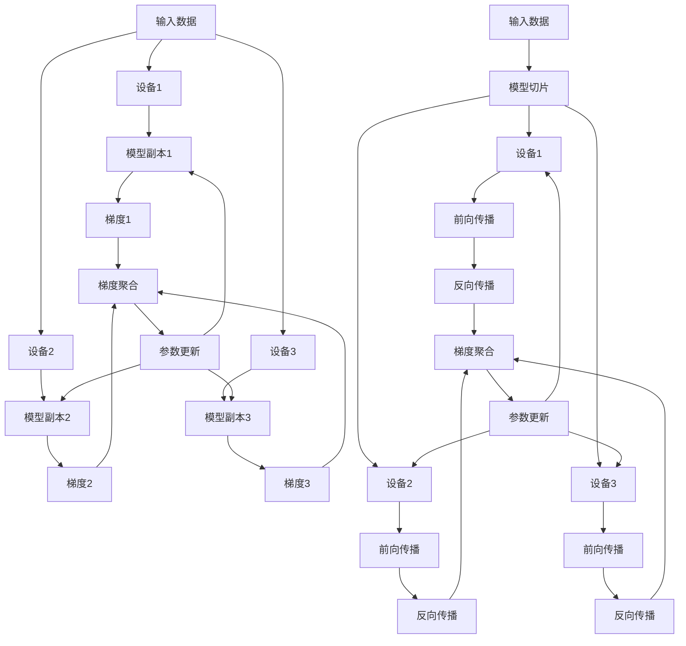
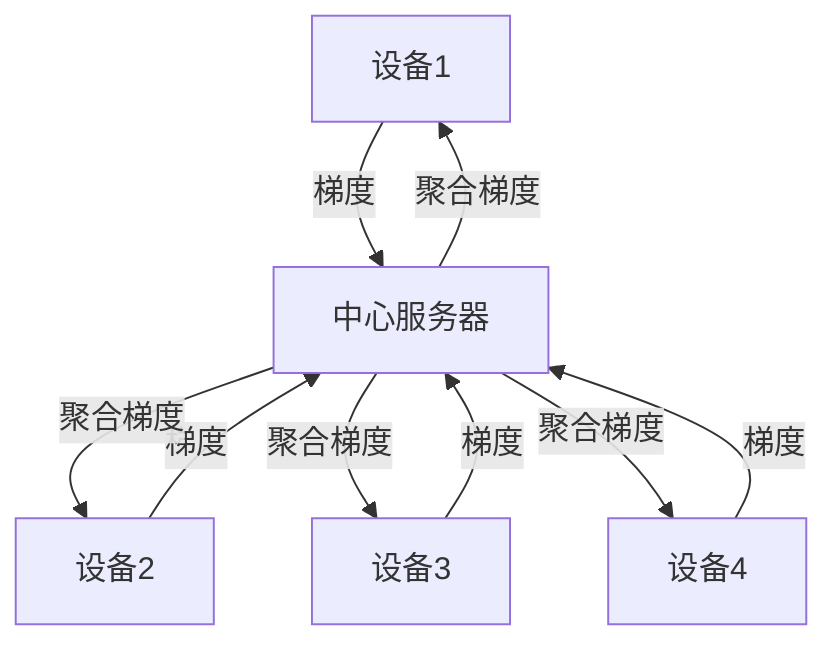
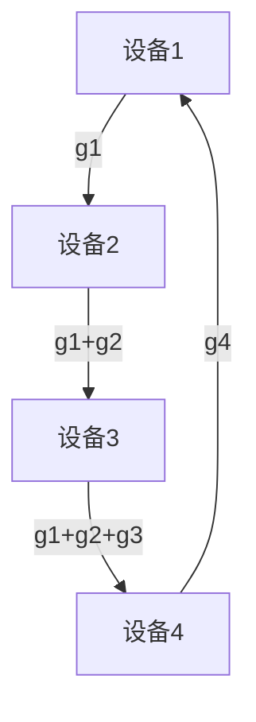

# 大规模语言模型从理论到实践 数据并行

## 1. 背景介绍

近年来,随着深度学习的快速发展,自然语言处理(NLP)领域取得了突破性的进展。其中,大规模语言模型(Large Language Models, LLMs)的出现,更是将NLP推向了一个新的高度。LLMs通过在海量文本数据上进行无监督预训练,学习到了丰富的语言知识和通用表征,在各类NLP任务上取得了显著的性能提升。

然而,训练LLMs面临着巨大的计算资源挑战。当前主流的LLMs动辄包含数十亿、上百亿甚至上千亿参数,单机训练已难以承载。因此,分布式训练成为训练LLMs的必由之路。本文将重点探讨LLMs分布式训练中的数据并行(Data Parallelism)技术,从理论到实践,全面阐述数据并行的工作原理、优化策略以及工程实现。

## 2. 核心概念与联系

在深入探讨数据并行之前,我们首先需要理解以下几个核心概念:

### 2.1 数据并行与模型并行
分布式训练主要有两种并行方式:数据并行和模型并行。
- 数据并行:将训练数据分割到多个设备上,每个设备复制一份完整的模型参数,并行处理不同的数据子集,最后汇总梯度更新模型。
- 模型并行:将模型参数切分到多个设备上,每个设备只负责部分参数的存储和计算,设备间需传递中间激活。

两种并行方式如下图所示:



数据并行更适合参数量较大的模型,而模型并行更适合显存占用较大的模型。本文主要关注数据并行。

### 2.2 数据并行中的核心问题

数据并行看似简单,但实现高效的数据并行还面临以下几个核心问题:

1. 通信开销:多个设备间需要频繁通信同步梯度,通信成为系统瓶颈。
2. 内存冗余:每个设备都需要存储一份完整模型参数,内存冗余严重。  
3. 负载均衡:设备间计算能力不均衡,导致快的设备需要等待慢的设备。

针对这些问题,业界和学界提出了许多优化方法,下面将逐一展开。

## 3. 核心算法原理与具体操作步骤

### 3.1 Ring AllReduce 通信算法

在数据并行中,多个设备并行计算各自的梯度子集,然后需要对所有梯度进行聚合(Reduce),再广播(Broadcast)到每个设备,更新模型参数。最朴素的实现是将所有梯度发送到一台中心服务器进行聚合,然后再发送回每个设备,如下图所示:



这种中心化的通信模式会导致中心服务器的网络带宽成为瓶颈。为了解决这一问题,Baidu提出了Ring AllReduce分布式通信算法。其基本思想是:将设备连接成一个逻辑环,每个设备只与左右邻居通信,通过流水线传递梯度并聚合,最终每个设备都能得到完整的聚合梯度。过程如下:

1. 将梯度tensor切分成N份,N为设备数
2. 第i个设备负责聚合第i份梯度
3. 每个设备将第i份梯度发送给左邻居,同时从右邻居接收第(i-1)份梯度 
4. 对接收到的梯度与本地梯度聚合,然后重复步骤3,经过N-1轮迭代,每个设备最终都有完整的聚合梯度

Ring AllReduce的通信过程如下图所示:



Ring AllReduce 相比中心化的通信,优势在于:
1. 避免了中心节点带宽瓶颈
2. 通信量从 $O(N)$ 降为 $O(\frac{N}{2})$
3. 可以很好地与梯度计算的流水线并行

### 3.2 ZeRO 优化器

前面提到,数据并行中,每个设备都要存储一份完整的模型参数,导致显存占用大,限制了可训练的模型规模。为此,DeepSpeed团队提出了ZeRO(Zero Redundancy Optimizer)内存优化策略。ZeRO 的核心思想是将优化器状态(如动量、梯度等)也进行划分,从而实现模型参数、梯度、优化器状态的零冗余。

ZeRO 主要分为三个不同的优化级别:

- ZeRO-1:只划分优化器状态
- ZeRO-2:在ZeRO-1基础上,进一步划分梯度
- ZeRO-3:在ZeRO-2基础上,进一步划分模型参数

ZeRO-3 的并行过程如下:
1. 前向传播时,每个设备只保存部分的模型参数,按需获取其他设备的参数
2. 反向传播时,每个设备计算部分梯度,然后进行 AllReduce 得到完整梯度
3. 优化器更新时,每个设备只更新自己负责的模型参数切片

通过这种参数、梯度、优化器状态划分机制,ZeRO 可以将每个设备的显存占用降低 $N$ 倍,从而支持训练规模更大的模型。

### 3.3 异步训练

前面介绍的数据并行方法都是同步的,即每个设备完成计算后需要等待其他设备,然后同步更新模型。这种同步并行受限于最慢的设备,设备间的负载不均衡会拖慢整体训练速度。

异步训练通过打破设备间的同步,让每个设备可以独立地进行训练,从而缓解设备间的负载不均衡问题。常见的异步训练算法有:

- Hogwild!:每个设备独立从参数服务器读取参数、计算梯度、更新参数,不需要锁。
- Downpour SGD:每个设备异步地向参数服务器推送梯度更新,然后拉取最新参数,设备间完全独立。  
- Stale Synchronous Parallel (SSP):在同步并行的基础上允许有限的延迟,快的设备可以先行 $s$ 步,而不必等待最慢的设备。

异步训练虽然能提升设备利用率,但也面临着训练不稳定、收敛变慢等问题,需要仔细权衡。

## 4. 数学模型与公式详细讲解

本节我们对数据并行中的几个关键数学模型进行详细推导。

### 4.1 数据并行 SGD 收敛性分析

考虑数据并行 SGD 优化目标函数 $f(x)$,其中 $x$ 为模型参数。假设有 $N$ 个并行的设备,第 $i$ 个设备的训练数据为 $\mathcal{D}_i$,大小为 $|\mathcal{D}_i|$。记第 $t$ 步迭代的参数为 $x_t$,学习率为 $\eta_t$,每个设备计算的随机梯度为 $g_t^i$,则有:

$$
g_t^i = \frac{1}{B} \sum_{j \in \mathcal{B}_t^i} \nabla f_j(x_t)
$$

其中 $\mathcal{B}_t^i$ 为第 $i$ 个设备在第 $t$ 步采样的小批量数据,大小为 $B$。

数据并行 SGD 的参数更新公式为:

$$
x_{t+1} = x_t - \eta_t \frac{1}{N} \sum_{i=1}^N g_t^i
$$

为了分析收敛性,我们对目标函数做如下假设:

1. $f(x)$ 为 $L\text{-smooth}$,即:

$$
\|\nabla f(x) - \nabla f(y)\| \leq L \|x - y\|, \forall x, y
$$

2. $f(x)$ 为 $\mu\text{-strongly convex}$,即:

$$
f(y) \geq f(x) + \langle \nabla f(x), y-x \rangle + \frac{\mu}{2}\|y-x\|^2, \forall x, y
$$

在这些假设下,可以证明数据并行 SGD 的收敛率为:

$$
\mathbb{E}\left[f(\bar{x}_T)\right] - f(x^*) \leq \frac{L}{2T} \left(\frac{1}{\eta_1} + \sum_{t=1}^{T-1} \eta_t \right) + \frac{\eta_{T-1} \sigma^2}{2\mu BN}
$$

其中 $\bar{x}_T = \frac{1}{T}\sum_{t=1}^T x_t$ 为参数平均值,$x^*$ 为最优解,$\sigma^2$ 为梯度方差。

可以看出,增大批量大小 $B$ 和并行数 $N$,可以减小收敛误差的第二项。但批量过大会增大内存消耗,并行数过多会增大通信成本,需要适度平衡。

### 4.2 Ring AllReduce 通信复杂度分析

考虑 $N$ 个设备在 $d$ 维梯度上进行Ring AllReduce,每次通信传输 $m$ 个梯度值。则完成一轮Ring AllReduce需要的通信轮数为:

$$
\text{rounds} = \left\lceil \frac{d}{m} \right\rceil (N-1)
$$

每轮通信需要的时间为:

$$
\text{time per round} = \alpha + \frac{m}{B}
$$

其中 $\alpha$ 为网络延迟, $B$ 为带宽。

因此,完成一轮Ring AllReduce的总时间为:

$$
\text{time} = \left(\alpha + \frac{m}{B}\right) \left\lceil \frac{d}{m} \right\rceil (N-1)
$$

通信复杂度为 $O\left(\left(\alpha + \frac{m}{B}\right) \frac{d}{m} N\right)$。

为了减小通信开销,我们可以:
1. 增大每次传输的梯度量 $m$,减少通信轮数
2. 减小网络延迟 $\alpha$,如使用 RDMA 通信
3. 增大网络带宽 $B$,如使用 InfiniBand 互联

但 $m$ 不宜过大,否则会增加内存消耗。$\alpha$ 和 $B$ 受限于集群硬件条件。因此还需要从算法层面优化通信,如梯度量化、稀疏化等。

## 5. 项目实践:代码实例与详细解释

本节我们使用 PyTorch 实现一个简单的数据并行Demo。完整代码如下:

```python
import torch
import torch.nn as nn
import torch.optim as optim
import torch.distributed as dist
from torch.nn.parallel import DistributedDataParallel as DDP

# 初始化进程组
dist.init_process_group(backend='nccl')

# 配置每个进程的gpu
local_rank = dist.get_rank()
torch.cuda.set_device(local_rank)
device = torch.device