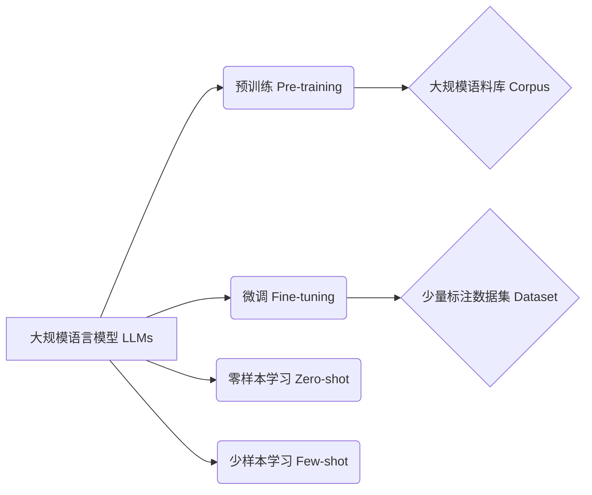

# 大规模语言模型从理论到实践 数据来源

## 1. 背景介绍
### 1.1 大规模语言模型的兴起
近年来,随着深度学习技术的快速发展,大规模语言模型(Large Language Models,LLMs)在自然语言处理(Natural Language Processing,NLP)领域取得了令人瞩目的成就。从2018年的BERT(Bidirectional Encoder Representations from Transformers)到2020年的GPT-3(Generative Pre-trained Transformer 3),再到最近的ChatGPT,LLMs展现出了惊人的语言理解和生成能力,引发了学术界和工业界的广泛关注。

### 1.2 数据的重要性
LLMs的成功离不开海量的训练数据。正如Andrew Ng所说,"要让AI系统表现良好,你需要大量数据(data),而不仅仅是更多的数学(math)"。高质量、大规模的文本数据是训练LLMs的关键。然而,对于许多研究者和从业者来说,获取和处理如此庞大的数据集并非易事。

### 1.3 本文的目的和结构
本文旨在系统地探讨LLMs训练数据的来源、特点及其对模型性能的影响,为相关研究提供参考。全文分为以下几个部分:
- 第2节介绍LLMs的核心概念及其之间的联系;
- 第3节详细阐述LLMs的训练算法原理和步骤;  
- 第4节给出LLMs常用的数学模型和公式,并举例说明;
- 第5节展示利用开源数据构建LLMs训练集的代码实例;
- 第6节讨论LLMs在实际应用中的场景和挑战;
- 第7节推荐LLMs相关的工具和学习资源;
- 第8节总结全文,并展望LLMs的未来发展方向;
- 第9节列出LLMs数据方面的常见问题与解答。

## 2. 核心概念与联系
### 2.1 大规模语言模型(LLMs) 
LLMs是一类基于海量文本数据训练的语言模型,旨在学习自然语言的统计规律和语义表示。与传统的n-gram语言模型不同,LLMs通常采用神经网络(如Transformer)作为主体架构,具有更强大的建模能力。代表性的LLMs包括BERT、GPT、T5、XLNet等。

### 2.2 预训练(Pre-training)和微调(Fine-tuning)
- 预训练是指在大规模无标注语料上训练通用的语言表示模型,学习词汇、句法、语义等不同粒度的语言知识。常见的预训练任务有语言模型、掩码语言模型等。 
- 微调是指在预训练的基础上,针对特定任务(如分类、阅读理解)用少量标注数据进一步训练模型。微调使LLMs能快速适应下游任务,显著提升性能。

### 2.3 零样本(Zero-shot)、少样本(Few-shot)学习
- 零样本学习是指模型无需在特定任务上微调,直接根据输入的提示(prompt)进行推理。GPT-3展现出了强大的零样本能力。
- 少样本学习介于零样本和微调之间,只需极少的示例(如10个)即可使模型适应新任务。这大大降低了任务适配的成本。

### 2.4 数据集(Dataset)、语料库(Corpus)
- 数据集是指用于机器学习模型训练、评估的结构化数据集合,通常带有标注信息,如情感标签、问题答案对等。
- 语料库泛指大规模的文本集合,可以是结构化或非结构化的,用于语言模型的预训练。常见的语料库有维基百科、新闻、图书等。

以下是LLMs核心概念之间的关系图:

## 3. 核心算法原理具体操作步骤
### 3.1 Transformer 架构
LLMs的核心架构是Transformer,它由编码器(Encoder)和解码器(Decoder)组成,通过自注意力机制(Self-Attention)和前馈神经网络(Feed-Forward Network)对输入序列进行建模。

#### Transformer的具体操作步骤如下:
1. 输入表示(Input Representation):将输入序列X = (x_1, x_2, ..., x_n)映射为嵌入向量E = (e_1, e_2, ..., e_n),并加入位置编码(Positional Encoding)。
2. 编码器自注意力:对E进行自注意力计算,得到上下文表示C = (c_1, c_2, ..., c_n)。自注意力分为三步:
   - 计算查询矩阵Q、键矩阵K、值矩阵V;
   - 计算注意力权重矩阵$A = softmax(\frac{QK^T}{\sqrt{d_k}})$;
   - 计算上下文表示$C = AV$。
3. 编码器前馈:对C进行两层前馈神经网络变换,得到新的表示H。
4. 编码器堆叠:重复步骤2-3多次(如12次),得到最终的编码器输出表示。
5. 解码器自注意力和编码-解码注意力:类似编码器,但引入了编码-解码注意力,将编码器输出作为键值对。
6. 解码器堆叠:重复步骤5多次,得到最终的解码器输出表示。
7. 输出:将解码器输出表示通过线性层和softmax层,得到下一个token的概率分布。

### 3.2 预训练任务
#### 3.2.1 语言模型(Language Modeling,LM)
LM任务是给定前面的token,预测下一个token。优化目标是最大化序列的似然概率:
$$\mathcal{L}_{LM} = -\sum_{i=1}^{n} \log P(x_i|x_{<i})$$

其中$x_{<i}$表示$x_i$之前的所有token。

#### 3.2.2 掩码语言模型(Masked Language Modeling,MLM)
MLM任务是随机掩盖(mask)输入序列中的部分token,然后预测被掩盖的token。优化目标是最大化被掩盖位置的似然概率:
$$\mathcal{L}_{MLM} = -\sum_{i \in \mathcal{M}} \log P(x_i|x_{\backslash \mathcal{M}})$$

其中$\mathcal{M}$为被掩盖的位置集合,$x_{\backslash \mathcal{M}}$表示去掉$\mathcal{M}$中元素后的序列。BERT采用的即是MLM任务。

#### 3.2.3 排列语言模型(Permuted Language Modeling,PLM)
PLM任务是随机打乱输入序列的顺序,然后预测原始序列。优化目标是最大化原始序列的似然概率:
$$\mathcal{L}_{PLM} = -\sum_{i=1}^{n} \log P(x_i|x_{\pi_{<i}})$$

其中$\pi$为随机排列,$x_{\pi_{<i}}$表示$x_i$在排列$\pi$下的前面所有token。XLNet采用的即是PLM任务。

### 3.3 微调
微调是在预训练模型的基础上,针对下游任务进行进一步训练。具体步骤如下:
1. 在预训练模型的顶部添加任务特定的输出层,如分类层、生成层等;
2. 用任务的标注数据对整个模型进行梯度更新,优化任务目标函数;
3. 在验证集上评估模型性能,调整超参数;
4. 在测试集上评估最终的模型性能。

微调使LLMs能快速适应各种NLP任务,大幅提升了下游任务的性能。

## 4. 数学模型和公式详细讲解举例说明
### 4.1 Transformer的数学模型
#### 4.1.1 自注意力(Self-Attention)
自注意力是Transformer的核心组件,用于捕捉序列内部的长距离依赖关系。以下是其数学公式:

查询矩阵$Q$、键矩阵$K$、值矩阵$V$的计算:
$$Q = EW^Q, K = EW^K, V = EW^V$$

其中$E \in \mathbb{R}^{n \times d}$为输入嵌入矩阵,$W^Q, W^K, W^V \in \mathbb{R}^{d \times d_k}$为可学习的权重矩阵。

注意力权重矩阵$A$的计算:
$$A = \text{softmax}(\frac{QK^T}{\sqrt{d_k}}) \in \mathbb{R}^{n \times n}$$

其中$\frac{1}{\sqrt{d_k}}$为缩放因子,用于控制点积的方差。

上下文表示$C$的计算:
$$C = AV \in \mathbb{R}^{n \times d_k}$$

多头自注意力(Multi-head Self-Attention)可以看作是$h$个独立的自注意力并行计算,然后将结果拼接:
$$\text{MultiHead}(E) = \text{Concat}(\text{head}_1, \ldots, \text{head}_h)W^O$$

其中$\text{head}_i = \text{Attention}(EW_i^Q, EW_i^K, EW_i^V)$,$W^O \in \mathbb{R}^{hd_k \times d}$为输出权重矩阵。

#### 4.1.2 前馈神经网络(Feed-Forward Network)
前馈神经网络用于对自注意力的输出进行非线性变换,增强模型的表达能力。其公式为:
$$\text{FFN}(x) = \max(0, xW_1 + b_1)W_2 + b_2$$

其中$W_1 \in \mathbb{R}^{d \times d_{ff}}, b_1 \in \mathbb{R}^{d_{ff}}$为第一层的权重和偏置,$W_2 \in \mathbb{R}^{d_{ff} \times d}, b_2 \in \mathbb{R}^d$为第二层的权重和偏置。通常$d_{ff} = 4d$。

### 4.2 预训练任务的数学模型
#### 4.2.1 语言模型(LM)
LM任务是给定前面的token,预测下一个token。其似然概率可表示为:
$$P(x_i|x_{<i}) = \frac{\exp(e(x_i)^T h_{i-1})}{\sum_{x' \in V} \exp(e(x')^T h_{i-1})}$$

其中$e(x) \in \mathbb{R}^d$为token $x$的嵌入向量,$h_{i-1} \in \mathbb{R}^d$为$x_{i-1}$的隐藏状态,$V$为词表。

#### 4.2.2 掩码语言模型(MLM)
MLM任务是随机掩盖输入序列中的token,然后预测被掩盖的token。设$\mathcal{M}$为被掩盖的位置集合,则MLM的似然概率可表示为:
$$P(x_i|x_{\backslash \mathcal{M}}) = \frac{\exp(e(x_i)^T h_i)}{\sum_{x' \in V} \exp(e(x')^T h_i)}, \forall i \in \mathcal{M}$$

其中$h_i$为第$i$个位置的隐藏状态。

### 4.3 示例说明
下面以一个简单的例子来说明Transformer的计算过程。假设输入序列为"I love NLP"。

首先将其转为嵌入向量:
$$E = \begin{bmatrix}
e(\text{I}) \\
e(\text{love}) \\ 
e(\text{NLP})
\end{bmatrix} \in \mathbb{R}^{3 \times d}$$

然后计算自注意力。以第1个token "I"为例,其查询向量为:
$$q_1 = e(\text{I})W^Q \in \mathbb{R}^{d_k}$$

键向量和值向量分别为:
$$k_1 = e(\text{I})W^K, v_1 = e(\text{I})W^V$$
$$k_2 = e(\text{love})W^K, v_2 = e(\text{love})W^V$$
$$k_3 = e(\text{NLP})W^K, v_3 = e(\text{NLP})W^V$$

注意力权重为:
$$a_{1j} = \frac{\exp(q_1 \cdot k_j)}{\sum_{j'=1}^3 \exp(q_1 \cdot k_{j'})}, j=1,2,3$$

上下文向量为:
$$c_1 = \sum_{j=1}^3 a_{1j} v_j \in \mathbb{R}