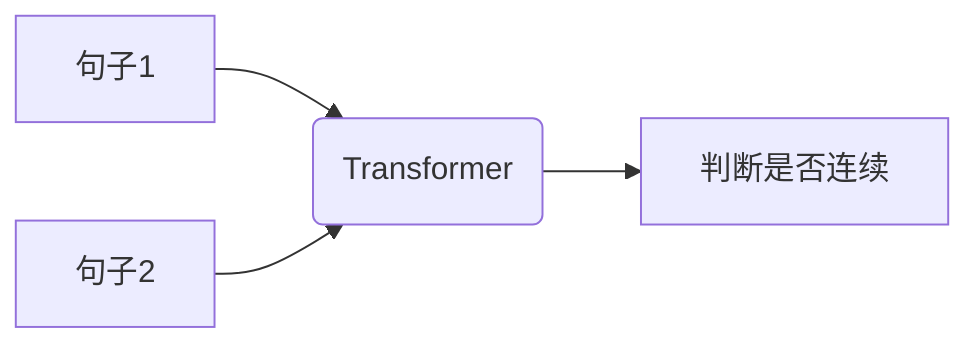

# 大规模语言模型从理论到实践 无监督预训练

## 1.背景介绍

### 1.1 语言模型的重要性

语言是人类交流和表达思想的基础工具。随着人工智能技术的快速发展,自然语言处理(NLP)已成为一个极具潜力和应用前景的领域。其中,语言模型作为NLP的核心组成部分,在机器翻译、对话系统、文本生成、问答系统等诸多任务中扮演着关键角色。

### 1.2 传统语言模型的局限性

早期的语言模型主要基于统计机器学习方法,如N-gram模型、最大熵模型等。这些模型虽然取得了一定成功,但由于其本质上是局部建模,无法有效捕捉长距离语义依赖关系,且模型容量有限,难以充分利用大规模语料进行训练。

### 1.3 大规模语言模型的兴起

近年来,基于深度学习的大规模语言模型凭借其强大的表示能力和泛化性能,在自然语言处理领域取得了突破性进展。这些模型通过无监督预训练的方式,在海量文本数据上学习通用的语言表示,从而能够捕捉丰富的语义和语法信息。

## 2.核心概念与联系

### 2.1 自注意力机制(Self-Attention)

自注意力机制是大规模语言模型的核心组成部分。它允许模型在计算每个单词的表示时,直接关注输入序列中的所有其他单词,捕捉长距离依赖关系。这种全局建模方式大大提高了模型的表现力。


### 2.2 Transformer架构

Transformer是第一个完全基于自注意力机制的序列到序列模型,它抛弃了传统的RNN和CNN结构,使用多头自注意力层和前馈网络层构建了一种全新的架构。Transformer的出色表现为后续的大规模语言模型奠定了基础。


### 2.3 掩码语言模型(Masked Language Model)

掩码语言模型是一种无监督预训练目标,它通过随机掩码输入序列中的部分单词,并让模型基于上下文预测这些被掩码的单词。这种方式能够有效捕捉双向上下文信息,成为大规模语言模型预训练的主导范式。


### 2.4 下一句预测(Next Sentence Prediction)

下一句预测是另一种常用的无监督预训练目标,它旨在让模型学习捕捉句子之间的关系。在训练过程中,模型需要判断两个句子是否为连续的句子对。这种预训练目标有助于模型学习更高层次的语义表示。



## 3.核心算法原理具体操作步骤

### 3.1 Transformer编码器

Transformer编码器是大规模语言模型的核心组成部分,它由多个编码器层堆叠而成。每个编码器层包含一个多头自注意力子层和一个前馈网络子层,并采用残差连接和层归一化来促进梯度传播。

1. 输入embedding:将输入序列转换为embedding向量表示。
2. 位置编码:为每个单词添加位置信息,使模型能够捕捉序列顺序。
3. 多头自注意力:计算每个单词与其他单词的注意力权重,生成加权和表示。
4. 残差连接和层归一化:将自注意力输出与输入相加,并进行层归一化。
5. 前馈网络:对归一化后的表示进行非线性变换,捕捉高阶特征。
6. 残差连接和层归一化:将前馈网络输出与自注意力输出相加,并进行层归一化。
7. 重复3-6,堆叠多个编码器层。


### 3.2 掩码语言模型预训练

掩码语言模型预训练是大规模语言模型训练的核心步骤,它通过预测被掩码的单词来学习上下文语义表示。

1. 随机掩码:在输入序列中随机选择一部分单词,用特殊的[MASK]标记替换。
2. 前向传播:将带有掩码的序列输入到Transformer编码器,获得每个位置的上下文表示。
3. 预测掩码单词:对于每个被掩码的位置,使用其上下文表示作为输入,通过一个分类器预测该位置的原始单词。
4. 计算损失:将预测结果与原始单词进行比较,计算交叉熵损失。
5. 反向传播:根据损失值,使用优化算法(如Adam)更新模型参数。
6. 重复1-5,迭代训练直至收敛。


## 4.数学模型和公式详细讲解举例说明

### 4.1 自注意力机制(Self-Attention)

自注意力机制是大规模语言模型的核心组成部分,它允许模型在计算每个单词的表示时,直接关注输入序列中的所有其他单词,捕捉长距离依赖关系。

给定一个长度为n的输入序列$X = (x_1, x_2, ..., x_n)$,我们首先计算查询(Query)、键(Key)和值(Value)向量:

$$
Q = XW^Q, K = XW^K, V = XW^V
$$

其中$W^Q, W^K, W^V$分别是可学习的查询、键和值的投影矩阵。

接下来,我们计算每个查询向量与所有键向量的点积,得到注意力分数矩阵:

$$
\text{Attention}(Q, K, V) = \text{softmax}(\frac{QK^T}{\sqrt{d_k}})V
$$

其中$d_k$是缩放因子,用于防止点积值过大导致softmax函数梯度消失。

最后,我们对注意力分数矩阵进行行wise求和,得到每个输入位置的加权和表示。

### 4.2 多头自注意力(Multi-Head Attention)

多头自注意力机制通过独立学习多个注意力头,从不同的子空间捕捉不同的依赖关系,进一步提高了模型的表现力。

给定查询、键和值矩阵$Q, K, V$,我们首先将它们分别投影到$h$个注意力头的子空间:

$$
\begin{aligned}
\text{head}_i &= \text{Attention}(QW_i^Q, KW_i^K, VW_i^V) \\
\text{MultiHead}(Q, K, V) &= \text{Concat}(\text{head}_1, ..., \text{head}_h)W^O
\end{aligned}
$$

其中$W_i^Q, W_i^K, W_i^V$是第$i$个注意力头的投影矩阵,$W^O$是最终的输出投影矩阵。

通过多头注意力机制,模型能够同时关注不同的依赖关系,提高了表示能力。

### 4.3 掩码语言模型目标函数

掩码语言模型的目标是最大化被掩码单词的条件概率。给定输入序列$X$和掩码位置集合$\mathcal{M}$,我们的目标函数为:

$$
\mathcal{L}_{\text{MLM}} = -\sum_{i \in \mathcal{M}} \log P(x_i | X_{\backslash i})
$$

其中$X_{\backslash i}$表示将第$i$个位置的单词掩码后的输入序列。

我们使用Transformer编码器计算每个位置的上下文表示$h_i$,然后通过一个分类器预测被掩码单词:

$$
P(x_i | X_{\backslash i}) = \text{softmax}(W_c h_i + b_c)
$$

其中$W_c$和$b_c$是分类器的可学习参数。

通过最小化掩码语言模型目标函数,模型能够学习到丰富的上下文语义表示,从而提高在下游任务上的泛化性能。

## 5.项目实践:代码实例和详细解释说明

为了更好地理解大规模语言模型的实现细节,我们将使用PyTorch框架,基于Transformer架构实现一个简单的掩码语言模型。

### 5.1 导入所需库

```python
import torch
import torch.nn as nn
import math
```

### 5.2 实现多头自注意力机制

```python
class MultiHeadAttention(nn.Module):
    def __init__(self, d_model, num_heads):
        super(MultiHeadAttention, self).__init__()
        self.d_model = d_model
        self.num_heads = num_heads
        self.head_dim = d_model // num_heads

        self.q_proj = nn.Linear(d_model, d_model)
        self.k_proj = nn.Linear(d_model, d_model)
        self.v_proj = nn.Linear(d_model, d_model)
        self.out_proj = nn.Linear(d_model, d_model)

    def forward(self, q, k, v, mask=None):
        batch_size = q.size(0)

        q = self.q_proj(q).view(batch_size, -1, self.num_heads, self.head_dim).transpose(1, 2)
        k = self.k_proj(k).view(batch_size, -1, self.num_heads, self.head_dim).transpose(1, 2)
        v = self.v_proj(v).view(batch_size, -1, self.num_heads, self.head_dim).transpose(1, 2)

        scores = torch.matmul(q, k.transpose(-2, -1)) / math.sqrt(self.head_dim)
        if mask is not None:
            scores = scores.masked_fill(mask == 0, -1e9)

        attn_weights = nn.Softmax(dim=-1)(scores)
        out = torch.matmul(attn_weights, v).transpose(1, 2).contiguous().view(batch_size, -1, self.d_model)

        out = self.out_proj(out)
        return out
```

这段代码实现了多头自注意力机制。首先,我们将查询、键和值投影到不同的子空间,然后计算注意力分数矩阵。接着,我们使用掩码机制屏蔽掉无效的注意力分数,并应用softmax函数获得注意力权重。最后,我们使用加权和的方式计算输出表示,并通过一个线性层进行投影。

### 5.3 实现Transformer编码器层

```python
class TransformerEncoderLayer(nn.Module):
    def __init__(self, d_model, num_heads, ffn_dim, dropout_rate):
        super(TransformerEncoderLayer, self).__init__()
        self.attn = MultiHeadAttention(d_model, num_heads)
        self.ffn = nn.Sequential(
            nn.Linear(d_model, ffn_dim),
            nn.ReLU(),
            nn.Dropout(dropout_rate),
            nn.Linear(ffn_dim, d_model),
            nn.Dropout(dropout_rate)
        )
        self.norm1 = nn.LayerNorm(d_model)
        self.norm2 = nn.LayerNorm(d_model)
        self.dropout1 = nn.Dropout(dropout_rate)
        self.dropout2 = nn.Dropout(dropout_rate)

    def forward(self, x, mask=None):
        residual = x
        x = self.norm1(x + self.dropout1(self.attn(x, x, x, mask)))
        residual = x
        x = self.norm2(x + self.dropout2(self.ffn(x)))
        return x
```

这段代码实现了Transformer编码器层。编码器层包含一个多头自注意力子层和一个前馈网络子层,并使用残差连接和层归一化来促进梯度传播。我们首先计算自注意力输出,将其与输入相加并进行层归一化。然后,我们将归一化后的表示输入到前馈网络,再次进行残差连接和层归一化。最