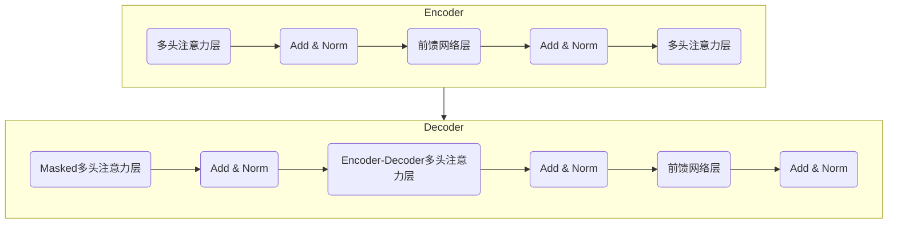

# 大规模语言模型从理论到实践 智能代理的组成

## 1. 背景介绍

### 1.1 人工智能的发展历程

人工智能(Artificial Intelligence, AI)是当代科技发展的核心驱动力之一。自20世纪50年代AI概念被正式提出以来,经历了几个重要的发展阶段。早期的AI系统主要基于规则和逻辑推理,如专家系统、决策树等。随后,机器学习和神经网络的兴起使AI系统能够从数据中自主学习,极大提高了系统的性能和适用范围。

近年来,benefiting from大规模计算能力、海量训练数据和新型深度学习算法的发展,大规模语言模型(Large Language Model, LLM)成为AI领域的一股重要力量。LLM通过在大量文本语料上训练,学习语言的语义和语法规则,从而具备出色的自然语言理解和生成能力。

### 1.2 大规模语言模型的重要性

大规模语言模型在自然语言处理(Natural Language Processing, NLP)领域发挥着越来越重要的作用。它们可广泛应用于机器翻译、文本摘要、问答系统、写作辅助等多个场景,为人类提供高效、智能的语言服务。此外,LLM也是构建通用人工智能(Artificial General Intelligence, AGI)的关键基础,对推动AI系统向更高层次发展至关重要。

随着模型规模和训练数据的不断扩大,LLM的性能不断提升,展现出令人惊叹的语言理解和生成能力。然而,LLM在实践应用中仍面临诸多挑战,如模型可解释性、安全性、公平性等问题亟待解决。本文将系统介绍大规模语言模型的理论基础、核心技术、实践应用,并探讨其未来发展趋势和挑战。

## 2. 核心概念与联系

### 2.1 语言模型

语言模型(Language Model, LM)是自然语言处理领域的基础技术之一。它的目标是学习语言的概率分布,即给定一个词序列,计算该序列出现的概率:

$$P(w_1, w_2, ..., w_n) = \prod_{i=1}^{n}P(w_i|w_1, ..., w_{i-1})$$

其中$w_i$表示序列中的第i个词。语言模型通过最大化上述概率,学习语言的语法和语义规则。

传统的语言模型通常基于N-gram模型,即根据前N-1个词来预测第N个词。这种方法简单高效,但是受限于上下文窗口的大小,难以学习长程依赖关系。

### 2.2 神经网络语言模型

为了解决传统语言模型的局限性,神经网络语言模型(Neural Network Language Model, NNLM)应运而生。NNLM使用神经网络来建模单词之间的条件概率分布,能够有效捕获长程语义依赖关系。

NNLM的基本思路是:首先将每个单词映射为一个低维稠密向量(Word Embedding),然后使用神经网络(如RNN、LSTM等)对上下文单词的Embedding序列进行编码,最终输出下一个单词的概率分布。通过反向传播算法对神经网络进行训练,NNLM可以自主学习语义和语法知识。

### 2.3 自注意力机制

虽然NNLM相比传统语言模型有了长足进步,但是由于RNN/LSTM等递归神经网络在训练和推理时难以并行化,因此在处理长序列时存在效率低下的问题。为解决这一瓶颈,Transformer模型被提出,其核心是自注意力(Self-Attention)机制。

自注意力机制通过计算输入序列中每个位置与其他所有位置的相关性,直接对长程依赖关系进行建模。这种全局关注的方式避免了RNN的递归计算,大大提高了并行能力。Transformer模型及其自注意力机制成为了当前主流的NLP模型的核心组件。

### 2.4 大规模语言模型

基于Transformer的自注意力机制,结合大规模参数、训练数据和算力,大规模语言模型(LLM)应运而生。LLM通常包含数十亿甚至上百亿个参数,在海量文本语料(通常超过数十亿词)上进行预训练。预训练过程中,LLM学习语言的语义和语法知识,形成强大的语言理解和生成能力。

目前,GPT(Generative Pre-trained Transformer)系列、BERT(Bidirectional Encoder Representations from Transformers)系列、PanGu系列等都是业界领先的大规模语言模型。这些模型在多项自然语言处理任务上展现出卓越的性能,为各种智能应用提供了强大的语义理解和生成能力。

## 3. 核心算法原理具体操作步骤  

### 3.1 Transformer模型

Transformer是当前主流的NLP模型的核心组件,其自注意力机制是LLM强大性能的关键所在。我们先来了解一下Transformer模型的基本原理和结构。

Transformer由编码器(Encoder)和解码器(Decoder)两部分组成,两者都采用多层Self-Attention和前馈神经网络堆叠而成。编码器将输入序列编码为中间表示,解码器则根据中间表示生成输出序列。

其中,自注意力层(Multi-Head Attention)是Transformer的核心模块。它计算输入序列中每个位置与其他所有位置的相关性,从而捕获长程依赖关系。解码器中还引入了Masked注意力机制,确保在生成每个词时只关注前面的词。

通过堆叠多个编码器/解码器层,Transformer可以高效地对长序列进行并行计算,从而在保留长程依赖的同时大幅提高了训练和推理效率。

### 3.2 LLM预训练

LLM的预训练过程是其获得强大语言能力的关键。常见的预训练目标包括:

1. **Causal Language Modeling**: 给定一个文本序列的前缀,模型需要预测下一个最可能出现的词。这种方式要求模型掌握语言的语法和语义规则。

2. **Masked Language Modeling**: 随机掩盖文本序列中的部分词,模型需要基于上下文预测被掩盖的词。这种方式迫使模型更好地理解上下文语义。

3. **Next Sentence Prediction**: 判断两个文本片段是否为连续的句子,从而学习捕获跨句子的语义关系。

4. **Permutation Language Modeling**: 将输入序列打乱,模型需要重建原始序列。这种方式有助于模型学习更加鲁棒的表示。

在海量文本语料上通过上述任务进行预训练,LLM可以学习到丰富的语言先验知识,形成强大的语言理解和生成能力。预训练完成后,LLM可以通过在特定任务上的少量调优(Fine-tuning),快速适配到各种自然语言处理任务。

### 3.3 LLM推理

在实际应用中,我们通常需要将预训练好的LLM应用于特定的NLP任务。这一过程被称为推理(Inference)。常见的推理方式包括:

1. **生成式推理(Generation)**: 给定一个文本前缀,模型生成其后续的文本内容。这种方式可应用于机器翻译、文本续写、对话系统等任务。

2. **判别式推理(Discrimination)**: 根据模型对文本序列的编码表示,进行文本分类、序列标注、关系抽取等任务。

3. **填充式推理(Infilling)**: 给定一段文本,模型需要自动填充其中被掩盖的部分内容。这种方式类似于Masked LM预训练目标。

无论采用何种推理方式,都需要对LLM的输出结果进行适当的后处理,以满足特定任务的要求。例如,在生成式推理时,可以采用Beam Search、Top-K/Top-P采样等策略来控制生成质量。

## 4. 数学模型和公式详细讲解举例说明

在LLM的理论基础中,有几个重要的数学模型和公式值得深入讲解。

### 4.1 Self-Attention机制

Self-Attention是Transformer模型的核心,它能够直接对输入序列中任意两个位置之间的关系进行建模。给定一个长度为n的序列$\boldsymbol{x} = (x_1, x_2, \ldots, x_n)$,其Self-Attention的计算过程如下:

1. 计算Query、Key和Value向量:

$$\begin{aligned}
\boldsymbol{Q} &= \boldsymbol{x}\boldsymbol{W}^Q \\
\boldsymbol{K} &= \boldsymbol{x}\boldsymbol{W}^K \\
\boldsymbol{V} &= \boldsymbol{x}\boldsymbol{W}^V
\end{aligned}$$

其中$\boldsymbol{W}^Q, \boldsymbol{W}^K, \boldsymbol{W}^V$分别为可训练的投影矩阵。

2. 计算注意力分数:

$$\text{Attention}(\boldsymbol{Q}, \boldsymbol{K}, \boldsymbol{V}) = \text{softmax}\left(\frac{\boldsymbol{Q}\boldsymbol{K}^\top}{\sqrt{d_k}}\right)\boldsymbol{V}$$

其中$d_k$为Query和Key向量的维度,用于缩放点积结果。

3. 多头注意力(Multi-Head Attention)机制将多个注意力头的结果进行拼接,以捕获不同子空间的信息:

$$\begin{aligned}
\text{MultiHead}(\boldsymbol{Q}, \boldsymbol{K}, \boldsymbol{V}) &= \text{Concat}(\text{head}_1, \ldots, \text{head}_h)\boldsymbol{W}^O \\
\text{where}\; \text{head}_i &= \text{Attention}(\boldsymbol{Q}\boldsymbol{W}_i^Q, \boldsymbol{K}\boldsymbol{W}_i^K, \boldsymbol{V}\boldsymbol{W}_i^V)
\end{aligned}$$

其中$\boldsymbol{W}_i^Q, \boldsymbol{W}_i^K, \boldsymbol{W}_i^V, \boldsymbol{W}^O$为可训练的投影矩阵。

通过Self-Attention机制,Transformer能够直接对输入序列中任意两个位置之间的关系进行建模,从而高效地捕获长程依赖关系。

### 4.2 语言模型损失函数

在LLM的预训练过程中,常用的目标函数是最大化语料库中所有文本序列的概率,即最小化交叉熵损失:

$$\mathcal{L} = -\frac{1}{N}\sum_{i=1}^{N}\log P(x_i)$$

其中$N$为语料库中序列的总数,$x_i$为第$i$个序列,$P(x_i)$为模型预测该序列的概率。

对于一个长度为$T$的序列$x = (x_1, x_2, \ldots, x_T)$,其概率可以进一步分解为:

$$P(x) = \prod_{t=1}^{T}P(x_t | x_1, \ldots, x_{t-1})$$

因此,交叉熵损失可以表示为:

$$\mathcal{L}(x) = -\frac{1}{T}\sum_{t=1}^{T}\log P(x_t | x_1, \ldots, x_{t-1})$$

在实际训练中,通常采用Teacher Forcing策略:在每一步,将上一步的真实输出作为下一步的输入,而不是使用模型的预测结果。这种策略能够加速训练收敛,但也可能导致模型在推理时的累积误差。

### 4.3 生成式推理策略

在生成式推理时,我们需要根据模型的输出概率分布采样生成文本序列。常见的采样策略包括:

1. **Greedy Search**: 每一步选择概率最大的词作