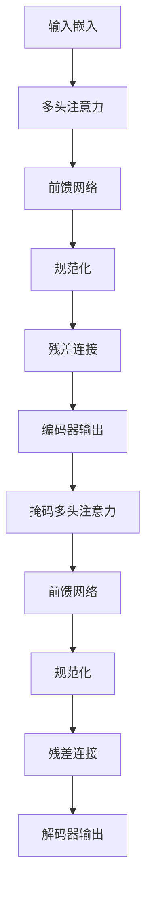

# 大规模语言模型从理论到实践：策略梯度

## 1. 背景介绍

### 1.1 自然语言处理的重要性

在当今的数字时代,自然语言处理(NLP)已成为人工智能领域中最具挑战性和影响力的研究方向之一。作为人类与机器之间交流的桥梁,NLP技术使计算机能够理解、解释和生成自然语言,从而极大地提高了人机交互的效率和质量。

随着大数据和计算能力的不断提升,NLP的应用范围不断扩大,包括机器翻译、智能问答、文本摘要、情感分析等,对于提高生产效率、优化决策过程、增强用户体验等方面发挥着越来越重要的作用。

### 1.2 语言模型在NLP中的作用

语言模型是NLP领域的基础技术之一,旨在捕捉语言的统计规律,为下游任务提供有价值的语义信息。高质量的语言模型能够更好地理解和生成自然语言,从而提高NLP系统的整体性能。

传统的语言模型主要基于n-gram统计方法,但由于数据稀疏和上下文利用不足等问题,其性能受到了一定限制。近年来,benefiting from 受益于深度学习技术的飞速发展,神经网络语言模型(Neural Network Language Model,NNLM)凭借其强大的表示能力和建模能力,成为了语言模型研究的新热点。

### 1.3 大规模语言模型的兴起

作为NNLM的一种,大规模语言模型通过预训练海量无监督语料,学习丰富的语言知识,从而为下游任务提供通用的语义表示。代表性模型包括GPT、BERT、XLNet等,它们在多项NLP任务上取得了超越人类的卓越表现,推动了NLP技术的飞速发展。

然而,大规模语言模型的训练过程通常需要消耗大量的计算资源,并且存在参数空间过大、训练不稳定等挑战。因此,如何高效、稳定地训练大规模语言模型,成为了当前研究的重点课题之一。

## 2. 核心概念与联系

### 2.1 语言模型的形式化定义

语言模型的目标是估计一个句子$S$的概率$P(S)$,通常将其分解为词序列的条件概率:

$$P(S)=P(w_1,w_2,...,w_n)=\prod_{i=1}^{n}P(w_i|w_1,...,w_{i-1})$$

其中$w_i$表示句子中的第$i$个词。

神经网络语言模型将上述条件概率建模为一个基于神经网络的判别模型:

$$P(w_i|w_1,...,w_{i-1})=\text{NeuralNetwork}(w_1,...,w_{i-1})$$

该神经网络可以是递归神经网络(RNN)、卷积神经网络(CNN)或者Transformer等不同架构。

### 2.2 自回归语言模型

自回归语言模型(Autoregressive Language Model)是一种常见的语言模型架构,它将句子$S$的概率建模为词序列的生成概率:

$$P(S)=P(w_1,w_2,...,w_n)=\prod_{i=1}^{n}P(w_i|w_1,...,w_{i-1})$$

每个词$w_i$的生成概率由前面的词序列$w_1,...,w_{i-1}$决定。这种架构常用于文本生成任务,如机器翻译、对话系统等。

### 2.3 掩码语言模型

掩码语言模型(Masked Language Model)是Transformer等模型采用的另一种建模方式。它通过随机掩码部分词,将模型训练为根据上下文预测被掩码词的概率分布:

$$\max_{\theta}\sum_{i=1}^{n}\log P(w_i|w_{\backslash i};\theta)$$

其中$w_{\backslash i}$表示去掉$w_i$的剩余词序列。这种方式能够更好地捕捉双向上下文信息,常用于预训练语义表示。

### 2.4 核心概念关系

上述三种语言模型形式相互关联:

- 自回归语言模型是最基础的形式,用于文本生成等任务;
- 掩码语言模型在自回归模型的基础上,引入掩码机制来学习双向上下文语义表示,适用于预训练场景;
- 神经网络语言模型则提供了一种通用的框架,自回归模型和掩码语言模型都可以视为其具体实例。

总的来说,它们共同构建了当前语言模型的理论基础。

## 3. 核心算法原理具体操作步骤 

### 3.1 Transformer模型

Transformer是当前大规模语言模型的核心架构之一,其完全基于注意力机制,避免了RNN的序列计算瓶颈。Transformer的主要组成部分包括:

1. **嵌入层(Embedding Layer)**: 将输入词映射为向量表示。
2. **多头注意力机制(Multi-Head Attention)**: 捕捉输入序列中不同位置词之间的关系。
3. **前馈神经网络(Feed-Forward Network)**: 对每个位置的表示进行非线性变换,提取更高层次的特征。
4. **规范化层(Normalization Layer)**: 加速训练收敛并提高模型泛化能力。

Transformer的核心在于自注意力机制,它允许模型直接关注输入序列中的任何位置,而不受距离限制。这种灵活的关注方式赋予了Transformer强大的表示能力。



### 3.2 预训练与微调

大规模语言模型通常采用两阶段训练策略:

1. **预训练(Pre-training)**: 在大规模无监督语料上训练模型,学习通用的语言知识。
2. **微调(Fine-tuning)**: 在特定的下游任务上继续训练模型,使其适应任务需求。

预训练阶段的目标是最大化掩码语言模型的似然函数:

$$\max_{\theta}\sum_{i=1}^{n}\log P(w_i|w_{\backslash i};\theta)$$

微调阶段则根据具体任务定义不同的目标函数,如分类任务的交叉熵损失、生成任务的最大似然估计等。

这种预训练+微调的范式能够有效利用大规模无监督数据,并将通用语言知识迁移到特定任务,从而显著提升了模型性能。

### 3.3 策略梯度算法

尽管预训练+微调范式取得了巨大成功,但仍存在一些局限性:

1. 微调过程容易过拟合,导致性能下降。
2. 不同任务需要重复微调,计算开销较大。
3. 生成任务的评估指标(如BLEU)通常无法直接优化。

为解决这些问题,策略梯度(Policy Gradient)算法应运而生。它将语言生成任务建模为强化学习过程:

1. 模型根据历史输出,生成下一个词的概率分布(策略)。
2. 根据生成的完整序列,计算指定的评估指标作为奖赏。
3. 通过策略梯度算法,最大化期望奖赏,直接优化评估指标。

策略梯度的优点是:

- 端到端优化评估指标,无需定义中间目标函数。
- 无需重复微调,计算开销较小。
- 生成质量更高,避免了曝光偏差问题。

然而,由于奖赏信号的高方差,策略梯度往往收敛缓慢。因此,如何提高训练效率是该算法的关键挑战。

## 4. 数学模型和公式详细讲解举例说明

### 4.1 Transformer注意力机制

Transformer的核心是缩放点积注意力(Scaled Dotted-Product Attention),定义如下:

$$\text{Attention}(Q,K,V)=\text{softmax}(\frac{QK^T}{\sqrt{d_k}})V$$

其中$Q$为查询(Query)向量,$K$为键(Key)向量,$V$为值(Value)向量,$d_k$为缩放因子。

注意力机制通过计算查询向量与所有键向量的相似性,得到一组权重,然后对值向量加权求和,作为注意力的输出。$\sqrt{d_k}$的作用是防止内积过大导致梯度饱和。

在实践中,通常采用多头注意力机制,将注意力分布在不同的子空间,以提高模型的表示能力:

$$\text{MultiHead}(Q,K,V)=\text{Concat}(head_1,...,head_h)W^O$$
$$\text{where } head_i=\text{Attention}(QW_i^Q,KW_i^K,VW_i^V)$$

其中$W_i^Q,W_i^K,W_i^V$为不同头的线性投影,用于构建子空间;$W^O$为最终的线性变换。

### 4.2 BERT预训练目标

BERT(Bidirectional Encoder Representations from Transformers)是一种基于Transformer的掩码语言模型,采用了两个预训练目标:

1. **遮蔽语言模型(Masked Language Model, MLM)**:

$$\max_{\theta}\sum_{i=1}^{n}\log P(w_i|w_{\backslash i};\theta)$$

其中$w_{\backslash i}$表示去掉$w_i$的剩余词序列。MLM通过随机遮蔽部分词,训练模型根据上下文预测被遮蔽词的概率分布,从而学习双向语义表示。

2. **下一句预测(Next Sentence Prediction, NSP)**:

$$\max_{\theta}\log P(y=1|\overrightarrow{C},\overleftarrow{C'})$$

其中$\overrightarrow{C}$和$\overleftarrow{C'}$分别表示两个句子的表示,标签$y$指示它们是否相邻。NSP目标有助于捕捉句子间的关系和上下文信息。

通过联合优化上述两个目标,BERT在多项NLP任务上取得了卓越表现,成为语言模型预训练的里程碑式工作。

### 4.3 策略梯度算法

策略梯度算法的目标是最大化语言生成任务的期望奖赏$\mathbb{E}[R]$,其中$R$为指定的评估指标(如BLEU)。

具体地,令$\pi_\theta$表示当前的语言模型(策略),生成句子$Y$的概率为:

$$P_\theta(Y)=\prod_{t=1}^{T}\pi_\theta(y_t|y_{<t})$$

其中$y_{<t}$表示前$t-1$个词。则期望奖赏可表示为:

$$\mathbb{E}[R]=\sum_{Y}P_\theta(Y)R(Y)$$

根据策略梯度定理,期望奖赏的梯度为:

$$\nabla_\theta\mathbb{E}[R]=\mathbb{E}[R\nabla_\theta\log P_\theta(Y)]$$

通过采样多个句子$Y^{(1)},...,Y^{(M)}$,可以近似计算梯度:

$$\nabla_\theta\mathbb{E}[R]\approx\frac{1}{M}\sum_{m=1}^{M}R(Y^{(m)})\nabla_\theta\log P_\theta(Y^{(m)})$$

然后使用梯度上升法更新模型参数$\theta$,以最大化期望奖赏。

虽然直观有效,但由于奖赏信号的高方差,策略梯度往往收敛缓慢。因此,提高训练效率是该算法的关键挑战之一。

## 5. 项目实践:代码实例和详细解释说明

以下是一个使用PyTorch实现的简单Transformer模型示例:

```python
import torch
import torch.nn as nn

class TransformerEncoder(nn.Module):
    def __init__(self, dim_model, num_heads, num_layers, dropout=0.1):
        super().__init__()
        self.embedding = nn.Embedding(vocab_size, dim_model)
        encoder_layer = nn.TransformerEncoderLayer(dim_model, num_heads, dim_feedforward=2048, dropout=dropout)
        self.encoder = nn.TransformerEncoder(encoder_layer, num_layers)
        
    def forward(self, src):
        src = self.embedding(src)
        output = self.encoder(src)
        return output

model = TransformerEncoder(dim_model=512, num_