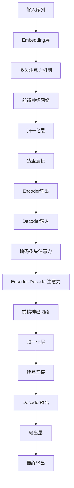

# 大规模语言模型从理论到实践 自定义模型

## 1.背景介绍

### 1.1 语言模型的重要性

语言模型是自然语言处理领域的核心技术之一,广泛应用于机器翻译、语音识别、文本生成、问答系统等多个领域。随着深度学习技术的不断发展,大规模语言模型的性能不断提升,在各种任务中取得了令人瞩目的成绩。

### 1.2 大规模语言模型的兴起

近年来,benefromingtingfrom大数据和计算能力的飞速增长,以及Transformer等新型神经网络架构的出现,使得训练大规模语言模型成为可能。代表性的大规模语言模型有GPT(GenerativePre-trainedTransformer)、BERT(BidirectionalEncoderRepresentationsfromTransformers)等,这些模型在自然语言理解和生成任务上展现出了强大的能力。

### 1.3 自定义语言模型的需求

虽然现有的大规模语言模型已经取得了卓越的成绩,但是由于数据和任务的多样性,通用模型难以完全满足特定领域的需求。因此,针对特定任务或领域自定义语言模型就显得尤为重要。自定义模型不仅可以提高模型性能,还可以更好地控制模型输出,满足特定需求。

## 2.核心概念与联系

### 2.1 语言模型的基本概念

语言模型的本质是学习文本序列的概率分布,即给定前面的词,预测下一个词的概率。形式化地,对于一个长度为n的序列$w_1, w_2, ..., w_n$,语言模型需要学习联合概率分布:

$$P(w_1, w_2, ..., w_n) = \prod_{i=1}^{n}P(w_i|w_1, ..., w_{i-1})$$

根据链式法则,联合概率可以分解为一系列条件概率的乘积。

### 2.2 自回归语言模型

自回归语言模型是一种常见的语言模型架构,它基于序列的前缀来预测下一个词。在自回归模型中,每一步的输出都会被用作下一步的输入,形成一个循环过程。GPT就是一种典型的自回归语言模型。

### 2.3 掩码语言模型

BERT采用的是掩码语言模型(Masked Language Model, MLM)的架构。在MLM中,模型需要根据上下文预测被掩码的词。这种架构允许模型同时利用上下文的双向信息,从而获得更好的表示能力。

### 2.4 因果语言模型与非因果语言模型

根据是否利用未来信息,语言模型可以分为因果语言模型(Causal Language Model)和非因果语言模型(Non-causal Language Model)。自回归模型属于因果模型,而MLM属于非因果模型。

## 3.核心算法原理具体操作步骤

### 3.1 Transformer架构

Transformer是当前大规模语言模型的核心架构,它完全基于注意力机制,不依赖于循环神经网络或卷积神经网络。Transformer的主要组成部分包括编码器(Encoder)、解码器(Decoder)和注意力机制(Attention Mechanism)。



上图展示了Transformer的基本架构流程。输入序列首先通过Embedding层转换为向量表示,然后进入Encoder部分进行编码。Encoder由多个相同的层组成,每一层包含多头注意力机制、前馈神经网络、归一化层和残差连接。Decoder的结构与Encoder类似,不同之处在于Decoder还需要利用Encoder的输出,通过Encoder-Decoder注意力机制获取编码信息。最后,Decoder的输出经过输出层得到最终的预测结果。

### 3.2 注意力机制

注意力机制是Transformer的核心,它允许模型在计算目标词的表示时,对不同位置的信息赋予不同的权重。具体来说,对于序列中的每个词,注意力机制会计算该词与其他词的关联程度,然后根据这些关联程度对其他词的表示进行加权求和,得到该词的注意力表示。

多头注意力机制是对普通注意力机制的扩展,它将注意力分成多个子空间,每个子空间都学习不同的注意力模式,最后将这些子空间的注意力表示进行拼接,从而捕获更加丰富的依赖关系。

### 3.3 位置编码

由于Transformer完全基于注意力机制,没有捕获序列顺序信息的机制。为了解决这个问题,Transformer引入了位置编码(Positional Encoding)。位置编码是一种将词的位置信息编码为向量的方法,它会被加入到词嵌入中,使得模型可以区分不同位置的词。

### 3.4 预训练与微调

大规模语言模型通常采用预训练与微调(Pre-training and Fine-tuning)的范式。在预训练阶段,模型会在大规模无标注数据上进行训练,学习通用的语言表示。在微调阶段,预训练模型会在特定任务的标注数据上进行进一步训练,使得模型可以更好地适应该任务。

## 4.数学模型和公式详细讲解举例说明

### 4.1 自回归语言模型

对于自回归语言模型,我们需要最大化序列的条件概率:

$$\begin{aligned}
\log P(x) &= \sum_{t=1}^{T} \log P(x_t | x_{<t}) \\
          &= \sum_{t=1}^{T} \log \frac{\exp(h_t^\top v_{x_t})}{\sum_{x'} \exp(h_t^\top v_{x'})}
\end{aligned}$$

其中$x$是长度为$T$的目标序列,$x_{<t}$表示序列前$t-1$个词,$h_t$是时间步$t$的隐藏状态向量,$v_x$是词$x$的词向量。

该目标函数可以通过softmax和交叉熵损失来优化。对于每个时间步,我们首先计算所有词的打分$h_t^\top v_x$,然后通过softmax函数得到每个词的概率,最后使用交叉熵损失与真实标签计算损失。

### 4.2 掩码语言模型

掩码语言模型的目标函数类似于自回归语言模型,不同之处在于它需要预测被掩码的词,而不是序列的下一个词。具体来说,对于包含被掩码词的序列$x$,其目标函数为:

$$\log P(x) = \sum_{t \in \text{mask}} \log P(x_t | x_{\backslash t})$$

其中$\text{mask}$是被掩码词的位置集合,$x_{\backslash t}$表示序列中除了位置$t$之外的其他词。

与自回归语言模型类似,我们可以使用softmax和交叉熵损失来优化掩码语言模型。不同之处在于,我们只需要计算被掩码词的概率,而不是计算每个位置的概率分布。

### 4.3 注意力机制

注意力机制的核心是计算查询向量(Query)与键向量(Key)之间的相关性分数,然后根据这些分数对值向量(Value)进行加权求和。具体来说,对于一个查询向量$q$,键向量集合$K=\{k_1, k_2, ..., k_n\}$和值向量集合$V=\{v_1, v_2, ..., v_n\}$,注意力机制的计算过程为:

$$\begin{aligned}
e_i &= q^\top k_i \\
\alpha_i &= \frac{\exp(e_i)}{\sum_j \exp(e_j)} \\
\text{Attention}(q, K, V) &= \sum_i \alpha_i v_i
\end{aligned}$$

其中$e_i$是查询向量$q$与键向量$k_i$之间的相关性分数,$\alpha_i$是通过softmax函数计算得到的注意力权重,最终的注意力表示是值向量的加权和。

多头注意力机制则是将注意力机制分成多个子空间,每个子空间都学习不同的注意力模式,最后将这些子空间的注意力表示进行拼接。

## 5.项目实践:代码实例和详细解释说明

在本节中,我们将通过一个实际的代码示例,演示如何使用PyTorch构建一个简单的Transformer语言模型。为了简化代码,我们将只实现Transformer的Decoder部分,并使用掩码语言模型的目标函数进行训练。

### 5.1 导入必要的库

```python
import math
import torch
import torch.nn as nn
from torch.nn import TransformerDecoder, TransformerDecoderLayer
```

### 5.2 定义模型

```python
class TransformerModel(nn.Module):
    def __init__(self, ntoken, ninp, nhead, nhid, nlayers, dropout=0.5):
        super(TransformerModel, self).__init__()
        self.model_type = 'Transformer'
        self.src_mask = None
        self.pos_encoder = PositionalEncoding(ninp, dropout)
        encoder_layers = TransformerDecoderLayer(ninp, nhead, nhid, dropout)
        self.transformer_decoder = TransformerDecoder(encoder_layers, nlayers)
        self.encoder = nn.Embedding(ntoken, ninp)
        self.ninp = ninp
        self.decoder = nn.Linear(ninp, ntoken)

    def forward(self, src, src_mask):
        src = self.encoder(src) * math.sqrt(self.ninp)
        src = self.pos_encoder(src)
        output = self.transformer_decoder(src, self.src_mask)
        output = self.decoder(output)
        return output
```

在上面的代码中,我们定义了一个`TransformerModel`类,它继承自`nn.Module`。

- `__init__`方法中,我们初始化了模型的各个组件,包括位置编码层(`PositionalEncoding`)、Transformer的Decoder层(`TransformerDecoder`)、词嵌入层(`nn.Embedding`)和输出层(`nn.Linear`)。
- `forward`方法定义了模型的前向传播过程。首先,输入序列通过词嵌入层和位置编码层进行编码。然后,编码后的序列被输入到Transformer的Decoder中进行处理。最后,Decoder的输出经过一个线性层得到每个词的概率分布。

### 5.3 位置编码

```python
class PositionalEncoding(nn.Module):
    def __init__(self, d_model, dropout=0.1, max_len=5000):
        super(PositionalEncoding, self).__init__()
        self.dropout = nn.Dropout(p=dropout)

        pe = torch.zeros(max_len, d_model)
        position = torch.arange(0, max_len, dtype=torch.float).unsqueeze(1)
        div_term = torch.exp(torch.arange(0, d_model, 2).float() * (-math.log(10000.0) / d_model))
        pe[:, 0::2] = torch.sin(position * div_term)
        pe[:, 1::2] = torch.cos(position * div_term)
        pe = pe.unsqueeze(0)
        self.register_buffer('pe', pe)

    def forward(self, x):
        x = x + self.pe[:, :x.size(1), :]
        return self.dropout(x)
```

在上面的代码中,我们定义了一个`PositionalEncoding`模块,用于将位置信息编码为向量。具体来说,我们首先生成一个形状为`(max_len, d_model)`的位置编码矩阵`pe`,其中每一行对应一个位置,每一列对应词嵌入的一个维度。然后,我们将位置编码矩阵添加到输入序列的词嵌入中,并应用dropout正则化。

### 5.4 训练过程

```python
import torchtext
from torchtext.datasets import WikiText2

train_iter = WikiText2(split='train')
ntokens = len(train_iter.vocab.stoi) # 词表大小

model = TransformerModel(ntokens, 200, 2, 200, 2, 0.2).to(device)

criterion = nn.CrossEntropyLoss()
lr = 5.0
optimizer = torch.optim.SGD(model.parameters(), lr=lr)
scheduler = torch.optim.lr_scheduler.StepLR(optimizer, 1.0, gamma=0.95)

def train():
    model.train()
    total_loss = 0.
    for batch, _ in train_iter:
        optimizer.zero_grad()
        output = model(batch.