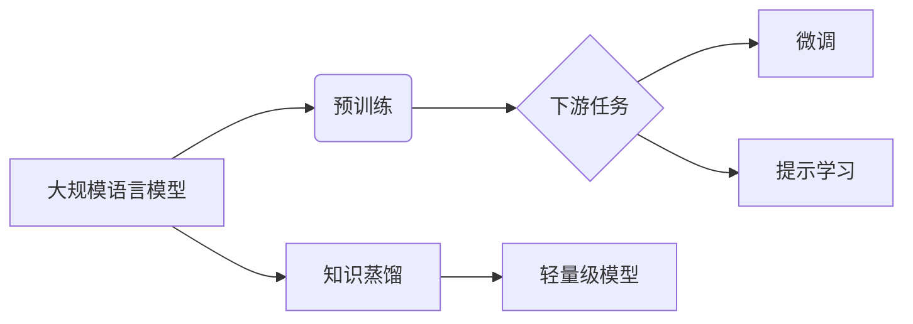

# 大规模语言模型从理论到实践 通用数据

## 1. 背景介绍
### 1.1 大规模语言模型的兴起
近年来,随着深度学习技术的飞速发展,大规模语言模型(Large Language Models, LLMs)开始崭露头角。这些模型通过在海量文本数据上进行预训练,能够学习到丰富的语言知识和通用表征,在自然语言处理(NLP)领域取得了引人瞩目的成就。从2018年的BERT模型,到2019年的GPT-2模型,再到2020年的GPT-3模型,LLMs不断刷新着NLP任务的性能上限。

### 1.2 大规模语言模型的优势
与传统的NLP模型相比,LLMs具有以下几个显著优势:

1. 强大的语言理解和生成能力:通过在大规模语料库上的预训练,LLMs能够捕捉到丰富的语言知识,具备出色的语言理解和生成能力。它们能够完成各种NLP任务,如文本分类、命名实体识别、问答系统、机器翻译等。

2. 少样本学习能力:LLMs在下游任务上表现出优异的少样本学习(Few-shot Learning)能力。即使在新任务上只有少量标注数据,LLMs也能通过示例快速适应,取得不错的性能。这大大降低了NLP任务的标注成本。

3. 跨领域迁移能力:LLMs学习到的语言知识和表征具有很强的通用性,可以方便地迁移到不同领域和任务中。这使得我们无需在每个任务上从头开始训练模型,大大提高了开发效率。

### 1.3 通用数据的重要性
LLMs的成功离不开海量的训练数据支撑。为了让模型学习到丰富全面的语言知识,需要覆盖广泛领域、体裁和写作风格的文本数据。这些数据被称为"通用数据"(General Data),对LLMs的训练至关重要。高质量的通用数据能够提升模型的语言理解和生成能力,使其更好地应对多样化的下游任务。

## 2. 核心概念与联系
### 2.1 预训练(Pre-training)
预训练是指在大规模无标注语料上训练语言模型,让其学习通用的语言知识和表征。主要分为两类:
- 无监督预训练:模型通过自监督任务如语言模型、去噪自编码器等,在无标注语料上学习语言规律。代表模型有BERT、RoBERTa、GPT系列等。
- 有监督预训练:在部分有标注数据的辅助下进行多任务学习,同时优化语言建模和监督任务。代表模型有ERNIE、UniLM等。

### 2.2 微调(Fine-tuning)
微调是指在特定任务的标注数据上,以预训练模型为基础,通过少量的训练对模型进行调优,使其适应当前任务。微调一般只需要较小的学习率和训练轮数,即可取得不错的效果。微调使得LLMs可以方便地应用到各种NLP任务中。

### 2.3 提示学习(Prompt Learning)
提示学习是一种新兴的少样本学习范式。通过设计恰当的提示模板(prompt template),将任务转化为语言模型的格式,从而利用LLMs的语言理解和生成能力来解决下游任务。提示学习可以进一步减少所需的标注数据,甚至实现零样本学习。代表方法有PET、GPT-3的in-context learning等。

### 2.4 知识蒸馏(Knowledge Distillation)
知识蒸馏是指使用大型复杂的教师模型(teacher model)来指导小型学生模型(student model)的训练,从而获得参数更少、推理更快的轻量级模型。在LLMs领域,知识蒸馏可以帮助我们压缩模型体积,降低部署难度,同时尽可能保留大模型的性能。代表工作有DistilBERT、TinyBERT等。

### 2.5 核心概念之间的联系
下图展示了上述核心概念之间的联系:



可以看到,大规模语言模型首先在海量文本数据上进行预训练,学习通用的语言知识。然后针对具体的下游任务,可以选择微调或提示学习的方式来应用预训练模型。知识蒸馏则可以帮助我们获得更加轻量高效的模型用于实际部署。

## 3. 核心算法原理具体操作步骤
本节将详细介绍大规模语言模型的几个关键训练算法,包括Masked Language Model、Next Sentence Prediction、Permutation Language Model和Denoising Autoencoder。

### 3.1 Masked Language Model (MLM)
MLM是BERT等模型采用的预训练任务,通过随机Mask掉部分词语,让模型根据上下文预测这些被Mask掉的词,从而学习语言的上下文表征。其具体步骤如下:

1. 随机选择输入序列中15%的Token进行掩码处理。
2. 对这15%的Token,有80%的概率替换为[MASK]标记,10%的概率替换为随机词,10%的概率保持不变。
3. 将处理后的序列输入BERT模型,让其预测被Mask掉的Token。
4. 计算被Mask位置的预测结果与真实标签的交叉熵损失,并进行梯度反向传播优化模型参数。

### 3.2 Next Sentence Prediction (NSP)
NSP是BERT引入的另一个预训练任务,旨在让模型学习句子之间的关系。给定两个句子A和B,模型需要判断B是否为A的下一句。其步骤如下:

1. 从语料库中抽取连续的句子对(A,B),其中50%的B是A的下一句,50%的B是语料库中的随机句子。
2. 将句子对拼接成"[CLS] A [SEP] B [SEP]"的形式输入BERT。
3. 取[CLS]位置的隐向量输入分类器,预测B是否为A的下一句。
4. 计算二分类交叉熵损失,并优化模型参数。

### 3.3 Permutation Language Model (PLM)
PLM是XLNet采用的预训练任务,通过排列句子中词语的顺序,让模型学习词语之间的依赖关系。其步骤如下:

1. 生成句子的所有可能排列。
2. 对每个排列,随机选择一个位置,让模型根据该位置左侧的上下文预测该位置词语。
3. 计算预测结果与真实标签的交叉熵损失。
4. 对所有排列的损失取平均,并优化模型参数。

### 3.4 Denoising Autoencoder (DAE)
DAE是BART、T5等模型采用的预训练任务,通过对输入文本添加噪声,让模型学习去噪和重构原始文本。其步骤如下:

1. 对输入文本序列进行噪声处理,如随机删除、置换、替换等。
2. 将噪声文本输入编码器,得到隐向量表征。
3. 解码器根据隐向量重构原始文本序列。
4. 计算重构结果与原始文本的交叉熵损失,并优化模型参数。

通过这些预训练任务,大规模语言模型可以在海量文本数据中学习到丰富的语言知识和通用表征,为下游任务奠定基础。

## 4. 数学模型和公式详细讲解举例说明
本节将详细介绍大规模语言模型中的关键数学模型和公式,主要包括Transformer模型、Self-Attention机制、Layer Normalization和残差连接等。

### 4.1 Transformer模型
Transformer是大规模语言模型的核心架构,由编码器(Encoder)和解码器(Decoder)组成。其中编码器用于对输入序列进行特征提取,解码器根据编码器的输出生成目标序列。Transformer的核心是Self-Attention机制和前馈神经网络(Feed-Forward Network, FFN)。

编码器的计算过程可以表示为:

$$ \text{Encoder}(X) = \text{FFN}(\text{SelfAttention}(X)) $$

其中$X$为输入序列的嵌入表示。

解码器的计算过程可以表示为:

$$ \text{Decoder}(Y, C) = \text{FFN}(\text{SelfAttention}(\text{CrossAttention}(Y, C))) $$

其中$Y$为目标序列的嵌入表示,$C$为编码器的输出。

### 4.2 Self-Attention机制
Self-Attention是Transformer的核心组件,用于捕捉序列内部的长距离依赖关系。对于输入序列的每个位置,Self-Attention计算其与序列中所有位置的注意力权重,然后加权求和得到该位置的新表示。

具体地,对于输入序列$X \in \mathbb{R}^{n \times d}$,首先计算其查询矩阵$Q$、键矩阵$K$和值矩阵$V$:

$$ Q = XW_Q, K = XW_K, V = XW_V $$

其中$W_Q, W_K, W_V \in \mathbb{R}^{d \times d_k}$为可学习的参数矩阵。

然后计算注意力权重矩阵$A$:

$$ A = \text{softmax}(\frac{QK^T}{\sqrt{d_k}}) $$

最后将注意力权重矩阵与值矩阵相乘,得到Self-Attention的输出:

$$ \text{SelfAttention}(X) = AV $$

### 4.3 Layer Normalization
Layer Normalization是Transformer中用于加速训练和提高模型泛化能力的技术。其思想是对每一层的输入进行归一化,使其均值为0,方差为1。

对于输入$X \in \mathbb{R}^{n \times d}$,Layer Normalization的计算公式为:

$$ \text{LayerNorm}(x_i) = \frac{x_i - \mu}{\sqrt{\sigma^2 + \epsilon}} \cdot \gamma + \beta $$

其中$x_i$为$X$的第$i$行,$\mu$和$\sigma^2$分别为$X$的均值和方差,$\gamma$和$\beta$为可学习的缩放和偏移参数,$\epsilon$为一个小常数,用于数值稳定性。

### 4.4 残差连接
残差连接是一种解决深层网络训练困难的技术,在Transformer中被广泛使用。其思想是在网络的每一层引入一条恒等映射支路,使得梯度可以直接传播到前面的层。

对于输入$X$和某一层的输出$F(X)$,残差连接的计算公式为:

$$ X + F(X) $$

将残差连接与Layer Normalization结合,可以得到Transformer中的子层连接(Sublayer Connection):

$$ \text{SublayerConnection}(X) = \text{LayerNorm}(X + \text{Sublayer}(X)) $$

其中$\text{Sublayer}$可以是Self-Attention或FFN。

通过以上数学模型和公式,Transformer实现了对序列数据的高效建模,成为大规模语言模型的基石。

## 5. 项目实践：代码实例和详细解释说明

本节将通过一个简单的PyTorch代码实例,演示如何使用Hugging Face的Transformers库来微调预训练模型,完成文本分类任务。

### 5.1 环境准备

首先安装需要的库:

```bash
!pip install transformers torch datasets
```

然后导入相关的模块:

```python
from datasets import load_dataset
from transformers import AutoTokenizer, AutoModelForSequenceClassification, TrainingArguments, Trainer
```

### 5.2 加载数据集

我们使用Hugging Face的Datasets库来加载IMDb电影评论情感分类数据集:

```python
imdb_dataset = load_dataset("imdb")
```

### 5.3 加载预训练模型和分词器

这里我们选择微调BERT模型,使用Hugging Face的AutoTokenizer和AutoModelForSequenceClassification类来加载预训练的BERT模型和分词器:

```python
model_name = "bert-base-uncased"
tokenizer = AutoTokenizer.from_pretrained(model_name)
model = AutoModelForSequenceClassification.from_pretrained(model_name, num_labels=2)
```

### 5.4 数据预处理

我们需要将文本数据转换为BERT模型可以接受的输入格式。这里定义一个预处理函数:

```python
def preprocess_function(examples):
    return tokenizer(examples["text"], truncation=True, padding=True)
```

然后用map