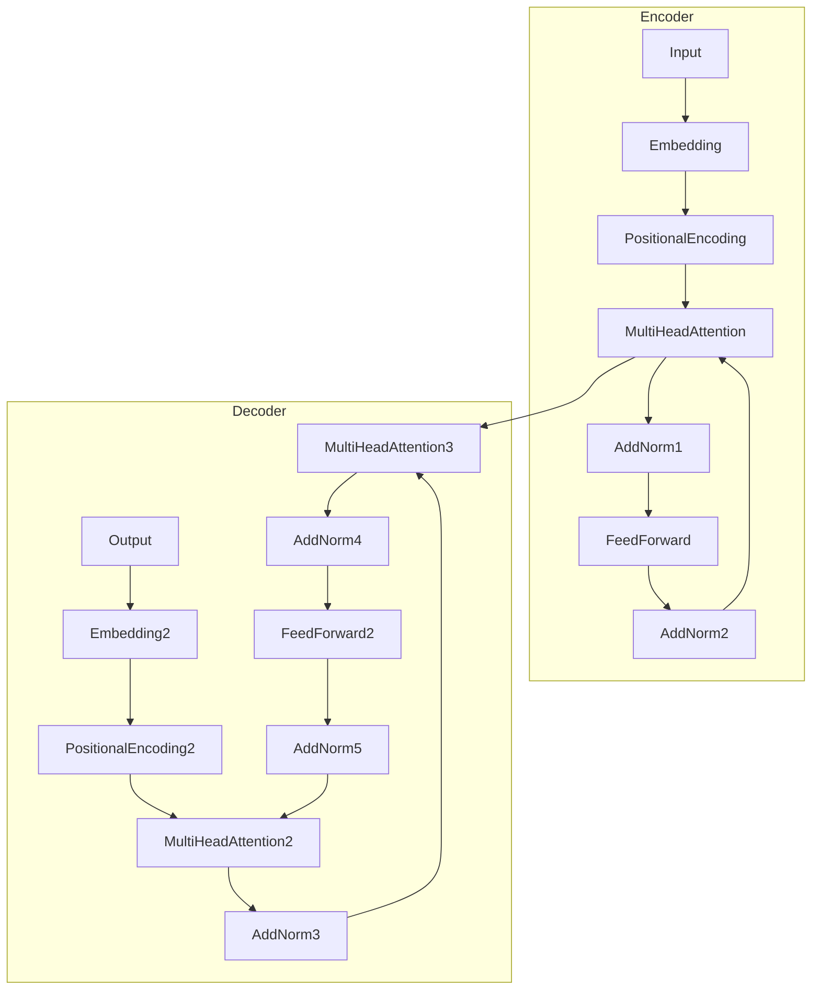

# 大语言模型 原理与代码实例讲解

## 1.背景介绍
### 1.1 大语言模型的发展历程
#### 1.1.1 早期的语言模型
#### 1.1.2 深度学习时代的语言模型
#### 1.1.3 Transformer 的出现与发展
### 1.2 大语言模型的应用场景
#### 1.2.1 自然语言处理任务
#### 1.2.2 对话系统与问答系统
#### 1.2.3 文本生成与创作

大语言模型(Large Language Model, LLM)是近年来自然语言处理领域最为瞩目的研究方向之一。它旨在通过海量文本数据的训练,学习语言的内在规律和表示,从而能够在各种自然语言处理任务上取得优异表现。

早期的语言模型主要基于统计方法,如 N-gram 模型,通过统计词语的共现频率来预测下一个词。但这类方法难以捕捉语言的长距离依赖关系。随着深度学习的兴起,研究者开始尝试利用神经网络构建语言模型。早期的神经语言模型如 NNLM、Word2Vec 等,虽然取得了一定进展,但仍然受限于模型容量和计算效率。

Transformer 的出现为语言模型的发展带来了革命性的突破。Transformer 抛弃了此前广泛使用的 RNN 结构,转而采用 Self-Attention 机制,大大提升了模型并行计算的效率。GPT 系列模型和 BERT 等大语言模型相继问世,在多个自然语言处理任务上取得了 SOTA 的成绩。

如今,大语言模型已经成为 NLP 领域的研究热点和业界竞相追逐的目标。它在机器翻译、文本分类、命名实体识别、阅读理解、对话生成等任务上大放异彩。同时,大语言模型强大的语言理解和生成能力,也为构建更加智能化的对话系统、知识问答系统铺平了道路。LLM 甚至在文本创作领域崭露头角,能够根据给定的主题或关键词,自动生成诗歌、小说、剧本等。

大语言模型的崛起,标志着人工智能在语言理解和生成领域取得了重大突破。但同时,训练大语言模型也面临着诸多挑战,如海量训练数据的获取、高昂的计算资源消耗、模型的可解释性不足等。未来,如何进一步提升大语言模型的性能,并将其应用到更广泛的场景中,仍是一个值得深入探索的课题。

## 2.核心概念与联系
### 2.1 语言模型
#### 2.1.1 统计语言模型
#### 2.1.2 神经语言模型 
#### 2.1.3 预训练语言模型
### 2.2 Transformer 结构
#### 2.2.1 Self-Attention
#### 2.2.2 Multi-Head Attention
#### 2.2.3 Positional Encoding
### 2.3 预训练任务
#### 2.3.1 自回归语言模型
#### 2.3.2 去噪自编码
#### 2.3.3 Masked Language Model

语言模型是大语言模型的核心概念之一。它旨在学习语言的概率分布,即 $P(w_1, w_2, ..., w_n)$。早期的统计语言模型如 N-gram,通过统计词语的共现频率来估计条件概率 $P(w_n|w_1, ..., w_{n-1})$。而神经语言模型则使用神经网络来建模条件概率。

预训练语言模型(Pre-trained Language Model)是近年来 NLP 领域的重要范式。与传统的语言模型不同,预训练语言模型先在大规模无标注语料上进行自监督预训练,学习通用的语言表示;然后再在下游任务的标注数据上进行微调。这种范式大大减少了对标注数据的依赖,同时显著提升了模型的性能。

Transformer 是大语言模型的核心结构。它由 Encoder 和 Decoder 两部分组成,大量使用了 Self-Attention 机制。Self-Attention 能够捕捉词语之间的长距离依赖关系,且计算高效。Multi-Head Attention 进一步增强了模型的表达能力。为了引入位置信息,Transformer 还设计了 Positional Encoding。

大语言模型常用的预训练任务主要有:
1. 自回归语言模型(Auto-regressive Language Model),如 GPT 系列模型,通过最大化下一个词的条件概率来学习语言表示。
2. 去噪自编码(Denoising Auto-Encoding),如 BERT,通过重建被随机 mask 掉的词语来学习语言表示。
3. Masked Language Model,同样是随机 mask 掉部分词语,但只预测被 mask 掉的词语。

下图展示了 Transformer 的整体架构:

## 3.核心算法原理具体操作步骤
### 3.1 Self-Attention 计算过程
#### 3.1.1 生成 Query、Key、Value 矩阵
#### 3.1.2 计算注意力权重
#### 3.1.3 加权求和
### 3.2 前馈神经网络
### 3.3 Layer Normalization
### 3.4 残差连接
### 3.5 Softmax 损失函数

Self-Attention 是 Transformer 的核心组件,它的计算过程如下:

1. 将输入序列 $X \in \mathbb{R}^{n \times d}$ 通过三个线性变换,生成 Query、Key、Value 矩阵:
$$ Q = XW^Q,  K = XW^K, V = XW^V $$
其中 $W^Q, W^K, W^V \in \mathbb{R}^{d \times d_k}$ 是可学习的参数矩阵。

2. 计算 Query 与 Key 的点积注意力权重:
$$ A = \text{softmax}(\frac{QK^T}{\sqrt{d_k}}) $$

3. 将注意力权重与 Value 矩阵相乘,得到加权求和的结果:
$$ \text{Attention}(Q,K,V) = AV $$

Multi-Head Attention 进一步增强了 Self-Attention 的表达能力。它将 Query、Key、Value 分别投影到 $h$ 个不同的子空间,并行计算 $h$ 个 Self-Attention,最后将结果拼接起来:

$$
\begin{aligned}
\text{MultiHead}(Q,K,V) &= \text{Concat}(\text{head}_1, ..., \text{head}_h)W^O \\
\text{head}_i &= \text{Attention}(QW_i^Q, KW_i^K, VW_i^V)
\end{aligned}
$$

其中 $W_i^Q \in \mathbb{R}^{d \times d_k}, W_i^K \in \mathbb{R}^{d \times d_k}, W_i^V \in \mathbb{R}^{d \times d_v}, W^O \in \mathbb{R}^{hd_v \times d}$。

除了 Self-Attention,Transformer 还使用了前馈神经网络(Feed-Forward Network)来增加模型的非线性表达能力。前馈神经网络由两个线性变换和一个 ReLU 激活函数组成:

$$ \text{FFN}(x) = \max(0, xW_1 + b_1)W_2 + b_2 $$

其中 $W_1 \in \mathbb{R}^{d \times d_{ff}}, W_2 \in \mathbb{R}^{d_{ff} \times d}$。

为了稳定训练,Transformer 在 Self-Attention 和前馈神经网络之后都使用了 Layer Normalization。Layer Normalization 对每个样本的每个特征维度分别做标准化:

$$ \text{LayerNorm}(x) = \frac{x - \mu}{\sqrt{\sigma^2 + \epsilon}} * \gamma + \beta $$

其中 $\mu, \sigma^2$ 是特征维度上的均值和方差, $\gamma, \beta$ 是可学习的缩放和偏移参数。

残差连接(Residual Connection)也被广泛使用,以帮助梯度更好地传播:

$$ y = \text{LayerNorm}(x + \text{Sublayer}(x)) $$

其中 $\text{Sublayer}$ 可以是 Self-Attention 或前馈神经网络。

在训练时,Transformer 采用 Softmax 交叉熵损失函数。对于自回归语言模型任务,损失函数定义为:

$$ \mathcal{L} = -\sum_{i=1}^n \log P(w_i|w_1, ..., w_{i-1}) $$

对于 Masked Language Model 任务,损失函数只计算被 mask 掉的词语:

$$ \mathcal{L} = -\sum_{i \in \mathcal{M}} \log P(w_i|w_1, ..., w_{i-1}, w_{i+1}, ..., w_n) $$

其中 $\mathcal{M}$ 是被 mask 掉的词语的下标集合。

## 4.数学模型和公式详细讲解举例说明
### 4.1 Self-Attention 的矩阵计算
### 4.2 Masked Self-Attention
### 4.3 位置编码
#### 4.3.1 正弦位置编码
#### 4.3.2 可学习的位置编码
### 4.4 层标准化

这一节我们将详细讲解 Transformer 中涉及的一些重要数学模型与公式。

Self-Attention 的核心是通过 Query、Key、Value 矩阵的乘积来计算注意力权重。以单头注意力为例,假设输入序列的特征维度为 $d$,序列长度为 $n$,则 $Q,K,V$ 的维度分别为 $\mathbb{R}^{n \times d_k}, \mathbb{R}^{n \times d_k}, \mathbb{R}^{n \times d_v}$。注意力权重矩阵 $A$ 的计算公式为:

$$ A = \text{softmax}(\frac{QK^T}{\sqrt{d_k}}) $$

其中 $QK^T \in \mathbb{R}^{n \times n}$,表示每个位置的 Query 与所有位置的 Key 的点积相似度。除以 $\sqrt{d_k}$ 是为了缓解点积结果的量级,使梯度更加稳定。Softmax 函数将点积结果归一化为概率分布。

最终的注意力结果为:

$$ \text{Attention}(Q,K,V) = AV $$

其中 $AV \in \mathbb{R}^{n \times d_v}$,表示每个位置的 Query 对所有位置的 Value 的加权求和。

对于 Masked Self-Attention,我们需要在计算注意力权重时,将未来的位置 mask 掉。具体来说,就是在 $QK^T$ 矩阵中,将上三角部分(不包括对角线)设置为 $-\infty$,这样在 Softmax 之后,未来位置的注意力权重就会变为 0。

$$ 
\text{MaskedAttention}(Q,K,V) = \text{softmax}(\frac{QK^T + M}{\sqrt{d_k}})V
$$

其中 $M \in \mathbb{R}^{n \times n}$ 是 mask 矩阵:

$$
M_{ij} = 
\begin{cases}
0 & i \leq j \\
-\infty & i > j
\end{cases}
$$

为了引入位置信息,Transformer 使用了位置编码(Positional Encoding)。最常用的是正弦位置编码:

$$
\begin{aligned}
PE_{(pos,2i)} &= \sin(pos / 10000^{2i/d}) \\
PE_{(pos,2i+1)} &= \cos(pos / 10000^{2i/d})
\end{aligned}
$$

其中 $pos$ 是位置下标, $i$ 是特征维度下标。这种位置编码具有一定的周期性,且可以扩展到任意长度的序列。

除了正弦位置编码,Transformer 也可以使用可学习的位置编码。即将位置编码定义为可学习的参数矩阵 $PE \in \mathbb{R}^{n \times d}$,与