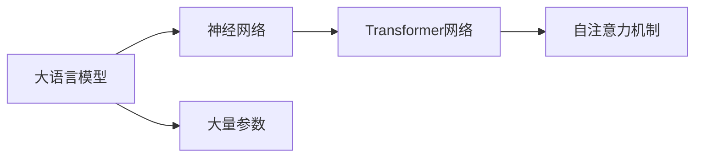

## 1.背景介绍

在过去的几年里，人工智能和机器学习领域经历了翻天覆地的变化，其中最引人注目的就是大语言模型的出现。大语言模型，如GPT-3、BERT等，已经在各种任务中取得了令人瞩目的成绩，包括机器翻译、情感分析、文本生成等等。这些模型的成功，使得我们有可能开发出可以理解和生成人类语言的机器，这无疑是人工智能的重大突破。

## 2.核心概念与联系

大语言模型的核心理念是使用大量的文本数据训练模型，使其能够理解和生成人类语言。这些模型的基础是神经网络，特别是Transformer网络。Transformer网络的核心是自注意力机制（Self-Attention Mechanism），它可以捕捉文本中的长距离依赖关系。大语言模型通常会使用数十亿甚至数千亿的参数，这使得它们可以处理非常复杂的语言任务。



## 3.核心算法原理具体操作步骤

大语言模型的训练通常包括以下步骤：

1. 数据准备：收集大量的文本数据，并进行预处理，包括分词、清洗等。

2. 模型构建：构建神经网络模型，通常是Transformer网络。

3. 模型训练：使用文本数据训练模型，通常使用的是最大似然估计方法。

4. 模型评估：在验证集上评估模型的性能，通常使用的是困惑度（Perplexity）。

5. 模型优化：根据模型在验证集上的表现，进行模型优化。

## 4.数学模型和公式详细讲解举例说明

让我们更深入地了解大语言模型的数学模型。

大语言模型的目标是最大化似然函数，这可以表示为：

$$
L(\theta) = \sum_{i=1}^{N} log P(w_i | w_{i-k}, ..., w_{i-1}; \theta)
$$

其中，$w_i$表示第i个单词，$w_{i-k}, ..., w_{i-1}$表示前k个单词，$\theta$表示模型的参数。

大语言模型通常使用交叉熵损失函数来训练，这可以表示为：

$$
L(\theta) = -\sum_{i=1}^{N} y_i log(\hat{y_i})
$$

其中，$y_i$表示真实的标签，$\hat{y_i}$表示模型的预测。

## 5.项目实践：代码实例和详细解释说明

以下是一个使用PyTorch实现的简单大语言模型的代码示例：

```python
import torch
from torch import nn
from torch.nn import Transformer

class LanguageModel(nn.Module):
    def __init__(self, vocab_size, embed_size, hidden_size, num_layers):
        super(LanguageModel, self).__init__()
        self.embed = nn.Embedding(vocab_size, embed_size)
        self.transformer = Transformer(hidden_size, num_layers)
        self.linear = nn.Linear(hidden_size, vocab_size)

    def forward(self, x):
        x = self.embed(x)
        x = self.transformer(x)
        x = self.linear(x)
        return x
```

## 6.实际应用场景

大语言模型在许多实际应用中都发挥了重要作用，包括：

1. 机器翻译：大语言模型可以生成流畅、准确的翻译。

2. 情感分析：大语言模型可以理解文本的情感倾向。

3. 文本生成：大语言模型可以生成人类级别的文本。

4. 智能聊天机器人：大语言模型可以进行自然语言对话。

## 7.工具和资源推荐

以下是一些有用的大语言模型相关的工具和资源：

1. PyTorch：一个开源的深度学习框架，适合大语言模型的训练和使用。

2. Hugging Face Transformers：一个提供预训练大语言模型的库。

3. OpenAI GPT-3：目前最大的语言模型，由OpenAI开发。

## 8.总结：未来发展趋势与挑战

大语言模型的发展仍然面临许多挑战，包括计算资源的限制、模型的解释性、模型的公平性等。然而，随着技术的发展，我们有理由相信，大语言模型将会在未来的人工智能领域扮演更重要的角色。

## 9.附录：常见问题与解答

1. Q: 大语言模型的训练需要多少数据？
   A: 通常需要数十亿甚至数千亿的单词。

2. Q: 大语言模型可以用于哪些任务？
   A: 包括机器翻译、情感分析、文本生成等。

3. Q: 大语言模型的训练需要多少计算资源？
   A: 通常需要大量的GPU和大量的时间。

作者：禅与计算机程序设计艺术 / Zen and the Art of Computer Programming
