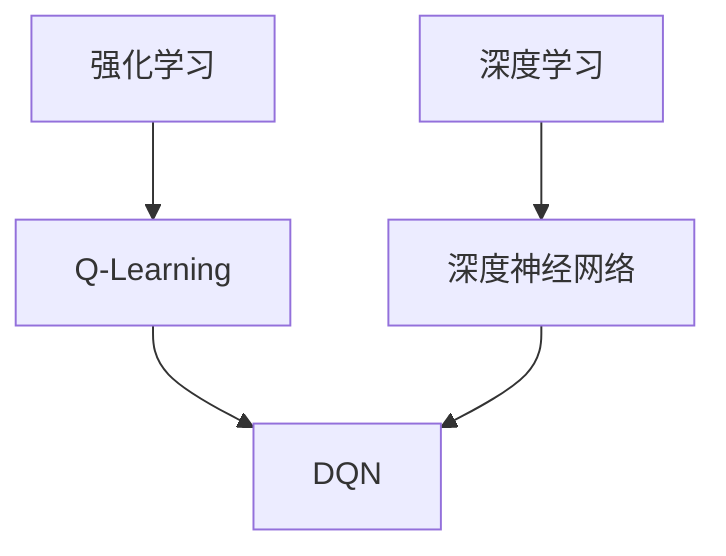

# 大语言模型原理与工程实践：DQN 的结构

## 1. 背景介绍

### 1.1 人工智能的发展历程

人工智能(AI)是当代科技发展的重要领域,它旨在创造出能够模拟人类智能的系统。自20世纪50年代诞生以来,AI经历了几个重要的发展阶段,包括专家系统、机器学习、深度学习等。

### 1.2 深度学习的兴起

深度学习作为机器学习的一个新的范式,凭借其强大的数据驱动能力和端到端的训练方式,在计算机视觉、自然语言处理等领域取得了突破性进展。

### 1.3 大语言模型的重要性

随着数据和计算能力的不断增长,大规模的语言模型开始展现出惊人的能力,能够捕捉丰富的语义和上下文信息,为自然语言处理任务提供强大支持。

## 2. 核心概念与联系

### 2.1 深度强化学习

深度强化学习(Deep Reinforcement Learning)将深度学习与强化学习相结合,旨在通过与环境的交互来学习最优策略。

#### 2.1.1 强化学习基础

强化学习是一种基于奖惩机制的学习范式,其中智能体(Agent)通过与环境(Environment)交互,获取奖励(Reward)并优化行为策略。

#### 2.1.2 深度神经网络

深度神经网络是深度学习的核心,它由多层非线性变换单元组成,能够自动从数据中学习特征表示。

### 2.2 深度Q网络(DQN)

深度Q网络(Deep Q-Network, DQN)是深度强化学习中的一种重要算法,它将深度神经网络应用于Q-Learning,用于估计状态-动作值函数(Q-Value Function)。



## 3. 核心算法原理具体操作步骤

### 3.1 Q-Learning

Q-Learning是一种基于时间差分(Temporal Difference)的强化学习算法,它旨在学习一个状态-动作值函数 $Q(s, a)$,用于估计在状态 $s$ 下执行动作 $a$ 后可获得的累积奖励。

$$
Q(s, a) = \mathbb{E}\left[r_t + \gamma \max_{a'} Q(s', a') \mid s_t = s, a_t = a\right]
$$

其中 $r_t$ 是立即奖励, $\gamma$ 是折现因子, $s'$ 是下一个状态。

### 3.2 深度Q网络(DQN)

传统的Q-Learning使用表格或简单的函数逼近器来表示Q值函数,但在高维状态空间下会遇到维数灾难的问题。DQN通过使用深度神经网络来逼近Q值函数,从而解决了这个问题。

$$
Q(s, a; \theta) \approx \max_\pi \mathbb{E}\left[r_t + \gamma r_{t+1} + \gamma^2 r_{t+2} + \cdots \mid s_t = s, a_t = a, \pi\right]
$$

其中 $\theta$ 是神经网络的参数。

#### 3.2.1 网络结构

DQN的网络结构通常由卷积层和全连接层组成,用于提取状态的特征表示。输出层的神经元数量等于可选动作的数量,每个神经元对应一个动作的Q值。


#### 3.2.2 经验回放

为了提高数据利用率并减少相关性,DQN采用了经验回放(Experience Replay)的技术。智能体与环境交互时,将转移元组 $(s_t, a_t, r_t, s_{t+1})$ 存储在经验回放池中。在训练时,从经验回放池中随机采样小批量数据进行训练,这样可以打破数据的相关性,提高训练效率。

#### 3.2.3 目标网络

为了提高训练的稳定性,DQN引入了目标网络(Target Network)的概念。目标网络是一个延迟更新的Q网络,用于计算 $\max_{a'} Q(s', a')$ 的目标值。主Q网络和目标网络的参数是分开更新的,每隔一定步数,将主Q网络的参数复制给目标网络。

### 3.3 算法步骤

DQN算法的具体步骤如下:

1. 初始化主Q网络和目标Q网络,使用相同的参数。
2. 初始化经验回放池。
3. 对于每个episode:
    1. 初始化环境状态 $s_0$。
    2. 对于每个时间步 $t$:
        1. 根据当前状态 $s_t$ 和主Q网络,选择动作 $a_t$。
        2. 执行动作 $a_t$,观测奖励 $r_t$ 和下一个状态 $s_{t+1}$。
        3. 将转移元组 $(s_t, a_t, r_t, s_{t+1})$ 存储到经验回放池。
        4. 从经验回放池中随机采样小批量数据进行训练:
            1. 计算目标值 $y_j = r_j + \gamma \max_{a'} Q(s_{j+1}, a'; \theta^-)$,其中 $\theta^-$ 是目标网络的参数。
            2. 计算主Q网络的输出 $Q(s_j, a_j; \theta)$。
            3. 最小化损失函数 $L = \mathbb{E}\left[(y_j - Q(s_j, a_j; \theta))^2\right]$,更新主Q网络的参数 $\theta$。
        5. 每隔一定步数,将主Q网络的参数复制给目标网络。

## 4. 数学模型和公式详细讲解举例说明

### 4.1 Q-Learning的数学模型

Q-Learning算法的目标是找到一个最优的Q值函数 $Q^*(s, a)$,它满足下式:

$$
Q^*(s, a) = \mathbb{E}\left[r_t + \gamma \max_{a'} Q^*(s', a') \mid s_t = s, a_t = a\right]
$$

这个方程描述了在状态 $s$ 下执行动作 $a$ 后,可获得的即时奖励 $r_t$ 加上折现后的下一状态 $s'$ 下最大Q值的期望值。

我们可以使用时间差分(Temporal Difference)的方法来更新Q值函数:

$$
Q(s_t, a_t) \leftarrow Q(s_t, a_t) + \alpha \left[r_t + \gamma \max_{a'} Q(s_{t+1}, a') - Q(s_t, a_t)\right]
$$

其中 $\alpha$ 是学习率,用于控制更新的步长。

### 4.2 DQN的损失函数

DQN使用神经网络来逼近Q值函数,因此我们需要最小化一个损失函数来训练网络参数。DQN的损失函数定义如下:

$$
L(\theta) = \mathbb{E}\left[(y_j - Q(s_j, a_j; \theta))^2\right]
$$

其中 $y_j = r_j + \gamma \max_{a'} Q(s_{j+1}, a'; \theta^-)$ 是目标Q值,使用目标网络参数 $\theta^-$ 计算得到。$Q(s_j, a_j; \theta)$ 是主Q网络在状态 $s_j$ 下执行动作 $a_j$ 的输出值,使用当前参数 $\theta$ 计算得到。

通过最小化这个损失函数,我们可以使主Q网络的输出值逼近目标Q值,从而学习到一个好的Q值函数逼近器。

### 4.3 举例说明

假设我们有一个简单的网格世界环境,智能体的目标是从起点移动到终点。每一步移动都会获得一个小的负奖励,到达终点会获得一个大的正奖励。

我们可以使用DQN算法来学习一个最优的Q值函数,指导智能体做出正确的移动决策。

假设在某个时间步 $t$,智能体处于状态 $s_t$,执行动作 $a_t$ 后进入状态 $s_{t+1}$,获得奖励 $r_t$。我们可以计算目标Q值:

$$
y_t = r_t + \gamma \max_{a'} Q(s_{t+1}, a'; \theta^-)
$$

其中 $\theta^-$ 是目标网络的参数。

然后,我们可以计算主Q网络在状态 $s_t$ 下执行动作 $a_t$ 的输出值 $Q(s_t, a_t; \theta)$,并最小化损失函数:

$$
L(\theta) = (y_t - Q(s_t, a_t; \theta))^2
$$

通过不断更新主Q网络的参数 $\theta$,我们可以逐步学习到一个好的Q值函数逼近器,指导智能体做出正确的决策。

## 5. 项目实践: 代码实例和详细解释说明

在这一部分,我们将提供一个使用PyTorch实现DQN算法的代码示例,并对关键部分进行详细解释。

### 5.1 环境设置

我们将使用OpenAI Gym中的CartPole-v1环境进行示例。该环境是一个经典的控制问题,目标是通过适当的力来保持杆子保持直立。

```python
import gym
env = gym.make('CartPole-v1')
```

### 5.2 定义DQN网络

我们使用一个简单的全连接神经网络作为DQN的网络结构。

```python
import torch
import torch.nn as nn

class DQN(nn.Module):
    def __init__(self, state_size, action_size):
        super(DQN, self).__init__()
        self.fc1 = nn.Linear(state_size, 24)
        self.fc2 = nn.Linear(24, 24)
        self.fc3 = nn.Linear(24, action_size)

    def forward(self, x):
        x = torch.relu(self.fc1(x))
        x = torch.relu(self.fc2(x))
        x = self.fc3(x)
        return x
```

### 5.3 经验回放池

我们使用一个简单的列表来实现经验回放池。

```python
import random
from collections import deque

class ReplayBuffer:
    def __init__(self, buffer_size):
        self.buffer = deque(maxlen=buffer_size)

    def push(self, state, action, reward, next_state, done):
        self.buffer.append((state, action, reward, next_state, done))

    def sample(self, batch_size):
        transitions = random.sample(self.buffer, batch_size)
        batch = tuple(map(lambda x: torch.cat(x, dim=0), zip(*transitions)))
        return batch
```

### 5.4 DQN算法实现

下面是DQN算法的核心实现部分。

```python
import torch.optim as optim

BUFFER_SIZE = 10000
BATCH_SIZE = 64
GAMMA = 0.99
EPS_START = 0.9
EPS_END = 0.05
EPS_DECAY = 200
TARGET_UPDATE = 10

policy_net = DQN(state_size, action_size)
target_net = DQN(state_size, action_size)
target_net.load_state_dict(policy_net.state_dict())

optimizer = optim.RMSprop(policy_net.parameters())
memory = ReplayBuffer(BUFFER_SIZE)

steps_done = 0

def select_action(state):
    global steps_done
    sample = random.random()
    eps_threshold = EPS_END + (EPS_START - EPS_END) * \
        math.exp(-1. * steps_done / EPS_DECAY)
    steps_done += 1
    if sample > eps_threshold:
        with torch.no_grad():
            return policy_net(state).max(1)[1].view(1, 1)
    else:
        return torch.tensor([[random.randrange(action_size)]], device=device, dtype=torch.long)

episode_durations = []

def optimize_model():
    if len(memory) < BATCH_SIZE:
        return
    transitions = memory.sample(BATCH_SIZE)
    batch = tuple(t.to(device) for t in transitions)

    state_batch = batch[0]
    action_batch = batch[1]
    reward_batch = batch[2]
    next_state_batch = batch[3]
    done_batch = batch[4]

    state_action_values = policy_net(state_batch).gather(1, action_batch)

    next_state_values = torch.zeros(BATCH_SIZE, device=device)
    next_state_values[~done_batch] = target_net(next_state_batch[~done_batch]).max(1)[0].detach()
    expected_state_action_values = (next_state_values * GAMMA) + reward_batch

    loss = F.smooth_l1_loss(state_action_values, expected_state_action_values.unsqueeze(1))

    optimizer.zero_grad()
    loss.backward()
    optimizer.step()

num_episodes = 1000
for i_episode in range(num_episodes):