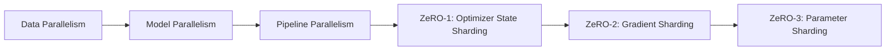

# 大语言模型原理与工程实践：ZeRO 并行

## 1. 背景介绍

### 1.1 大语言模型的发展历程

近年来,随着深度学习技术的快速发展,自然语言处理领域取得了巨大的突破。其中,大语言模型(Large Language Model,LLM)的出现,更是将NLP推向了一个新的高度。从2018年GPT-1的发布,到如今GPT-3、PaLM、Megatron-Turing NLG等百亿甚至千亿级别参数量的模型不断涌现,大语言模型正在以惊人的速度发展,并在机器翻译、对话系统、文本生成等诸多任务上取得了超越人类的表现。

### 1.2 大语言模型面临的挑战

然而,训练大语言模型所需的算力和内存资源也在急剧增长。以GPT-3为例,其参数量高达1750亿,训练成本据估计超过1200万美元。如何在有限的硬件资源下高效训练如此庞大的模型,成为了工业界和学术界共同面临的一大挑战。

### 1.3 ZeRO 并行的意义

为了解决这一难题,微软研究院提出了ZeRO(Zero Redundancy Optimizer)并行训练优化方法。通过优化内存分配和通信策略,再结合数据并行、模型并行、流水线并行等分布式训练技术,ZeRO 可以将模型训练所需的内存降低 10 倍以上,大幅提升训练效率。这为大语言模型的研究和应用带来了新的曙光。

## 2. 核心概念与联系

### 2.1 数据并行

数据并行(Data Parallelism)是最常见的一种分布式训练方式。它将训练数据分割成多个子集,分配到不同的设备上,每个设备保存一份完整的模型参数,并行处理不同的数据子集,然后通过 AllReduce 通信原语,在设备间同步梯度,更新模型参数。数据并行可以显著加速训练过程,但受限于单个设备的内存容量。

### 2.2 模型并行 

模型并行(Model Parallelism)则是将模型参数切分到多个设备上。每个设备只保存并训练部分模型参数。前向和反向传播时,需要在设备间传递中间激活(Activation)状态。模型并行可以突破单卡内存的限制,支持更大规模的模型训练。但设备间通信开销较大,且并行度受限于模型的层数。

### 2.3 流水线并行

流水线并行(Pipeline Parallelism)是将模型分割成若干个连续的部分,每个部分被分配到不同的设备,数据在设备间流水线式传递。当一个设备还在处理当前的微批次(Micro-Batch)时,下一个微批次就可以进入流水线并行处理,从而提高设备的利用率。但流水线并行对批次大小、设备数量和负载均衡等都有较高要求。

### 2.4 ZeRO 并行

ZeRO 并行是在数据并行的基础上,进一步优化内存分配和通信效率。它借鉴了操作系统中的 Zero Copy 理念,尽可能避免冗余的内存占用和数据拷贝。ZeRO 主要包含三个阶段的优化:

- ZeRO-1: 优化器状态(Optimizer State)分片
- ZeRO-2: 梯度(Gradient)分片
- ZeRO-3: 参数(Parameter)分片

通过这三个阶段的优化,再结合模型并行、流水线并行等技术,ZeRO 可以大幅降低训练大模型所需的内存消耗,提高训练效率。

以下是 ZeRO 并行的核心概念和技术关联的 Mermaid 流程图:



## 3. 核心算法原理具体操作步骤

### 3.1 ZeRO-1: 优化器状态分片

ZeRO-1 的核心思想是将优化器状态(如 Adam 优化器中的动量、方差等)在不同设备间进行分片。每个设备只保存和更新自己负责的那部分参数对应的优化器状态,而不是所有参数的优化器状态。这样可以将优化器状态占用的内存降低 N 倍(N为设备数)。

具体步骤如下:

1. 在初始化优化器时,根据设备数量 N,将优化器状态均匀分片到 N 个设备。
2. 前向传播时,每个设备计算自己负责的部分参数的梯度。 
3. 反向传播时,各设备通过 AllReduce 通信,聚合得到完整的参数梯度。
4. 每个设备使用聚合后的梯度,更新自己负责的那部分参数的优化器状态和参数值。

### 3.2 ZeRO-2: 梯度分片

ZeRO-2 在 ZeRO-1 的基础上,进一步将参数梯度也进行分片。每个设备只负责计算、更新和保存部分参数的梯度,进一步减少了内存占用。

具体步骤如下:

1. 前向传播时,各设备独立完成自己负责部分的计算。
2. 反向传播时,各设备只计算自己负责的部分参数的梯度。
3. 各设备通过 ReduceScatter 通信原语,交换梯度分片,使每个设备最终只保留自己负责的梯度分片。
4. 每个设备使用自己的梯度分片,更新对应的参数值和优化器状态。

### 3.3 ZeRO-3: 参数分片

ZeRO-3 更进一步,在 ZeRO-2 的基础上实现了参数分片。每个设备只保存和更新部分参数,显著降低了模型参数占用的内存。但由于前向和反向传播都需要用到完整的参数,ZeRO-3 引入了参数获取(Gathering)和参数释放(Freeing)的操作,需要在设备间传输参数。

具体步骤如下:

1. 模型初始化时,将参数均匀分片到 N 个设备。
2. 前向传播时,每个设备先通过 AllGather 通信获取完整的参数副本,然后完成自己负责部分的计算。
3. 前向传播完成后,各设备立即释放刚刚获取的参数副本,只保留部分本地参数和中间激活值。
4. 反向传播时,各设备先通过 AllGather 获取完整的参数副本和梯度副本,计算部分梯度。
5. 各设备通过 ReduceScatter 通信交换梯度分片,并用于更新自己负责的参数分片和优化器状态。
6. 反向传播完成后,各设备立即释放获取的完整参数副本和梯度副本,只保留更新后的部分本地参数。

## 4. 数学模型和公式详细讲解举例说明

为了更好地理解 ZeRO 并行的数学原理,这里我们以 ZeRO-1 为例,详细推导并举例说明。

假设我们有 $N$ 个设备,模型有 $M$ 个参数 $\theta=\{\theta_1,\theta_2,...,\theta_M\}$,对应的梯度为 $g=\{g_1,g_2,...,g_M\}$,学习率为 $\alpha$。我们使用 Adam 优化器,其中动量项为 $m$,方差项为 $v$。

在传统的数据并行中,每个设备 $i$ 都保存一份完整的参数副本 $\theta^{(i)}$、梯度 $g^{(i)}$ 和优化器状态 $m^{(i)},v^{(i)}$。设备 $i$ 上的参数更新公式为:

$$
\begin{aligned}
g^{(i)} &= \frac{1}{N} \sum_{j=1}^N g^{(j)} \\
m^{(i)} &= \beta_1 \cdot m^{(i)} + (1-\beta_1) \cdot g^{(i)} \\
v^{(i)} &= \beta_2 \cdot v^{(i)} + (1-\beta_2) \cdot (g^{(i)})^2 \\
\theta^{(i)} &= \theta^{(i)} - \alpha \cdot \frac{m^{(i)}}{\sqrt{v^{(i)}}+\epsilon}
\end{aligned}
$$

其中 $\beta_1,\beta_2$ 是 Adam 的超参数, $\epsilon$ 是平滑项。

在 ZeRO-1 中,每个设备只保存和更新部分参数的优化器状态。假设设备 $i$ 负责的参数下标集合为 $S_i$,则有 $\bigcup_{i=1}^N S_i = \{1,2,...,M\}$ 且 $\bigcap_{i=1}^N S_i = \emptyset$。设备 $i$ 只保存 $\{m_k^{(i)},v_k^{(i)}|k\in S_i\}$。

ZeRO-1 的参数更新公式为:

$$
\begin{aligned}
g^{(i)} &= \frac{1}{N} \sum_{j=1}^N g^{(j)} \\
m_k^{(i)} &= \begin{cases}
\beta_1 \cdot m_k^{(i)} + (1-\beta_1) \cdot g_k^{(i)}, & k \in S_i \\
0, & k \notin S_i
\end{cases} \\
v_k^{(i)} &= \begin{cases}
\beta_2 \cdot v_k^{(i)} + (1-\beta_2) \cdot (g_k^{(i)})^2, & k \in S_i \\
0, & k \notin S_i
\end{cases} \\
\theta^{(i)} &= \theta^{(i)} - \alpha \cdot \frac{m^{(i)}}{\sqrt{v^{(i)}}+\epsilon}
\end{aligned}
$$

可以看出,ZeRO-1 只更新设备 $i$ 负责的那部分优化器状态,其余部分保持为 0。这样可以将优化器状态占用的内存降低 $N$ 倍。

举个例子,假设我们有 2 个设备,模型有 4 个参数。在传统的数据并行中,每个设备都保存 4 个参数的优化器状态,共占用 $4\times 2=8$ 份内存。而在 ZeRO-1 中,设备 1 负责前两个参数,设备 2 负责后两个参数,每个设备只保存 2 个参数的优化器状态,共占用 $2\times 2=4$ 份内存,内存占用减半。

ZeRO-2 和 ZeRO-3 的数学推导和优化过程与之类似,限于篇幅这里不再赘述。总之,通过这些优化,ZeRO 并行可以大幅降低训练大模型所需的内存消耗。

## 5. 项目实践：代码实例和详细解释说明

下面我们通过一个简单的 PyTorch 代码实例,来演示如何使用 ZeRO 并行训练一个大语言模型。

首先,我们需要安装 DeepSpeed 库,它提供了 ZeRO 并行的高效实现:

```bash
pip install deepspeed
```

然后,我们定义一个简单的 GPT 语言模型:

```python
import torch
import torch.nn as nn

class GPTModel(nn.Module):
    def __init__(self, vocab_size, hidden_size, num_layers):
        super().__init__()
        self.embedding = nn.Embedding(vocab_size, hidden_size)
        self.layers = nn.ModuleList([nn.TransformerBlock(hidden_size, 4 * hidden_size, 4, dropout=0.1) for _ in range(num_layers)])
        self.norm = nn.LayerNorm(hidden_size)

    def forward(self, input_ids):
        x = self.embedding(input_ids)
        for layer in self.layers:
            x = layer(x)
        x = self.norm(x)
        return x
```

接下来,我们使用 DeepSpeed 提供的 `deepspeed.initialize` 函数,对模型、优化器和数据加载器进行初始化和包装:

```python
import deepspeed
import transformers

model = GPTModel(vocab_size=50000, hidden_size=1024, num_layers=24)
optimizer = torch.optim.Adam(model.parameters(), lr=1e-4)
train_loader = ...

model_engine, optimizer, train_loader, _ = deepspeed.initialize(
    args=args,
    model=model, 
    optimizer=optimizer,
    model_parameters=model.parameters(),
    training_data=train_dataset
)
```

这里的 `args` 是一个