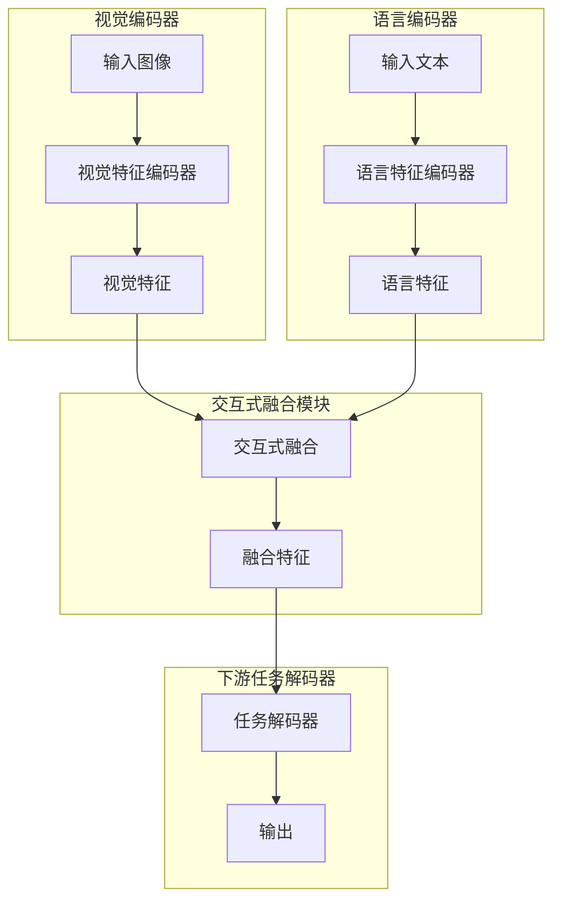

# 大语言模型原理与工程实践：其他数据

## 1.背景介绍

### 1.1 大语言模型的兴起

近年来,大型语言模型(Large Language Models, LLMs)在自然语言处理领域崭露头角,展现出令人惊叹的能力。这些模型通过在大规模语料库上进行预训练,学习了丰富的语言知识和上下文信息,可以生成看似人性化的文本输出。

代表性的大语言模型包括GPT(Generative Pre-trained Transformer)系列、BERT(Bidirectional Encoder Representations from Transformers)、XLNet、T5(Text-to-Text Transfer Transformer)等,它们在机器翻译、文本生成、问答系统、文本摘要等多个任务上表现出色。

### 1.2 大语言模型的局限性

尽管大语言模型在处理自然语言方面取得了长足进展,但它们仍然存在一些局限性和缺陷。其中一个主要问题是,这些模型在训练过程中只利用了文本数据,缺乏对真实世界的理解和常识推理能力。它们生成的输出可能存在事实错误、逻辑矛盾或不合理之处。

为了解决这一问题,研究人员提出了将其他形式的数据融入大语言模型的想法,旨在增强模型对真实世界的认知和推理能力。这些其他数据可以包括结构化知识库、视觉数据、多模态数据等,为模型提供更丰富、更全面的信息来源。

## 2.核心概念与联系

### 2.1 知识增强语言模型

知识增强语言模型(Knowledge-Enhanced Language Models)是指将结构化知识库或知识图谱融入语言模型的方法。这种方法的核心思想是,利用知识库中的事实信息和实体关系,为语言模型提供外部知识支持,从而提高模型的理解和推理能力。

常见的知识增强方法包括:

1. **知识注入(Knowledge Injection)**: 将知识库中的三元组(主语-关系-宾语)形式的事实直接注入到语言模型的输入或输出中。

2. **记忆增强(Memory Augmentation)**: 将知识库作为外部记忆模块与语言模型相结合,在生成过程中动态查询和利用相关知识。

3. **知识蒸馏(Knowledge Distillation)**: 从知识库中提取知识,并将其蒸馏到语言模型的参数中,使模型内部融合了知识信息。

知识增强语言模型可以显著提高模型在特定领域的表现,但同时也面临着知识库覆盖范围有限、知识融合方式复杂等挑战。

### 2.2 视觉语义模型

视觉语义模型(Vision-Language Models)旨在将视觉信息与语言信息相结合,实现跨模态的理解和生成。这种模型通常由两个子模块组成:视觉编码器(Vision Encoder)和语言编码器(Language Encoder)。

视觉编码器负责提取图像或视频中的视觉特征,而语言编码器则负责编码相应的文本描述。两个编码器的输出将被融合,用于下游任务如图像描述生成、视觉问答、图文理解等。

常见的视觉语义模型架构包括:

1. **双编码器(Dual Encoder)**: 视觉编码器和语言编码器分别对视觉和语言信号进行编码,然后将编码后的特征进行融合。

2. **单编码器(Single Encoder)**: 将视觉和语言信号拼接为单一序列输入,由统一的Transformer编码器进行编码。

3. **交互式编码器(Interactive Encoder)**: 在编码过程中,视觉和语言模块之间存在交互和信息传递,实现跨模态的特征融合。

视觉语义模型能够捕捉视觉和语言之间的关联,为语言模型提供更丰富的上下文信息,但同时也面临着模态之间的heterogeneity和对齐问题。

### 2.3 多模态语义模型

多模态语义模型(Multimodal Semantic Models)是一种更广义的模型,它不仅融合了视觉和语言信息,还可以整合其他形式的模态数据,如音频、视频、传感器数据等。这种模型旨在实现跨模态的理解和生成,为语言模型提供全面的多源信息支持。

多模态语义模型的架构通常包括多个模态特定编码器和一个融合模块。每个模态编码器负责提取相应模态的特征表示,而融合模块则将不同模态的特征进行融合和建模。

常见的多模态融合方法包括:

1. **特征拼接(Feature Concatenation)**: 直接将不同模态的特征向量拼接在一起,作为融合后的特征表示。

2. **门控融合(Gated Fusion)**: 使用门控机制动态调节不同模态特征的重要性,实现自适应的特征融合。

3. **交互式融合(Interactive Fusion)**: 在融合过程中,不同模态之间存在交互和信息传递,实现跨模态的特征增强。

4. **转换器融合(Transformer Fusion)**: 利用Transformer的自注意力机制,自动捕捉不同模态之间的长程依赖关系。

多模态语义模型能够利用多源异构数据,为语言模型提供更全面的信息支持,但同时也面临着模态对齐、融合策略选择等挑战。

## 3.核心算法原理具体操作步骤

在本节中,我们将详细介绍一种常见的多模态语义模型架构及其核心算法原理和操作步骤。

### 3.1 模型架构概述

我们采用一种典型的双编码器架构,包括一个视觉编码器和一个语言编码器。视觉编码器负责从输入图像中提取视觉特征,而语言编码器则负责从输入文本中提取语义特征。然后,我们使用一个交互式融合模块将两种模态的特征进行融合,实现跨模态的特征增强。最后,融合后的特征将被送入下游任务的解码器进行预测。

该模型架构的核心思想是利用视觉和语言信息的互补性,捕捉两种模态之间的关联和依赖关系,从而提高模型的理解和生成能力。

### 3.2 视觉编码器

视觉编码器的目标是从输入图像中提取富含语义信息的视觉特征表示。我们通常采用预训练的卷积神经网络(CNN)作为视觉编码器的骨干网络,如VGG、ResNet或EfficientNet等。

具体操作步骤如下:

1. 将输入图像送入CNN骨干网络,经过一系列卷积、池化和非线性激活操作,提取不同尺度的特征图。

2. 对特征图进行空间池化操作(如平均池化或自适应池化),将其降维为一个固定长度的视觉特征向量。

3. (可选)将视觉特征向量输入到一个全连接层中,进行线性变换和非线性激活,得到最终的视觉特征表示。

视觉特征表示将被送入交互式融合模块,与语言特征进行融合。

### 3.3 语言编码器

语言编码器的目标是从输入文本中提取语义特征表示。我们通常采用预训练的Transformer语言模型(如BERT、RoBERTa或XLNet)作为语言编码器的骨干网络。

具体操作步骤如下:

1. 将输入文本进行标记化(tokenization),得到一系列标记序列。

2. 将标记序列输入到Transformer语言模型中,经过多层自注意力和前馈网络,得到每个标记对应的上下文化表示。

3. 对最后一层的输出进行池化操作(如取[CLS]标记的表示或序列平均池化),得到一个固定长度的语言特征向量。

4. (可选)将语言特征向量输入到一个全连接层中,进行线性变换和非线性激活,得到最终的语言特征表示。

语言特征表示将被送入交互式融合模块,与视觉特征进行融合。

### 3.4 交互式融合模块

交互式融合模块的目标是将视觉特征和语言特征进行融合,实现跨模态的特征增强。我们采用一种基于自注意力机制的交互式融合策略。

具体操作步骤如下:

1. 将视觉特征和语言特征拼接为一个特征序列,作为融合模块的输入。

2. 使用多头自注意力机制,捕捉不同模态特征之间的长程依赖关系。具体来说,每个特征向量都可以通过注意力机制关注到其他模态的相关特征,实现跨模态的特征交互。

3. 将自注意力的输出通过前馈网络进行非线性变换,得到增强后的特征表示。

4. 重复步骤2和3若干次,进行多层次的交互式融合。

5. 对最后一层的输出进行池化操作,得到一个固定长度的融合特征向量。

融合特征向量将被送入下游任务的解码器,用于预测或生成相应的输出。

### 3.5 下游任务解码器

下游任务解码器的具体形式取决于所要解决的任务。例如,对于图像描述生成任务,解码器可以是一个基于Transformer的序列到序列模型;对于视觉问答任务,解码器可以是一个分类器。

无论解码器的具体形式如何,它都将利用融合特征向量作为输入,结合任务目标进行预测或生成。在训练阶段,解码器的参数将通过反向传播算法进行优化,使模型在特定任务上达到最佳性能。

## 4.数学模型和公式详细讲解举例说明

在本节中,我们将详细介绍交互式融合模块中使用的自注意力机制,并给出相关数学模型和公式。

### 4.1 自注意力机制

自注意力机制是Transformer模型的核心组件,它能够自适应地捕捉输入序列中任意两个位置之间的长程依赖关系。在我们的交互式融合模块中,自注意力机制被用于捕捉不同模态特征之间的相关性和依赖关系。

给定一个包含视觉特征和语言特征的输入序列 $X = [x_1, x_2, \dots, x_n]$,其中 $x_i \in \mathbb{R}^{d_x}$ 表示第 $i$ 个位置的特征向量。自注意力机制的计算过程如下:

1. **线性投影**:将输入序列 $X$ 分别投影到查询(Query)、键(Key)和值(Value)空间,得到 $Q$、$K$ 和 $V$:

$$
\begin{aligned}
Q &= XW^Q \\
K &= XW^K \\
V &= XW^V
\end{aligned}
$$

其中 $W^Q \in \mathbb{R}^{d_x \times d_k}$、$W^K \in \mathbb{R}^{d_x \times d_k}$ 和 $W^V \in \mathbb{R}^{d_x \times d_v}$ 分别是查询、键和值的线性投影矩阵,而 $d_k$ 和 $d_v$ 分别是查询/键和值的维度。

2. **注意力计算**:计算查询 $Q$ 和所有键 $K$ 之间的点积,得到注意力分数矩阵 $A$。然后,对 $A$ 的每一行进行软最大值归一化,得到注意力权重矩阵 $\alpha$:

$$
\begin{aligned}
A &= QK^T \\
\alpha &= \text{softmax}(A / \sqrt{d_k})
\end{aligned}
$$

其中,温度参数 $\sqrt{d_k}$ 用于缩放注意力分数,以防止过大或过小的值导致梯度消失或爆炸。

3. **加权求和**:使用注意力权重矩阵 $\alpha$ 对值 $V$ 进行加权求和,得到