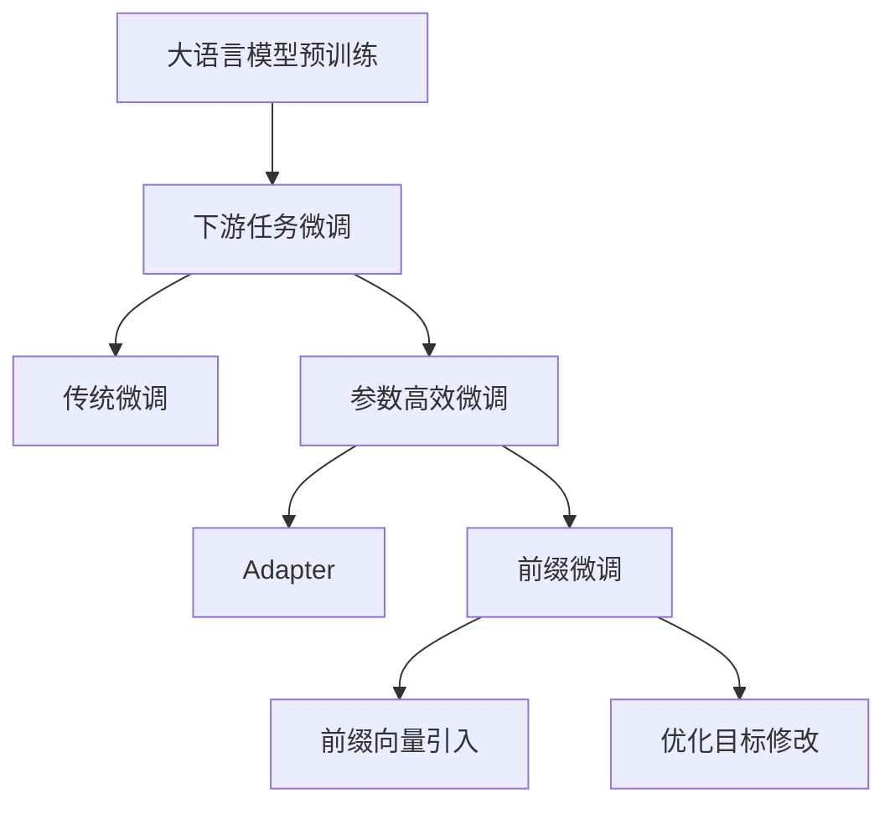

# 大语言模型原理与工程实践：前缀微调

## 1. 背景介绍
### 1.1 大语言模型的发展历程
#### 1.1.1 早期的语言模型
#### 1.1.2 Transformer的出现
#### 1.1.3 预训练语言模型的崛起

### 1.2 大语言模型的应用现状
#### 1.2.1 自然语言处理领域的广泛应用  
#### 1.2.2 知识图谱构建与问答系统
#### 1.2.3 语言翻译与文本生成

### 1.3 前缀微调的提出背景
#### 1.3.1 传统微调方法的局限性
#### 1.3.2 前缀微调的优势与创新点
#### 1.3.3 前缀微调在业界的研究现状

## 2. 核心概念与联系
### 2.1 大语言模型的基本原理
#### 2.1.1 语言模型的定义与目标
#### 2.1.2 基于Transformer的语言模型架构
#### 2.1.3 预训练与微调的概念

### 2.2 前缀微调的核心思想 
#### 2.2.1 前缀向量的引入
#### 2.2.2 前缀向量与模型参数的联系
#### 2.2.3 前缀微调的优化目标

### 2.3 前缀微调与其他微调方法的对比
#### 2.3.1 传统微调方法的局限性
#### 2.3.2 Adapter等参数高效微调方法
#### 2.3.3 前缀微调的独特优势



## 3. 核心算法原理与具体操作步骤
### 3.1 前缀向量的构建与初始化
#### 3.1.1 前缀向量的维度与形状
#### 3.1.2 前缀向量的初始化策略
#### 3.1.3 前缀向量的嵌入方式

### 3.2 前缀微调的训练过程
#### 3.2.1 损失函数的设计
#### 3.2.2 前缀向量的更新策略 
#### 3.2.3 超参数的选择与调优

### 3.3 推理阶段的前缀向量应用
#### 3.3.1 前缀向量的存储与加载
#### 3.3.2 前缀向量与模型的组合方式
#### 3.3.3 推理加速技巧

## 4. 数学模型与公式详解
### 4.1 Transformer的数学原理
#### 4.1.1 自注意力机制的数学表示
$$Attention(Q,K,V) = softmax(\frac{QK^T}{\sqrt{d_k}})V$$
#### 4.1.2 前馈神经网络的数学表示
$$FFN(x) = max(0, xW_1 + b_1)W_2 + b_2$$
#### 4.1.3 残差连接与层归一化的数学表示
$$LayerNorm(x + Sublayer(x))$$

### 4.2 前缀微调的数学原理
#### 4.2.1 前缀向量的数学表示
设前缀向量为$P \in \mathbb{R}^{l \times d}$，其中$l$为前缀长度，$d$为隐藏层维度。
#### 4.2.2 前缀向量与隐藏状态的融合
$$h_0 = [P; E(x)]$$
其中$E(x)$为输入$x$的嵌入表示。
#### 4.2.3 前缀微调的损失函数
$$\mathcal{L}(\theta, \phi) = -\sum_{i=1}^{N} \log p_{\theta, \phi}(y_i|x_i, P)$$
其中$\theta$为原始模型参数，$\phi$为前缀向量参数。

## 5. 项目实践：代码实例与详解
### 5.1 基于PyTorch的前缀微调实现
#### 5.1.1 定义前缀向量类
```python
class PrefixEncoder(nn.Module):
    def __init__(self, config):
        super().__init__()
        self.prefix_projection = nn.Parameter(torch.randn(config.pre_seq_len, config.hidden_size))
        
    def forward(self, prefix):
        return self.prefix_projection.unsqueeze(0).expand(prefix.size(0), -1, -1)
```
#### 5.1.2 修改Transformer的前向传播
```python
def forward(self, input_ids, prefix_embeds):
    hidden_states = self.embeddings(input_ids)
    hidden_states = torch.cat([prefix_embeds, hidden_states], dim=1)
    ...
```
#### 5.1.3 定义训练循环
```python
for epoch in range(num_epochs):
    for batch in dataloader:
        input_ids, labels = batch
        prefix_embeds = prefix_encoder(input_ids)
        outputs = model(input_ids, prefix_embeds)
        loss = criterion(outputs, labels)
        loss.backward()
        optimizer.step()
```

### 5.2 基于TensorFlow的前缀微调实现
#### 5.2.1 定义前缀向量类
```python
class PrefixEncoder(tf.keras.layers.Layer):
    def __init__(self, config):
        super().__init__()
        self.prefix_projection = self.add_weight(shape=(config.pre_seq_len, config.hidden_size), initializer="random_normal")
        
    def call(self, prefix):
        return tf.broadcast_to(self.prefix_projection, [tf.shape(prefix)[0], tf.shape(self.prefix_projection)[0], tf.shape(self.prefix_projection)[1]])
```
#### 5.2.2 修改Transformer的前向传播
```python
def call(self, input_ids, prefix_embeds):
    hidden_states = self.embeddings(input_ids)
    hidden_states = tf.concat([prefix_embeds, hidden_states], axis=1)
    ...
```
#### 5.2.3 定义训练循环
```python
for epoch in range(num_epochs):
    for input_ids, labels in dataset:
        with tf.GradientTape() as tape:
            prefix_embeds = prefix_encoder(input_ids)
            outputs = model(input_ids, prefix_embeds)
            loss = loss_fn(labels, outputs)
        gradients = tape.gradient(loss, model.trainable_variables + prefix_encoder.trainable_variables)
        optimizer.apply_gradients(zip(gradients, model.trainable_variables + prefix_encoder.trainable_variables))
```

## 6. 实际应用场景
### 6.1 文本分类任务
#### 6.1.1 情感分析
#### 6.1.2 主题分类
#### 6.1.3 意图识别

### 6.2 序列标注任务  
#### 6.2.1 命名实体识别
#### 6.2.2 词性标注
#### 6.2.3 语义角色标注

### 6.3 文本生成任务
#### 6.3.1 摘要生成
#### 6.3.2 对话生成
#### 6.3.3 故事生成

## 7. 工具与资源推荐
### 7.1 开源工具包
#### 7.1.1 Hugging Face Transformers
#### 7.1.2 Flair
#### 7.1.3 OpenPrompt

### 7.2 预训练模型资源
#### 7.2.1 BERT系列模型
#### 7.2.2 GPT系列模型
#### 7.2.3 T5系列模型

### 7.3 数据集资源
#### 7.3.1 GLUE基准测试
#### 7.3.2 SuperGLUE基准测试
#### 7.3.3 SQuAD问答数据集

## 8. 总结：未来发展趋势与挑战
### 8.1 前缀微调的优势与局限
#### 8.1.1 参数高效性
#### 8.1.2 任务适应性
#### 8.1.3 推理速度瓶颈

### 8.2 前缀微调的改进方向  
#### 8.2.1 前缀向量的压缩
#### 8.2.2 前缀向量的解耦
#### 8.2.3 前缀微调与其他微调方法的结合

### 8.3 大语言模型的未来发展趋势
#### 8.3.1 模型规模的持续扩大
#### 8.3.2 多模态语言模型的崛起
#### 8.3.3 语言模型的通用智能

## 9. 附录：常见问题与解答
### 9.1 前缀微调与Adapter的区别？
前缀微调通过引入前缀向量来适应下游任务，而Adapter则是在Transformer的每一层中加入额外的适配器模块。前缀微调更加参数高效，但Adapter具有更好的任务适应性。

### 9.2 前缀向量的长度如何选择？
前缀向量的长度是一个超参数，需要根据具体任务进行调优。一般来说，前缀长度越大，模型的容量越大，但训练和推理的开销也会增加。常见的前缀长度选择包括10、16、32等。

### 9.3 前缀微调能否应用于生成式任务？
前缀微调不仅适用于分类、标注等判别式任务，也可以应用于生成式任务。在生成式任务中，前缀向量可以作为生成过程的初始状态，引导模型生成特定风格或主题的文本。

作者：禅与计算机程序设计艺术 / Zen and the Art of Computer Programming