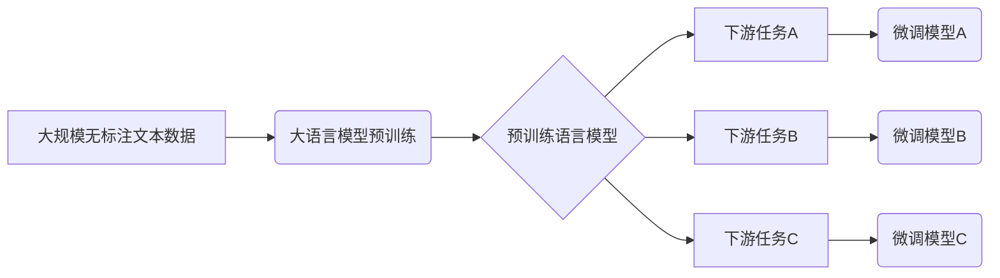

# 大语言模型原理与工程实践：大语言模型基础技术

## 1. 背景介绍

### 1.1 人工智能的发展历程

人工智能(Artificial Intelligence, AI)是当代科技发展的重要领域之一。自20世纪50年代AI概念被正式提出以来,经历了几个重要的发展阶段。早期的AI系统主要采用符号主义方法,通过构建规则和知识库来模拟人类的推理过程。20世纪80年代,机器学习和神经网络等新兴技术为AI注入了新的活力,使AI系统能够从数据中自动学习模式和规律。

### 1.2 深度学习的兴起

21世纪初,benefiting from大量数据、强大的计算能力和新的训练算法,深度学习(Deep Learning)技术取得了突破性进展,在计算机视觉、自然语言处理等领域展现出卓越的性能。深度学习模型通过构建多层神经网络,能够自动从原始数据中提取有效的特征表示,从而完成复杂的预测和决策任务。

### 1.3 大语言模型的崛起

作为深度学习在自然语言处理领域的杰出代表,大语言模型(Large Language Model, LLM)近年来引起了广泛关注。大语言模型通过在海量文本数据上进行预训练,学习到丰富的语言知识和上下文信息,从而具备强大的自然语言理解和生成能力。这些模型可用于多种下游任务,如机器翻译、文本摘要、问答系统等,极大推动了自然语言处理技术的发展。

## 2. 核心概念与联系

### 2.1 自然语言处理(NLP)

自然语言处理(Natural Language Processing, NLP)是人工智能的一个重要分支,旨在使计算机能够理解和生成人类语言。NLP技术广泛应用于机器翻译、文本分类、信息检索、对话系统等领域。

### 2.2 语言模型(Language Model)

语言模型是NLP中的基础技术,用于估计一个句子或文本序列的概率。传统的语言模型通常基于n-gram统计方法,而现代的神经网络语言模型则采用深度学习技术,能够更好地捕捉语言的上下文信息和语义关系。

### 2.3 大语言模型(LLM)

大语言模型指具有数十亿甚至上百亿参数的大型神经网络语言模型。这些模型通过在海量文本数据上进行预训练,学习到丰富的语言知识和上下文信息,从而具备强大的自然语言理解和生成能力。

大语言模型的核心思想是通过自监督学习(Self-Supervised Learning)的方式,在大规模无标注文本数据上进行预训练,获取通用的语言表示能力。然后,可以将预训练模型应用于特定的下游任务,通过少量有标注数据进行微调(Fine-tuning),从而快速获得优秀的性能表现。



### 2.4 预训练与微调

预训练(Pre-training)是大语言模型的关键步骤,旨在从大量无标注文本数据中学习通用的语言表示能力。常见的预训练目标包括掩码语言模型(Masked Language Modeling)和下一句预测(Next Sentence Prediction)等。

微调(Fine-tuning)则是将预训练模型应用于特定下游任务的过程。通过在有标注的任务数据上进行少量训练迭代,模型可以快速适应新任务,并获得优秀的性能表现。

### 2.5 自注意力机制(Self-Attention)

自注意力机制是大语言模型中的核心组件之一,它允许模型捕捉输入序列中任意两个位置之间的依赖关系。与传统的循环神经网络(RNN)相比,自注意力机制具有更好的并行计算能力,能够更有效地建模长距离依赖关系。

### 2.6 变换器(Transformer)

变换器是一种全新的基于自注意力机制的神经网络架构,被广泛应用于大语言模型的构建。变换器由编码器(Encoder)和解码器(Decoder)两个主要部分组成,能够高效地处理序列到序列(Sequence-to-Sequence)的任务,如机器翻译、文本生成等。

## 3. 核心算法原理具体操作步骤

### 3.1 掩码语言模型(Masked Language Modeling)

掩码语言模型是大语言模型预训练的主要目标之一。其基本思想是在输入文本序列中随机掩码(mask)部分词元(token),然后训练模型基于上下文预测被掩码的词元。这种自监督学习方式能够有效地捕捉语言的上下文信息和语义关系。

具体操作步骤如下:

1. 从语料库中随机采样一个文本序列作为输入。
2. 在输入序列中随机选择15%的词元进行掩码,其中80%的掩码词元用特殊的[MASK]标记替换,10%用随机词元替换,剩余10%保持不变。
3. 将掩码后的序列输入到大语言模型中,模型需要基于上下文预测被掩码的词元。
4. 计算模型预测值与真实标签的交叉熵损失函数,并通过反向传播算法更新模型参数。

通过在大量文本数据上重复上述过程,大语言模型可以学习到丰富的语言知识和上下文信息,从而提高自然语言理解和生成的能力。

### 3.2 下一句预测(Next Sentence Prediction)

下一句预测是另一种常见的大语言模型预训练目标。其基本思想是判断两个给定句子是否为连续的句子对,从而学习捕捉句子之间的逻辑关系和语义连贯性。

具体操作步骤如下:

1. 从语料库中随机采样一对连续的句子作为正例,同时构造一对不相关的句子作为负例。
2. 将句子对拼接为单个序列输入到大语言模型中,添加特殊的[CLS]标记表示分类任务。
3. 模型需要基于输入序列预测[CLS]标记处的二分类标签,即判断句子对是否为连续句子。
4. 计算模型预测值与真实标签的交叉熵损失函数,并通过反向传播算法更新模型参数。

通过在大量文本数据上重复上述过程,大语言模型可以学习到捕捉句子之间关系的能力,进一步提高语言理解和生成的质量。

### 3.3 自注意力机制(Self-Attention)

自注意力机制是大语言模型中的核心组件之一,它允许模型捕捉输入序列中任意两个位置之间的依赖关系。自注意力机制的计算过程可以概括为以下几个步骤:

1. **计算注意力分数(Attention Scores)**: 对于输入序列中的每个位置,计算它与其他所有位置的注意力分数,表示它们之间的关联程度。
   
   $$\text{Attention}(Q, K, V) = \text{softmax}\left(\frac{QK^T}{\sqrt{d_k}}\right)V$$
   
   其中,$Q$、$K$、$V$分别表示查询(Query)、键(Key)和值(Value)向量,它们通过线性变换从输入序列中计算得到。$d_k$是缩放因子,用于防止较深层次的注意力值过小。

2. **计算加权和(Weighted Sum)**: 将每个位置的值向量$V$与对应的注意力分数相乘,并对所有位置求和,得到该位置的注意力输出向量。

3. **多头注意力(Multi-Head Attention)**: 为了捕捉不同的关系,自注意力机制通常采用多头注意力的方式,将注意力计算过程独立运行多次,最后将各头的输出向量拼接。

通过自注意力机制,大语言模型能够有效地捕捉输入序列中任意距离的依赖关系,从而提高语言理解和生成的质量。

### 3.4 变换器(Transformer)

变换器是一种全新的基于自注意力机制的神经网络架构,被广泛应用于大语言模型的构建。变换器由编码器(Encoder)和解码器(Decoder)两个主要部分组成,能够高效地处理序列到序列(Sequence-to-Sequence)的任务。

**编码器(Encoder)**的具体操作步骤如下:

1. 将输入序列的词元(token)映射为嵌入向量(Embedding)表示。
2. 对嵌入向量进行位置编码(Positional Encoding),引入位置信息。
3. 通过多层自注意力和前馈神经网络(Feed-Forward Neural Network)计算,捕捉输入序列中的上下文信息。
4. 编码器的输出是一系列编码向量,表示输入序列的上下文表示。

**解码器(Decoder)**的具体操作步骤如下:

1. 将目标序列的词元映射为嵌入向量表示,并进行位置编码。
2. 通过掩码多头自注意力(Masked Multi-Head Attention)计算,捕捉已生成token之间的依赖关系。
3. 通过编码器-解码器注意力(Encoder-Decoder Attention)计算,将解码器的输出与编码器的输出进行关联。
4. 通过前馈神经网络计算,生成下一个token的概率分布。
5. 根据概率分布采样或选择最可能的token,作为解码器的输出。

通过编码器捕捉输入序列的上下文信息,解码器则基于输入和已生成的token预测下一个token,从而实现序列到序列的转换任务。变换器架构的自注意力机制和残差连接(Residual Connection)设计,使其具有强大的并行计算能力和长距离依赖建模能力。

## 4. 数学模型和公式详细讲解举例说明

### 4.1 自注意力机制(Self-Attention)

自注意力机制是大语言模型中的核心组件之一,它允许模型捕捉输入序列中任意两个位置之间的依赖关系。自注意力机制的计算过程可以用以下公式表示:

$$\text{Attention}(Q, K, V) = \text{softmax}\left(\frac{QK^T}{\sqrt{d_k}}\right)V$$

其中:

- $Q$表示查询(Query)向量,用于计算注意力分数。
- $K$表示键(Key)向量,用于计算注意力分数。
- $V$表示值(Value)向量,表示每个位置的实际值。
- $d_k$是缩放因子,用于防止较深层次的注意力值过小。

具体来说,自注意力机制的计算过程包括以下几个步骤:

1. **计算注意力分数(Attention Scores)**: 对于输入序列中的每个位置,计算它与其他所有位置的注意力分数,表示它们之间的关联程度。注意力分数通过查询向量$Q$和键向量$K$的点积计算得到,并除以缩放因子$\sqrt{d_k}$进行归一化。

   $$\text{Attention Scores} = \frac{QK^T}{\sqrt{d_k}}$$

2. **应用softmax函数**: 对注意力分数应用softmax函数,将其转换为概率分布,表示每个位置对应的注意力权重。

   $$\text{Attention Weights} = \text{softmax}(\text{Attention Scores})$$

3. **计算加权和(Weighted Sum)**: 将每个位置的值向量$V$与对应的注意力权重相乘,并对所有位置求和,得到该位置的注意力输出向量。

   $$\text{Attention Output} = \sum_{i=1}^{n} \text{Attention Weight}_i \cdot V_i$$

通过自注意力机制,大语言模型能够有效地捕捉输入序列中任意距离的依赖关系,从而提高语言理解和生成的质量。

**示例**:

假设输入序列为"The cat sat on the mat"。我们将每个词映射为向量表示,并计算自注意力机制的输出。

1. 计算注意力分数矩阵:

   ```
   Query:  [The, cat, sat, on, the, mat]
   Key:    [The, cat, sat, on, the, mat]

   Attention Scores = Query * Key^T / sqrt(d_k)
   =