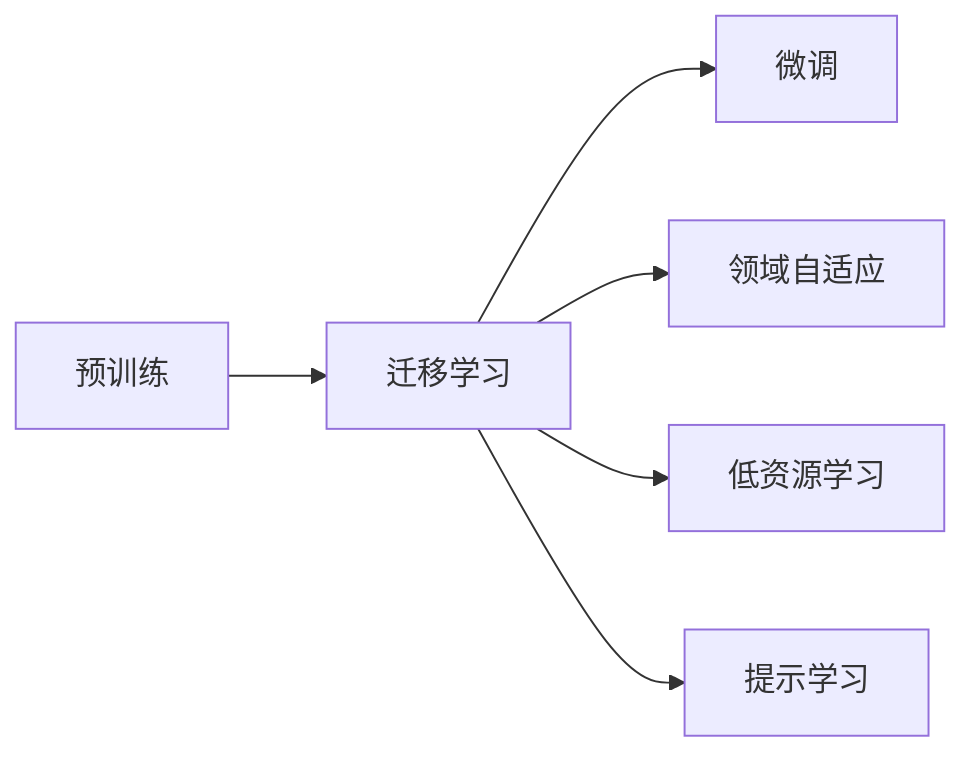
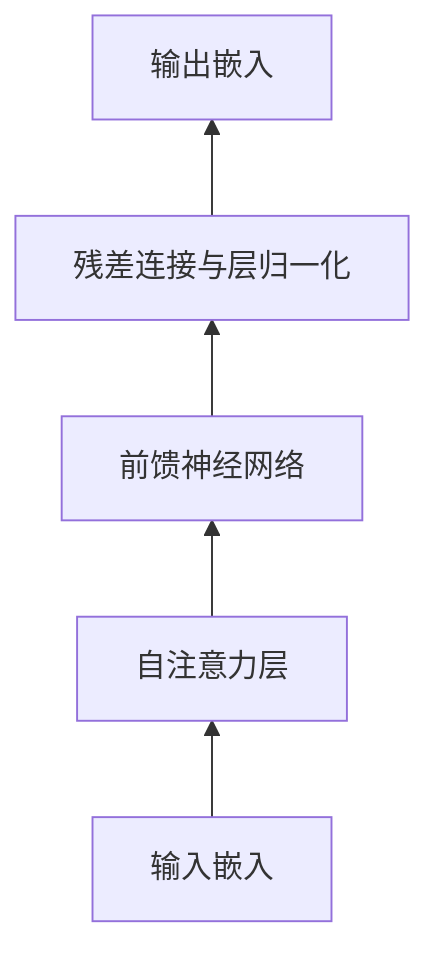

# 大语言模型原理与工程实践：大语言模型微调的挑战和探索

## 1. 背景介绍
### 1.1 大语言模型的兴起
近年来,随着深度学习技术的快速发展,大规模预训练语言模型(Pretrained Language Models, PLMs)已成为自然语言处理(Natural Language Processing, NLP)领域的研究热点。从2018年Google推出BERT(Bidirectional Encoder Representations from Transformers)模型开始,各大科技巨头和学术机构纷纷推出了自己的大语言模型,如OpenAI的GPT系列、Facebook的RoBERTa、Google的T5等。这些大语言模型在多个NLP任务上取得了显著的性能提升,引领了NLP技术的新浪潮。

### 1.2 大语言模型面临的挑战  
尽管大语言模型取得了巨大成功,但在实际应用中仍面临诸多挑战:
1. 模型体积庞大,训练和推理成本高昂。动辄上亿的参数量使得模型难以部署到资源受限的场景中。
2. 模型泛化能力有限,难以适应特定领域的任务。预训练阶段学习的是通用语言知识,在特定垂直领域的任务上往往需要进一步微调。
3. 模型可解释性差,难以洞察其内部工作机制。作为黑盒模型,我们很难理解其做出特定预测的原因。
4. 模型训练对算力和数据的要求极高。动辄数百GB甚至上TB的训练数据对于许多中小型团队而言是难以企及的。

### 1.3 大语言模型微调的意义
针对上述挑战,大语言模型微调(Fine-tuning)成为了一种简单而有效的解决方案。通过在特定任务的小规模标注数据上微调预训练模型,我们可以显著提升模型在该任务上的性能,同时避免了从头训练的巨大开销。微调使得大语言模型真正成为了一种"预训练-微调"的范式,大大拓展了其应用场景,让NLP技术惠及更多中小型团队和垂直领域。

## 2. 核心概念与联系
### 2.1 预训练(Pre-training)
预训练指的是在大规模无标注语料上训练语言模型的过程。通过自监督学习(如掩码语言建模、 next sentence prediction等)任务,模型可以学习到语言的通用表征,捕捉词汇、句法、语义等不同粒度的语言知识。预训练阶段旨在学习通用的语言理解能力,为下游任务提供一个强有力的基础模型。

### 2.2 微调(Fine-tuning)
微调指的是在特定任务的标注数据上,通过梯度下降等优化算法继续训练预训练模型的过程。通过引入任务特定的输入输出层,并利用反向传播调整整个模型的参数,使预训练模型适应特定任务。微调阶段的目标是将预训练学到的通用语言知识迁移到具体任务中,从而获得更好的任务性能。

### 2.3 迁移学习(Transfer Learning)
迁移学习是指将一个领域学习到的知识迁移并应用到另一个领域的过程。大语言模型的"预训练-微调"范式本质上就是一种迁移学习:将预训练阶段学到的通用语言知识迁移到下游具体任务中,从而显著提升任务性能,降低所需标注数据规模。语言模型的迁移学习能力是其取得巨大成功的关键原因之一。

### 2.4 领域自适应(Domain Adaptation)  
领域自适应指的是将一个领域(如通用领域)的模型适配到另一个领域(如医疗、法律等特定垂直领域)的过程。由于不同领域在语言风格、词汇分布等方面存在显著差异,直接将通用领域预训练模型应用到垂直领域往往难以取得理想效果。因此需要利用领域内数据对模型进行自适应,以提升其在目标领域的表现。

### 2.5 低资源学习(Low-resource Learning)
低资源学习指的是在标注数据十分稀缺的情况下进行机器学习的任务。传统的深度学习方法通常需要大量的标注数据才能达到理想性能,这限制了其在许多现实场景中的应用。大语言模型的一大优势在于其强大的迁移学习能力,在少量标注数据的情况下仍能通过微调取得不错的性能,这使其在低资源场景中备受青睐。

### 2.6 提示学习(Prompt Learning)
提示学习是近年来兴起的一种新范式,其核心思想是将各类NLP任务转化为语言模型的文本生成问题。通过设计巧妙的输入提示模板(prompt template),将任务信息融入到输入文本中,就可以利用语言模型强大的文本生成能力直接预测答案。与传统的微调方法相比,提示学习无需引入新的任务特定参数,因此更为简洁和高效。

### 2.7 概念之间的关系
以上几个概念之间有着紧密的联系,可以用下图来概括:



预训练是基础,奠定了语言模型强大的语言理解和生成能力。在此基础上,通过迁移学习,我们可以将预训练知识应用到下游任务中。微调、领域自适应、低资源学习、提示学习等都是迁移学习的具体形式,分别针对不同的应用场景。微调是最常见的迁移学习方式,通过在标注数据上调整模型参数适应任务;领域自适应则着眼于不同领域间的知识迁移;低资源学习利用迁移来缓解标注数据稀缺的问题;而提示学习则是一种新的迁移学习范式,通过prompt引入任务信息。这些方法的核心都在于利用预训练知识,提升下游任务性能,降低标注成本。

## 3. 核心算法原理与操作步骤
本节将详细介绍大语言模型微调的核心算法原理与具体操作步骤。我们以当前最广泛使用的BERT模型为例,阐述其微调过程。

### 3.1 BERT模型简介
BERT(Bidirectional Encoder Representations from Transformers)是Google于2018年提出的一种大规模预训练语言模型。其核心思想是利用Transformer编码器结构,在大规模无标注文本语料上进行自监督预训练,学习通用的语言表征。BERT模型的预训练任务包括:

1. 掩码语言模型(Masked Language Model, MLM):随机掩盖输入序列中的部分token,让模型根据上下文预测被掩盖的token。这使得模型能够学习到词汇、句法、语义等不同粒度的语言知识。

2. 下一句预测(Next Sentence Prediction, NSP):给定两个句子,让模型预测它们是否前后相邻。这有助于模型学习句间关系,捕捉全局语义信息。 

通过这两个预训练任务,BERT模型可以学习到强大的语言理解能力,在多个NLP任务上取得了显著的性能提升。

### 3.2 微调BERT的一般步骤
将预训练的BERT模型应用到下游任务时,我们通常采用微调的方式。微调BERT的一般步骤如下:

1. 准备任务数据:将任务的标注数据处理成BERT的输入格式,通常包括token ids、segment ids、attention mask等。

2. 添加任务输出层:在BERT模型之上添加任务特定的输出层,如分类任务的全连接层+softmax层。

3. 加载预训练参数:从预训练的BERT模型中加载参数,包括Transformer编码器参数和词嵌入参数。任务输出层的参数则随机初始化。

4. 设置优化器和学习率:通常使用Adam优化器,学习率设置需要根据任务和数据量进行调整。一般来说,BERT的编码器参数学习率要比任务输出层小一些。

5. 开始微调:将任务数据分批次输入模型,计算损失函数,并通过反向传播更新整个模型的参数。这个过程通常需要几个epoch。

6. 评估和预测:微调结束后,在任务的验证集上评估模型性能,并用训练好的模型对测试集进行预测。

### 3.3 微调BERT的核心代码

下面是使用PyTorch和Hugging Face Transformers库微调BERT的核心代码:

```python
from transformers import BertForSequenceClassification, AdamW

# 加载预训练模型
model = BertForSequenceClassification.from_pretrained('bert-base-uncased', num_labels=2)

# 准备优化器
optimizer = AdamW(model.parameters(), lr=2e-5)

# 开始微调
for epoch in range(3):
    for batch in train_dataloader:
        model.train()
        
        batch = {k: v.to(device) for k, v in batch.items()}
        outputs = model(**batch)
        loss = outputs.loss
        
        loss.backward()
        optimizer.step()
        optimizer.zero_grad()
        
    # 在验证集上评估
    model.eval()
    val_loss, val_acc = evaluate(model, val_dataloader)
    print(f'Epoch {epoch}, Val Loss: {val_loss}, Val Acc: {val_acc}')
    
# 在测试集上预测
model.eval()
predictions = predict(model, test_dataloader)
```

这段代码展示了微调BERT的核心步骤:加载预训练模型、准备优化器、循环训练、评估验证和测试预测。其中`BertForSequenceClassification`是包含了任务输出层的BERT模型,`num_labels`参数指定了分类任务的类别数。`AdamW`优化器是Adam优化器的一个变体,能够更好地处理BERT这样的大模型。在训练循环中,我们将数据分批次输入模型,计算损失并通过反向传播更新参数。每个epoch结束后,在验证集上评估模型性能。微调结束后,用训练好的模型对测试集进行预测。

## 4. 数学模型与公式详解
本节我们将详细讲解BERT模型微调过程中涉及的关键数学模型与公式,并给出具体的例子说明。

### 4.1 Transformer编码器
BERT模型的核心组件是Transformer编码器,其结构如下图所示:



Transformer编码器由多个相同的子层堆叠而成,每个子层包含一个自注意力层(Self-Attention)和一个前馈神经网络(Feed-Forward Network)。此外还有残差连接(Residual Connection)和层归一化(Layer Normalization)来促进训练。

#### 4.1.1 自注意力机制
自注意力机制是Transformer的核心,它允许模型在处理某个token时,参考输入序列中的所有token。具体来说,自注意力分三步进行:

1. 根据输入嵌入计算query矩阵$Q$, key矩阵$K$和value矩阵$V$:

$$
\begin{aligned}
Q &= XW^Q \\
K &= XW^K \\
V &= XW^V
\end{aligned}
$$

其中$X$是输入嵌入矩阵,$W^Q$、$W^K$、$W^V$是可学习的权重矩阵。

2. 计算注意力分数(attention scores)矩阵$A$:

$$
A = \text{softmax}(\frac{QK^T}{\sqrt{d_k}})
$$

其中$d_k$是key向量的维度,用于缩放点积结果。softmax函数将分数归一化为概率分布。

3. 根据注意力分数矩阵$A$和value矩阵$V$计算输出:

$$
\text{Attention}(Q,K,V) = AV
$$

直观地理解,自注意力机制可以看作一个加权求和的过程:对于每个输入token,我们根据其与其他token的相似度(由注意力分数矩阵$A$刻画)来决定在计算其输出表征时分别赋予其他token多大的权重。这使得模型能够动态地聚焦于不同token之间的交互,捕捉长距离依赖。

#### 4.1.2 前馈神经网络
自注意力层的输出会被传入一个前馈神经网络,对特征进一步变换。前馈神经网络通常包含两个