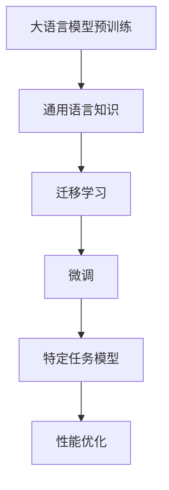
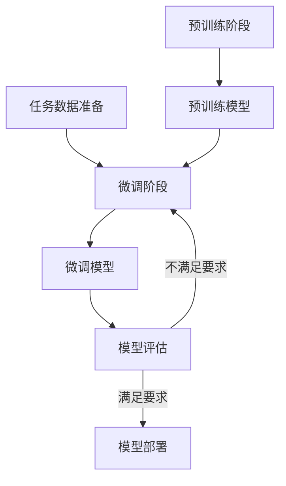

# 大语言模型原理与工程实践：大语言模型微调的探索与展望

## 1. 背景介绍

### 1.1 大语言模型的兴起

近年来,大型语言模型(Large Language Models, LLMs)在自然语言处理(NLP)领域掀起了一场革命。这些模型通过在海量文本数据上进行预训练,学习了丰富的语言知识和上下文信息,展现出令人惊叹的语言生成和理解能力。

代表性的大语言模型包括 GPT-3、BERT、XLNet、T5 等,其中 GPT-3 凭借高达 1750 亿个参数的规模,成为当前最大的语言模型。这些模型在广泛的 NLP 任务中表现出色,如机器翻译、问答系统、文本摘要、语义分析等,极大推动了 NLP 技术的发展。

### 1.2 微调在大语言模型中的重要性

尽管大语言模型在通用领域表现出色,但直接将其应用于特定领域或任务时,往往需要进行进一步的微调(Fine-tuning)。微调是指在大语言模型预训练的基础上,利用特定任务的标注数据进行额外的训练,使模型更好地适应目标任务。

通过微调,大语言模型可以吸收特定领域的知识和语言模式,从而提高在该领域的性能表现。这种"预训练+微调"的范式已成为利用大语言模型的主流方法,在自然语言生成、理解、分类等多个领域发挥着关键作用。

### 1.3 本文的目的和结构

本文旨在深入探讨大语言模型微调的原理、方法和实践,为读者提供全面的理解和指导。文章将从以下几个方面进行阐述:

1. 核心概念与联系
2. 核心算法原理具体操作步骤
3. 数学模型和公式详细讲解举例说明
4. 项目实践:代码实例和详细解释说明
5. 实际应用场景
6. 工具和资源推荐
7. 总结:未来发展趋势与挑战
8. 附录:常见问题与解答

通过对这些内容的深入探讨,读者将能够全面掌握大语言模型微调的理论基础和实践技能,为将大语言模型应用于实际场景做好充分准备。

## 2. 核心概念与联系

在深入探讨大语言模型微调之前,我们需要先了解一些核心概念及其相互关系。

### 2.1 大语言模型

大语言模型(LLMs)是一种基于深度学习的自然语言处理模型,通过在海量文本数据上进行预训练,学习丰富的语言知识和上下文信息。这些模型具有巨大的参数量(通常超过10亿个参数),能够捕捉复杂的语言模式和语义关系。

常见的大语言模型包括:

- **GPT(Generative Pre-trained Transformer)**: 由 OpenAI 开发的自回归语言模型,擅长生成自然语言文本。GPT-3 是目前最大的语言模型,拥有 1750 亿个参数。
- **BERT(Bidirectional Encoder Representations from Transformers)**: 由谷歌开发的双向编码器模型,在各种 NLP 任务中表现出色,如文本分类、问答等。
- **XLNet**: 由谷歌开发的自回归语言模型,通过一种新的预训练目标函数和注意力机制,在多项任务上超过了 BERT。
- **T5(Text-to-Text Transfer Transformer)**: 由谷歌开发的统一的文本到文本的转换框架,可以应用于广泛的 NLP 任务,如翻译、问答、摘要等。

### 2.2 微调(Fine-tuning)

微调是指在大语言模型预训练的基础上,利用特定任务的标注数据进行额外的训练,使模型更好地适应目标任务。这个过程通常包括以下步骤:

1. **加载预训练模型**: 将预训练好的大语言模型作为初始模型。
2. **准备任务数据**: 收集并准备特定任务的标注数据集。
3. **构建任务模型**: 在预训练模型的基础上,添加适当的输出层或微调策略,以适应目标任务。
4. **微调训练**: 使用任务数据集对模型进行进一步的训练,优化模型在目标任务上的性能。
5. **模型评估和部署**: 在验证集上评估微调后模型的性能,并将其部署到实际应用中。

通过微调,大语言模型可以吸收特定领域的知识和语言模式,从而提高在该领域的性能表现。这种"预训练+微调"的范式已成为利用大语言模型的主流方法。

### 2.3 迁移学习(Transfer Learning)

迁移学习是机器学习中的一种重要概念,指将在一个领域或任务中学习到的知识,应用于另一个相关但不同的领域或任务。在大语言模型的背景下,预训练可被视为一种迁移学习的形式。

大语言模型通过在海量文本数据上进行预训练,学习了通用的语言知识和上下文信息。这些知识可以被视为在一个"通用语言"任务上进行了训练。当将预训练模型应用于特定的 NLP 任务时,就相当于将在"通用语言"任务上学习到的知识迁移到了目标任务。

微调则是在迁移学习的基础上,进一步优化模型在目标任务上的性能。通过这种"预训练+微调"的范式,大语言模型可以充分利用通用语言知识,同时针对特定任务进行优化,从而获得更好的性能表现。

### 2.4 Mermaid 流程图

以下是大语言模型微调的核心概念和流程的 Mermaid 流程图:

上图展示了大语言模型微调的核心流程:

1. 首先,通过在海量文本数据上进行预训练,获得通用的语言知识。
2. 然后,将预训练模型作为起点,利用迁移学习的思想,将通用语言知识迁移到特定的 NLP 任务中。
3. 接下来,通过微调的方式,在特定任务的标注数据上进行进一步的训练,优化模型在该任务上的性能。
4. 最终,得到针对特定任务优化后的模型,可以部署到实际应用中。

## 3. 核心算法原理具体操作步骤

在了解了大语言模型微调的核心概念之后,我们将深入探讨其核心算法原理和具体操作步骤。

### 3.1 预训练阶段

大语言模型的预训练阶段是整个过程的基础,旨在从海量文本数据中学习通用的语言知识。常见的预训练目标包括:

1. **掩码语言模型(Masked Language Modeling, MLM)**: 随机掩蔽部分输入词,模型需要根据上下文预测被掩蔽的词。这种方式可以学习双向的语义表示。
2. **下一句预测(Next Sentence Prediction, NSP)**: 判断两个句子是否相邻,从而学习捕捉句子之间的关系。
3. **因果语言模型(Causal Language Modeling, CLM)**: 基于前面的词预测下一个词,这种自回归的方式可以学习生成自然语言文本。

预训练通常采用自监督学习的方式,利用大量未标注的文本数据,通过上述目标函数进行训练。训练过程中,模型会不断优化参数,使得在预训练任务上的损失函数最小化。

预训练阶段的具体操作步骤包括:

1. **数据预处理**: 从互联网、书籍、维基百科等来源收集海量文本数据,并进行必要的清洗和预处理。
2. **模型选择**: 选择合适的神经网络架构作为预训练模型,如 Transformer、BERT、GPT 等。
3. **训练配置**: 设置预训练的超参数,如批量大小、学习率、优化器等。
4. **预训练过程**: 将预处理后的文本数据输入预训练模型,根据预训练目标函数(MLM、NSP、CLM 等)进行训练,不断优化模型参数。
5. **模型保存**: 在预训练结束后,保存训练好的模型权重,作为后续微调的初始模型。

预训练过程通常需要消耗大量的计算资源,并且训练时间较长。因此,研究人员通常会在公开发布的预训练模型上进行微调,以节省计算资源。

### 3.2 微调阶段

微调阶段是在预训练模型的基础上,针对特定任务进行进一步优化的关键步骤。微调的核心思想是利用目标任务的标注数据,对预训练模型进行"微小"的调整,使其更好地适应目标任务。

微调阶段的具体操作步骤包括:

1. **任务数据准备**: 收集并准备目标任务的标注数据集,通常包括训练集、验证集和测试集。
2. **模型初始化**: 加载预训练模型的权重作为初始模型。
3. **模型修改**: 根据目标任务的特点,对预训练模型进行适当的修改,如添加新的输出层、调整模型架构等。
4. **训练配置**: 设置微调训练的超参数,如学习率、批量大小、优化器等。
5. **微调训练**: 使用目标任务的训练数据集对模型进行微调训练,优化模型在该任务上的性能。
6. **模型评估**: 在验证集上评估微调后模型的性能,根据需要进行超参数调整或其他优化。
7. **模型部署**: 将最终的微调模型部署到实际应用中,用于处理目标任务。

在微调过程中,通常会冻结预训练模型的大部分参数,只对最后几层或输出层进行训练,以避免破坏预训练模型学习到的通用语言知识。同时,也可以采用其他微调策略,如discriminative fine-tuning、prompt-based fine-tuning 等,以进一步提高模型性能。

### 3.3 Mermaid 流程图

以下是大语言模型微调的核心算法原理和具体操作步骤的 Mermaid 流程图:

上图展示了大语言模型微调的核心算法原理和具体操作步骤:

1. 预训练阶段:通过在海量文本数据上进行自监督学习,获得预训练模型。
2. 任务数据准备:收集并准备目标任务的标注数据集。
3. 微调阶段:
   - 加载预训练模型的权重作为初始模型。
   - 根据目标任务的特点,对预训练模型进行适当的修改。
   - 使用任务数据集对模型进行微调训练,优化模型在该任务上的性能。
4. 模型评估:在验证集上评估微调后模型的性能。
   - 如果性能满足要求,则将模型部署到实际应用中。
   - 如果性能不满足要求,则回到微调阶段进行进一步优化,如调整超参数、采用其他微调策略等。

通过上述流程,大语言模型可以充分利用预训练阶段学习到的通用语言知识,并在微调阶段针对特定任务进行优化,从而获得更好的性能表现。

## 4. 数学模型和公式详细讲解举例说明

在探讨大语言模型微调的算法原理时,我们需要了解一些核心的数学模型和公式。本节将详细讲解这些模型和公式,并提供具体的例子说明。

### 4.1 自注意力机制(Self-Attention)

自注意力机制是大语言模型中的核心组件,它允许模型捕捉输入序列中任意两个位置之间的关系,从而更好地建模长距离依赖关系。

在自注意力机制中,每个输入位置的表示是通过对其他所有位置的表示进行加权求和而得到的。具体来