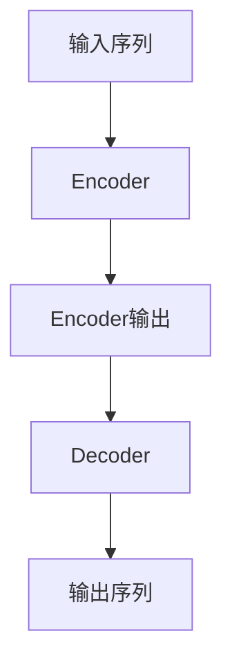
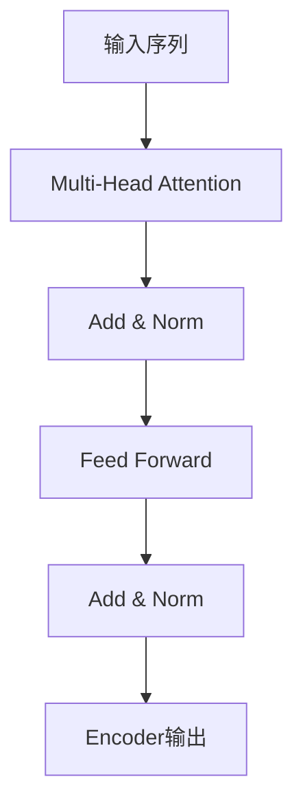

# 大语言模型原理与工程实践：大语言模型微调面临的挑战

## 1. 背景介绍

### 1.1 大语言模型的兴起

近年来,大型语言模型(Large Language Models, LLMs)在自然语言处理(Natural Language Processing, NLP)领域取得了令人瞩目的成就。这些模型通过在大规模文本数据上进行预训练,学习了丰富的语言知识和上下文信息,从而展现出惊人的泛化能力,可以应用于广泛的下游NLP任务。

代表性的大语言模型包括GPT(Generative Pre-trained Transformer)系列、BERT(Bidirectional Encoder Representations from Transformers)、XLNet、RoBERTa等。其中,GPT-3是目前最大的语言模型之一,拥有1750亿个参数,在各种NLP任务上表现出色。

### 1.2 大语言模型微调的重要性

尽管大语言模型在预训练阶段学习了丰富的语言知识,但它们通常需要针对特定的下游任务进行微调(fine-tuning),以获得更好的性能。微调是一种迁移学习(Transfer Learning)技术,它在保留预训练模型大部分参数的同时,对一小部分参数进行调整,使模型更好地适应目标任务。

大语言模型微调的优势在于:

1. **高效性**:相比从头训练,微调只需调整少量参数,节省了大量计算资源和时间。
2. **泛化能力**:预训练模型已经学习了丰富的语言知识,微调可以在此基础上传递知识,提高模型在目标任务上的泛化能力。
3. **数据效率**:对于数据量有限的任务,微调可以充分利用预训练模型的知识,减轻对大量标注数据的依赖。

然而,大语言模型微调也面临着一些挑战,本文将重点探讨这些挑战及相应的解决方案。

## 2. 核心概念与联系

### 2.1 大语言模型的架构

大语言模型通常采用基于Transformer的编码器-解码器(Encoder-Decoder)架构或仅编码器(Encoder-only)架构。编码器用于捕获输入序列的上下文信息,解码器则根据编码器的输出生成目标序列。



### 2.2 自注意力机制

自注意力机制(Self-Attention)是Transformer架构的核心,它允许模型在计算每个位置的表示时,关注整个输入序列的信息。这种长程依赖建模能力使得Transformer能够有效捕获远距离的上下文信息,从而提高了模型的表现。



### 2.3 预训练与微调

大语言模型通常采用两阶段训练策略:首先在大规模无监督文本数据上进行预训练,学习通用的语言表示;然后在特定任务的标注数据上进行微调,使模型适应目标任务。

预训练阶段通常采用自监督学习(Self-Supervised Learning)技术,如掩码语言模型(Masked Language Modeling)和下一句预测(Next Sentence Prediction)等,以捕获语言的统计规律和语义信息。

微调阶段则根据目标任务的性质,对模型的输入、输出和损失函数进行调整,并在标注数据上进行有监督训练。

## 3. 核心算法原理具体操作步骤

### 3.1 预训练阶段

大语言模型的预训练通常采用自监督学习技术,其中最常见的是掩码语言模型(Masked Language Modeling, MLM)和下一句预测(Next Sentence Prediction, NSP)。

1. **掩码语言模型(MLM)**

MLM的目标是根据上下文预测被掩码的单词。具体操作步骤如下:

1) 从语料库中随机采样一个序列;
2) 在序列中随机选择15%的单词进行掩码,其中80%的掩码单词被替换为特殊的[MASK]标记,10%被替换为随机单词,剩余10%保持不变;
3) 将掩码后的序列输入到编码器中,模型需要根据上下文预测被掩码的单词;
4) 计算预测值与真实值之间的交叉熵损失,并使用梯度下降算法更新模型参数。

2. **下一句预测(NSP)**

NSP的目标是判断两个句子是否相邻。具体操作步骤如下:

1) 从语料库中随机采样一对相邻句子或非相邻句子;
2) 将句子对输入到编码器中,模型需要预测这两个句子是否相邻;
3) 计算二分类损失,并使用梯度下降算法更新模型参数。

通过预训练,模型学习了丰富的语言知识和上下文信息,为后续的微调奠定了基础。

### 3.2 微调阶段

微调阶段的目标是使预训练模型适应特定的下游任务。具体操作步骤如下:

1) 准备标注数据集,并根据任务需求对数据进行预处理;
2) 根据任务类型(如文本分类、序列标注等),设计合适的输入表示和输出表示;
3) 在预训练模型的基础上,对输入、输出和损失函数进行调整;
4) 在标注数据上进行有监督训练,更新模型参数;
5) 在验证集上评估模型性能,并根据需要进行超参数调整和早停(Early Stopping)等策略。

通过微调,预训练模型可以更好地适应目标任务,提高模型的性能和泛化能力。

## 4. 数学模型和公式详细讲解举例说明

### 4.1 自注意力机制

自注意力机制是Transformer架构的核心,它允许模型在计算每个位置的表示时,关注整个输入序列的信息。

给定输入序列$X = (x_1, x_2, \dots, x_n)$,自注意力机制首先计算查询(Query)、键(Key)和值(Value)向量:

$$
\begin{aligned}
Q &= XW^Q \\
K &= XW^K \\
V &= XW^V
\end{aligned}
$$

其中$W^Q$、$W^K$和$W^V$分别是可学习的查询、键和值的投影矩阵。

然后,计算查询和键之间的点积,并对点积结果进行缩放和软最大化操作,得到注意力分数:

$$
\text{Attention}(Q, K, V) = \text{softmax}\left(\frac{QK^T}{\sqrt{d_k}}\right)V
$$

其中$d_k$是键的维度,用于防止点积结果过大导致梯度消失或爆炸。

最后,将注意力分数与值向量相乘,得到每个位置的加权和表示:

$$
\text{MultiHead}(Q, K, V) = \text{Concat}(head_1, \dots, head_h)W^O
$$

其中$head_i = \text{Attention}(QW_i^Q, KW_i^K, VW_i^V)$,表示第$i$个注意力头,共有$h$个注意力头。$W_i^Q$、$W_i^K$、$W_i^V$和$W^O$都是可学习的投影矩阵。

多头注意力机制可以从不同的子空间捕获不同的注意力模式,提高了模型的表现能力。

### 4.2 交叉熵损失

在预训练和微调阶段,常用的损失函数是交叉熵损失(Cross-Entropy Loss)。

对于一个样本$x$,其真实标签为$y$,模型预测的概率分布为$\hat{y}$,交叉熵损失定义为:

$$
\mathcal{L}(x, y) = -\sum_{i=1}^{C} y_i \log \hat{y}_i
$$

其中$C$是类别数,$y_i$和$\hat{y}_i$分别表示真实标签和预测概率在第$i$个类别上的值。

在掩码语言模型任务中,交叉熵损失可以表示为:

$$
\mathcal{L}_\text{MLM} = -\frac{1}{N} \sum_{i=1}^{N} \log P(x_i^\text{masked} | x^\text{input})
$$

其中$N$是掩码单词的数量,$x_i^\text{masked}$是第$i$个掩码单词的真实值,$x^\text{input}$是输入序列。

在微调阶段,根据任务的不同,交叉熵损失的计算方式也会有所调整。例如,在文本分类任务中,交叉熵损失可以表示为:

$$
\mathcal{L}_\text{classification} = -\sum_{i=1}^{C} y_i \log \hat{y}_i
$$

其中$y_i$和$\hat{y}_i$分别表示样本$x$在第$i$个类别上的真实标签和预测概率。

通过最小化交叉熵损失,模型可以学习到更准确的概率预测,从而提高性能。

## 5. 项目实践:代码实例和详细解释说明

在本节,我们将提供一个基于PyTorch实现的示例代码,演示如何对BERT模型进行微调,以完成文本分类任务。

### 5.1 数据预处理

```python
import torch
from transformers import BertTokenizer

# 加载预训练的BERT分词器
tokenizer = BertTokenizer.from_pretrained('bert-base-uncased')

# 定义数据预处理函数
def preprocess_data(texts, labels):
    input_ids = []
    attention_masks = []
    
    for text in texts:
        encoded = tokenizer.encode_plus(
            text,
            add_special_tokens=True,
            max_length=128,
            padding='max_length',
            truncation=True,
            return_attention_mask=True
        )
        input_ids.append(encoded['input_ids'])
        attention_masks.append(encoded['attention_mask'])
    
    input_ids = torch.tensor(input_ids)
    attention_masks = torch.tensor(attention_masks)
    labels = torch.tensor(labels)
    
    return input_ids, attention_masks, labels
```

在这个示例中,我们使用BERT的分词器对输入文本进行编码,并将编码后的输入序列和注意力掩码转换为PyTorch张量。`preprocess_data`函数接受文本列表和标签列表作为输入,返回输入ID张量、注意力掩码张量和标签张量。

### 5.2 模型定义和微调

```python
import torch.nn as nn
from transformers import BertForSequenceClassification

# 加载预训练的BERT模型
model = BertForSequenceClassification.from_pretrained('bert-base-uncased', num_labels=2)

# 定义微调函数
def finetune(model, train_dataloader, val_dataloader, epochs, optimizer, device):
    model.to(device)
    
    for epoch in range(epochs):
        model.train()
        total_loss = 0
        
        for batch in train_dataloader:
            input_ids, attention_masks, labels = batch
            input_ids = input_ids.to(device)
            attention_masks = attention_masks.to(device)
            labels = labels.to(device)
            
            optimizer.zero_grad()
            outputs = model(input_ids, attention_mask=attention_masks, labels=labels)
            loss = outputs.loss
            total_loss += loss.item()
            loss.backward()
            optimizer.step()
        
        print(f'Epoch {epoch+1}/{epochs}, Loss: {total_loss/len(train_dataloader)}')
        
        model.eval()
        eval_accuracy = 0
        eval_steps = 0
        
        for batch in val_dataloader:
            input_ids, attention_masks, labels = batch
            input_ids = input_ids.to(device)
            attention_masks = attention_masks.to(device)
            labels = labels.to(device)
            
            with torch.no_grad():
                outputs = model(input_ids, attention_mask=attention_masks)
            logits = outputs.logits
            predictions = torch.argmax(logits, dim=-1)
            eval_accuracy += (predictions == labels).sum().item()
            eval_steps += labels.size(0)
        
        eval_accuracy = eval_accuracy / eval_steps
        print(f'Validation Accuracy: {eval_accuracy}')
```

在这个示例中,我们加载了预训练的BERT模型,并使用`BertForSequenceClassification`模块进行文本分类任务。`finetune`函数实现了模型的微调过程,包括训练循环和验证循环。

在训练循环中,我们遍历训练数据批次,计算损失值,执行反向传播和优化器更新。在验证循环中,我们计算模型在验证集上的准确率,用于监控模型的性能。

### 5.3 模型评估和预测

```python
import torch

# 定义评估函数
def evaluate(model, test_data