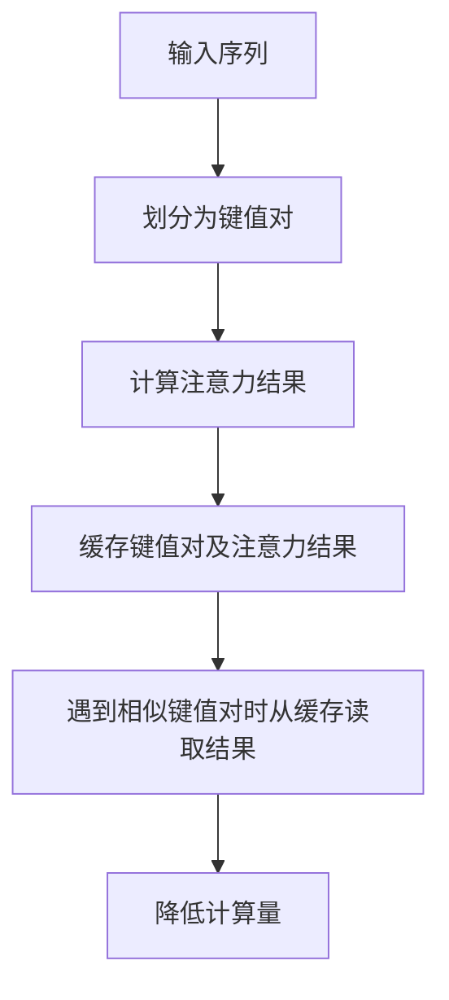

# 大语言模型原理与工程实践：大语言模型推理工程降低计算量：KV-Cache

## 1. 背景介绍

### 1.1 大语言模型的计算挑战

随着自然语言处理(NLP)技术的飞速发展,大型语言模型(Large Language Models, LLMs)已经成为当前最先进的NLP技术之一。这些模型通过在海量文本数据上进行预训练,学习了丰富的语言知识和上下文信息,展现出令人惊叹的语言理解和生成能力。

然而,训练和推理这些庞大的语言模型需要耗费大量的计算资源。以GPT-3为例,它拥有1750亿个参数,推理时需要对整个输入序列进行注意力计算,计算复杂度为O(n^2),其中n为输入序列长度。当输入序列较长时,计算量会成指数级增长,给模型的实时响应和部署带来了巨大挑战。

### 1.2 降低计算量的重要性

降低大语言模型推理的计算量对于提高模型的响应速度、降低部署成本以及减少碳排放至关重要。一方面,快速响应对于许多实时应用场景(如对话系统、机器翻译等)是必不可少的;另一方面,降低计算量也有利于在资源受限的边缘设备(如手机、物联网设备等)上部署这些大型模型。

此外,训练大语言模型通常需要消耗大量的计算资源和能源,导致了高昂的碳排放。根据一项研究,训练一个具有几十亿参数的大型语言模型所产生的碳排放量相当于一辆汽车在道路上行驶近5次环绕地球的距离。因此,降低推理计算量不仅可以节省部署成本,还有利于减少模型的环境足迹。

### 1.3 KV-Cache: 一种高效的缓存方法

为了应对上述计算挑战,本文介绍了一种名为KV-Cache的高效缓存方法,旨在显著降低大语言模型推理时的计算量。KV-Cache利用了自然语言中的重复模式,将输入序列划分为多个键值对(Key-Value pairs),并将相似的键值对及其对应的注意力计算结果缓存起来,避免重复计算。这种方法不仅可以大幅减少计算量,还能保持与原始模型相当的性能表现。

## 2. 核心概念与联系

### 2.1 注意力机制和自回归语言模型

自回归语言模型(Autoregressive Language Model)是当前大型语言模型的主要架构之一。这种模型通过注意力机制(Attention Mechanism)来捕捉输入序列中不同位置之间的依赖关系,从而生成相应的输出序列。

注意力机制的核心思想是允许每个输出元素关注输入序列中的不同位置,并根据这些位置的重要性对它们进行加权求和。具体来说,对于输出序列中的第i个元素y_i,它的计算公式为:

$$y_i = \sum_{j=1}^n \alpha_{ij}(x_j)$$

其中,n是输入序列的长度,x_j是输入序列中的第j个元素,α_ij是注意力权重,表示输出元素y_i对输入元素x_j的关注程度。注意力权重α_ij通过一个可学习的注意力函数计算得到,该函数考虑了输入元素x_j、输出元素y_i以及它们之间的位置信息。

### 2.2 注意力计算的高计算复杂度

尽管注意力机制赋予了语言模型强大的表达能力,但它也带来了高昂的计算代价。对于一个长度为n的输入序列,需要计算n^2个注意力权重,其计算复杂度为O(n^2)。当输入序列较长时,计算量会迅速增长,导致模型推理速度变慢、部署成本增加。

为了降低计算量,一种常见的方法是使用近似注意力机制(Approximate Attention),例如局部注意力(Local Attention)、稀疏注意力(Sparse Attention)等。这些方法通过只关注输入序列中的一部分元素来减少计算量,但是会牺牲一定的性能表现。

### 2.3 KV-Cache的核心思想

KV-Cache的核心思想是利用自然语言中的重复模式,将输入序列划分为多个键值对(Key-Value pairs),并将相似的键值对及其对应的注意力计算结果缓存起来,避免重复计算。

具体来说,KV-Cache将输入序列x划分为多个长度为k的子序列(称为"键",Key),以及与之对应的长度为v的子序列(称为"值",Value)。对于每个键值对(Key-Value pair),KV-Cache计算其注意力结果,并将结果缓存起来。当遇到相似的键值对时,KV-Cache直接从缓存中读取注意力结果,而不需要重新计算。

通过这种方式,KV-Cache可以显著减少注意力计算的重复工作,从而降低整体计算量。同时,由于自然语言中存在大量的重复模式,KV-Cache能够有效利用这些模式,在降低计算量的同时保持与原始模型相当的性能表现。



## 3. 核心算法原理具体操作步骤

### 3.1 KV-Cache算法概述

KV-Cache算法主要包括以下几个步骤:

1. **划分键值对(Key-Value Pairs)**: 将输入序列x划分为多个长度为k的子序列(键,Key)和长度为v的子序列(值,Value),形成多个键值对。
2. **计算注意力结果**: 对于每个键值对,计算其注意力结果。
3. **缓存键值对和注意力结果**: 将键值对及其对应的注意力结果缓存起来。
4. **查询缓存**: 对于新的输入序列,查询缓存中是否存在相似的键值对。如果存在,直接从缓存中读取注意力结果;否则,计算新的注意力结果并缓存。
5. **更新缓存**: 根据缓存替换策略(如LRU、LFU等),更新缓存中的键值对和注意力结果。

### 3.2 划分键值对

KV-Cache算法的第一步是将输入序列x划分为多个键值对。具体来说,对于长度为n的输入序列x,KV-Cache将其划分为n-k+1个长度为k的子序列(作为键,Key)和n-v+1个长度为v的子序列(作为值,Value)。

例如,对于输入序列x = [x1, x2, x3, x4, x5, x6, x7, x8],假设k=3,v=2,则划分出的键值对为:

- 键(Key): [x1, x2, x3], [x2, x3, x4], [x3, x4, x5], [x4, x5, x6], [x5, x6, x7], [x6, x7, x8]
- 值(Value): [x1, x2], [x2, x3], [x3, x4], [x4, x5], [x5, x6], [x6, x7], [x7, x8]

通过这种划分方式,KV-Cache可以捕捉输入序列中的局部模式,并利用这些模式进行缓存和计算复用。

### 3.3 计算和缓存注意力结果

对于每个键值对,KV-Cache计算其注意力结果,并将结果缓存起来。注意力结果的计算方式与原始模型相同,但是计算的对象是键值对而不是整个输入序列。

具体来说,对于一个键值对(Key, Value),其注意力结果的计算公式为:

$$\text{Attention}(Key, Value) = \text{softmax}(\frac{Q(Key)K(Key)^T}{\sqrt{d_k}})V(Value)$$

其中,Q(Key)、K(Key)和V(Value)分别表示键(Key)和值(Value)的查询(Query)、键(Key)和值(Value)向量,d_k是缩放因子。

计算得到的注意力结果与对应的键值对一起缓存起来,形成一个键值对到注意力结果的映射关系。

### 3.4 查询缓存和更新缓存

在推理过程中,对于新的输入序列,KV-Cache首先将其划分为键值对,然后查询缓存中是否存在相似的键值对。如果存在,直接从缓存中读取对应的注意力结果;否则,计算新的注意力结果并将其与键值对一起缓存起来。

为了判断两个键值对是否相似,KV-Cache使用一种相似度函数,例如余弦相似度或编辑距离等。只有当两个键值对的相似度超过一定阈值时,才认为它们是相似的。

由于缓存空间有限,KV-Cache需要采用一种缓存替换策略来管理缓存中的键值对和注意力结果。常见的缓存替换策略包括最近最少使用(LRU)、最少使用(LFU)等。当缓存满时,KV-Cache根据替换策略删除一些键值对及其对应的注意力结果,为新的键值对腾出空间。

### 3.5 算法伪代码

以下是KV-Cache算法的伪代码:

```python
def KV_Cache(input_sequence, k, v, cache, similarity_threshold):
    # 划分键值对
    keys, values = split_into_kv_pairs(input_sequence, k, v)
    
    # 初始化注意力结果列表
    attention_results = []
    
    # 遍历每个键值对
    for key, value in zip(keys, values):
        # 查询缓存中是否存在相似的键值对
        similar_key, similar_value, cached_attention = find_similar_kv_pair(cache, key, value, similarity_threshold)
        
        if cached_attention is not None:
            # 从缓存中读取注意力结果
            attention_result = cached_attention
        else:
            # 计算注意力结果并缓存
            attention_result = compute_attention(key, value)
            cache.add(key, value, attention_result)
        
        attention_results.append(attention_result)
    
    # 根据缓存替换策略更新缓存
    cache.update()
    
    return attention_results
```

在上述伪代码中,`split_into_kv_pairs`函数用于将输入序列划分为键值对,`find_similar_kv_pair`函数用于在缓存中查找相似的键值对,`compute_attention`函数用于计算注意力结果,`cache`是一个缓存对象,实现了添加、查询和更新等操作。

## 4. 数学模型和公式详细讲解举例说明

### 4.1 注意力机制的数学模型

注意力机制(Attention Mechanism)是当前自然语言处理领域中广泛使用的一种关键技术。它允许模型在生成每个输出元素时,关注输入序列中的不同位置,并根据这些位置的重要性对它们进行加权求和。

具体来说,对于输出序列中的第i个元素y_i,它的计算公式为:

$$y_i = \sum_{j=1}^n \alpha_{ij}(x_j)$$

其中,n是输入序列的长度,x_j是输入序列中的第j个元素,α_ij是注意力权重,表示输出元素y_i对输入元素x_j的关注程度。

注意力权重α_ij通过一个可学习的注意力函数计算得到,该函数考虑了输入元素x_j、输出元素y_i以及它们之间的位置信息。常见的注意力函数包括加性注意力(Additive Attention)和缩放点积注意力(Scaled Dot-Product Attention)。

以缩放点积注意力为例,其计算公式为:

$$\alpha_{ij} = \text{softmax}(\frac{Q(y_i)K(x_j)^T}{\sqrt{d_k}})$$

其中,Q(y_i)和K(x_j)分别表示输出元素y_i和输入元素x_j的查询(Query)和键(Key)向量,d_k是一个缩放因子,用于防止点积结果过大导致梯度消失或爆炸。softmax函数用于将注意力权重归一化为概率分布。

通过注意力机制,模型可以动态地捕捉输入序列中不同位置之间的依赖关系,从而生成更准确的输出序列。

### 4.2 KV-Cache中的注意力计算

在KV-Cache算法中,注意力计算的对象是键值对(Key-Value Pair