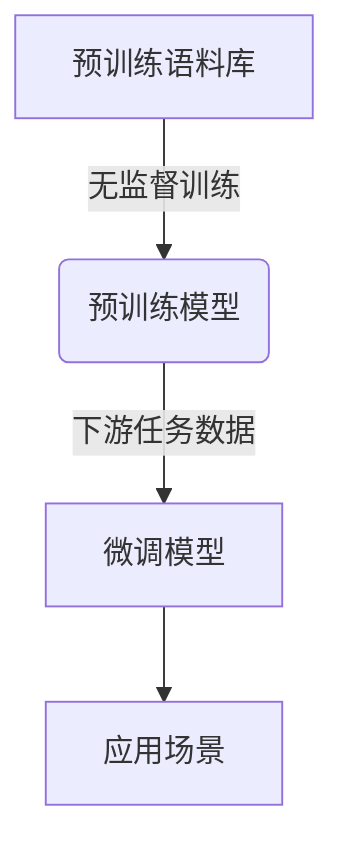
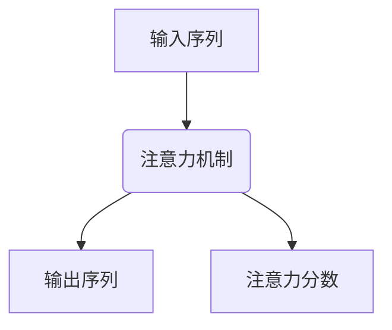
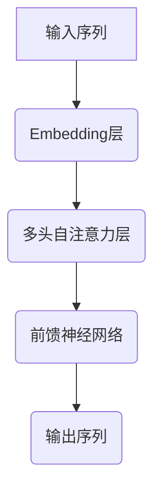

# 大语言模型原理与工程实践：大语言模型预训练

## 1.背景介绍

### 1.1 人工智能的新时代

人工智能(AI)正在以前所未有的速度发展,其中大语言模型(Large Language Model,LLM)的出现标志着AI进入了一个新的里程碑。大语言模型是一种基于大规模文本数据训练而成的深度神经网络模型,能够掌握人类语言的复杂语义和语法结构,并具备出色的自然语言理解和生成能力。

### 1.2 大语言模型的重要性

大语言模型的突破性进展为众多领域带来了革命性的变革,如自然语言处理、机器翻译、问答系统、内容生成等。它们能够通过学习海量数据,掌握人类语言的本质,从而实现高质量的语言理解和生成。这不仅极大地提高了人机交互的自然性和效率,也为发展通用人工智能(AGI)奠定了基础。

### 1.3 预训练大语言模型的兴起

尽管早期的语言模型取得了一些成果,但由于计算能力和数据量的限制,它们的性能和应用场景都受到了很大的制约。直到2018年,谷歌的Transformer模型和BERT预训练模型问世,才真正开启了大语言模型的新纪元。自此,越来越多的大型AI公司和研究机构投入巨资研发更加强大的预训练大语言模型,如GPT、PaLM、ChatGPT等,这些模型在各种自然语言任务上展现出了令人惊叹的性能。

## 2.核心概念与联系

### 2.1 预训练与微调

预训练(Pre-training)是大语言模型的核心概念之一。它指的是在庞大的通用语料库上进行无监督训练,使模型学习到丰富的语言知识和语义表示能力。而微调(Fine-tuning)则是在特定的下游任务数据上进行有监督训练,使模型适应具体的应用场景。



预训练和微调的分离使得大语言模型能够在通用语料库上获取基础语言知识,然后只需在较小的任务数据集上进行微调,就可以快速适应新的应用场景,极大地提高了模型的泛化能力和训练效率。

### 2.2 自监督学习

大语言模型的预训练过程实际上是一种自监督学习(Self-supervised Learning)。与监督学习需要大量人工标注数据不同,自监督学习能够利用原始文本数据本身的结构和语义信息作为训练目标。常见的自监督学习任务包括:

- **Masked Language Modeling**: 随机掩蔽部分词,模型需要预测被掩蔽的词。
- **Next Sentence Prediction**: 判断两个句子是否相邻。
- **Causal Language Modeling**: 基于前文预测下一个词或句子。

通过这些任务,模型可以自主学习文本数据中蕴含的语义和语法规则,从而获得强大的语言理解和生成能力。

### 2.3 注意力机制

注意力机制(Attention Mechanism)是大语言模型的另一个核心概念。传统的序列模型(如RNN)由于存在长期依赖问题,难以有效捕捉长距离的上下文信息。而注意力机制通过计算查询(Query)与键(Key)的相关性,可以自适应地聚焦于输入序列中的关键信息,从而更好地建模长期依赖关系。



自注意力(Self-Attention)是注意力机制在大语言模型中的重要应用,它允许每个位置的输出与输入序列中的所有其他位置相关联,从而捕捉全局依赖关系。这使得大语言模型能够更好地理解和生成复杂的长文本。

## 3.核心算法原理具体操作步骤  

### 3.1 Transformer模型

Transformer是大语言模型的核心架构,它完全基于注意力机制,摒弃了传统的RNN和CNN结构。Transformer的主要组件包括:

1. **Embedding层**: 将输入词元(Token)映射为向量表示。
2. **多头自注意力层(Multi-Head Self-Attention)**: 计算输入序列中每个位置与其他位置的注意力分数,捕捉长期依赖关系。
3. **前馈神经网络(Feed-Forward Network)**: 对注意力输出进行非线性变换,提取高阶特征。
4. **规范化(Normalization)和残差连接(Residual Connection)**: 促进梯度传播,提高模型稳定性。



Transformer的自注意力机制使其能够并行计算,避免了RNN的序列计算瓶颈。此外,多头注意力可以从不同的子空间捕捉不同的依赖关系,提高了模型的表示能力。

### 3.2 BERT模型

BERT(Bidirectional Encoder Representations from Transformers)是一种革命性的预训练语言模型,它基于Transformer架构,采用了Masked LM和Next Sentence Prediction等自监督任务进行预训练。BERT的主要创新在于:

1. **双向编码器**: 与传统语言模型只考虑单向上下文不同,BERT可以同时捕捉左右上下文信息,提高了语义表示能力。
2. **Masked LM**: 通过随机掩蔽部分词,并预测被掩蔽的词,BERT可以学习到双向语境信息。
3. **Next Sentence Prediction**: 判断两个句子是否相邻,帮助BERT捕捉句子之间的关系。

BERT的出现极大地提高了预训练语言模型的性能,在多项自然语言处理任务上取得了新的状态。它也促进了后续一系列基于Transformer的大型语言模型的发展,如GPT、XLNet等。

### 3.3 GPT模型

GPT(Generative Pre-trained Transformer)是另一种流行的预训练语言模型,它由OpenAI开发。与BERT不同,GPT采用了单向语言模型(Causal LM)的预训练方式,即基于前文预测下一个词或句子。

GPT的核心思想是通过掌握语言的生成规律,来提高模型的语言理解能力。在预训练阶段,GPT会最大化下一个词的条件概率,从而学习到语言的语义和语法知识。在下游任务中,GPT可以通过提示(Prompt)的方式,生成与任务相关的文本输出。

GPT模型家族包括GPT、GPT-2、GPT-3等,随着模型规模和训练数据的不断扩大,它们的性能也不断提升。GPT-3拥有1750亿个参数,是目前最大的语言模型,它展现出了惊人的文本生成、推理和任务完成能力。

## 4.数学模型和公式详细讲解举例说明

### 4.1 Transformer的注意力计算

Transformer模型中的多头自注意力层是捕捉输入序列长期依赖关系的关键。我们以单头注意力为例,详细解释其数学原理:

给定一个长度为 $n$ 的输入序列 $\boldsymbol{X}=\left(x_{1}, x_{2}, \ldots, x_{n}\right)$,其中 $x_{i} \in \mathbb{R}^{d}$ 表示第 $i$ 个位置的词向量。注意力机制的目标是计算每个位置 $i$ 对应的注意力输出 $y_{i}$,即所有位置的加权和:

$$y_{i}=\sum_{j=1}^{n} \alpha_{i j}\left(x_{j} W^{V}\right)$$

其中, $W^{V} \in \mathbb{R}^{d \times d_{v}}$ 是一个可学习的值矩阵(Value Matrix), $\alpha_{i j}$ 是位置 $i$ 对位置 $j$ 的注意力分数,反映了 $x_{j}$ 对 $y_{i}$ 的重要性。

注意力分数 $\alpha_{i j}$ 的计算过程如下:

1. 通过可学习的查询矩阵 $W^{Q} \in \mathbb{R}^{d \times d_{k}}$ 和键矩阵 $W^{K} \in \mathbb{R}^{d \times d_{k}}$,将输入 $x_{i}$ 和 $x_{j}$ 映射到查询空间和键空间:
   $$q_{i}=x_{i} W^{Q}, \quad k_{j}=x_{j} W^{K}$$

2. 计算查询 $q_{i}$ 和键 $k_{j}$ 的点积,获得它们的相似性分数:
   $$e_{i j}=q_{i}^{\top} k_{j}$$

3. 对相似性分数 $e_{i j}$ 进行缩放和 softmax 归一化,得到注意力分数 $\alpha_{i j}$:
   $$\alpha_{i j}=\operatorname{softmax}\left(\frac{e_{i j}}{\sqrt{d_{k}}}\right)=\frac{\exp \left(\frac{e_{i j}}{\sqrt{d_{k}}}\right)}{\sum_{l=1}^{n} \exp \left(\frac{e_{i l}}{\sqrt{d_{k}}}\right)}$$

通过这种方式,注意力机制可以自适应地捕捉输入序列中的重要信息,并将其编码到注意力输出 $y_{i}$ 中。缩放因子 $\sqrt{d_{k}}$ 可以避免点积过大导致的梯度饱和问题。

### 4.2 BERT的掩蔽语言模型

BERT采用了掩蔽语言模型(Masked Language Model, MLM)作为预训练任务之一。MLM的目标是根据上下文预测被掩蔽的词元,从而学习双向语境信息。

具体来说,对于输入序列 $\boldsymbol{X}=\left(x_{1}, x_{2}, \ldots, x_{n}\right)$,我们随机选择 $15\%$ 的词元进行掩蔽,得到掩蔽后的序列 $\tilde{\boldsymbol{X}}=\left(\tilde{x}_{1}, \tilde{x}_{2}, \ldots, \tilde{x}_{n}\right)$。对于被掩蔽的词元 $\tilde{x}_{i}$,BERT需要基于其上下文预测其原始词元 $x_{i}$。

我们定义 $\boldsymbol{H}=\left(h_{1}, h_{2}, \ldots, h_{n}\right)$ 为BERT模型的最终隐层输出,其中 $h_{i} \in \mathbb{R}^{d}$ 编码了第 $i$ 个位置的上下文语义表示。对于被掩蔽的词元 $\tilde{x}_{i}$,我们通过一个分类器计算其原始词元 $x_{i}$ 的概率分布:

$$P\left(x_{i} \mid \tilde{\boldsymbol{X}}\right)=\operatorname{softmax}\left(h_{i} W^{T}+b\right)$$

其中, $W \in \mathbb{R}^{d \times V}$ 是可学习的权重矩阵, $V$ 是词表大小, $b \in \mathbb{R}^{V}$ 是偏置项。

在训练过程中,BERT的目标是最大化被掩蔽词元的对数似然:

$$\mathcal{L}_{\mathrm{MLM}}=-\frac{1}{N} \sum_{i=1}^{N} \log P\left(x_{i} \mid \tilde{\boldsymbol{X}}\right)$$

其中, $N$ 是被掩蔽词元的总数。通过这种方式,BERT可以同时利用左右上下文信息,学习到更加丰富和准确的语义表示。

## 5.项目实践：代码实例和详细解释说明

为了更好地理解大语言模型的原理和实现,我们将基于PyTorch框架,构建一个简化版的Transformer模型。虽然代码较为简单,但它包含了Transformer的核心组件,如多头自注意力、前馈网络和位置编码等。

### 5.1 导入所需库

```python
import math
import torch
import torch.nn as nn
```

### 5.2 位置编码

由于Transformer没有递归或卷积结构,因此需要一些额外的信息来编码输入序列中词元的位置。我们使用正弦和余弦函数来构建位置编码:

```python
class Posit