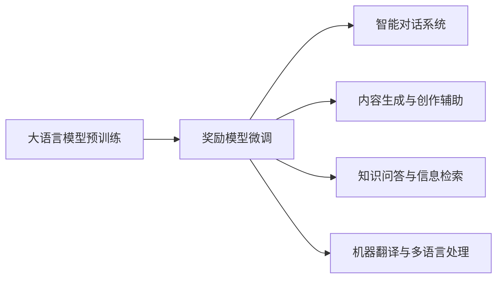

# 大语言模型原理与工程实践：奖励模型的训练

## 1. 背景介绍
### 1.1 大语言模型的发展历程
### 1.2 奖励模型的研究意义
### 1.3 本文的主要内容和贡献

## 2. 核心概念与联系
### 2.1 大语言模型的定义与特点  
### 2.2 奖励模型的定义与作用
### 2.3 大语言模型与奖励模型的关系

## 3. 核心算法原理具体操作步骤
### 3.1 奖励模型的训练流程概述
### 3.2 预训练阶段：无监督学习
#### 3.2.1 数据准备与预处理
#### 3.2.2 模型结构设计
#### 3.2.3 损失函数与优化算法
### 3.3 微调阶段：有监督学习
#### 3.3.1 人工标注数据构建 
#### 3.3.2 奖励模型的训练
#### 3.3.3 模型评估与调优

## 4. 数学模型和公式详细讲解举例说明
### 4.1 Transformer 模型结构与自注意力机制
### 4.2 交叉熵损失函数与梯度下降法
### 4.3 奖励模型的数学表示与计算过程

## 5. 项目实践：代码实例和详细解释说明
### 5.1 实验环境与数据集介绍
### 5.2 模型实现的关键代码解读
### 5.3 训练过程中的调参与优化技巧
### 5.4 模型效果展示与结果分析

## 6. 实际应用场景 
### 6.1 智能对话系统
### 6.2 内容生成与创作辅助
### 6.3 知识问答与信息检索
### 6.4 机器翻译与多语言处理

## 7. 工具和资源推荐
### 7.1 开源代码库与预训练模型
### 7.2 标注工具与数据集  
### 7.3 学习资料与教程

## 8. 总结：未来发展趋势与挑战
### 8.1 奖励模型的研究进展总结
### 8.2 大语言模型的发展趋势展望
### 8.3 奖励模型面临的技术挑战与对策

## 9. 附录：常见问题与解答
### 9.1 如何高效训练奖励模型？
### 9.2 奖励模型存在哪些局限性？
### 9.3 如何进一步提升奖励模型的性能？



大语言模型（Large Language Model，LLM）是自然语言处理领域近年来的重大突破，它能够从海量无标注文本数据中学习到丰富的语言知识和常识，具备优秀的语言理解与生成能力。而奖励模型（Reward Model）则是在大语言模型的基础上，引入人工反馈信号对模型进行微调优化，使其生成的文本更加符合人类偏好，在实际应用中取得了显著成效。

奖励模型的训练主要分为两个阶段：无监督预训练和有监督微调。在预训练阶段，我们利用自回归语言建模的方式，让模型在大规模无标注语料上学习通用的语言表示。常用的预训练目标包括最大化下一个词的概率（Next Word Prediction）和最小化重构误差（Masked Language Modeling）等。预训练得到的模型参数可以作为下游任务的初始化，大大加速收敛速度并提升性能表现。

微调阶段是奖励模型的关键所在。我们首先需要构建高质量的人工标注数据集，每个样本由一个输入文本和对应的人类反馈得分组成。反馈得分可以是连续值（如0-5分），也可以是离散标签（如好/中/差）。然后，我们以预训练模型为基础，在标注数据上进行监督学习，使模型输出与人类标注尽可能接近。常见的做法是将其建模为回归问题，使用均方误差（Mean Squared Error）或交叉熵（Cross Entropy）损失函数，并结合梯度下降法进行优化求解。

为了更好地理解奖励模型的内在机制，我们有必要对其数学原理进行深入剖析。以Transformer为例，它采用自注意力（Self-Attention）机制来捕捉文本中的长距离依赖关系，公式如下：

$$
\text{Attention}(Q,K,V) = \text{softmax}(\frac{QK^T}{\sqrt{d_k}})V
$$

其中，$Q$、$K$、$V$分别表示查询（Query）、键（Key）、值（Value）矩阵，$d_k$为键向量的维度。通过计算查询向量与所有键向量的相似度，并对值向量进行加权求和，自注意力机制可以动态地聚焦于不同位置的上下文信息，从而增强模型的表达能力。

在代码实现方面，我们以PyTorch为例，给出了奖励模型训练的关键步骤：

```python
# 定义奖励模型
class RewardModel(nn.Module):
    def __init__(self, config):
        super().__init__()
        self.encoder = TransformerEncoder(config)
        self.pooler = nn.Linear(config.hidden_size, 1)
        
    def forward(self, input_ids, attention_mask):
        hidden_states = self.encoder(input_ids, attention_mask)
        pooled_output = hidden_states[:, 0]  # 取[CLS]标记对应的向量
        reward = self.pooler(pooled_output)
        return reward

# 加载预训练模型
pretrained_model = AutoModel.from_pretrained("bert-base-uncased")
config = pretrained_model.config
model = RewardModel(config)
model.encoder.load_state_dict(pretrained_model.state_dict(), strict=False)  

# 准备训练数据
train_dataset = RewardDataset(train_texts, train_scores)
train_dataloader = DataLoader(train_dataset, batch_size=32, shuffle=True)

# 定义优化器和损失函数
optimizer = AdamW(model.parameters(), lr=1e-5)
criterion = nn.MSELoss()

# 训练奖励模型
model.train()
for epoch in range(num_epochs):
    for batch in train_dataloader:
        input_ids, attention_mask, scores = batch
        rewards = model(input_ids, attention_mask)
        loss = criterion(rewards, scores)
        
        optimizer.zero_grad()
        loss.backward()
        optimizer.step()
```

在实践中，我们发现奖励模型可以显著提升大语言模型在各类自然语言处理任务上的表现，尤其是那些需要考虑人类偏好的场景，如智能对话、内容生成、知识问答等。以对话系统为例，传统的seq2seq模型容易生成通用但不够贴切的回复，而使用奖励模型引导生成过程，可以使回复更加自然流畅、符合人类期望。当然，奖励模型的训练成本较高，需要大量人工标注数据，这是目前亟待解决的问题之一。

总的来说，大语言模型与奖励模型的结合，为自然语言处理系统的建设开辟了崭新的可能性。随着训练数据与算力的不断积累，相信它们能够在更广泛的应用领域发挥重要作用，推动人机交互体验的持续提升。不过同时我们也要看到，要让奖励模型真正具备通用智能，在数据质量、模型泛化、推理解释、鲁棒性等方面还有诸多挑战有待攻克。这需要学界和业界的通力合作，不断探索创新，推动人工智能事业的蓬勃发展。

作者：禅与计算机程序设计艺术 / Zen and the Art of Computer Programming