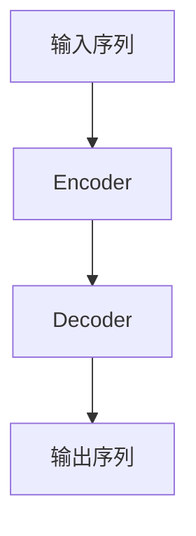

# 大语言模型原理与工程实践：局限和发展

## 1. 背景介绍

### 1.1 大语言模型的兴起

近年来,大型语言模型(Large Language Models, LLMs)在自然语言处理(NLP)领域掀起了一场革命。这些模型通过在大规模语料库上进行预训练,学习了丰富的语言知识和上下文信息,展现出令人惊叹的语言生成和理解能力。

代表性模型包括GPT-3、PaLM、ChatGPT等,它们不仅能够执行传统的NLP任务,如文本生成、机器翻译、问答系统等,还能够进行更复杂的任务,如代码生成、文本摘要、创意写作等。这些模型的出现,为人工智能系统赋予了更自然、更流畅的语言交互能力,极大推动了智能对话系统、虚拟助手等应用的发展。

### 1.2 大语言模型的挑战

尽管取得了令人瞩目的成就,但大语言模型也面临着一些重大挑战和局限性,这些问题需要研究人员进一步探索和解决。

首先,大语言模型存在着一定的安全性和可靠性问题。由于这些模型是通过学习海量语料进行训练的,其中可能包含有偏见、不当或不实信息,导致模型在生成的输出中存在潜在的风险。此外,这些模型也可能被误导或操纵,生成有害或违法的内容。

其次,大语言模型的可解释性和可控性也是一个巨大的挑战。这些庞大的神经网络模型内部机理复杂,很难解释它们是如何得出特定输出的,也难以控制它们的行为和决策。

再者,大语言模型的训练和部署成本高昂,需要大量的计算资源和存储空间,这对于许多组织和个人来说是一个障碍。

最后,大语言模型在某些特定领域的性能仍然有待提高,例如需要深度推理或专业知识的任务。

为了解决这些挑战,研究人员正在努力探索新的模型架构、训练方法、评估指标等,以提高大语言模型的安全性、可解释性、效率和性能。同时,也需要制定相应的伦理和监管框架,确保这些强大的语言技术能够得到负责任的开发和应用。

## 2. 核心概念与联系

### 2.1 语言模型的基本概念

语言模型(Language Model, LM)是一种用于捕捉和表示语言规律的统计模型。它旨在学习语言的概率分布,即给定一个语句的前缀,预测下一个词或标记出现的概率。

语言模型的核心思想是利用大量的语料数据,通过机器学习算法(如神经网络)来建模语言的统计规律,包括词序、语法、语义等各个层面的模式。训练好的语言模型可以用于各种下游的NLP任务,如机器翻译、文本生成、语音识别等。

### 2.2 大语言模型的核心架构

大语言模型通常采用基于Transformer的编码器-解码器(Encoder-Decoder)架构,其中编码器负责捕获输入序列的上下文信息,解码器则根据编码器的输出和先前生成的词来预测下一个词。

编码器和解码器都由多层Transformer块组成,每个Transformer块包含多头自注意力(Multi-Head Attention)和前馈神经网络(Feed-Forward Neural Network)等核心组件。自注意力机制使模型能够捕捉输入序列中任意两个位置之间的依赖关系,而前馈神经网络则对每个位置的表示进行非线性转换,提取更高层次的特征。

### 2.3 大语言模型的预训练和微调

大语言模型通常采用两阶段的训练策略:预训练(Pre-training)和微调(Fine-tuning)。

在预训练阶段,模型会在大规模的语料库上进行自监督学习,目标是最大化语言的概率分布。常见的预训练目标包括掩码语言模型(Masked Language Modeling)和下一句预测(Next Sentence Prediction)等。通过预训练,模型可以学习到丰富的语言知识和上下文信息。

在微调阶段,预训练好的模型会在特定的下游任务数据集上进行进一步的训练,以适应特定任务的需求。在这个过程中,模型的大部分参数会被冻结,只有一小部分参数会被微调,以避免"catastrophic forgetting"(灾难性遗忘)的问题。

预训练和微调的两阶段训练策略,使得大语言模型能够在有限的任务数据集上获得出色的性能表现。

## 3. 核心算法原理具体操作步骤

### 3.1 Transformer架构

Transformer是大语言模型的核心架构,它主要由编码器(Encoder)和解码器(Decoder)两部分组成。编码器负责捕获输入序列的上下文信息,解码器则根据编码器的输出和先前生成的词来预测下一个词。

#### 3.1.1 编码器(Encoder)

编码器由多个相同的层组成,每一层都包含两个子层:多头自注意力机制(Multi-Head Attention)和前馈神经网络(Feed-Forward Neural Network)。

1. **多头自注意力机制**

多头自注意力机制是Transformer的核心,它允许模型捕捉输入序列中任意两个位置之间的依赖关系。具体来说,对于每个位置的输入向量,自注意力机制会计算它与其他所有位置的相关性分数,然后根据这些分数对所有位置的向量进行加权求和,得到该位置的新表示。

通过多头注意力机制,模型可以同时关注不同的表示子空间,从而更好地捕捉输入序列的不同特征。

2. **前馈神经网络**

前馈神经网络是一个简单的全连接前馈网络,它对每个位置的表示进行非线性转换,提取更高层次的特征。具体来说,它包含两个线性变换,中间使用ReLU作为非线性激活函数。

3. **残差连接和层归一化**

为了更好地训练深层神经网络,Transformer在每个子层之后使用了残差连接(Residual Connection)和层归一化(Layer Normalization)。残差连接有助于梯度的传播,而层归一化则有助于加速收敛和提高模型的泛化能力。

#### 3.1.2 解码器(Decoder)

解码器的结构与编码器类似,也由多个相同的层组成,每一层包含三个子层:

1. **掩码多头自注意力机制**

这个子层与编码器的多头自注意力机制类似,但它引入了一种掩码机制,使得每个位置的输出只能依赖于该位置之前的输入,从而保证了自回归(Auto-Regressive)的特性,适用于序列生成任务。

2. **编码器-解码器注意力机制**

这个子层允许解码器关注编码器的输出,捕捉输入序列和输出序列之间的依赖关系。

3. **前馈神经网络**

与编码器中的前馈神经网络相同,用于提取更高层次的特征表示。

解码器的输出经过一个线性层和softmax层,即可得到下一个词的概率分布,从而实现序列生成。

### 3.2 预训练目标

大语言模型通常采用自监督学习的方式进行预训练,以学习通用的语言知识和上下文信息。常见的预训练目标包括:

#### 3.2.1 掩码语言模型(Masked Language Modeling, MLM)

在MLM中,模型会随机掩码输入序列中的一些词,然后尝试预测这些被掩码的词。具体来说,对于每个被掩码的位置,模型需要根据其他位置的上下文信息,生成该位置最可能出现的词的概率分布。

MLM的目标函数是最大化被掩码词的概率,可以表示为:

$$\mathcal{L}_\text{MLM} = -\sum_{i=1}^{n} \log P(w_i | w_{\backslash i})$$

其中,$ n $是被掩码词的数量,$ w_i $是第$ i $个被掩码的词,$ w_{\backslash i} $表示其他未被掩码的词。

#### 3.2.2 下一句预测(Next Sentence Prediction, NSP)

NSP是一种辅助的预训练目标,旨在帮助模型学习更好的句子关系表示。在NSP中,模型会获取一对句子作为输入,并预测第二个句子是否为第一个句子的下一句。

NSP的目标函数是最大化正确句子对的概率,可以表示为:

$$\mathcal{L}_\text{NSP} = -\log P(y | s_1, s_2)$$

其中,$ y $是一个二元标签,表示两个句子$ s_1 $和$ s_2 $是否为连续的句子对。

通过组合MLM和NSP两个预训练目标,大语言模型可以同时学习词级和句级的语言表示,从而获得更好的语言理解和生成能力。

### 3.3 微调策略

在完成预训练后,大语言模型需要在特定的下游任务数据集上进行微调(Fine-tuning),以适应特定任务的需求。常见的微调策略包括:

#### 3.3.1 全模型微调

全模型微调是最直接的方式,即在下游任务的训练数据上,对整个预训练模型(包括编码器和解码器)的所有参数进行进一步的训练。这种方式可以充分利用预训练模型的知识,但也存在过拟合的风险,尤其是当下游任务的训练数据较少时。

#### 3.3.2 编码器微调

编码器微调是一种更保守的策略,只对编码器部分的参数进行微调,而保持解码器部分的参数不变。这种方式可以减小过拟合的风险,但也可能限制了模型在下游任务上的表现。

#### 3.3.3 前几层微调

另一种常见的策略是只微调预训练模型的前几层,而保持其余层的参数不变。这种方式的假设是,预训练模型的底层捕捉了通用的语言特征,而高层则更专注于特定的预训练目标。因此,只微调高层可以更好地适应下游任务,同时保留了底层的通用语言知识。

#### 3.3.4 discriminative fine-tuning

Discriminative fine-tuning是一种新兴的微调策略,它通过添加一个辅助的判别任务,来引导模型更好地学习下游任务的目标。具体来说,在微调过程中,模型不仅需要优化下游任务的损失函数,还需要同时优化辅助判别任务的损失函数。这种策略可以帮助模型学习更鲁棒、更可解释的表示,从而提高下游任务的性能。

不同的微调策略适用于不同的场景,需要根据具体的下游任务、数据量和计算资源等因素来选择合适的策略。

## 4. 数学模型和公式详细讲解举例说明

### 4.1 自注意力机制(Self-Attention)

自注意力机制是Transformer模型的核心组件,它允许模型捕捉输入序列中任意两个位置之间的依赖关系。具体来说,对于每个位置的输入向量,自注意力机制会计算它与其他所有位置的相关性分数,然后根据这些分数对所有位置的向量进行加权求和,得到该位置的新表示。

设输入序列为$ X = (x_1, x_2, \dots, x_n) $,其中$ x_i \in \mathbb{R}^{d_\text{model}} $表示第$ i $个位置的向量表示。自注意力机制的计算过程如下:

1. 计算查询(Query)、键(Key)和值(Value)向量:

   $$\begin{aligned}
   Q &= XW^Q \\
   K &= XW^K \\
   V &= XW^V
   \end{aligned}$$

   其中,$ W^Q, W^K, W^V \in \mathbb{R}^{d_\text{model} \times d_k} $是可学习的权重矩阵,用于将输入向量映射到查询、键和值的子空间。

2. 计算注意力分数:

   $$\text{Attention}(Q, K, V) = \text{softmax}\left(\frac{QK^\top}{\sqrt{d_k}}\right)V$$

   其中,$ \frac{QK^\top}{\sqrt