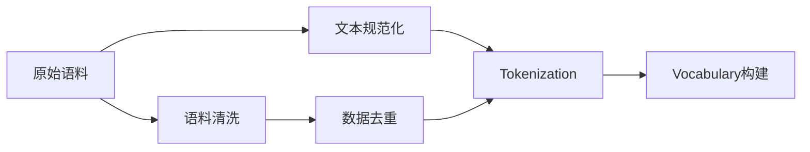

# 大语言模型原理与工程实践：手把手教你训练 7B 大语言模型 语料预处理

## 1. 背景介绍
近年来，随着深度学习技术的飞速发展，大规模语言模型（Large Language Model，LLM）在自然语言处理领域取得了突破性进展。LLM 通过在海量文本数据上进行无监督预训练，能够学习到丰富的语言知识和语义表示，在机器翻译、问答系统、文本生成等任务上表现出色。其中，以 GPT-3、PaLM、OPT 等为代表的百亿级别参数的超大规模语言模型更是引起了学术界和工业界的广泛关注。

然而，训练一个高质量的大规模语言模型并非易事，其中语料的预处理是至关重要的一环。语料预处理的目的是将原始文本数据转化为适合模型训练的格式，并尽可能去除噪声和无用信息，提高数据质量。本文将深入探讨大规模语言模型训练中的语料预处理技术，手把手教你如何为训练一个 70 亿参数的语言模型进行语料准备。

### 1.1 大语言模型的发展历程
- 2018年，GPT-1 模型提出，参数量 1.17 亿，在多个 NLP 任务上取得了当时最好的结果。
- 2019年，GPT-2 模型发布，参数量达到 15 亿，展现出了强大的语言生成能力。  
- 2020年，GPT-3 横空出世，参数量高达 1750 亿，在零样本和少样本学习上表现惊人。
- 2021年，Google 发布了 1.6 万亿参数的 Switch Transformer 模型。
- 2022年，DeepMind 发布了 2800 亿参数的 Chinchilla 模型，Meta 发布了 5400 亿参数的 OPT 模型。

### 1.2 大语言模型的应用场景
- 机器翻译：利用 LLM 的语言理解和生成能力，实现高质量的机器翻译。
- 智能问答：基于 LLM 构建知识库问答系统，回答用户的自然语言提问。
- 文本生成：使用 LLM 进行开放域的文本生成，创作诗歌、小说、剧本等。
- 代码生成：微软的 CodeBERT 等模型实现了根据自然语言描述生成代码。
- 数据增强：利用 LLM 生成的合成数据，扩充下游任务的训练数据。

## 2. 核心概念与联系
在进行语料预处理之前，我们需要了解几个核心概念：

### 2.1 Tokenization
Tokenization 指将文本拆分成一系列词元（token）的过程。常见的 tokenization 方法包括：
- 字符级别：将文本拆分成单个字符。
- 单词级别：以空格或标点为分隔符，将文本拆分成单词。
- 子词级别：通过 BPE、WordPiece 等算法，将单词拆分成更小的有意义的子词单元。

### 2.2 Vocabulary
Vocabulary 是模型训练过程中使用的所有唯一词元的集合。对于大规模语言模型，vocabulary 的大小通常在 5 万到 10 万之间。构建 vocabulary 需要在覆盖率和效率之间权衡。

### 2.3 文本规范化
文本规范化（Text Normalization）旨在将不同形式的文本统一到一致的表示。主要包括以下处理：
- 大小写统一：通常将所有字母转换为小写。
- Unicode 规范化：将 Unicode 字符转换为标准形式，如 NFKC。
- 去除乱码：剔除不可见字符和非法 Unicode 字符。

### 2.4 语料清洗
语料清洗（Data Cleaning）是去除原始文本中噪声和无用信息的过程。常见的清洗操作有：
- 去除 HTML 标签、URL、邮箱地址等。
- 去除重复文本和低质量文本。
- 过滤掉过长或过短的文本。
- 去除非目标语言的文本。

### 2.5 数据去重
大规模爬取的网页语料中往往包含大量重复数据，需要进行去重处理。常用的去重方法有：
- 基于 SimHash、MinHash 等文档指纹算法实现高效的文本去重。
- 使用布隆过滤器等数据结构快速判断文本是否已存在。

下图展示了各个概念之间的关系：



## 3. 核心算法原理具体操作步骤
接下来，我们详细介绍语料预处理的核心算法和具体操作步骤。

### 3.1 文本规范化
1. 将所有文本转换为小写。
2. 使用 NFKC 对 Unicode 字符进行规范化。
3. 去除不可见字符和非法字符，如制表符、零宽字符等。
4. 将数字、日期等特殊实体转换为统一格式。

### 3.2 语料清洗
1. 使用正则表达式去除 HTML 标签、URL、邮箱地址等。
2. 过滤掉长度小于 10 个词或大于 1000 个词的文本。
3. 使用语言检测工具如 fastText 过滤非目标语言文本。  
4. 去除重复句子和低质量句子，如只包含特殊字符的句子。

### 3.3 文本去重
1. 对每篇文档提取 SimHash 指纹。
2. 使用局部敏感哈希（LSH）算法对 SimHash 指纹进行聚类。
3. 对于每个聚类，保留其中的一个代表文档，剔除其余重复文档。
4. 使用布隆过滤器记录所有已处理文档的指纹，加速去重判断。

### 3.4 Tokenization
1. 对于中文，使用结巴分词等工具进行分词。
2. 对于英文，使用 NLTK、SpaCy 等工具进行单词级别分词。
3. 使用字节对编码（Byte Pair Encoding, BPE）算法学习子词级别的词元。
   - 初始化词元集合为所有字符。
   - 统计词元对的出现频率，选择频率最高的词元对合并为新词元。
   - 重复上一步，直到达到预设的词元数量或最大合并次数。
4. 使用学习得到的 BPE 词元表对文本进行编码。

### 3.5 Vocabulary 构建
1. 对预处理后的语料进行 tokenization。
2. 统计每个词元的出现频率。
3. 根据词元频率对词元进行排序。
4. 选取出现频率最高的前 N 个词元构成词表。
5. 向词表中添加特殊词元，如 `[PAD]`、`[UNK]`、`[CLS]`、`[SEP]` 等。

## 4. 数学模型和公式详细讲解举例说明
在语料预处理中，我们用到了几个重要的数学模型和公式，下面进行详细讲解。

### 4.1 SimHash
SimHash 是一种文档指纹算法，用于计算文本的紧凑表示。SimHash 的计算步骤如下：

1. 对文本进行分词，得到词元序列 $\{t_1, t_2, \dots, t_n\}$。
2. 对每个词元 $t_i$，计算其哈希值 $h_i$，得到 $\{h_1, h_2, \dots, h_n\}$。
3. 初始化 SimHash 向量 $\mathbf{v} = \{0\}^d$，其中 $d$ 为哈希值的位数。
4. 对于每个哈希值 $h_i$，将其二进制表示的每一位加到 $\mathbf{v}$ 的对应位上。若该位为 1，则 $\mathbf{v}$ 的对应位加 1，否则减 1。
5. 对 $\mathbf{v}$ 的每一位进行符号函数处理，得到最终的 SimHash 指纹 $\mathbf{s}$：

$$
s_j = \begin{cases}
1, & \text{if } v_j > 0 \\
0, & \text{otherwise}
\end{cases}
$$

其中，$s_j$ 和 $v_j$ 分别表示 $\mathbf{s}$ 和 $\mathbf{v}$ 的第 $j$ 位。

两篇文档的相似度可以通过其 SimHash 指纹的汉明距离来衡量。汉明距离计算公式为：

$$
d_H(\mathbf{s}_1, \mathbf{s}_2) = \sum_{j=1}^d |s_{1j} - s_{2j}|
$$

其中，$\mathbf{s}_1$ 和 $\mathbf{s}_2$ 为两个 SimHash 指纹，$d_H$ 为汉明距离。

### 4.2 BPE 算法
BPE 算法是一种无监督的子词分割算法，通过迭代合并频繁的字符对来构建词表。其数学描述如下：

1. 定义初始词表 $V = \{v_1, v_2, \dots, v_n\}$，其中 $v_i$ 为单个字符。
2. 定义合并操作 $merge(a, b) = a \oplus b$，表示将字符对 $(a, b)$ 合并为新的词元。
3. 定义词元对 $(a, b)$ 的频率 $f(a, b)$ 为它们在语料中相邻出现的次数。
4. 迭代执行以下步骤，直到达到预设的词表大小或最大迭代次数：
   - 计算所有词元对的频率，选择频率最高的词元对 $(a^*, b^*) = \arg\max_{(a, b)} f(a, b)$。
   - 将 $(a^*, b^*)$ 合并为新词元 $v_{new} = merge(a^*, b^*)$，加入词表 $V$。
   - 更新语料中所有出现 $(a^*, b^*)$ 的地方为 $v_{new}$。

BPE 算法可以在保证词表紧凑性的同时，有效处理未登录词（Out-of-Vocabulary, OOV）问题。

## 5. 项目实践：代码实例和详细解释说明
下面通过 Python 代码实例，演示如何进行语料预处理的各个步骤。

### 5.1 文本规范化
```python
import re
import unicodedata

def normalize_text(text):
    # 转换为小写
    text = text.lower()
    # Unicode 规范化
    text = unicodedata.normalize('NFKC', text)
    # 去除非法字符
    text = re.sub(r'[^\x00-\x7F]+', '', text)
    # 转换特殊实体
    text = re.sub(r'\d+', '<NUM>', text)
    return text
```

### 5.2 语料清洗
```python
import re

def clean_text(text):
    # 去除 HTML 标签
    text = re.sub(r'<.*?>', '', text)
    # 去除 URL
    text = re.sub(r'https?://\S+', '', text)
    # 去除邮箱地址
    text = re.sub(r'\S+@\S+', '', text)
    # 过滤长度
    if len(text.split()) < 10 or len(text.split()) > 1000:
        return ''
    return text
```

### 5.3 文本去重
```python
import simhash

def get_simhash(text):
    # 计算 SimHash 指纹
    return simhash.Simhash(text).value

def deduplicate(texts, threshold=3):
    fingerprints = [(get_simhash(text), text) for text in texts]
    clusters = dict()
    for fingerprint, text in fingerprints:
        matched = False
        for key in clusters:
            if simhash.Simhash(fingerprint).distance(simhash.Simhash(key)) <= threshold:
                matched = True
                clusters[key].append(text)
                break
        if not matched:
            clusters[fingerprint] = [text]
    return [texts[0] for texts in clusters.values()]
```

### 5.4 Tokenization 和 BPE 算法
```python
import re
from collections import defaultdict

def tokenize(text):
    # 中文分词
    if re.search(r'[\u4e00-\u9fa5]', text):
        return list(jieba.cut(text))
    # 英文分词
    else:
        return re.findall(r'\w+', text)

def get_vocab(texts, max_size=50000):
    tokens = [token for text in texts for token in tokenize(text)]
    freq = defaultdict(int)
    for token in tokens:
        freq[token] += 1
    vocab = sorted(freq.items(), key=lambda