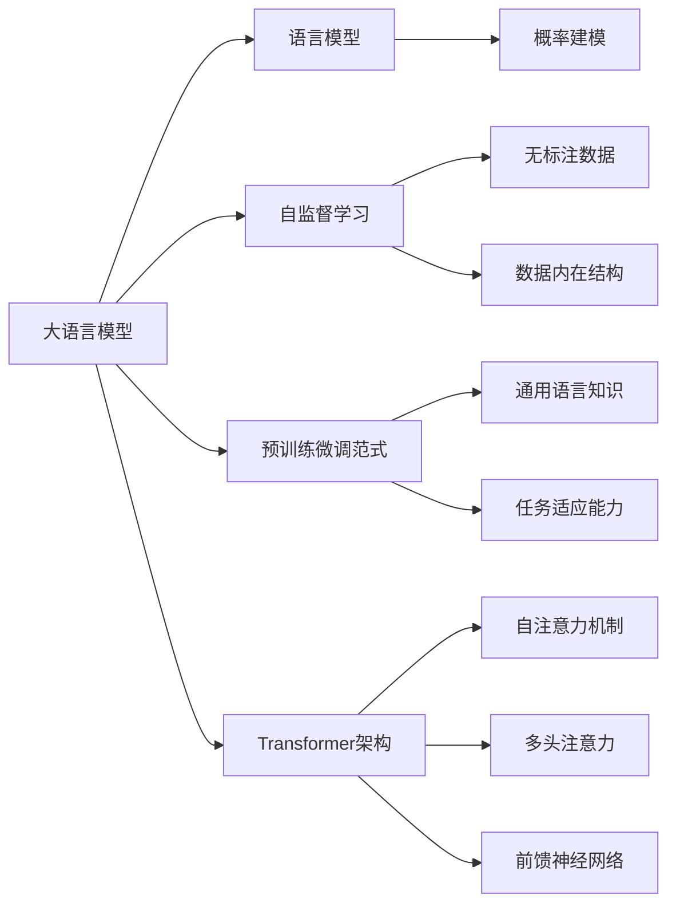

# 大语言模型原理与工程实践：训练目标

## 1. 背景介绍
### 1.1 大语言模型的兴起
近年来,随着深度学习技术的快速发展,特别是Transformer架构的提出,大规模预训练语言模型(Pre-trained Language Models, PLMs)得到了广泛关注和应用。这类模型通过在海量无标注文本数据上进行自监督预训练,可以学习到丰富的语言知识和通用语义表示,再通过少量标注数据微调,即可应用于下游的各种自然语言处理任务,展现出强大的迁移学习能力和优异的性能表现。代表性的大语言模型包括BERT、GPT、XLNet、RoBERTa等。

### 1.2 大语言模型面临的挑战
尽管大语言模型取得了瞩目的成就,但在实际应用中仍面临诸多挑战:
1. 模型参数量巨大,训练和推理成本高昂。动辄上亿的参数规模对计算资源提出了极高要求。
2. 模型泛化能力有待提升。面对新领域、新任务时,模型的适应性和鲁棒性仍需改进。  
3. 训练数据的质量参差不齐。网络文本数据良莠不齐,噪声对模型性能影响大。
4. 模型的可解释性不足。大语言模型内部的工作机制仍是一个"黑盒",缺乏透明度。

### 1.3 训练目标的重要性
大语言模型要获得理想的性能,合理设置训练目标至关重要。训练目标决定了优化的方向,直接影响模型学习到的语言知识和泛化能力。不同的训练目标侧重点有所不同,需要根据实际任务需求来权衡取舍。因此,深入探讨大语言模型的训练目标具有重要的理论意义和实践价值。

## 2. 核心概念与联系
### 2.1 语言模型(Language Model)
语言模型是一种对语言概率分布进行建模的方法。给定一个词序列,语言模型可以计算该序列的概率。形式化地,语言模型就是计算条件概率`P(x_t|x_1, x_2, ..., x_{t-1})`,其中`x_t`为序列的第`t`个词。传统的语言模型包括N-gram、RNN等。

### 2.2 自监督学习(Self-supervised Learning) 
自监督学习是一种无需人工标注训练数据的机器学习范式。其核心思想是利用数据本身蕴含的某种结构作为监督信号,从而实现模型自我训练。常见的自监督方法包括自回归、自编码、对比学习等。大语言模型正是利用自监督学习从海量无标注文本中习得语言知识。

### 2.3 预训练(Pre-training)与微调(Fine-tuning)
预训练指先在大规模无标注数据上训练通用的语言表示模型,学习词语义、句法、语境等知识。微调是在预训练的基础上,利用少量下游任务的标注数据对模型进行二次训练,使其适应特定任务。这种"预训练+微调"的范式可显著降低标注数据的需求,已成为NLP领域的主流做法。

### 2.4 Transformer与注意力机制(Attention)
Transformer是一种基于自注意力机制的神经网络架构,摒弃了传统RNN的循环结构,通过Attention实现远距离依赖建模。Self-Attention使每个位置的表示都能attend到序列的所有位置,大大提升了建模长程依赖的能力。多头注意力机制(Multi-head Attention)进一步增强了模型的表达能力。Feed Forward层扩大了模型容量。

### 概念联系图


## 3. 核心算法原理与具体操作步骤
### 3.1 Masked Language Model(MLM)
MLM是BERT使用的预训练任务,通过随机Mask掉部分词tokens,让模型根据上下文去预测这些被遮掩的词,从而学习上下文语义信息。
#### 训练步骤
1. 随机Mask掉输入序列中15%的词tokens,替换为[MASK]特殊符号。
2. 将Mask后的序列输入BERT编码器,获取每个位置的上下文表示。
3. 在被Mask位置使用一个分类层,基于位置表示对该位置的词进行预测。
4. 计算预测词的交叉熵损失,并利用反向传播算法更新模型参数。

### 3.2 Next Sentence Prediction(NSP)
NSP是BERT提出的另一个预训练任务,通过预测两个句子在原文中是否相邻,来学习句子间的语义关系。
#### 训练步骤 
1. 从语料中抽取连续的句子对(A,B),其中50%保持原有相邻关系,50%的B随机替换为语料中的其他句子。
2. 将句子对拼接后输入BERT编码器,在[CLS]位置获取整个句子对的表示。
3. 在[CLS]位置使用一个二分类层,预测句子对是否相邻。
4. 计算二分类交叉熵损失,并利用反向传播算法更新模型参数。

### 3.3 Permutation Language Model(PLM)
PLM是XLNet提出的无需依赖[MASK]符号的自回归预训练方法。通过随机置换序列并进行因果语言建模,PLM能够考虑到双向的上下文信息。
#### 训练步骤
1. 生成输入序列的一个随机排列`x_z`,其中`z`为`1~n`的一个排列。
2. 将序列`x_z`输入Transformer编码器,但在Attention Mask中屏蔽掉`z_i>z_t`的位置(即当前预测位置只能看到排列中它前面的tokens)。
3. 在每个位置`z_t`使用一个分类层,基于其位置表示对原始序列中该位置的词`x_{z_t}`进行预测。
4. 计算所有位置预测词的交叉熵损失,并利用反向传播算法更新模型参数。

### 3.4 Replaced Token Detection(RTD)
RTD是ELECTRA提出的一种更高效的预训练任务。与生成式的MLM不同,RTD是一个判别式任务,通过判断词是否被替换来学习语言知识。
#### 训练步骤
1. 使用一个小的MLM生成器模型随机替换输入序列中的部分词tokens。
2. 将替换后的序列输入ELECTRA判别器模型,判断每个位置的词是否被替换。
3. 计算所有位置二分类的交叉熵损失,并利用反向传播算法同时更新生成器和判别器的参数。

## 4. 数学模型与公式详解
### 4.1 语言模型的概率公式
给定词序列`X=(x_1,x_2,...,x_T)`,语言模型的目标是计算该序列的概率`P(X)`:
$$
P(X)=\prod_{t=1}^{T}P(x_t|x_1,x_2,...,x_{t-1})
$$
其中`P(x_t|x_1,x_2,...,x_{t-1})`表示在给定前`t-1`个词的条件下,第`t`个词为`x_t`的条件概率。语言模型的目标是最大化目标序列`X`的对数似然概率:
$$
\mathcal{L}(\theta)=\log P(X)=\sum_{t=1}^{T}\log P(x_t|x_1,x_2,...,x_{t-1};\theta)
$$
其中`θ`为模型参数。通过最大化`L(θ)`来训练语言模型,使其能够准确评估序列的合理性。

### 4.2 Transformer的Self-Attention计算
Self-Attention的计算分为三步:
1. 根据输入序列`X`计算Query矩阵`Q`、Key矩阵`K`和Value矩阵`V`:
$$
Q=XW_Q, K=XW_K, V=XW_V
$$
其中`W_Q`,`W_K`,`W_V`为可学习的参数矩阵。

2. 计算Attention Scores矩阵`A`:
$$
A=\text{softmax}(\frac{QK^T}{\sqrt{d_k}})
$$
其中`d_k`为`K`的维度,用于缩放点积结果。`A`矩阵的每个元素`A_{ij}`表示位置`i`到位置`j`的注意力权重。

3. 计算Attention Value:
$$
\text{Attention}(Q,K,V)=AV
$$
将`A`与`V`相乘,得到融合了序列不同位置信息的表示。

多头注意力机制将上述过程独立重复`h`次,再将`h`个头的结果拼接起来,经过一个线性变换得到最终的多头注意力值:
$$
\text{MultiHead}(Q,K,V)=\text{Concat}(\text{head}_1,...,\text{head}_h)W_O \\
\text{head}_i=\text{Attention}(QW_i^Q,KW_i^K,VW_i^V)
$$

### 4.3 MLM的损失函数
MLM的损失函数是被Mask位置词的预测交叉熵损失。设输入序列经过Mask后为`\hat{X}`,Mask位置的真实词为`x_m`,模型在Mask位置的输出概率分布为`p_θ(x|\hat{X})`,则MLM的损失为:
$$
\mathcal{L}_{\text{MLM}}(\theta)=-\mathbb{E}_{x\sim D}\log p_\theta(x_m|\hat{X})
$$
其中`D`为训练语料的经验分布。

### 4.4 NSP的损失函数
NSP的损失函数是二分类交叉熵损失。设句子对`(S_A,S_B)`的标签为`y`(`y=1`表示相邻,`y=0`表示不相邻),模型在[CLS]位置的输出概率为`p_θ(y|S_A,S_B)`,则NSP的损失为:
$$
\mathcal{L}_{\text{NSP}}(\theta)=-\mathbb{E}_{S_A,S_B\sim D}[y\log p_\theta(y|S_A,S_B)+(1-y)\log(1-p_\theta(y|S_A,S_B))]
$$

BERT的联合训练目标为最小化MLM和NSP的损失之和:
$$
\mathcal{L}(\theta)=\mathcal{L}_{\text{MLM}}(\theta)+\mathcal{L}_{\text{NSP}}(\theta)
$$

## 5. 项目实践：代码实例与详解
下面以PyTorch实现BERT的MLM预训练任务为例,给出核心代码及解释:
```python
import torch
import torch.nn as nn

class BertModel(nn.Module):
    def __init__(self, config):
        super().__init__()
        self.embeddings = BertEmbeddings(config)
        self.encoder = BertEncoder(config) 
        self.pooler = BertPooler(config)

    def forward(self, input_ids, attention_mask=None, token_type_ids=None):
        embedding_output = self.embeddings(input_ids, token_type_ids)
        encoder_outputs = self.encoder(embedding_output, attention_mask)
        sequence_output = encoder_outputs[0] 
        pooled_output = self.pooler(sequence_output)
        return sequence_output, pooled_output

class BertForMaskedLM(nn.Module):
    def __init__(self, config):
        super().__init__()
        self.bert = BertModel(config)
        self.cls = BertOnlyMLMHead(config)

    def forward(self, input_ids, attention_mask=None, token_type_ids=None, labels=None):
        sequence_output, _ = self.bert(input_ids, attention_mask, token_type_ids) 
        prediction_scores = self.cls(sequence_output)
        
        if labels is not None:
            loss_fct = nn.CrossEntropyLoss()
            masked_lm_loss = loss_fct(prediction_scores.view(-1, self.config.vocab_size), labels.view(-1))
            return masked_lm_loss
        else:
            return prediction_scores
```
代码解读:
- `BertModel`类定义了BERT的主体架构,包括Embedding层、Transformer Encoder层和Pooling层。
- `BertForMaskedLM`类在`BertModel`的基础上添加了MLM特定的预测头`BertOnlyMLMHead`,用于预测Mask位置的词。
- 在`forward`函数中,先将输入`input_ids`经过BERT主体得到