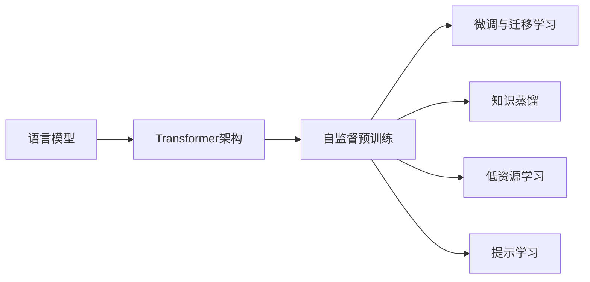

# 大语言模型原理与工程实践：预训练还有什么没有解决

## 1. 背景介绍
### 1.1 大语言模型的兴起
近年来,随着深度学习技术的快速发展,特别是 Transformer 架构的出现,大规模预训练语言模型(Pretrained Language Models,PLMs)取得了突破性的进展。从 2018 年 Google 推出的 BERT 模型,到此后的 GPT 系列、XLNet、RoBERTa 等,大语言模型在多项自然语言处理任务上取得了远超人类的表现,成为了 NLP 领域的研究热点。

### 1.2 预训练范式的优势
大语言模型采用了预训练-微调(Pretrain-Finetune)的范式。首先在大规模无监督语料上进行自监督预训练,学习通用的语言表征;然后针对下游任务进行微调,实现特定任务的优化。这种范式有效解决了传统监督学习面临的标注数据稀缺、领域适应等问题,大大提升了模型的泛化能力。

### 1.3 预训练的局限性
尽管预训练语言模型取得了巨大成功,但仍然存在一些亟待解决的问题和挑战:
- 模型参数量巨大,训练和推理成本高昂
- 模型泛化能力有限,在某些任务上表现不佳
- 模型可解释性差,容易产生偏见和安全隐患
- 模型缺乏常识推理和因果推理能力
- 模型难以应对开放域问答、对话等需要知识和逻辑推理的任务

本文将围绕预训练语言模型的局限性,探讨相关的原理、算法、工程实践,以及未来的研究方向。

## 2. 核心概念与联系
### 2.1 语言模型
语言模型是对语言概率分布的建模,旨在学习单词序列的联合概率分布 $P(w_1, w_2, ..., w_n)$。传统的 n-gram 语言模型基于马尔可夫假设,只考虑有限的上下文信息,而神经网络语言模型可以建模长距离的语义依赖。

### 2.2 Transformer 架构
Transformer 是一种基于自注意力机制的神经网络架构,摒弃了传统的 RNN/CNN 结构,可以高效地并行计算。其核心是多头自注意力层和前馈神经网络,通过 Self-Attention 机制捕捉单词之间的相关性,生成上下文相关的词向量表征。

### 2.3 自监督预训练
自监督学习是一种不需要人工标注数据的学习范式,通过设计辅助任务(pretext task),让模型从大规模无标注数据中自主学习有用的特征表示。在语言模型预训练中,常见的自监督任务包括:
- 语言模型:预测下一个单词(GPT)或被掩码单词(BERT)
- 句子连贯性判别:判断两个句子是否连贯(NSP)  
- 句子顺序判别:判断句子顺序是否被打乱(SOP)
- 词类比:预测单词之间的语义关系

### 2.4 微调与迁移学习
微调(Fine-tuning)是在预训练模型的基础上,针对特定任务进行参数微调,从而将预训练的语言知识迁移到下游任务。一般采用两阶段的训练流程:先冻结预训练参数进行 warm-up,再解冻全部参数进行 fine-tuning。迁移学习可以显著减少下游任务所需的标注数据和训练时间。

### 2.5 知识蒸馏
知识蒸馏(Knowledge Distillation)是一种模型压缩技术,旨在将大型复杂教师模型(teacher model)的知识迁移到小型学生模型(student model)。通过最小化教师模型和学生模型的预测概率分布差异,使学生模型学到教师模型的泛化能力。在预训练语言模型领域,知识蒸馏可用于模型压缩、多语言迁移、领域自适应等。

### 2.6 低资源学习
低资源学习(Low-resource Learning)是指在标注数据稀缺的情况下进行机器学习,如小语种、特定领域等。预训练语言模型为低资源学习提供了新的思路,通过在高资源语言或领域的大规模语料上预训练,再迁移到低资源场景,可以显著提升低资源任务的性能。

### 2.7 提示学习
提示学习(Prompt Learning)是一种新兴的自然语言处理范式,旨在将各类 NLP 任务转化为语言模型的文本生成问题。通过设计适当的提示模板(prompt template),引导预训练语言模型进行特定任务的推理和生成。与传统的微调方法相比,提示学习无需修改模型参数,更加灵活高效。

### 2.8 核心概念之间的联系
下图展示了预训练语言模型涉及的核心概念之间的联系:

从图中可以看出,语言模型是预训练的基础,Transformer 架构是预训练的核心,而自监督预训练则是实现语言模型学习通用语言知识的关键。微调、知识蒸馏、低资源学习、提示学习等都是基于预训练模型实现迁移学习的手段。理解这些概念之间的联系,有助于我们系统地把握预训练语言模型的原理和应用。

## 3. 核心算法原理与操作步骤
### 3.1 Transformer 的自注意力机制
Transformer 的核心是自注意力机制(Self-Attention),可以捕捉任意两个位置之间的长距离依赖关系。对于输入序列 $X=[x_1,x_2,...,x_n]$,自注意力的计算过程如下:

1) 将输入 $X$ 通过三个线性变换得到 query 矩阵 $Q$、key 矩阵 $K$、value 矩阵 $V$:
$$Q=XW^Q, K=XW^K, V=XW^V$$

2) 计算 query 和 key 的注意力分数(attention scores):
$$A = \text{softmax}(\frac{QK^T}{\sqrt{d_k}})$$

其中 $d_k$ 为 query/key 向量的维度,作为缩放因子。

3) 将注意力分数与 value 矩阵相乘,得到注意力输出:
$$\text{Attention}(Q,K,V) = AV$$

4) 将多头注意力的输出拼接,并经过线性变换,得到最终的自注意力输出:
$$\text{MultiHead}(Q,K,V) = \text{Concat}(\text{head}_1,...,\text{head}_h)W^O$$
$$\text{head}_i = \text{Attention}(QW_i^Q, KW_i^K, VW_i^V)$$

其中 $h$ 为注意力头数,$W_i^Q, W_i^K, W_i^V$ 为第 $i$ 个头的权重矩阵。

### 3.2 BERT 的预训练任务 
BERT(Bidirectional Encoder Representation from Transformers)是一个基于 Transformer 编码器的预训练语言模型,采用了两个自监督任务:

1) 掩码语言模型(Masked Language Model,MLM):随机掩盖一定比例(如15%)的输入单词,让模型根据上下文预测被掩盖的单词。损失函数为被掩盖位置的交叉熵损失:
$$\mathcal{L}_{MLM} = -\sum_{i\in \mathcal{M}}\log P(w_i|w_{\backslash \mathcal{M}})$$

其中 $\mathcal{M}$ 为被掩码位置的集合,$w_{\backslash \mathcal{M}}$ 为未被掩码的单词序列。

2) 下一句预测(Next Sentence Prediction,NSP):对于输入的两个句子 $S_1$ 和 $S_2$,让模型判断 $S_2$ 是否为 $S_1$ 的下一句。损失函数为二分类交叉熵损失:
$$\mathcal{L}_{NSP} = -\log P(y|S_1,S_2)$$

其中 $y\in\{0,1\}$ 表示 $S_2$ 是否为 $S_1$ 的下一句。

最终的预训练损失为两个任务损失的加权和:
$$\mathcal{L} = \mathcal{L}_{MLM} + \lambda \mathcal{L}_{NSP}$$

其中 $\lambda$ 为 NSP 损失的权重系数。

### 3.3 GPT 的预训练任务
GPT(Generative Pre-trained Transformer)是一个基于 Transformer 解码器的单向语言模型,采用标准的语言模型任务进行预训练,即根据前面的单词预测下一个单词:
$$\mathcal{L}_{LM} = -\sum_{i=1}^n \log P(w_i|w_{<i})$$

其中 $w_{<i}$ 表示位置 $i$ 之前的单词序列。相比 BERT,GPT 的预训练任务更加简单,但生成能力更强。

### 3.4 预训练-微调流程
预训练语言模型的训练一般分为两个阶段:预训练和微调。以下是详细的操作步骤:

1) 预训练阶段:
- 准备大规模无标注语料,进行必要的清洗和预处理(如 tokenization)
- 根据所选的预训练任务(如 MLM、NSP、LM),构建自监督训练数据
- 初始化模型参数(如 BERT、GPT),设置预训练超参数(如批大小、学习率、训练步数)
- 在训练语料上进行预训练,定期保存模型 checkpoint
- 预训练结束后,在验证集上评估模型性能,选择最优的checkpoint

2) 微调阶段:
- 根据下游任务准备标注数据,构建微调数据集
- 加载预训练模型 checkpoint,根据任务对模型结构进行必要的修改(如添加分类头)
- 设置微调超参数(如批大小、学习率、训练轮数),一般要小于预训练阶段
- 在训练集上进行微调,定期在验证集上评估模型性能,保存最优模型
- 在测试集上评估微调后的模型性能,分析错误样本

预训练-微调范式的优势在于可以在大规模语料上学习通用语言知识,再迁移到小规模的标注数据集,显著提升下游任务性能。但预训练的计算开销很大,需要谨慎设计预训练任务和模型架构。

## 4. 数学模型与公式推导
### 4.1 Transformer 的数学建模
Transformer 可以看作一个条件语言模型,对于输入序列 $X=(x_1,x_2,...,x_n)$ 和输出序列 $Y=(y_1,y_2,...,y_m)$,Transformer 的目标是建模条件概率:
$$P(Y|X) = \prod_{i=1}^m P(y_i|y_{<i},X)$$

其中 $y_{<i}$ 表示位置 $i$ 之前的输出序列。在编码器-解码器框架下,编码器负责将输入 $X$ 编码为隐向量序列 $Z=(z_1,z_2,...,z_n)$,解码器根据 $Z$ 和之前的输出 $y_{<i}$ 预测下一个输出 $y_i$。

编码器和解码器都由若干个 Transformer 块组成,每个块包含两个子层:多头自注意力层和前馈神经网络层。对于第 $l$ 层的第 $i$ 个位置,其隐状态 $h_i^l$ 的更新公式为:
$$a_i^l = \text{MultiHead}(h_i^{l-1}, H^{l-1}, H^{l-1})$$
$$h_i^l = \text{LayerNorm}(a_i^l + \text{FFN}(a_i^l))$$

其中 $H^{l-1}$ 为上一层的隐状态矩阵,$\text{FFN}$ 为前馈神经网络,$\text{LayerNorm}$ 为层归一化。解码器还在自注意力之后引入了编码-解码注意力,将当前解码时刻的隐状态 $s_i^l$ 与编码器输出 $Z$ 进行注意力交互:
$$c_i^l = \text{MultiHead}(s_i^l, Z, Z)$$

最后,解码器输出经过线性变换和 softmax 归一化,得到下一个