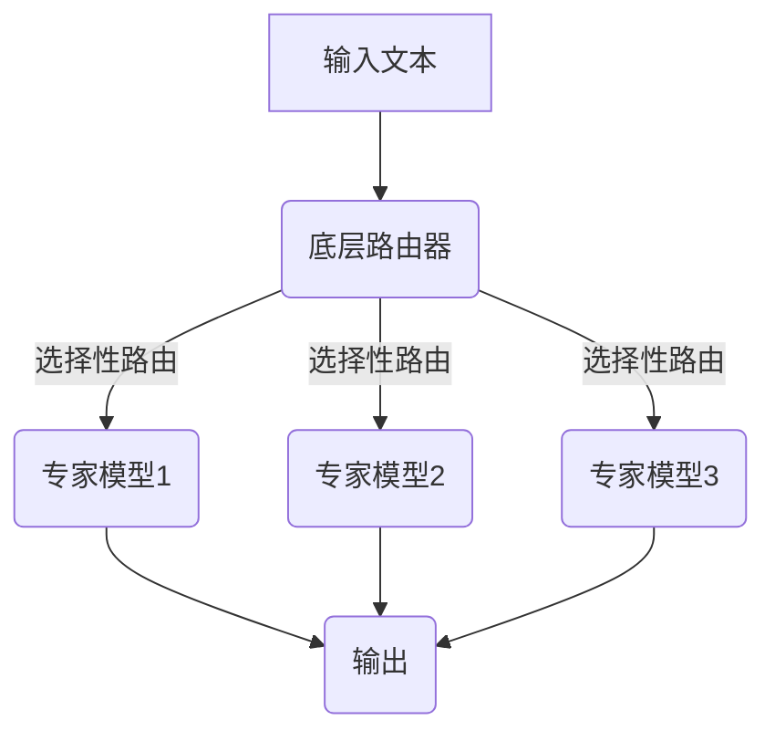

# 大语言模型原理基础与前沿 双层路由

## 1.背景介绍

### 1.1 大语言模型的兴起

近年来,自然语言处理(NLP)领域取得了长足的进步,这在很大程度上归功于大型神经网络语言模型的出现和发展。传统的NLP系统通常依赖于手工设计的特征和规则,而现代的大型语言模型则是通过在大规模文本数据上进行自监督学习,自动学习文本的语义和语法表示。

大型语言模型的出现极大地提高了NLP任务的性能,如机器翻译、文本摘要、问答系统等,为人工智能系统赋予了更强大的语言理解和生成能力。这些模型通过在海量文本数据上训练,学习捕捉文本中丰富的语义和语法信息,从而能够产生高质量、连贯且语义合理的文本输出。

### 1.2 大模型挑战

然而,训练和部署大型语言模型面临着诸多挑战:

1. **计算资源需求巨大**:大型语言模型通常包含数十亿甚至上千亿参数,训练这些模型需要大量的计算资源,包括GPU集群、大内存等,这对于普通机构而言是一个沉重的负担。

2. **推理效率低下**:即使是中等规模的语言模型,在推理时也需要大量的计算资源,这限制了它们在终端设备上的应用。

3. **长序列处理能力有限**:现有的大型语言模型在处理长文本时存在明显的性能下降,无法很好地捕捉长距离的上下文依赖关系。

4. **知识一致性和逻辑推理能力不足**:尽管大型语言模型能够生成看似合理的文本,但往往缺乏全局的知识一致性和逻辑推理能力,从而产生矛盾或无意义的输出。

为了解决这些挑战,研究人员提出了多种创新方法,其中一种备受关注的方法就是双层路由机制。

## 2.核心概念与联系  

### 2.1 双层路由机制概述

双层路由机制是一种全新的大型语言模型架构,旨在提高模型的计算效率、长序列处理能力和知识一致性。该机制将整个模型分为两层:

1. **底层路由器(Router)**:一个相对精简的模型,负责选择性地路由输入文本中的关键信息到上层专家模型。

2. **上层专家模型(Experts)**:由多个专门的子模型组成,每个子模型专注于处理特定类型的输入,如语法分析、知识推理等。

通过这种分层架构,双层路由机制可以更高效地利用计算资源,同时提高模型对长序列和复杂任务的处理能力。

### 2.2 关键技术

实现双层路由机制需要解决以下几个关键技术问题:

1. **路由策略**:如何设计高效的路由策略,将输入信息准确地分派到相应的专家模型。
2. **专家模型设计**:如何设计和训练专家模型,使其能够高效地处理特定类型的输入。
3. **知识融合**:如何将来自不同专家模型的输出进行融合,生成一致和连贯的最终输出。
4. **模型训练**:如何在端到端的方式下高效地训练整个双层路由模型。

接下来,我们将详细探讨双层路由机制的核心算法原理和实现细节。

## 3.核心算法原理具体操作步骤

### 3.1 路由策略

路由策略决定了如何将输入信息分配给不同的专家模型。一种常见的路由策略是基于注意力机制的软路由。

在软路由中,底层路由器会为每个输入token计算一个路由概率向量,该向量表示将该token路由到每个专家模型的概率。具体地,对于第 $t$ 个输入token $x_t$,路由器会计算其路由概率向量 $\boldsymbol{p}_t = [p_{t,1}, p_{t,2}, \ldots, p_{t,N}]$,其中 $N$ 是专家模型的数量,并且 $\sum_{i=1}^N p_{t,i} = 1$。然后,每个专家模型 $i$ 会接收到一个加权后的输入表示 $\tilde{\boldsymbol{x}}_t^{(i)} = p_{t,i} \boldsymbol{x}_t$。

为了学习路由策略,我们需要在训练过程中最小化一个损失函数,该损失函数由两部分组成:

1. **任务损失**:衡量模型在特定任务上的性能,如机器翻译的交叉熵损失。
2. **路由损失**:鼓励路由器学习高效的路由策略,避免将大量输入发送到所有专家模型(导致计算浪费)。

路由损失可以采用信息理论中的互信息(mutual information)来定义,目标是最小化路由器输出的路由概率向量与均匀分布之间的互信息。

### 3.2 专家模型设计

专家模型的设计需要考虑两个关键因素:

1. **专家能力**:每个专家模型应该专注于处理特定类型的输入,如语法分析、知识推理等。
2. **专家容量**:专家模型的容量(参数数量)应该与其所需处理的输入量相匹配,以避免过度或欠度参数化。

常见的做法是使用基于Transformer的序列到序列模型作为专家模型的基础架构,并根据具体任务对其进行微调或设计特殊的注意力机制。例如,对于知识推理任务,可以设计一种基于图神经网络的注意力机制,以更好地捕捉知识图谱中的结构信息。

### 3.3 知识融合

由于不同的专家模型负责处理不同类型的输入,因此需要一种机制来融合它们的输出,生成一致和连贯的最终输出。一种常见的做法是使用另一个Transformer解码器模型作为知识融合模块。

具体地,每个专家模型 $i$ 会产生一个输出表示 $\boldsymbol{y}_t^{(i)}$,知识融合模块会将所有专家输出 $\{\boldsymbol{y}_t^{(i)}\}_{i=1}^N$ 作为输入,并生成最终的输出 $\boldsymbol{z}_t$。在训练过程中,知识融合模块会与整个双层路由模型一起被端到端地优化。

### 3.4 模型训练

训练双层路由模型需要同时优化底层路由器、专家模型和知识融合模块。这可以通过端到端的方式实现,将整个模型视为一个整体,并最小化一个组合损失函数:

$$\mathcal{L} = \mathcal{L}_\text{task} + \lambda_1 \mathcal{L}_\text{routing} + \lambda_2 \mathcal{L}_\text{regularization}$$

其中:

- $\mathcal{L}_\text{task}$ 是任务损失,如机器翻译的交叉熵损失。
- $\mathcal{L}_\text{routing}$ 是路由损失,鼓励路由器学习高效的路由策略。
- $\mathcal{L}_\text{regularization}$ 是正则化项,如权重衰减,用于防止过拟合。
- $\lambda_1$ 和 $\lambda_2$ 是超参数,控制不同损失项的权重。

在训练过程中,可以采用一种称为"解耦训练"的策略,先分别预训练路由器、专家模型和知识融合模块,然后再进行端到端的联合训练。这种策略可以提高训练的稳定性和收敛速度。

## 4.数学模型和公式详细讲解举例说明

在上一节中,我们介绍了双层路由机制的核心算法原理。现在,让我们通过数学模型和公式来深入探讨其中的一些关键细节。

### 4.1 路由概率计算

路由器的主要任务是计算每个输入token被路由到不同专家模型的概率。具体地,对于第 $t$ 个输入token $\boldsymbol{x}_t$,路由器会输出一个路由概率向量 $\boldsymbol{p}_t = [p_{t,1}, p_{t,2}, \ldots, p_{t,N}]$,其中 $N$ 是专家模型的数量。

这个路由概率向量可以通过以下公式计算:

$$\boldsymbol{p}_t = \text{softmax}(\boldsymbol{W}_r \boldsymbol{h}_t + \boldsymbol{b}_r)$$

其中:

- $\boldsymbol{h}_t$ 是输入token $\boldsymbol{x}_t$ 的隐藏状态表示,可以通过如BERT等预训练语言模型获得。
- $\boldsymbol{W}_r$ 和 $\boldsymbol{b}_r$ 是可训练的路由器参数。
- $\text{softmax}(\cdot)$ 是softmax函数,用于将路由得分归一化为概率分布。

通过这种方式,路由器可以根据输入token的语义信息动态地决定将其路由到哪些专家模型。

### 4.2 路由损失

为了鼓励路由器学习高效的路由策略,我们需要设计一个路由损失函数。一种常见的做法是最小化路由概率向量与均匀分布之间的互信息(mutual information)。

具体地,对于一个长度为 $T$ 的输入序列,其路由损失可以定义为:

$$\mathcal{L}_\text{routing} = \frac{1}{T} \sum_{t=1}^T \text{KL}(\boldsymbol{p}_t \| \boldsymbol{u})$$

其中:

- $\boldsymbol{p}_t$ 是第 $t$ 个token的路由概率向量。
- $\boldsymbol{u} = [\frac{1}{N}, \frac{1}{N}, \ldots, \frac{1}{N}]$ 是均匀分布向量。
- $\text{KL}(\cdot \| \cdot)$ 是KL散度(Kullback-Leibler divergence),用于衡量两个概率分布之间的差异。

通过最小化这个路由损失,我们可以鼓励路由器输出"peaked"(即大部分概率集中在少数专家模型上)的路由概率向量,从而实现高效的路由策略。

### 4.3 知识融合

知识融合模块的任务是将来自不同专家模型的输出进行融合,生成一致和连贯的最终输出。一种常见的做法是使用另一个Transformer解码器模型作为知识融合模块。

具体地,假设我们有 $N$ 个专家模型,每个专家模型 $i$ 会产生一个输出表示序列 $\{\boldsymbol{y}_t^{(i)}\}_{t=1}^T$。知识融合模块会将所有专家输出 $\{\boldsymbol{y}_t^{(i)}\}_{i=1}^N$ 作为输入,并生成最终的输出序列 $\{\boldsymbol{z}_t\}_{t=1}^T$。

在每个时间步 $t$,知识融合模块会计算一个上下文向量 $\boldsymbol{c}_t$,该向量是所有专家输出的加权和:

$$\boldsymbol{c}_t = \sum_{i=1}^N \alpha_{t,i} \boldsymbol{y}_t^{(i)}$$

其中 $\alpha_{t,i}$ 是一个注意力权重,表示第 $t$ 个时间步对第 $i$ 个专家输出的关注程度。这些注意力权重可以通过以下公式计算:

$$\alpha_{t,i} = \frac{\exp(\boldsymbol{v}^\top \tanh(\boldsymbol{W}_y \boldsymbol{y}_t^{(i)} + \boldsymbol{W}_h \boldsymbol{h}_t))}{\sum_{j=1}^N \exp(\boldsymbol{v}^\top \tanh(\boldsymbol{W}_y \boldsymbol{y}_t^{(j)} + \boldsymbol{W}_h \boldsymbol{h}_t))}$$

其中 $\boldsymbol{v}$、$\boldsymbol{W}_y$ 和 $\boldsymbol{W}_h$ 是可训练的参数,用于计算注意力分数。

最终,知识融合模块会将上下文向量 $\boldsymbol{c}_t$ 与