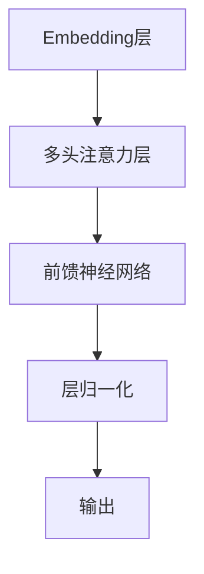

# 大语言模型原理基础与前沿 基于监督学习进行微调

## 1. 背景介绍

### 1.1 大语言模型的兴起

近年来,自然语言处理(NLP)领域取得了长足的进步,其中大语言模型的出现被视为一个里程碑式的突破。大语言模型是一种基于海量自然语言数据训练而成的深度神经网络模型,能够捕捉语言的复杂模式和语义信息。这些模型通过自监督学习的方式,在大规模语料库上进行预训练,获得了通用的语言表示能力,可以应用于广泛的自然语言处理任务。

### 1.2 大语言模型的优势

相较于传统的NLP模型,大语言模型具有以下优势:

1. **语义理解能力强大**: 通过预训练,模型能够学习到丰富的语义知识,更好地理解和生成自然语言。
2. **泛化能力出色**: 预训练的通用语言表示能力使得模型可以轻松迁移到新的下游任务,减少了从头开始训练的需求。
3. **可解释性较好**: 大语言模型的内部机制更加透明,有助于理解模型的决策过程。

### 1.3 微调(Fine-tuning)的重要性

尽管大语言模型已经具备了通用的语言理解能力,但是直接将其应用于特定的下游任务往往效果并不理想。这时,我们需要对预训练模型进行微调(Fine-tuning),即在特定任务的数据集上继续训练模型,使其适应目标任务的特征和要求。微调过程通常只需要少量的标注数据和较短的训练时间,就能够显著提升模型在目标任务上的性能表现。

## 2. 核心概念与联系

### 2.1 自监督预训练

大语言模型的训练过程分为两个阶段:自监督预训练和监督微调。在预训练阶段,模型在海量的原始文本数据上进行自监督学习,目标是捕捉语言的一般模式和语义知识。常见的自监督预训练目标包括:

1. **Masked Language Modeling (MLM)**: 模型需要预测被掩码的词元。
2. **Next Sentence Prediction (NSP)**: 模型需要判断两个句子是否相邻。
3. **Permutation Language Modeling**: 模型需要预测打乱顺序的词元的原始顺序。

通过这些预训练目标,模型可以学习到丰富的语义和语法知识,形成通用的语言表示能力。

### 2.2 监督微调

在完成自监督预训练后,我们需要针对特定的下游任务对模型进行微调。微调过程中,模型在标注的任务数据集上进行有监督的训练,目标是使模型适应目标任务的特征和要求。常见的微调方式包括:

1. **追加任务特定的输出层**: 在预训练模型的基础上,添加新的输出层用于目标任务的预测。
2. **全模型微调**: 对整个预训练模型的所有参数进行微调,使其完全适应目标任务。
3. **部分微调**: 只对预训练模型的部分层进行微调,保留底层参数的通用语言知识。

微调过程通常只需要少量的标注数据和较短的训练时间,就能够显著提升模型在目标任务上的性能表现。

### 2.3 核心概念联系

自监督预训练和监督微调是大语言模型训练过程中的两个关键环节,它们相互关联、相辅相成。

1. **预训练为微调奠定基础**: 自监督预训练使模型获得了通用的语言表示能力,为后续的监督微调提供了良好的初始化参数和语义知识。
2. **微调使模型专门化**: 监督微调使预训练模型适应了特定任务的特征和要求,提高了模型在目标任务上的性能表现。
3. **相互促进、循环迭代**: 预训练和微调可以形成一个循环迭代的过程,通过不断地预训练和微调,模型的性能可以持续提升。

这种预训练-微调的范式已经成为大语言模型训练和应用的主流方式,展现了卓越的性能和泛化能力。

## 3. 核心算法原理具体操作步骤

### 3.1 Transformer 模型架构

大语言模型通常采用 Transformer 作为核心模型架构。Transformer 是一种全新的基于注意力机制(Attention Mechanism)的序列到序列模型,它摒弃了传统的循环神经网络(RNN)和卷积神经网络(CNN)结构,完全基于注意力机制来捕捉输入序列中任意两个位置之间的依赖关系。

Transformer 的主要组成部分包括:

1. **Embedding层**: 将输入的词元(Token)映射为向量表示。
2. **多头注意力层(Multi-Head Attention)**: 捕捉输入序列中任意两个位置之间的依赖关系。
3. **前馈神经网络(Feed-Forward Network)**: 对注意力层的输出进行非线性变换。
4. **层归一化(Layer Normalization)**: 加速训练收敛并提高模型性能。

Transformer 的核心在于注意力机制,它允许模型在计算目标位置的表示时,直接关注整个输入序列的所有位置,从而有效地捕捉长距离依赖关系。

### 3.2 自监督预训练算法

大语言模型的自监督预训练算法主要包括 Masked Language Modeling (MLM) 和 Next Sentence Prediction (NSP)。

#### 3.2.1 Masked Language Modeling (MLM)

MLM 的目标是基于上下文预测被掩码的词元。具体操作步骤如下:

1. 从输入序列中随机选择 15% 的词元进行掩码。
2. 对于被选中的词元,有 80% 的概率将其替换为特殊的 [MASK] 标记,10% 的概率替换为随机词元,剩余 10% 的概率保持不变。
3. 将掩码后的序列输入 Transformer 模型,模型需要预测被掩码位置的原始词元。
4. 使用交叉熵损失函数优化模型参数。

MLM 任务迫使模型理解上下文语义,从而学习到丰富的语言知识。

#### 3.2.2 Next Sentence Prediction (NSP)

NSP 的目标是判断两个句子是否相邻。具体操作步骤如下:

1. 从语料库中随机抽取两个句子,有 50% 的概率它们相邻,50% 的概率不相邻。
2. 将两个句子拼接为一个序列,在中间添加特殊的分隔符 [SEP]。
3. 将拼接后的序列输入 Transformer 模型,模型需要预测两个句子是否相邻。
4. 使用二元交叉熵损失函数优化模型参数。

NSP 任务有助于模型捕捉句子之间的关系和语境信息。

通过 MLM 和 NSP 两个预训练任务的组合,大语言模型可以学习到丰富的语义和语法知识,形成通用的语言表示能力。

### 3.3 监督微调算法

在完成自监督预训练后,我们需要针对特定的下游任务对模型进行微调。常见的监督微调算法包括:

#### 3.3.1 追加任务特定的输出层

这种方式保留预训练模型的大部分参数,只在顶层添加一个新的输出层,用于目标任务的预测。具体操作步骤如下:

1. 将预训练模型的输出作为新输出层的输入。
2. 在新输出层上训练目标任务的分类器或回归器。
3. 使用目标任务的损失函数优化新输出层的参数,同时保持预训练模型的其他参数不变或仅进行少量微调。

这种方式计算成本较低,但模型的适应性可能受到限制。

#### 3.3.2 全模型微调

这种方式对预训练模型的所有参数进行微调,使整个模型完全适应目标任务。具体操作步骤如下:

1. 将预训练模型的输出作为目标任务的输入。
2. 在目标任务的数据集上对整个模型进行端到端的训练。
3. 使用目标任务的损失函数优化模型的所有参数。

这种方式可以充分利用预训练模型的知识,同时使模型完全适应目标任务,但计算成本较高。

#### 3.3.3 部分微调

这种方式只对预训练模型的部分层进行微调,保留底层参数的通用语言知识。具体操作步骤如下:

1. 将预训练模型的输出作为目标任务的输入。
2. 冻结预训练模型的底层参数,只对顶层的几层进行微调。
3. 使用目标任务的损失函数优化被微调层的参数。

这种方式兼顾了计算成本和模型适应性,是一种常见的折中方案。

微调过程通常只需要少量的标注数据和较短的训练时间,就能够显著提升模型在目标任务上的性能表现。选择合适的微调算法对于充分发挥大语言模型的潜力至关重要。

## 4. 数学模型和公式详细讲解举例说明

### 4.1 注意力机制(Attention Mechanism)

注意力机制是 Transformer 模型的核心,它允许模型在计算目标位置的表示时,直接关注整个输入序列的所有位置,从而有效地捕捉长距离依赖关系。

给定一个长度为 $n$ 的输入序列 $\boldsymbol{X} = (x_1, x_2, \ldots, x_n)$,注意力机制的计算过程如下:

1. 计算查询(Query)、键(Key)和值(Value)向量:

$$
\begin{aligned}
\boldsymbol{Q} &= \boldsymbol{X} \boldsymbol{W}^Q \\
\boldsymbol{K} &= \boldsymbol{X} \boldsymbol{W}^K \\
\boldsymbol{V} &= \boldsymbol{X} \boldsymbol{W}^V
\end{aligned}
$$

其中 $\boldsymbol{W}^Q$、$\boldsymbol{W}^K$ 和 $\boldsymbol{W}^V$ 分别是查询、键和值的线性变换矩阵。

2. 计算注意力分数:

$$
\text{Attention}(\boldsymbol{Q}, \boldsymbol{K}, \boldsymbol{V}) = \text{softmax}\left(\frac{\boldsymbol{Q}\boldsymbol{K}^\top}{\sqrt{d_k}}\right)\boldsymbol{V}
$$

其中 $d_k$ 是缩放因子,用于防止内积过大导致梯度饱和。

3. 多头注意力机制通过将注意力机制独立运行 $h$ 次,然后将结果拼接起来,从而捕捉不同的子空间表示:

$$
\text{MultiHead}(\boldsymbol{Q}, \boldsymbol{K}, \boldsymbol{V}) = \text{Concat}(\text{head}_1, \ldots, \text{head}_h)\boldsymbol{W}^O
$$

其中 $\text{head}_i = \text{Attention}(\boldsymbol{Q}\boldsymbol{W}_i^Q, \boldsymbol{K}\boldsymbol{W}_i^K, \boldsymbol{V}\boldsymbol{W}_i^V)$,并且 $\boldsymbol{W}_i^Q$、$\boldsymbol{W}_i^K$、$\boldsymbol{W}_i^V$ 和 $\boldsymbol{W}^O$ 是可学习的线性变换矩阵。

注意力机制通过动态地为每个位置分配不同的注意力权重,从而有效地捕捉输入序列中任意两个位置之间的依赖关系,这是 Transformer 模型取得卓越性能的关键所在。

### 4.2 交叉熵损失函数(Cross-Entropy Loss)

在自监督预训练和监督微调过程中,我们通常使用交叉熵损失函数来优化模型参数。

对于一个长度为 $n$ 的输入序列 $\boldsymbol{X} = (x_1, x_2, \ldots, x_n)$,其对应的标签序列为 $\boldsymbol{Y} = (y_1, y_2, \ldots, y_n)$,交叉熵损失函数定义为:

$$
\mathcal{L}(\boldsymbol{\theta}) = -\frac{