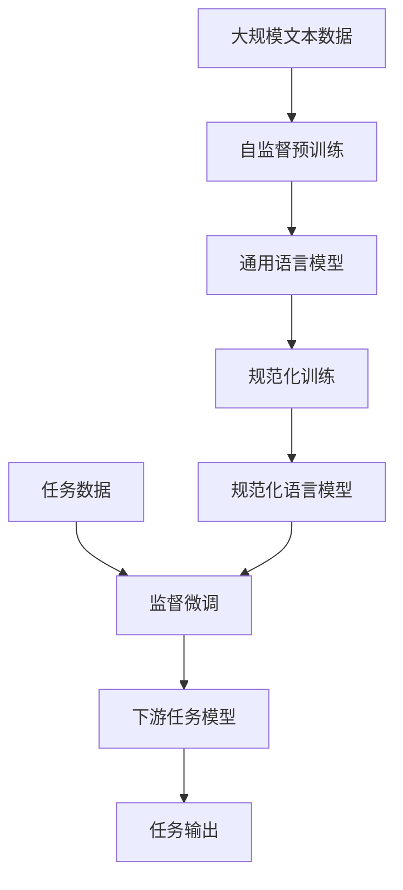

# 大语言模型原理基础与前沿 基于规范的方法

## 1. 背景介绍

### 1.1 什么是大语言模型?

大语言模型(Large Language Model, LLM)是一种基于深度学习的自然语言处理(NLP)模型,旨在捕捉和理解人类语言的复杂结构和语义。它们被训练在海量的文本数据上,学习语言的统计规律和上下文关联,从而能够生成自然、流畅的文本输出。

大语言模型的出现彻底改变了NLP领域的格局,展现出前所未有的语言理解和生成能力。相比传统的NLP模型,大语言模型具有以下显著优势:

- **大规模**: 模型参数规模达数十亿,能够捕捉更丰富的语言知识
- **通用性**: 可以应用于多种不同的NLP任务,如文本生成、问答、摘要等
- **少量或无监督**: 主要通过自监督预训练获得语言理解能力
- **上下文感知**: 能够把握语句的上下文语义关系

### 1.2 大语言模型的发展历程

大语言模型的发展经历了三个主要阶段:

1. **基于Transformer的语言模型**(2017年前后)
   - 代表模型: GPT、BERT
   - 基于Transformer的自注意力机制,显著提升了模型性能

2. **大规模参数模型**(2020年前后)  
   - 代表模型: GPT-3、Switch Transformer、PaLM
   - 参数规模突破十亿,展现出惊人的语言理解和生成能力

3. **基于规范的大语言模型**(2022年后)
   - 代表模型: InstructGPT、ChatGPT、Claude等
   - 引入人类反馈的规范化训练,提高模型的安全性和可控性

## 2. 核心概念与联系

### 2.1 自注意力机制

自注意力机制是Transformer模型的核心,它允许模型捕捉输入序列中任意两个位置之间的关系。这种长程依赖建模能力是大语言模型取得突破性进展的关键。

自注意力机制可以形式化为将查询(query)与键(key)序列进行相似度计算,根据相似度分配注意力权重,并与值(value)序列加权求和获得注意力表示。数学表达式如下:

$$\mathrm{Attention}(Q, K, V) = \mathrm{softmax}(\frac{QK^T}{\sqrt{d_k}})V$$

其中 $Q$ 为查询序列, $K$ 为键序列, $V$ 为值序列, $d_k$ 为缩放因子。

### 2.2 预训练与微调

大语言模型通常采用两阶段的训练范式:

1. **预训练(Pretraining)**: 在大规模无标注文本数据上进行自监督训练,学习通用的语言知识
2. **微调(Finetuning)**: 在特定的有标注数据集上进行进一步训练,将预训练模型适配到特定的下游任务

预训练阶段通常采用自监督目标,如掩码语言模型(Masked LM)、下一句预测等,旨在捕捉语言的统计规律和语义关联。而微调阶段则针对具体任务进行有监督训练,使模型学习任务相关的知识。

这种预训练-微调范式大幅降低了大语言模型在下游任务上的数据需求,显著提高了模型的泛化能力。

### 2.3 规范化训练

传统的大语言模型存在一些潜在风险,如生成不当内容、缺乏可控性等。为解决这些问题,研究人员提出了基于规范的大语言模型训练范式。

规范化训练的核心思想是:在预训练和微调阶段引入人类反馈,使模型学习遵循一定的行为准则和规范。常见的规范化训练方法包括:

- **规范性提示(Instructive Prompting)**: 在输入中加入规范性说明,指导模型生成符合要求的输出
- **有监督纠正(Supervised Correction)**: 人工标注模型输出是否符合规范,并将其作为监督信号
- **奖惩建模(Reward Modeling)**: 构建规范性奖惩函数,将其作为模型训练的目标函数

通过规范化训练,大语言模型不仅能生成高质量的语言输出,还能更好地控制输出的属性,提高模型的安全性和可靠性。

### 2.4 Mermaid流程图

以下是大语言模型训练和应用的基本流程:

## 3. 核心算法原理具体操作步骤  

### 3.1 Transformer模型结构

Transformer是大语言模型的核心架构,它完全基于注意力机制,摒弃了传统的RNN和CNN结构。Transformer的基本组件包括:

1. **嵌入层(Embedding Layer)**: 将输入token映射到连续向量空间
2. **编码器(Encoder)**: 对输入序列建模,捕捉上下文信息
3. **解码器(Decoder)**: 根据编码器输出和先前生成的token,预测下一个token
4. **注意力层(Attention Layer)**: 实现自注意力机制,捕捉长程依赖
5. **前馈层(Feed-Forward Layer)**: 对注意力输出进行非线性变换

编码器和解码器都由多个相同的层组成,每层包含一个多头自注意力子层和一个前馈子层。层归一化(Layer Normalization)和残差连接(Residual Connection)用于加速训练和提高性能。

### 3.2 自注意力机制细节

多头自注意力是Transformer的核心组件,它将注意力机制扩展到多个"头"(head),每个头捕捉不同的依赖关系模式。具体步骤如下:

1. **线性投影**: 将输入 $X$ 投影到查询 $Q$、键 $K$ 和值 $V$ 空间:
   $$Q = XW_Q,\ K = XW_K,\ V = XW_V$$

2. **计算注意力权重**: 对每个头计算注意力权重,并应用缩放点积注意力:
   $$\mathrm{head}_i = \mathrm{Attention}(Q_i, K_i, V_i) = \mathrm{softmax}(\frac{Q_iK_i^T}{\sqrt{d_k}})V_i$$

3. **多头注意力合并**: 将所有头的注意力输出拼接:
   $$\mathrm{MultiHead}(Q, K, V) = \mathrm{Concat}(\mathrm{head}_1, \dots, \mathrm{head}_h)W_O$$

通过多头机制,自注意力能够同时关注不同位置的表示,更好地捕捉长程依赖。

### 3.3 预训练目标

大语言模型的预训练通常采用自监督目标,常见的预训练目标包括:

1. **掩码语言模型(Masked Language Modeling, MLM)**: 随机掩码输入序列中的一部分token,模型需要预测被掩码的token。

2. **下一句预测(Next Sentence Prediction, NSP)**: 判断两个句子是否为连续句子,捕捉句子间的关系。

3. **序列到序列(Sequence-to-Sequence)**: 给定源序列,生成对应的目标序列,常用于机器翻译等任务。

4. **交替语言模型(Alternating Language Modeling)**: 在MLM的基础上,增加了预测下一个token的目标。

5. **生成式预训练(Generative Pretraining)**: 直接最大化生成序列的概率,常用于纯文本生成模型。

这些预训练目标旨在使模型学习语言的统计规律、语义关联和上下文信息,为下游任务奠定基础。

### 3.4 规范化训练方法

规范化训练方法的核心在于将人类反馈引入模型训练过程,指导模型生成符合规范的输出。常见的规范化训练方法包括:

1. **规范性提示(Instructive Prompting)**:
   - 在输入中加入规范性说明,如"请回答问题时保持礼貌"
   - 模型需要生成与提示相符的输出

2. **有监督纠正(Supervised Correction)**:
   - 人工标注模型输出是否符合规范
   - 将标注作为监督信号,优化模型参数

3. **奖惩建模(Reward Modeling)**:
   - 构建规范性奖惩函数 $R(x, y)$,衡量输出 $y$ 是否符合输入 $x$ 的规范
   - 将奖惩函数作为模型训练的目标函数:
     $$\mathcal{L}_\text{RM} = -\mathbb{E}_{x,y\sim p_\theta}[R(x, y)]$$

通过上述方法,模型不仅能生成高质量的语言输出,还能更好地控制输出的属性,提高安全性和可靠性。

## 4. 数学模型和公式详细讲解举例说明

### 4.1 自注意力机制数学模型

自注意力机制是Transformer模型的核心,它能够捕捉输入序列中任意两个位置之间的依赖关系。自注意力的数学模型可以表示为:

$$\mathrm{Attention}(Q, K, V) = \mathrm{softmax}(\frac{QK^T}{\sqrt{d_k}})V$$

其中:

- $Q$ 为查询(Query)序列,表示我们想要关注的部分
- $K$ 为键(Key)序列,表示我们要对比的部分
- $V$ 为值(Value)序列,表示我们要获取的信息
- $d_k$ 为缩放因子,用于防止点积过大导致的梯度饱和

具体计算过程如下:

1. 计算查询 $Q$ 与键 $K$ 的点积相似度: $QK^T$
2. 对相似度进行缩放: $\frac{QK^T}{\sqrt{d_k}}$
3. 对缩放后的相似度应用 softmax 函数,获得注意力权重: $\mathrm{softmax}(\frac{QK^T}{\sqrt{d_k}})$
4. 将注意力权重与值 $V$ 相乘,获得加权和作为注意力输出: $\mathrm{softmax}(\frac{QK^T}{\sqrt{d_k}})V$

通过这种方式,自注意力机制能够自适应地为每个位置分配注意力权重,捕捉输入序列中任意两个位置之间的依赖关系。

### 4.2 多头自注意力机制

为了进一步提高模型的表示能力,Transformer引入了多头自注意力机制。多头注意力将注意力机制扩展到多个"头"(head),每个头捕捉不同的依赖关系模式,然后将所有头的输出拼接起来作为最终的注意力表示。

多头注意力的数学表达式如下:

$$\begin{aligned}
\mathrm{head}_i &= \mathrm{Attention}(Q_i, K_i, V_i) \\
               &= \mathrm{softmax}(\frac{Q_iK_i^T}{\sqrt{d_k}})V_i \\
\mathrm{MultiHead}(Q, K, V) &= \mathrm{Concat}(\mathrm{head}_1, \dots, \mathrm{head}_h)W_O
\end{aligned}$$

其中:

- $Q_i$、$K_i$、$V_i$ 分别为第 $i$ 个头的查询、键和值投影
- $\mathrm{head}_i$ 表示第 $i$ 个头的注意力输出
- $\mathrm{Concat}$ 表示将所有头的输出拼接
- $W_O$ 为可训练的线性投影参数

通过多头机制,自注意力能够同时关注不同位置的表示,更好地捕捉长程依赖和不同的语义关系。

### 4.3 掩码语言模型

掩码语言模型(Masked Language Modeling, MLM)是大语言模型预训练的常用目标之一。MLM的基本思想是随机掩码输入序列中的一部分token,然后让模型预测被掩码的token。

MLM的数学表达式如下:

$$\mathcal{L}_\text{MLM} = -\mathbb{E}_{x\sim X}\left[\sum_{t\in\mathcal{M}}\log p(x_t|x_{\backslash\mathcal{M}};\theta)\right]$$

其中:

- $x$ 表示输入序列
- $\mathcal