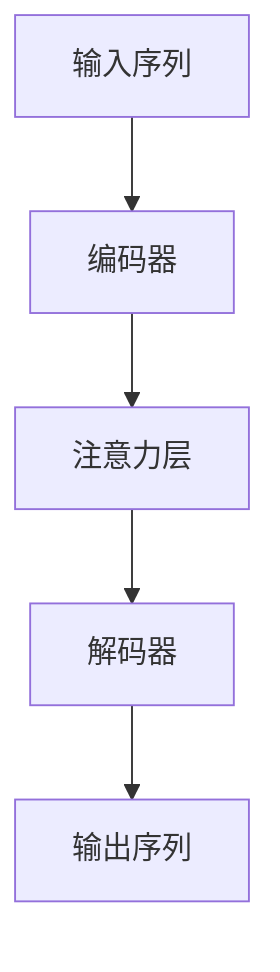

# 大语言模型原理基础与前沿 思维链

## 1. 背景介绍

### 1.1 人工智能的崛起

人工智能(Artificial Intelligence, AI)是当代科技发展的核心驱动力之一。近年来,AI取得了长足的进步,尤其是在自然语言处理(Natural Language Processing, NLP)和计算机视觉(Computer Vision)等领域。这些进展很大程度上归功于深度学习(Deep Learning)技术的飞速发展。

### 1.2 大语言模型的兴起

大语言模型(Large Language Model, LLM)是NLP领域中的一种突破性技术,它通过在大规模语料库上进行预训练,学习语言的潜在规律和知识,从而获得强大的语言理解和生成能力。代表性的大语言模型包括GPT(Generative Pre-trained Transformer)、BERT(Bidirectional Encoder Representations from Transformers)等。

### 1.3 思维链的概念

思维链(Chain of Thought)是一种新兴的大语言模型范式,它旨在赋予模型更强的推理和解释能力。传统的语言模型往往只关注输出结果,而忽视了推理过程。思维链则要求模型在生成最终答案之前,先生成一系列的中间推理步骤,以展示其思考过程。这不仅有助于提高模型的透明度和可解释性,也有望增强其推理能力。

## 2. 核心概念与联系

### 2.1 自回归语言模型

自回归语言模型(Autoregressive Language Model)是大语言模型的核心概念之一。它基于条件概率,通过最大化语料库中的单词序列的概率来训练模型参数。具体来说,给定前缀序列$x_1, x_2, ..., x_t$,模型需要预测下一个单词$x_{t+1}$的概率分布:

$$P(x_{t+1}|x_1, x_2, ..., x_t)$$

在推理阶段,模型会自回归地生成单词序列,每次根据已生成的部分序列,预测并采样下一个最可能的单词。

### 2.2 Transformer架构

Transformer是大语言模型中广泛采用的核心架构。它完全基于注意力(Attention)机制,摒弃了传统序列模型中的循环和卷积结构,大大提高了并行计算能力。Transformer的主要组件包括编码器(Encoder)、解码器(Decoder)和注意力层(Attention Layer)。编码器负责构建输入序列的表示,解码器则根据编码器的输出以及前缀生成目标序列。



### 2.3 预训练与微调

大语言模型通常采用预训练与微调(Pre-training and Fine-tuning)的范式。在预训练阶段,模型会在大规模通用语料库上进行自监督学习,获得通用的语言理解和生成能力。在微调阶段,模型会在特定任务的标注数据集上进行进一步训练,使其适应特定领域和任务。这种范式大大提高了模型的泛化能力和数据利用效率。

## 3. 核心算法原理具体操作步骤

### 3.1 Transformer的自注意力机制

Transformer的核心是自注意力(Self-Attention)机制。对于输入序列$X = (x_1, x_2, ..., x_n)$,自注意力的计算过程如下:

1. 将输入序列$X$分别通过三个线性变换得到查询(Query)、键(Key)和值(Value)向量序列$Q$、$K$和$V$。
2. 计算注意力分数矩阵$A$:

$$A = \text{softmax}(\frac{QK^T}{\sqrt{d_k}})$$

其中$d_k$是缩放因子,用于避免内积过大导致的梯度饱和问题。
3. 计算注意力加权和,得到输出序列$Y$:

$$Y = AV$$

自注意力机制允许每个位置的输出向量与整个输入序列相关联,捕获长距离依赖关系。

### 3.2 编码器-解码器架构

编码器(Encoder)和解码器(Decoder)是Transformer的两个主要组件。

**编码器**由多层相同的编码器层组成,每层包含一个多头自注意力子层和一个前馈神经网络子层。编码器的作用是构建输入序列的表示。

**解码器**由多层相同的解码器层组成,每层包含一个掩码多头自注意力子层、一个编码器-解码器注意力子层和一个前馈神经网络子层。解码器的作用是根据输入序列的表示,生成目标序列。

在解码器的自注意力子层中,会使用一个注意力掩码,以确保每个位置的输出只能关注之前的位置,从而保证了自回归属性。

### 3.3 预训练任务

大语言模型的预训练通常采用自监督学习的方式,无需人工标注的数据。常见的预训练任务包括:

1. **掩码语言模型(Masked Language Modeling, MLM)**: 随机掩码输入序列中的一部分单词,模型需要预测被掩码的单词。
2. **下一句预测(Next Sentence Prediction, NSP)**: 给定两个句子,模型需要判断第二个句子是否为第一个句子的下一句。
3. **因果语言模型(Causal Language Modeling, CLM)**: 给定前缀序列,模型需要预测下一个单词。

通过这些预训练任务,模型可以学习到丰富的语言知识和上下文理解能力。

## 4. 数学模型和公式详细讲解举例说明

### 4.1 自注意力计算示例

我们以一个简单的例子来说明自注意力的计算过程。假设输入序列为$X = (x_1, x_2, x_3)$,其中$x_i$是词嵌入向量。我们令查询、键和值向量序列$Q$、$K$、$V$与输入序列$X$相同,缩放因子$\sqrt{d_k} = 2$。

1. 计算注意力分数矩阵$A$:

$$A = \text{softmax}\begin{pmatrix}
\frac{x_1 \cdot x_1}{2} & \frac{x_1 \cdot x_2}{2} & \frac{x_1 \cdot x_3}{2} \\
\frac{x_2 \cdot x_1}{2} & \frac{x_2 \cdot x_2}{2} & \frac{x_2 \cdot x_3}{2} \\
\frac{x_3 \cdot x_1}{2} & \frac{x_3 \cdot x_2}{2} & \frac{x_3 \cdot x_3}{2}
\end{pmatrix}$$

2. 计算注意力加权和,得到输出序列$Y$:

$$Y = \begin{pmatrix}
a_{11}x_1 + a_{12}x_2 + a_{13}x_3 \\
a_{21}x_1 + a_{22}x_2 + a_{23}x_3 \\
a_{31}x_1 + a_{32}x_2 + a_{33}x_3
\end{pmatrix}$$

其中$a_{ij}$是$A$矩阵中的元素。可以看出,每个输出向量$y_i$是输入序列$X$的加权和,权重由注意力分数$a_{ij}$决定。

### 4.2 交叉熵损失函数

在语言模型的训练中,常用的损失函数是交叉熵损失(Cross-Entropy Loss)。对于一个长度为$n$的目标序列$Y = (y_1, y_2, ..., y_n)$,其交叉熵损失定义为:

$$\mathcal{L}(Y, \hat{Y}) = -\sum_{t=1}^n \log P(y_t|\hat{y}_1, \hat{y}_2, ..., \hat{y}_{t-1})$$

其中$\hat{Y} = (\hat{y}_1, \hat{y}_2, ..., \hat{y}_n)$是模型预测的序列。这个损失函数衡量了模型预测序列与真实序列之间的差异,并且由于对数运算的性质,它会更加关注于低概率事件。

在训练过程中,我们需要最小化这个损失函数,以使模型的预测能力最大化。通常会采用随机梯度下降(Stochastic Gradient Descent)等优化算法来更新模型参数。

## 5. 项目实践:代码实例和详细解释说明

为了更好地理解大语言模型的原理,我们将通过一个基于PyTorch的代码示例,实现一个简化版的Transformer模型。

### 5.1 导入必要的库

```python
import math
import torch
import torch.nn as nn
from torch.nn import TransformerEncoder, TransformerEncoderLayer
```

### 5.2 实现多头自注意力机制

```python
class MultiHeadAttention(nn.Module):
    def __init__(self, d_model, num_heads):
        super().__init__()
        self.num_heads = num_heads
        self.d_model = d_model
        
        self.depth = d_model // num_heads

        self.wq = nn.Linear(d_model, d_model)
        self.wk = nn.Linear(d_model, d_model)
        self.wv = nn.Linear(d_model, d_model)

        self.dense = nn.Linear(d_model, d_model)
        
    def split_heads(self, x, batch_size):
        x = x.view(batch_size, -1, self.num_heads, self.depth)
        return x.permute(0, 2, 1, 3)

    def forward(self, v, k, q, mask):
        batch_size = q.size(0)
        
        q = self.wq(q)
        k = self.wk(k)
        v = self.wv(v)
        
        q = self.split_heads(q, batch_size)
        k = self.split_heads(k, batch_size)
        v = self.split_heads(v, batch_size)

        scaled_attention, attention_weights = self.scaled_dot_product_attention(q, k, v, mask)
        
        scaled_attention = scaled_attention.permute(0, 2, 1, 3).contiguous()

        concat_attention = scaled_attention.view(batch_size, -1, self.d_model)

        output = self.dense(concat_attention)
        
        return output, attention_weights
    
    def scaled_dot_product_attention(self, q, k, v, mask=None):
        matmul_qk = torch.matmul(q, k.transpose(-2, -1))
        
        dk = k.size(-1)
        scaled_attention_logits = matmul_qk / math.sqrt(dk)

        if mask is not None:
            scaled_attention_logits += (mask * -1e9)
        
        attention_weights = torch.softmax(scaled_attention_logits, dim=-1)
        
        output = torch.matmul(attention_weights, v)
        
        return output, attention_weights
```

这个代码实现了多头自注意力机制的核心逻辑。它首先将输入分别通过线性变换得到查询、键和值向量,然后进行分头操作。接着,它计算缩放点积注意力,得到注意力权重和加权和输出。最后,它将多头的输出拼接并通过一个线性层得到最终输出。

### 5.3 实现Transformer编码器

```python
class TransformerEncoder(nn.Module):
    def __init__(self, d_model, num_heads, num_layers, dropout=0.1):
        super().__init__()
        
        self.d_model = d_model
        self.num_layers = num_layers
        
        self.pos_encoder = PositionalEncoding(d_model)
        
        encoder_layers = TransformerEncoderLayer(d_model, num_heads, dim_feedforward=2048, dropout=dropout, batch_first=True)
        self.transformer_encoder = TransformerEncoder(encoder_layers, num_layers)
        
    def forward(self, src):
        src = self.pos_encoder(src)
        output = self.transformer_encoder(src)
        return output
```

这个代码实现了Transformer的编码器部分。它首先对输入序列进行位置编码,然后通过一个由多层编码器层组成的Transformer编码器,得到输入序列的表示。

### 5.4 实现位置编码

```python
class PositionalEncoding(nn.Module):
    def __init__(self, d_model, max_len=5000):
        super().__init__()
        
        pe = torch.zeros(max_len, d_model)
        position = torch.arange(0, max_len, dtype=torch.float).unsqueeze(1)
        div_term = torch.exp(torch.arange(0, d_model, 2).float() * (-math.log(10000.0) / d_model))
        pe[:, 0::2] = torch.sin(position * div_term)
        pe[:, 1::2] = torch.cos(position * div_term)
        pe = pe.unsqueeze(0)
        self.register_buffer('pe', pe)

    def forward(self, x):
        return x + self.pe[:, :x.size(1)]
```

这个代码实现了位置编码的功能,它为每个位置生成一个独特的位置向