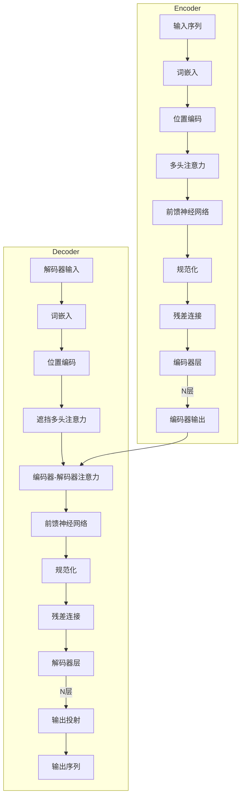

# 大语言模型原理基础与前沿 指令生成

## 1.背景介绍

### 1.1 人工智能的发展历程

人工智能(Artificial Intelligence, AI)是一门研究如何使机器模仿人类智能行为的科学与技术。自20世纪50年代问世以来，人工智能经历了几个重要的发展阶段。

- 早期阶段(1956-1974)主要集中在知识表示、推理和专家系统等领域。
- 知识陷阱时期(1974-1980)由于缺乏足够的计算能力和大规模数据,人工智能发展遇到了瓶颈。
- 知识重振时期(1980-1987)专家系统和知识工程获得了重大突破。
- 统计学习时期(1987-2012)机器学习、神经网络等统计方法开始应用于人工智能。
- 深度学习时期(2012-至今)benefiting from大数据、强大计算能力和新算法,深度学习取得了突破性进展。

### 1.2 大语言模型的兴起

在深度学习时期,自然语言处理(Natural Language Processing, NLP)成为人工智能的一个重要分支。传统的NLP方法主要基于规则和特征工程,但存在一些局限性。2018年,谷歌的Transformer模型和BERT模型开启了大语言模型的新时代。

大语言模型(Large Language Model, LLM)是一种基于大规模无标注语料进行预训练的神经网络模型。它能够从海量文本数据中自主学习语言知识和模式,并可用于下游的NLP任务,如机器翻译、文本摘要、问答系统等。

大语言模型的出现极大地推动了NLP技术的发展,使得人工智能系统能够更好地理解和生成自然语言。目前,GPT-3、PanGu-Alpha、ERNIE 3.0等大型语言模型已经展现出了强大的语言理解和生成能力。

## 2.核心概念与联系  

### 2.1 大语言模型的核心概念

1. **预训练(Pre-training)**: 大语言模型通过在海量无标注语料上进行预训练,学习通用的语言表示和知识。这个过程不依赖于任何特定的下游任务。

2. **自监督学习(Self-Supervised Learning)**: 预训练采用自监督的方式,即模型通过预测被遮蔽或删除的词来学习语言模式,而无需人工标注的数据。

3. **迁移学习(Transfer Learning)**: 经过预训练后,大语言模型可以在下游任务上进行微调(Fine-tuning),将通用的语言知识迁移到特定任务中。

4. **注意力机制(Attention Mechanism)**: 注意力机制是大语言模型的关键技术,它允许模型动态地关注输入序列中与当前预测相关的部分,从而更好地捕获长距离依赖关系。

5. **transformer架构**: 大多数大语言模型采用了transformer的编码器-解码器架构,其中编码器用于理解输入,解码器用于生成输出。

6. **规模效应(Scaling Effect)**: 随着模型规模(参数量)和训练数据量的增加,大语言模型的性能通常会显著提升,这被称为规模效应。

### 2.2 大语言模型与其他AI技术的联系

大语言模型与其他AI技术存在密切联系:

- **机器学习**: 大语言模型本质上是一种基于深度神经网络的机器学习模型,利用了监督学习、自监督学习等技术。

- **深度学习**: 大语言模型通常采用transformer等深度神经网络架构,并借助深度学习算法进行训练。

- **自然语言处理**: 大语言模型是NLP领域的核心技术,为各种NLP任务提供了强大的语言理解和生成能力。

- **知识表示与推理**: 大语言模型能够从训练数据中学习丰富的语义和世界知识,为知识表示和推理奠定基础。

- **多模态AI**: 除了文本,大语言模型还可以扩展到处理图像、视频等多模态数据,实现视觉-语言的联合理解和生成。

## 3.核心算法原理具体操作步骤

### 3.1 Transformer架构

Transformer是大语言模型中广泛采用的核心架构,由编码器(Encoder)和解码器(Decoder)组成。

#### 3.1.1 编码器(Encoder)

编码器的主要作用是将输入序列映射为一系列连续的表示向量,称为隐藏状态(Hidden States)。编码器的具体操作步骤如下:

1. **词嵌入(Word Embedding)**: 将输入序列中的每个词映射为一个固定长度的向量表示。

2. **位置编码(Positional Encoding)**: 因为Transformer没有递归或卷积结构,无法直接获取序列的位置信息,因此需要将位置信息编码到输入中。

3. **多头注意力(Multi-Head Attention)**: 计算每个单词与其他单词之间的注意力权重,捕获它们之间的依赖关系。

4. **前馈神经网络(Feed-Forward Neural Network)**: 对注意力的输出应用两层全连接的前馈神经网络,进一步提取特征。

5. **规范化(Normalization)和残差连接(Residual Connection)**: 使用层规范化和残差连接来促进梯度传播,提高模型的训练稳定性。

编码器会重复上述步骤多次,每次重复称为一个"层"。最终,编码器会输出一系列隐藏状态,作为解码器的输入。

#### 3.1.2 解码器(Decoder)

解码器的作用是根据编码器的输出和目标序列生成新的序列。解码器的操作步骤类似于编码器,但有以下不同:

1. **遮挡注意力(Masked Self-Attention)**: 在计算注意力时,每个单词只能关注之前的单词,而不能关注之后的单词,以避免在生成时利用了目标序列的未来信息。

2. **编码器-解码器注意力(Encoder-Decoder Attention)**: 在计算注意力时,解码器还需要关注编码器的输出,以获取输入序列的信息。

3. **输出投射(Output Projection)**: 解码器的最后一层会将隐藏状态映射到目标词汇表的维度,以生成每个位置的输出概率分布。

4. **输出序列生成**: 在生成模式下,解码器会根据概率分布采样或选择最可能的单词,并将其作为下一个位置的输入,重复该过程直到生成完整序列。

通过上述步骤,Transformer架构能够有效地捕获输入和输出序列之间的长距离依赖关系,从而实现高质量的序列到序列的转换。

### 3.2 自监督预训练

大语言模型通过自监督预训练的方式在大量无标注语料上学习通用的语言表示。常见的自监督预训练目标包括:

1. **掩码语言模型(Masked Language Modeling, MLM)**: 随机将输入序列中的一些词替换为特殊的[MASK]标记,然后让模型预测这些被遮蔽词的原始词汇。

2. **下一句预测(Next Sentence Prediction, NSP)**: 判断两个句子是否为连续的句子对,以捕获句子之间的关系和上下文信息。

3. **因果语言模型(Causal Language Modeling, CLM)**: 给定序列的前缀,预测序列中的下一个词。这种方式常用于生成式任务,如机器翻译、文本生成等。

4. **序列到序列预训练(Sequence-to-Sequence Pre-training)**: 将输入序列和目标序列进行掩码,同时预测被遮蔽的输入词和输出词,常用于序列到序列的任务。

通过自监督预训练,大语言模型可以从海量无标注语料中学习丰富的语言知识和模式,为下游任务提供强大的语言理解和生成能力。

### 3.3 指令生成

指令生成(Instruction Generation)是大语言模型的一种重要应用,旨在根据给定的指令生成相应的文本输出。指令可以是各种形式的自然语言描述,如问题、任务说明、创作主题等。

指令生成的核心思想是将指令作为输入,通过大语言模型生成与指令相关的文本序列。具体的操作步骤如下:

1. **指令表示(Instruction Representation)**: 将指令转换为大语言模型可以理解的向量表示,通常采用词嵌入和位置编码等技术。

2. **编码器处理(Encoder Processing)**: 将指令的向量表示输入到编码器,获得指令的隐藏状态表示。

3. **解码器生成(Decoder Generation)**: 解码器基于编码器的输出和生成历史,逐步生成与指令相关的文本序列。

4. **输出序列生成(Output Sequence Generation)**: 通过贪婪搜索、束搜索或其他解码策略,从解码器的输出概率分布中选择最可能的词汇,构建最终的输出序列。

5. **反馈机制(Feedback Mechanism)**: 在某些情况下,可以将生成的输出序列作为新的输入,重复上述过程,实现交互式的指令生成。

指令生成可以应用于各种场景,如问答系统、文本创作、任务规划等。通过指令,人类可以更自然地与大语言模型进行交互,指导模型生成所需的内容。

## 4.数学模型和公式详细讲解举例说明

### 4.1 自注意力机制(Self-Attention)

自注意力机制是Transformer架构中的核心组件,它能够捕获输入序列中任意两个位置之间的依赖关系。给定一个长度为n的输入序列$\boldsymbol{X} = (x_1, x_2, \dots, x_n)$,自注意力的计算过程如下:

1. **查询(Query)、键(Key)和值(Value)的计算**:

$$
\begin{aligned}
\boldsymbol{Q} &= \boldsymbol{X} \boldsymbol{W}^Q \\
\boldsymbol{K} &= \boldsymbol{X} \boldsymbol{W}^K \\
\boldsymbol{V} &= \boldsymbol{X} \boldsymbol{W}^V
\end{aligned}
$$

其中$\boldsymbol{W}^Q, \boldsymbol{W}^K, \boldsymbol{W}^V$分别是查询、键和值的线性变换矩阵。

2. **注意力分数的计算**:

$$
\text{Attention}(\boldsymbol{Q}, \boldsymbol{K}, \boldsymbol{V}) = \text{softmax}\left(\frac{\boldsymbol{Q}\boldsymbol{K}^\top}{\sqrt{d_k}}\right)\boldsymbol{V}
$$

其中$d_k$是缩放因子,用于防止内积过大导致的梯度饱和问题。

3. **多头注意力(Multi-Head Attention)**:

$$
\begin{aligned}
\text{MultiHead}(\boldsymbol{Q}, \boldsymbol{K}, \boldsymbol{V}) &= \text{Concat}(\text{head}_1, \dots, \text{head}_h)\boldsymbol{W}^O \\
\text{where} \; \text{head}_i &= \text{Attention}(\boldsymbol{Q}\boldsymbol{W}_i^Q, \boldsymbol{K}\boldsymbol{W}_i^K, \boldsymbol{V}\boldsymbol{W}_