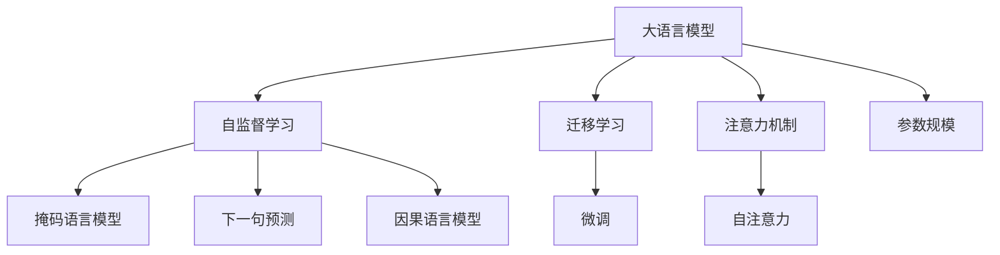

# 大语言模型原理基础与前沿 挑战与机遇

## 1. 背景介绍

### 1.1 什么是大语言模型?

大语言模型(Large Language Model, LLM)是一种利用大规模语料训练而成的深度神经网络模型,旨在学习自然语言的语义和语法规则。它们能够生成看似人类写作的连贯、流畅的文本,并对输入的文本进行理解和生成响应。

大语言模型的出现源于深度学习和自然语言处理领域的快速发展,特别是transformer模型架构和大规模预训练技术的引入。这些突破使得训练出拥有数十亿乃至上万亿参数的庞大神经网络模型成为可能,从而赋予模型强大的语言理解和生成能力。

### 1.2 大语言模型的重要性

大语言模型在自然语言处理领域具有革命性的影响,它们展现出令人惊叹的语言理解和生成能力,在多个任务上超越了人类水平。大语言模型的出现极大地推动了人工智能技术在语言领域的发展,为众多应用场景带来了新的可能性,例如:

- 对话系统和虚拟助手
- 内容创作和自动写作
- 机器翻译和多语种处理
- 问答系统和知识库构建
- 文本摘要和信息提取
- 情感分析和观点挖掘

### 1.3 发展历程

大语言模型的发展可以追溯到2018年,当时OpenAI发布了GPT(Generative Pre-trained Transformer)模型,这是第一个基于transformer架构的大型语言模型。随后,谷歌发布了BERT(Bidirectional Encoder Representations from Transformers)模型,它采用了双向transformer编码器,在多项自然语言理解任务上取得了突破性成果。

2020年,OpenAI推出GPT-3,其参数规模高达1750亿,展现出令人惊讶的语言生成能力,可以完成包括创意写作、代码生成等在内的多种任务。同年,谷歌也发布了Switch Transformer,其规模达到了1.6万亿参数,成为当时最大的语言模型。

随后,越来越多的科技公司和研究机构投入到大语言模型的研发中,包括Meta(Facebook)的OPT、OpenAI的InstructGPT、谷歌的PaLM、DeepMind的Chinchilla等,模型规模和性能不断被推进。大语言模型已成为人工智能领域的前沿热点,吸引了众多研究者的关注和投入。

## 2. 核心概念与联系

### 2.1 自监督学习

大语言模型的训练采用自监督学习(Self-Supervised Learning)的方式,利用大量未标注的原始文本语料进行预训练。与传统的监督学习不同,自监督学习不需要人工标注的训练数据,而是通过设计特定的预训练目标(Pretraining Objective),让模型自主学习语料中蕴含的语义和语法知识。

常见的预训练目标包括:

- **掩码语言模型(Masked Language Modeling, MLM)**: 随机掩蔽部分词元,让模型预测被掩蔽的词元。
- **下一句预测(Next Sentence Prediction, NSP)**: 判断两个句子是否为连续的句子对。
- **因果语言模型(Causal Language Modeling, CLM)**: 基于前文预测下一个词元。

通过自监督学习,大语言模型能够从海量语料中自主获取语言的语义和语法知识,而无需人工标注,从而克服了传统监督学习所面临的数据瓶颈问题。

### 2.2 迁移学习

大语言模型的另一个核心思想是迁移学习(Transfer Learning)。在自监督预训练之后,模型获得了通用的语言理解能力。然后,可以在此基础上,通过对特定任务的少量标注数据进行微调(Fine-tuning),使模型适应并擅长该任务。

迁移学习的优势在于,预训练的大语言模型已经学习了丰富的语言知识,只需要较少的任务数据就可以快速适应新任务,从而大幅提高了数据利用效率。这使得大语言模型可以轻松应用于各种不同的自然语言处理任务,展现出强大的通用性和泛化能力。

### 2.3 注意力机制

大语言模型的核心架构是transformer,它利用自注意力(Self-Attention)机制来捕捉输入序列中任意两个位置之间的关系。与传统的循环神经网络(RNN)不同,transformer完全基于注意力机制,摒弃了递归结构,从而更易于并行计算,有利于模型的大规模训练。

自注意力机制能够自适应地学习输入序列中不同位置之间的依赖关系,捕捉长距离依赖,从而更好地编码上下文信息。这使得transformer能够有效处理长序列输入,是大语言模型取得出色表现的关键所在。

### 2.4 参数规模

大语言模型的另一个显著特点是巨大的参数规模。随着硬件计算能力的提升和分布式训练技术的进步,训练出拥有数十亿、上千亿乃至万亿参数的大型神经网络模型成为可能。

参数规模的增长为模型带来了更强的表示能力,使其能够学习和存储更丰富的语言知识。然而,过度追求参数规模也会带来一些挑战,如训练成本昂贵、推理效率低下、环境足迹较大等。因此,在追求性能提升的同时,也需要关注模型的计算效率和环境影响。

### 2.5 Mermaid 流程图

下面的Mermaid流程图描述了大语言模型的核心概念及其相互关系:

## 3. 核心算法原理具体操作步骤

### 3.1 transformer 架构

transformer是大语言模型的核心架构,它完全基于注意力机制,摒弃了传统的递归神经网络结构。transformer主要由编码器(Encoder)和解码器(Decoder)两个部分组成。

#### 3.1.1 编码器(Encoder)

编码器的作用是将输入序列编码为一系列连续的表示向量,捕捉输入序列中各个位置之间的依赖关系。编码器由多个相同的层组成,每一层包含两个子层:

1. **多头自注意力子层(Multi-Head Self-Attention Sublayer)**: 计算输入序列中每个位置与所有其他位置之间的注意力权重,生成注意力表示。
2. **前馈全连接子层(Feed-Forward Fully-Connected Sublayer)**: 对注意力表示进行非线性变换,产生该层的输出表示。

#### 3.1.2 解码器(Decoder)

解码器的作用是根据编码器的输出表示和输入序列,生成目标序列。解码器的结构与编码器类似,也由多个相同的层组成,每一层包含三个子层:

1. **掩码多头自注意力子层(Masked Multi-Head Self-Attention Sublayer)**: 计算当前位置与之前位置之间的注意力权重,生成自注意力表示。
2. **多头编码器-解码器注意力子层(Multi-Head Encoder-Decoder Attention Sublayer)**: 计算当前位置与编码器输出表示之间的注意力权重,捕捉输入和输出序列之间的依赖关系。
3. **前馈全连接子层(Feed-Forward Fully-Connected Sublayer)**: 对注意力表示进行非线性变换,产生该层的输出表示。

通过层与层之间的连续计算,解码器最终生成目标序列的表示,并通过线性层和softmax层预测每个位置的词元概率分布。

### 3.2 自监督预训练

大语言模型的训练分为两个阶段:自监督预训练和监督微调。

#### 3.2.1 预训练目标

自监督预训练的目标是让模型从大量未标注的原始文本语料中学习通用的语言知识。常见的预训练目标包括:

1. **掩码语言模型(Masked Language Modeling, MLM)**: 随机选择输入序列中的部分词元,用特殊的[MASK]标记替换。模型的目标是根据上下文预测被掩码的词元。
2. **下一句预测(Next Sentence Prediction, NSP)**: 给定两个句子A和B,模型需要判断B是否为A的下一句。
3. **因果语言模型(Causal Language Modeling, CLM)**: 基于输入序列的前缀,预测下一个词元。

#### 3.2.2 预训练过程

预训练过程采用自监督学习的方式,利用海量语料进行训练。具体步骤如下:

1. 从语料库中采样一个小批量的文本序列。
2. 根据预训练目标(MLM、NSP或CLM)构造训练样本。
3. 将训练样本输入transformer模型,计算预测结果。
4. 根据预测结果和真实标签计算损失函数。
5. 使用优化算法(如Adam)更新模型参数,minimizing损失函数。
6. 重复以上步骤,迭代训练模型直至收敛。

通过自监督预训练,大语言模型能够从海量语料中自主学习语义和语法知识,获得通用的语言理解能力。

### 3.3 监督微调

在自监督预训练之后,大语言模型已经获得了通用的语言理解能力。为了使模型擅长特定的自然语言处理任务,需要进行监督微调(Supervised Fine-tuning)。

#### 3.3.1 微调过程

微调的过程如下:

1. 准备与目标任务相关的标注数据集。
2. 将预训练好的大语言模型作为初始化模型。
3. 在标注数据集上训练模型,计算任务相关的损失函数(如交叉熵损失)。
4. 使用优化算法(如Adam)更新模型参数,minimizing损失函数。
5. 在验证集上评估模型性能,根据需要调整超参数。
6. 重复以上步骤,直至模型在验证集上的性能满足要求。

微调过程只需要相对较少的任务数据,就可以让预训练模型快速适应新任务,充分利用了预训练阶段获得的通用语言知识。

#### 3.3.2 prompt tuning

除了标准的微调方式外,prompt tuning是一种新兴的微调技术。它的思路是在输入序列前添加一个任务相关的prompt(提示),让模型根据prompt生成相应的输出。

在prompt tuning中,只对prompt的连续表示进行训练和微调,而保持大语言模型的主体参数不变。这种方式可以避免对整个大模型进行微调,从而节省计算资源,并有助于知识迁移和提高泛化能力。

## 4. 数学模型和公式详细讲解举例说明

### 4.1 transformer 注意力机制

transformer的核心是注意力机制,它能够自适应地学习输入序列中不同位置之间的依赖关系。注意力机制的数学原理可以用下面的公式表示:

对于一个长度为n的输入序列$X = (x_1, x_2, \dots, x_n)$,注意力机制首先计算查询向量(Query)、键向量(Key)和值向量(Value):

$$
\begin{aligned}
Q &= X W^Q \\
K &= X W^K \\
V &= X W^V
\end{aligned}
$$

其中$W^Q, W^K, W^V$分别是可训练的权重矩阵。

然后,计算查询向量与所有键向量之间的点积,经过缩放处理后得到注意力分数:

$$
\text{Attention}(Q, K, V) = \text{softmax}\left(\frac{QK^T}{\sqrt{d_k}}\right)V
$$

其中$d_k$是键向量的维度,用于缩放点积值,避免过大的值导致softmax函数梯度消失。

注意力分数反映了查询向量对每个键向量的注意力权重。通过与值向量相乘,我们可以获得注意力表示,它是输入序列在不同位置的加权和:

$$
\text{Attention}(Q, K, V) = \sum_{i=1}^n \alpha_i v_i
$$

其中$\alpha_i$是第$i$个位置的注意