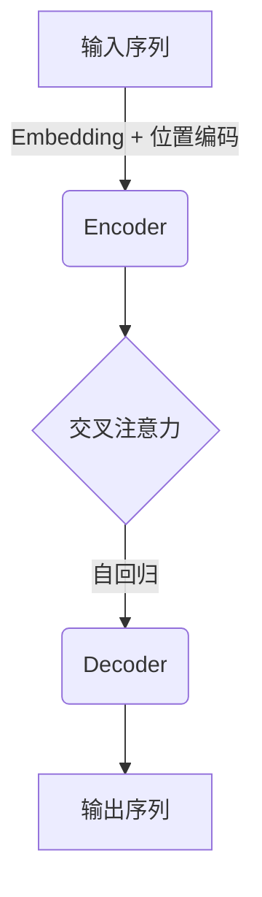

# 大语言模型原理基础与前沿 新时代的曙光

## 1. 背景介绍

### 1.1 人工智能的演进

人工智能(Artificial Intelligence, AI)是当代科技发展的核心驱动力之一,它旨在赋予机器智能,使其能够模仿人类的认知能力,如学习、推理、规划和创造等。自20世纪50年代诞生以来,人工智能经历了几个重要的发展阶段。

#### 1.1.1 早期阶段

早期的人工智能系统主要基于符号主义和逻辑推理,如专家系统和规则引擎。这些系统通过编码人类知识和规则,模拟人类的推理过程。然而,这种方法存在局限性,难以处理复杂的现实世界问题。

#### 1.1.2 机器学习时代

20世纪80年代,机器学习(Machine Learning, ML)的兴起标志着人工智能进入了新的阶段。机器学习系统能够从数据中自动学习模式和规律,而无需显式编程。这种数据驱动的方法极大扩展了人工智能的应用范围,催生了诸如计算机视觉、自然语言处理等领域的重大进展。

#### 1.1.3 深度学习革命

21世纪初,深度学习(Deep Learning)的出现彻底改变了人工智能的发展轨迹。深度神经网络能够自主学习数据的多层次抽象特征,在语音识别、图像分类等任务上展现出超人的能力。大量突破性的深度学习模型相继问世,如卷积神经网络(CNN)、循环神经网络(RNN)、长短期记忆网络(LSTM)等。

### 1.2 大语言模型的崛起

在深度学习的推动下,自然语言处理(Natural Language Processing, NLP)取得了长足进步。特别是近年来,大型神经网络语言模型凭借其强大的语言理解和生成能力,成为人工智能领域的新星。

#### 1.2.1 大语言模型的概念

大语言模型(Large Language Model, LLM)是一种基于深度学习的巨型神经网络,通过在海量文本数据上进行预训练,获得对自然语言的深刻理解能力。这些模型能够捕捉语言的语义和逻辑关系,并生成流畅、连贯的文本输出。

#### 1.2.2 代表性模型

近年来,一系列大语言模型相继问世,引起了广泛关注:

- GPT(Generative Pre-trained Transformer):OpenAI于2018年推出的首个大型生成式预训练转换器模型,展现了强大的语言生成能力。
- BERT(Bidirectional Encoder Representations from Transformers):2018年由谷歌推出的双向编码器表示,在自然语言理解任务上取得了突破性进展。
- GPT-3:OpenAI于2020年发布的超大型语言模型,包含1750亿个参数,在各种自然语言任务上表现出色。
- PanGu-α:2021年,由中国语言智能技术平台发布的首个百亿参数预训练语言模型。
- InstructGPT: 2022年,OpenAI推出的指令遵循型语言模型,可根据自然语言指令完成各种任务。

这些大语言模型的出现,标志着人工智能进入了一个新的里程碑式时代。它们不仅极大推进了自然语言处理技术的发展,也为人工智能的通用智能奠定了基础。

### 1.3 大语言模型的影响

大语言模型的崛起正在从根本上改变人机交互的方式,为各行业带来了前所未有的机遇和挑战:

- 自动问答和对话系统:大语言模型能够与人类进行自然、流畅的对话交互,实现智能问答和任务辅助。
- 自动创作和内容生成:模型可以自动生成高质量的文本内容,如新闻、小说、诗歌、代码等,大大提高了创作效率。
- 机器翻译和多语种处理:模型具备跨语言理解和生成能力,有望实现高质量的机器翻译。
- 知识提取和推理:从大量文本中提取结构化知识,支持复杂推理和决策。
- 教育和个性化学习:根据学习者的水平和需求,生成个性化的教学内容和练习。

然而,大语言模型也面临着一些挑战和风险,如隐私和安全问题、偏见传播、能源消耗等,需要相关领域的专家共同努力加以解决。

总的来说,大语言模型正在开启人工智能的新纪元,它们将极大推动科技创新,重塑人类的生产生活方式。我们有理由相信,通过持续的研究和发展,大语言模型将为人类社会带来更加广阔的想象空间。

## 2. 核心概念与联系

### 2.1 自然语言处理基础

#### 2.1.1 语言的表示

为了使计算机能够理解和处理自然语言,需要将语言转换为机器可识别的数值表示形式。常见的语言表示方法包括:

- One-hot编码:将每个单词映射为一个高维稀疏向量,向量中只有一个位置为1,其余全为0。
- 词嵌入(Word Embedding):通过神经网络模型将单词映射到低维稠密的语义空间,相似的单词在该空间中彼此靠近。
- 子词嵌入(Subword Embedding):将单词分解为字符级别的子词元素,学习子词的语义表示,可以处理未见单词。

#### 2.1.2 语言模型

语言模型是自然语言处理的核心技术之一,旨在捕捉语言的统计规律,计算一个句子或词序列的概率。常见的语言模型包括:

- N-gram语言模型:基于统计方法,利用前N-1个词来预测第N个词的概率。
- 神经网络语言模型:使用神经网络从数据中学习语言的潜在特征和规律,对词序列进行概率建模。
- 自回归语言模型:一种特殊的神经网络语言模型,每次预测下一个词时,都会利用之前预测的词作为上下文信息。

#### 2.1.3 注意力机制

注意力机制(Attention Mechanism)是深度学习领域的一种关键技术,它允许模型在处理序列数据时,动态地关注并捕获不同位置上元素之间的长程依赖关系。这一机制在自然语言处理任务中发挥着重要作用,如机器翻译、阅读理解等。

### 2.2 变革性的Transformer架构

2017年,谷歌大脑团队提出了Transformer模型,这是一种全新的基于注意力机制的序列到序列(Seq2Seq)架构,彻底改变了神经网络语言模型的设计范式。

#### 2.2.1 Transformer的核心思想

Transformer完全抛弃了传统的循环神经网络(RNN)和卷积神经网络(CNN)结构,而是完全依赖注意力机制来捕获输入和输出序列之间的长程依赖关系。它的主要创新点包括:

- 多头自注意力机制(Multi-Head Attention):通过并行计算多个注意力表示,捕获不同的语义关联。
- 位置编码(Positional Encoding):将位置信息直接编码到输入序列中,使模型能够学习词序的重要性。

#### 2.2.2 Transformer的优势

与传统序列模型相比,Transformer架构具有以下显著优势:

- 并行计算能力:不再依赖序列操作,可以高效利用现代硬件(GPU/TPU)的并行计算能力。
- 长期依赖建模:注意力机制使模型能够直接捕获任意距离的长程依赖关系。
- 灵活的输入长度:可以处理任意长度的输入序列,不受传统RNN的梯度消失/爆炸问题困扰。

Transformer的出现为后续大语言模型的发展奠定了坚实的基础。

### 2.3 大语言模型的核心架构

现代大语言模型通常采用基于Transformer的编码器-解码器(Encoder-Decoder)架构,并引入了一些关键创新,使其能够在海量数据上进行高效的预训练。

#### 2.3.1 编码器(Encoder)

编码器的主要作用是捕获输入序列的语义表示。它由多个相同的编码器层组成,每一层包含以下关键组件:

1. 多头自注意力子层:捕获输入序列中不同位置词元素之间的依赖关系。
2. 前馈神经网络子层:对注意力输出进行非线性变换,提取更高层次的特征表示。
3. 残差连接和层归一化:确保梯度在深层网络中的有效传播,提高模型的稳定性和收敛速度。

#### 2.3.2 解码器(Decoder)

解码器的任务是根据编码器的输出,自回归地生成目标序列。每个解码器层包含以下核心组件:

1. 掩码自注意力子层:只允许关注当前位置及之前的输出元素,确保生成的是有意义的序列。
2. 交叉注意力子层:将解码器的输出与编码器的输出进行注意力计算,捕获输入和输出之间的依赖关系。
3. 前馈神经网络子层:提取更高层次的特征表示。
4. 残差连接和层归一化:确保梯度稳定传播。

通过编码器捕获输入语义,解码器根据输入生成目标输出,编码器-解码器架构使大语言模型能够在各种序列到序列的任务上发挥强大的能力。

### 2.4 大语言模型的预训练范式

#### 2.4.1 预训练与微调

大语言模型通常采用"预训练+微调"的范式进行训练:

1. **预训练(Pre-training)**: 在大规模无监督文本数据上训练模型,使其学习通用的语言知识和表示能力。
2. **微调(Fine-tuning)**: 在特定的下游任务数据上,对预训练模型进行进一步的监督微调,使其适应具体的任务需求。

这种范式的优势在于,通过预训练学习通用语言表示,可以大幅减少下游任务所需的标注数据量,提高模型的泛化能力。

#### 2.4.2 预训练目标

不同的大语言模型采用了不同的预训练目标,常见的预训练目标包括:

- **掩码语言模型(Masked Language Modeling, MLM)**: 随机掩码输入序列中的部分词元素,模型需要预测被掩码的词。
- **下一句预测(Next Sentence Prediction, NSP)**: 判断两个句子是否为连续的句子对。
- **因果语言模型(Causal Language Modeling, CLM)**: 基于前文上下文,预测下一个词元素。
- **序列到序列预训练(Sequence-to-Sequence Pre-training)**: 学习将输入序列映射到目标序列的能力。

不同的预训练目标能够捕获语言的不同方面的知识,组合使用可以进一步提升模型的表现。

### 2.5 大语言模型的规模化趋势

#### 2.5.1 参数规模的重要性

大语言模型的性能与其参数规模密切相关。更大的模型通常能够捕获更丰富的语言知识,在各种下游任务上表现更加出色。著名的GPT-3模型拥有惊人的1750亿个参数,展现了大规模语言模型的强大潜力。

然而,模型规模的扩大也带来了诸多挑战,如计算资源消耗、内存需求、训练时间等,需要相应的算力和优化技术予以支持。

#### 2.5.2 模型压缩与高效推理

为了在资源受限的环境(如移动设备、边缘计算等)中部署大语言模型,需要采用模型压缩和高效推理等优化技术:

- 量化(Quantization):将模型参数从32位或16位浮点数压缩到8位或更低的定点数表示。
- 知识蒸馏(Knowledge Distillation):使用一个小型的"学生"模型来近似模拟一个大型的"教师"模型的行为。
- 稀疏化(Sparsity):通过剪枝和稀疏训练,减少模型中的