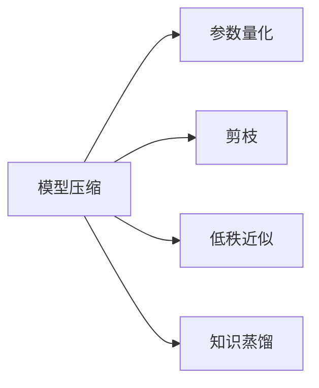
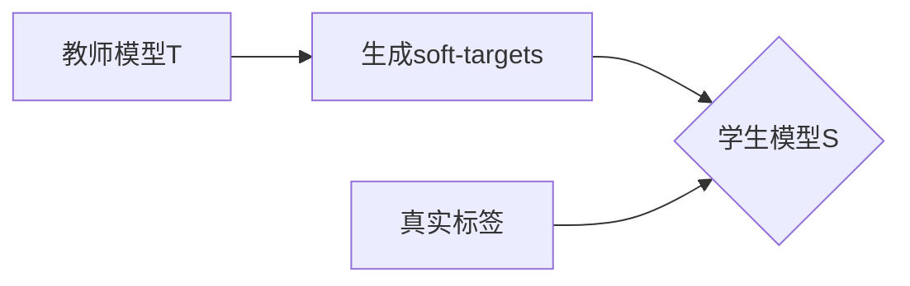
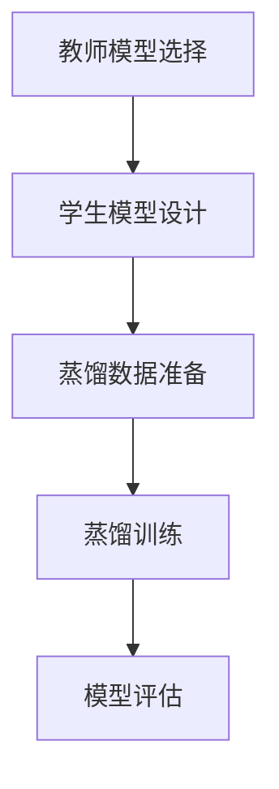
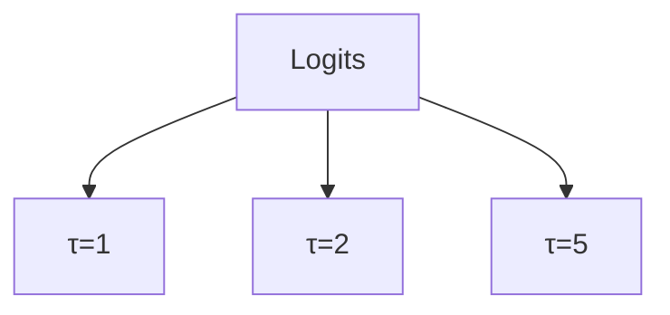

# 大语言模型原理基础与前沿 蒸馏

## 1. 背景介绍

### 1.1 大语言模型概述
大语言模型(Large Language Models, LLMs)是近年来自然语言处理(NLP)领域最重要的突破之一。它们是在海量文本数据上训练的神经网络模型,具有数十亿甚至上万亿参数,能够学习语言的深层次语义表示,在机器翻译、问答系统、文本摘要等任务上取得了显著的性能提升。代表性的大语言模型包括GPT系列、BERT、XLNet等。

### 1.2 大语言模型面临的挑战
尽管大语言模型取得了巨大成功,但它们仍然面临一些挑战:
1. **计算和存储资源需求大**。动辄上百亿参数的模型需要大量的算力和内存支持,给部署应用带来困难。
2. **推理速度慢**。模型体积庞大导致推理时间长,难以满足实时响应的需求。
3. **可解释性差**。大模型内部的工作机制仍是一个黑盒,缺乏可解释性。
4. **训练成本高**。从零开始训练大模型需要大量的数据和算力,成本高昂。

### 1.3 知识蒸馏的作用
知识蒸馏(Knowledge Distillation)是一种将大模型的知识"蒸馏"到小模型中的技术,可以在保持模型性能的同时,大幅降低模型体积和推理时间,从而缓解大语言模型面临的挑战。本文将详细介绍大语言模型知识蒸馏的基本原理、前沿进展以及实践案例。

## 2. 核心概念与联系

### 2.1 知识蒸馏的定义
知识蒸馏源于Hinton等人2015年的工作[1],核心思想是用一个体积小、结构简单的学生模型(Student Model)去学习体积大、结构复杂的教师模型(Teacher Model),从而获得与教师模型相近的性能。学生模型在训练过程中,不仅学习如何拟合真实标签(Hard Label),还学习如何模仿教师模型softmax层输出的soft-targets分布(Soft Label)。Soft Label蕴含了更多的信息,有助于学生模型学到更加鲁棒和有判别力的特征表示。

### 2.2 蒸馏过程的形式化描述
设教师模型为 $T$,学生模型为 $S$,训练样本为 $(x,y)$,其中 $x$ 为输入,真实标签 $y \in \{1,2,...,K\}$ 为 $K$ 维one-hot向量。教师模型和学生模型在 $x$ 上的输出logits分别为 $t$ 和 $s$,对应的softmax概率输出为 $p^T$ 和 $p^S$:

$$
p^T = \text{softmax}(t/\tau) \\
p^S = \text{softmax}(s/\tau)
$$

其中 $\tau$ 为温度参数,用于控制概率分布的平滑度。蒸馏的目标是最小化学生模型在训练集 $D$ 上的如下损失函数:

$$
\mathcal{L} = \sum_{(x,y)\in D} \mathcal{L}_\text{KD}(p^S, p^T) + \lambda \mathcal{L}_\text{CE}(y, p^S)
$$

其中 $\mathcal{L}_\text{KD}$ 是学生模型与教师模型输出分布的KL散度,用于度量两个分布的差异:

$$
\mathcal{L}_\text{KD}(p^S, p^T) = \tau^2 \sum_i p_i^T \log \frac{p_i^T}{p_i^S}
$$

$\mathcal{L}_\text{CE}$ 是学生模型与真实标签的交叉熵损失:

$$
\mathcal{L}_\text{CE}(y, p^S) = -\sum_i y_i \log p_i^S
$$

$\lambda$ 为平衡两个损失项的权重系数。

### 2.3 知识蒸馏与模型压缩的关系
知识蒸馏是模型压缩(Model Compression)的一种重要方法。模型压缩旨在降低深度学习模型的存储和计算开销,主要技术路线包括:
1. 参数量化(Quantization):将模型参数从32位浮点型量化为8位整型等。
2. 剪枝(Pruning):将冗余和不重要的神经元或连接剪除。 
3. 低秩近似(Low-rank Approximation):用若干个低秩矩阵的乘积去近似大的参数矩阵。
4. 知识蒸馏(Knowledge Distillation):用小模型去学习大模型的知识。

其中知识蒸馏通过"软目标"的知识迁移,不仅可以压缩模型体积,还能提升小模型的性能,因而备受关注。下图展示了知识蒸馏在模型压缩中的定位:

## 3. 核心算法原理与操作步骤

### 3.1 经典的蒸馏算法

#### 3.1.1 软目标蒸馏(Soft-targets Distillation)
软目标蒸馏由Hinton等人最早提出[1],通过让学生模型去匹配教师模型softmax输出层的概率分布来进行知识迁移。具体步骤如下:
1. 首先在大规模数据集上训练一个复杂的教师模型 $T$。
2. 利用教师模型 $T$ 对训练集 $D$ 做推理,得到soft-targets $p^T$。
3. 固定教师模型参数,训练学生模型 $S$ 去匹配soft-targets $p^T$,损失函数为KL散度 $\mathcal{L}_\text{KD}$。
4. 联合soft-targets和真实标签,对学生模型进行蒸馏训练,总的损失函数为:$\mathcal{L} = \mathcal{L}_\text{KD}(p^S, p^T) + \lambda \mathcal{L}_\text{CE}(y, p^S)$。

软目标蒸馏示意图:

#### 3.1.2 响应蒸馏(Response-based Distillation)
响应蒸馏不仅利用教师模型的输出,还利用其中间层的响应信息来指导学生模型。具体步骤为:
1. 选取教师模型 $T$ 的若干中间层 $\{l_1,l_2,...,l_n\}$,提取其响应(激活值)。
2. 学生模型 $S$ 中设置与 $T$ 对应的中间层 $\{l'_1,l'_2,...,l'_n\}$。
3. 最小化 $T$ 和 $S$ 对应层响应的均方误差(MSE),同时优化 $S$ 在训练集上的分类损失。

令 $f_i^T$ 和 $f_i^S$ 分别表示教师和学生在第 $i$ 层的响应,响应蒸馏的损失为:

$$
\mathcal{L}_\text{RD} = \sum_{i=1}^n \| f_i^T - f_i^S \|_2^2
$$

总的优化目标为:

$$
\mathcal{L} = \mathcal{L}_\text{RD} + \beta \mathcal{L}_\text{CE}
$$

其中 $\beta$ 为平衡系数。相比软目标蒸馏,响应蒸馏利用了教师模型更加丰富的中间层信息,有助于学生模型学到更加鲁棒的特征。

### 3.2 基于蒸馏的模型压缩流程

将知识蒸馏应用于模型压缩,一般包括如下几个步骤:
1. **教师模型选择**。选择一个在大规模数据集上预训练的大模型作为教师模型,如BERT-Large、GPT等。
2. **学生模型设计**。设计一个体积小、结构简单的学生模型,如BERT-Small、TinyBERT等。
3. **蒸馏数据准备**。利用教师模型对无标签数据做推理,生成soft-targets作为蒸馏训练的目标。
4. **蒸馏训练**。利用蒸馏损失函数(如KL散度、MSE等)对学生模型进行训练,同时对真实标签进行监督。
5. **模型评估**。在下游任务上评估学生模型的性能,权衡压缩比和精度的trade-off。

下图展示了基于蒸馏的模型压缩流程:

## 4. 数学模型和公式详解

### 4.1 KL散度的直觉理解
KL散度(Kullback–Leibler Divergence)常用于衡量两个概率分布之间的差异。设 $P$ 和 $Q$ 是定义在同一个概率空间 $\mathcal{X}$ 上的两个概率分布,二者的KL散度定义为:

$$
D_\text{KL}(P \| Q) = \sum_{x \in \mathcal{X}} P(x) \log \frac{P(x)}{Q(x)}
$$

可以理解为,当真实分布为 $P$ 时,使用分布 $Q$ 进行编码的平均额外信息量(编码长度)。KL散度具有非负性和不对称性:
- 非负性:$D_\text{KL}(P \| Q) \geq 0$,当且仅当 $P=Q$ 时取等号。
- 不对称性:一般有 $D_\text{KL}(P \| Q) \neq D_\text{KL}(Q \| P)$。

在知识蒸馏中,将教师模型softmax输出 $p^T$ 看作真实分布,学生模型输出 $p^S$ 看作拟合分布,通过最小化二者的KL散度,使学生模型输出尽可能逼近教师模型输出。

### 4.2 软目标蒸馏的温度参数
温度(Temperature)参数 $\tau$ 用于控制softmax函数的平滑程度。令 $z_i$ 表示第 $i$ 类的logits,标准的softmax函数为:

$$
p_i = \frac{\exp(z_i)}{\sum_j \exp(z_j)}
$$

加入温度参数后,变为:

$$
p_i = \frac{\exp(z_i/\tau)}{\sum_j \exp(z_j/\tau)}
$$

当 $\tau>1$ 时,softmax概率分布会变得更加平滑,高置信度的类别概率会降低,低置信度的类别概率会升高。这有助于揭示类别之间的相对关系,为学生模型提供更多的信息。在蒸馏训练时,通常取 $\tau=3,4,5$ 等。

下图展示了不同温度下的softmax概率分布:

### 4.3 响应蒸馏的层选择
响应蒸馏需要在教师和学生模型中选取对应的中间层。一般遵循以下原则:
1. 教师和学生模型结构相似时,选择同名或语义对应的层,如BERT的12层Transformer Block。
2. 教师和学生模型结构差异大时,可选择特征图尺度接近的层,如ResNet的不同Stage输出。
3. 选择信息丰富、语义级别适中的层,避免过于底层(如词嵌入层)或过于高层(如最后的FC层)。
4. 尝试不同的层组合,对比蒸馏效果,选择最优的方案。

实践中,响应蒸馏常与软目标蒸馏联合使用,以期获得更好的蒸馏性能。

## 5. 项目实践:基于BERT的模型蒸馏

### 5.1 实验设置
- 教师模型:BERT-Base, 12层Transformer Block, Hidden Size为768。
- 学生模型:BERT-Tiny, 4层Transformer Block, Hidden Size为312。
- 数据集:英文Wikipedia, BookCorpus等, 总token数约3.3B。
- 蒸馏配置:
    - 软目标蒸馏:温度 $\tau=5$, 蒸馏loss权重 $\lambda=0.5$。