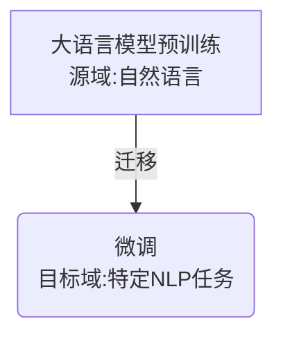
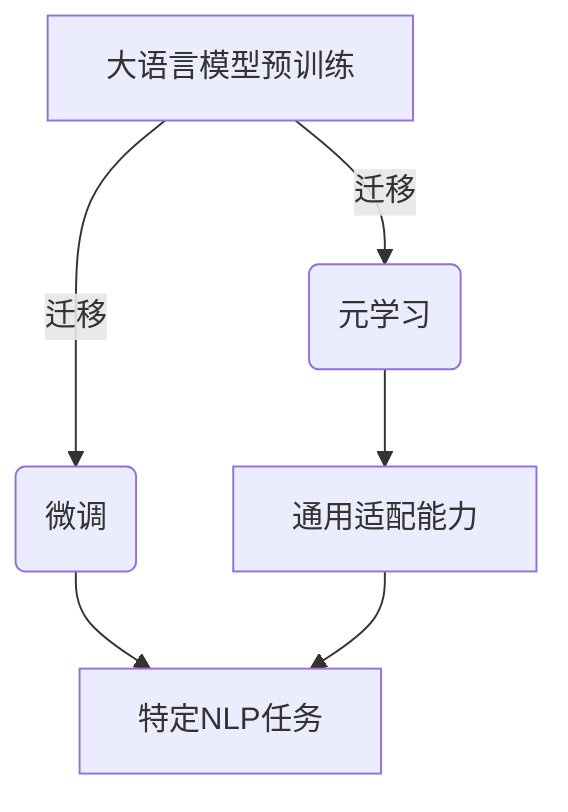

# 大语言模型原理基础与前沿 轻量级微调

## 1.背景介绍

### 1.1 大语言模型的兴起

近年来,大型语言模型(Large Language Models, LLMs)在自然语言处理(NLP)领域掀起了一场革命。这些模型通过在大规模语料库上进行预训练,学习了丰富的语言知识和上下文信息,展现出令人惊叹的语言理解和生成能力。

代表性的大语言模型包括:

- GPT系列(GPT、GPT-2、GPT-3)
- BERT及其变体(RoBERTa、ALBERT等)
- T5
- PaLM
- Jurassic-1等

这些模型在广泛的NLP任务中表现出色,如机器翻译、问答系统、文本摘要、语义分析等,推动了人工智能在语言领域的飞速发展。

### 1.2 大模型的挑战

尽管大语言模型取得了巨大成功,但也面临着一些挑战:

- **计算资源消耗巨大**: 大模型通常包含数十亿甚至上百亿参数,训练和推理过程需要大量计算资源,导致高昂的成本和碳排放。
- **数据隐私和安全性**: 预训练语料可能包含敏感信息,存在潜在的隐私和安全风险。
- **偏见和不当内容**: 大模型可能会从训练数据中学习到社会偏见和不当内容,产生有害的输出。
- **可解释性和可控性**: 大模型通常被视为"黑箱",其内部机理和决策过程缺乏透明度,难以解释和控制。

### 1.3 轻量级微调的重要性

为了应对上述挑战,研究人员提出了"轻量级微调"(Lightweight Fine-tuning)的概念,旨在通过少量数据和少量计算资源,对大语言模型进行有针对性的调整和优化,从而满足特定任务和场景的需求。

轻量级微调技术具有以下优势:

- **高效和经济**: 相比完全重新训练,微调只需少量计算资源,大幅降低了成本。
- **隐私和安全**: 无需访问原始预训练数据,避免了潜在的隐私和安全风险。
- **可解释性和可控性**: 微调过程更加透明,有助于理解模型行为和决策过程。
- **灵活性**: 可以针对不同任务和场景进行定制化微调,提高模型的适用性和性能。

本文将深入探讨大语言模型轻量级微调的原理、方法和前沿进展,为读者提供全面的理解和实践指导。

## 2.核心概念与联系

### 2.1 迁移学习与微调

微调(Fine-tuning)是迁移学习(Transfer Learning)在NLP领域的一种常见实现方式。迁移学习旨在利用在源域(source domain)学习到的知识,帮助目标域(target domain)的任务学习。

在NLP中,我们可以将大语言模型的预训练过程视为在"自然语言"这一广阔的源域进行知识学习。而微调则是将这些知识迁移并适配到特定的NLP任务(如文本分类、机器翻译等),即目标域。



微调的优点在于,它可以在保留大语言模型中宝贵的语言知识的同时,通过少量数据和计算资源,快速适配到新的任务,实现知识迁移。

### 2.2 微调策略

微调策略决定了如何利用源模型(大语言模型)和目标任务数据,对模型进行适配和优化。常见的微调策略包括:

1. **全模型微调(Full Model Fine-tuning)**: 在目标任务数据上对整个大语言模型(包括编码器和解码器)进行端到端的微调。这是最直接和常用的方式,但计算开销较大。

2. **编码器微调(Encoder Fine-tuning)**: 只微调大语言模型的编码器部分,解码器保持不变。适用于那些只需要理解输入的任务,如文本分类、序列标注等。

3. **前馈层微调(Prefix-tuning)**: 只微调大语言模型的前馈层(Feed-Forward Layers),保持自注意力层不变。这种方式计算开销较小,但性能可能会受到一定影响。

4. **LoRA(Low-Rank Adaptation)**: 通过在每层之后添加一个低秩矩阵,实现高效的模型适配。LoRA可以显著降低微调过程中的参数数量和计算开销。

5. **Prompt-tuning**: 通过设计任务相关的提示(Prompt),将任务信息注入到大语言模型中,实现无需微调的快速适配。

不同的微调策略在计算开销、性能和灵活性之间存在权衡,需要根据具体任务和场景进行选择。

### 2.3 微调与元学习

除了微调,元学习(Meta-Learning)也是一种有效的大模型适配方法。元学习旨在让模型"学会学习",提高快速适配新任务的能力。

常见的元学习方法包括:

- **MAML(Model-Agnostic Meta-Learning)**: 通过多任务学习,让模型学习如何快速适配新任务。
- **Reptile**: 一种简单而有效的元学习算法,通过在任务间交替更新参数,实现快速适配。
- **ANIL(Almost No Inner Loop)**: 一种计算高效的元学习方法,只在输出层上进行任务适配。

元学习和微调可以结合使用,提高大模型的通用适配能力和特定任务性能。



## 3.核心算法原理具体操作步骤

### 3.1 微调算法流程

大语言模型轻量级微调的核心算法流程如下:

1. **准备数据**: 收集并准备目标任务的训练数据集。

2. **加载预训练模型**: 加载大语言模型的预训练权重,作为微调的初始化参数。

3. **构建微调模型**: 根据选择的微调策略(如全模型微调、编码器微调等),构建适当的微调模型架构。

4. **定义损失函数**: 根据任务类型(如分类、生成等),定义合适的损失函数,用于优化模型参数。

5. **微调训练**: 在目标任务数据上,使用优化算法(如Adam)对微调模型进行训练,最小化损失函数。

6. **模型评估**: 在验证集或测试集上评估微调后模型的性能。

7. **模型部署**: 将微调好的模型部署到实际应用系统中,用于推理和预测。

以上流程可以根据具体需求进行调整和优化,例如添加正则化、学习率调度等技术,以提高模型性能和泛化能力。

### 3.2 示例:文本分类任务微调

以文本分类任务为例,具体的微调步骤如下:

1. **准备数据**:
   - 收集文本分类数据集,如新闻分类、情感分析等。
   - 对数据进行预处理,如分词、标记化等。

2. **加载预训练模型**:
   - 加载BERT等预训练语言模型的权重。

3. **构建微调模型**:
   - 使用BERT作为编码器,在顶部添加一个分类头(Classification Head)。
   - 分类头通常是一个线性层,将BERT的输出映射到类别空间。

4. **定义损失函数**:
   - 使用交叉熵损失函数(Cross-Entropy Loss)作为分类任务的损失函数。

5. **微调训练**:
   - 在文本分类数据集上,使用Adam优化算法对模型进行端到端微调训练。
   - 可以使用学习率warmup、正则化等技术提高性能。

6. **模型评估**:
   - 在测试集上评估微调后模型的分类准确率等指标。

7. **模型部署**:
   - 将微调好的模型部署到实际的文本分类系统中,用于在线预测和推理。

通过上述步骤,我们可以快速将大语言模型(如BERT)适配到文本分类任务,实现高效的知识迁移和模型优化。

## 4.数学模型和公式详细讲解举例说明

### 4.1 自注意力机制(Self-Attention)

自注意力机制是大语言模型(如Transformer)的核心组件之一,它允许模型捕捉输入序列中任意两个位置之间的依赖关系。

给定一个输入序列 $X = (x_1, x_2, \dots, x_n)$,自注意力机制的计算过程如下:

1. **Query、Key和Value映射**:
   $$
   Q = XW^Q \\
   K = XW^K \\
   V = XW^V
   $$
   其中 $W^Q, W^K, W^V$ 分别是可学习的查询(Query)、键(Key)和值(Value)的线性映射矩阵。

2. **计算注意力分数**:
   $$
   \text{Attention}(Q, K, V) = \text{softmax}\left(\frac{QK^T}{\sqrt{d_k}}\right)V
   $$
   其中 $d_k$ 是缩放因子,用于防止内积值过大导致梯度饱和。

3. **多头注意力(Multi-Head Attention)**:
   为了捕捉不同的子空间信息,Transformer采用了多头注意力机制:
   $$
   \text{MultiHead}(Q, K, V) = \text{Concat}(head_1, \dots, head_h)W^O
   $$
   其中 $head_i = \text{Attention}(QW_i^Q, KW_i^K, VW_i^V)$,表示第 $i$ 个注意力头的计算结果。$W_i^Q, W_i^K, W_i^V$ 是对应的线性映射矩阵,而 $W^O$ 是最终的输出线性映射。

自注意力机制通过计算输入序列中每个位置与其他位置的相关性,捕捉全局依赖关系,是大语言模型实现强大语言理解能力的关键。

### 4.2 交叉熵损失函数(Cross-Entropy Loss)

交叉熵损失函数广泛用于分类任务中,它衡量了模型预测概率分布与真实标签分布之间的差异。

对于一个样本 $(x, y)$,其中 $x$ 是输入,而 $y$ 是真实标签,设模型输出的预测概率分布为 $p(x)$,则交叉熵损失函数定义为:

$$
L(x, y) = -\sum_{i=1}^{C} y_i \log p_i(x)
$$

其中 $C$ 是类别数,而 $y_i$ 是真实标签的一热编码表示,取值为 0 或 1。$p_i(x)$ 是模型预测的第 $i$ 类概率。

在实践中,我们通常会对一个批次的样本计算平均损失,并使用优化算法(如Adam)最小化该损失函数,从而训练模型参数。

交叉熵损失函数具有以下优点:

- 它直接衡量了模型预测概率分布与真实标签分布之间的差异,与分类任务的目标高度相关。
- 它是一个凸函数,便于优化和求解。
- 它对于置信度较高的错误预测给予更大的惩罚,从而鼓励模型输出更加确定的预测。

因此,交叉熵损失函数被广泛应用于大语言模型的微调过程中,用于优化模型在各种分类任务上的性能。

## 5.项目实践:代码实例和详细解释说明

在本节中,我们将通过一个实际的代码示例,演示如何使用 Hugging Face 的 Transformers 库对 BERT 模型进行轻量级微调,以完成文本分类任务。

### 5.1 准备数据

首先,我们需要准备文本分类数据集。这里我们使用经典的 IMDB 电影评论数据集,其中包含了 25,000 条正面和负面的电影评论。

```python
from datasets import load_dataset

dataset = load_dataset("imdb")
```

### 5.2 数据预处理

接下来,我们需要对数据进行预处理,包括标记化(tokenization)和数据格式化。

```python
from transformers import AutoTokenizer

tokenizer = AutoToken