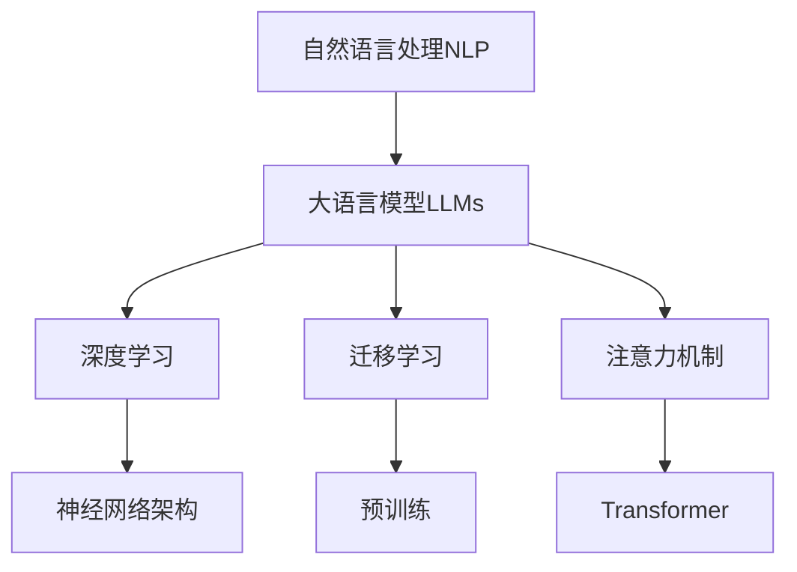
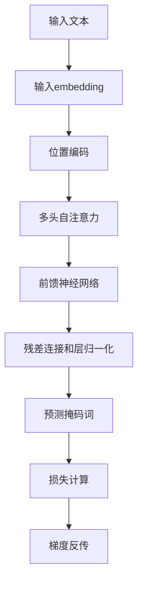

# 大语言模型原理基础与前沿 针对不同预训练领域的不同专家

## 1. 背景介绍

### 1.1 大语言模型的兴起

近年来,大型语言模型(Large Language Models, LLMs)在自然语言处理(NLP)领域取得了令人瞩目的进展,成为了人工智能(AI)研究的一个重要方向。这些模型通过在海量文本数据上进行预训练,学习到了丰富的语言知识和上下文信息,展现出了惊人的语言生成和理解能力。

### 1.2 预训练的重要性

预训练是大语言模型取得巨大成功的关键。通过在大规模语料库上进行自监督学习,模型可以捕捉到语言的统计规律和语义信息,从而为下游任务提供有力的语言表示和迁移学习能力。不同的预训练数据和任务会影响模型学习到的知识,进而决定了其在特定领域的表现。

### 1.3 不同预训练领域的专家模型

为了满足不同领域的需求,研究人员开发了多种针对性的大语言模型,这些模型在特定领域的语料库上进行了预训练,从而获得了相应领域的专业知识。例如,在医疗、法律、金融等领域都涌现出了专门的大语言模型。这些"专家"模型能够更好地理解和生成特定领域的语言,为相关应用提供强大的支持。

## 2. 核心概念与联系

### 2.1 自然语言处理(NLP)

自然语言处理是人工智能的一个重要分支,旨在使计算机能够理解和生成人类语言。它包括多个任务,如文本分类、机器翻译、问答系统等。大语言模型作为NLP的核心技术,为这些任务提供了强大的语言表示和生成能力。

### 2.2 深度学习

深度学习是大语言模型的技术基础。通过构建深层神经网络,模型可以从海量数据中自动学习特征表示,捕捉复杂的统计模式。transformer等新型网络架构的出现,进一步提高了模型的表现力和计算效率。

### 2.3 迁移学习

迁移学习是大语言模型的核心思想之一。预训练模型在大规模语料库上学习到的知识可以迁移到下游任务,极大地减少了数据需求和训练时间,提高了模型的泛化能力。

### 2.4 注意力机制

注意力机制是transformer等新型网络架构的关键创新,它允许模型动态地关注输入序列的不同部分,捕捉长距离依赖关系。这种机制大大提高了模型处理长序列的能力,是大语言模型取得巨大成功的重要原因之一。



## 3. 核心算法原理具体操作步骤

大语言模型的核心算法是基于transformer的自注意力机制和掩码语言模型(Masked Language Model, MLM)预训练方法。下面将详细介绍其原理和操作步骤:

### 3.1 Transformer架构

1) 输入embedding:将输入文本转换为向量表示
2) 位置编码:为每个词位置添加位置信息
3) 多头自注意力:捕捉序列内不同位置之间的依赖关系
4) 前馈神经网络:对注意力输出进行非线性映射
5) 残差连接和层归一化:保证梯度传播稳定

### 3.2 掩码语言模型预训练

1) 随机掩码:在输入序列中随机选择部分词,用特殊标记[MASK]替换
2) 前向传播:将带有掩码的序列输入transformer模型
3) 预测掩码词:模型根据上下文预测被掩码词的标签
4) 损失计算:将预测值与真实标签计算交叉熵损失
5) 梯度反传:根据损失对模型参数进行优化

通过上述无监督预训练,模型可以学习到丰富的语言知识,为下游任务做好准备。



## 4. 数学模型和公式详细讲解举例说明

### 4.1 自注意力机制

自注意力机制是transformer的核心,它允许模型捕捉输入序列中任意两个位置之间的依赖关系。给定查询向量$\boldsymbol{q}$、键向量$\boldsymbol{K}$和值向量$\boldsymbol{V}$,注意力输出可以表示为:

$$\mathrm{Attention}(\boldsymbol{Q}, \boldsymbol{K}, \boldsymbol{V}) = \mathrm{softmax}\left(\frac{\boldsymbol{Q}\boldsymbol{K}^\top}{\sqrt{d_k}}\right)\boldsymbol{V}$$

其中$d_k$是缩放因子,用于防止点积过大导致梯度饱和。多头注意力机制可以从不同的子空间捕捉不同的依赖关系,进一步提高模型表现力:

$$\mathrm{MultiHead}(\boldsymbol{Q}, \boldsymbol{K}, \boldsymbol{V}) = \mathrm{Concat}(\mathrm{head}_1, \ldots, \mathrm{head}_h)\boldsymbol{W}^O$$
$$\mathrm{head}_i = \mathrm{Attention}(\boldsymbol{Q}\boldsymbol{W}_i^Q, \boldsymbol{K}\boldsymbol{W}_i^K, \boldsymbol{V}\boldsymbol{W}_i^V)$$

其中$\boldsymbol{W}_i^Q$、$\boldsymbol{W}_i^K$、$\boldsymbol{W}_i^V$和$\boldsymbol{W}^O$是可学习的线性映射。

### 4.2 掩码语言模型目标函数

掩码语言模型的目标是最大化被掩码词的条件概率,即:

$$\mathcal{L}_{\mathrm{MLM}} = -\mathbb{E}_{(\boldsymbol{x}, \mathcal{M})\sim D}\left[\sum_{i\in\mathcal{M}}\log P(x_i|\boldsymbol{x}_{\backslash\mathcal{M}})\right]$$

其中$D$是语料库的数据分布,$\boldsymbol{x}$是输入序列,$\mathcal{M}$是被掩码词的位置集合,$\boldsymbol{x}_{\backslash\mathcal{M}}$表示除去被掩码词的剩余序列。

通过最小化上述损失函数,模型可以学习到捕捉序列上下文信息的能力,从而更好地预测被掩码词。

### 4.3 示例:BERT模型

BERT(Bidirectional Encoder Representations from Transformers)是一种广为人知的大语言模型,它采用了双向transformer编码器和掩码语言模型预训练策略。在预训练过程中,BERT不仅需要预测被掩码的词,还需要预测两个句子是否相关(下一句预测任务)。这种策略使得BERT能够同时学习到词级别和句级别的语义表示,展现出了卓越的性能。

## 5. 项目实践:代码实例和详细解释说明

以下是使用PyTorch实现的一个简化版BERT模型,用于掩码语言模型预训练。为了便于说明,我们将忽略一些细节,如位置编码、层归一化等。

```python
import torch
import torch.nn as nn

# 定义BERT模型
class BERT(nn.Module):
    def __init__(self, vocab_size, hidden_size, num_layers, num_heads, dropout):
        super().__init__()
        self.embeddings = nn.Embedding(vocab_size, hidden_size)
        self.encoder = nn.TransformerEncoder(
            nn.TransformerEncoderLayer(hidden_size, num_heads, hidden_size * 4, dropout),
            num_layers
        )
        self.output = nn.Linear(hidden_size, vocab_size)

    def forward(self, inputs, masks):
        embeddings = self.embeddings(inputs)
        outputs = self.encoder(embeddings, src_key_padding_mask=masks)
        logits = self.output(outputs)
        return logits

# 掩码语言模型预训练
def mlm_train(model, inputs, masks, labels):
    logits = model(inputs, masks)
    loss_fn = nn.CrossEntropyLoss()
    loss = loss_fn(logits.view(-1, logits.size(-1)), labels.view(-1))
    return loss

# 示例用法
vocab_size = 20000
hidden_size = 768
num_layers = 12
num_heads = 12
dropout = 0.1

model = BERT(vocab_size, hidden_size, num_layers, num_heads, dropout)
optimizer = torch.optim.Adam(model.parameters(), lr=1e-4)

inputs = torch.randint(vocab_size, (2, 10))  # 批量大小为2,序列长度为10
masks = torch.randint(2, (2, 10)).bool()  # 掩码位置
labels = torch.randint(vocab_size, (2, 10))  # 目标标签

for epoch in range(10):
    optimizer.zero_grad()
    loss = mlm_train(model, inputs, masks, labels)
    loss.backward()
    optimizer.step()
    print(f"Epoch {epoch+1}, Loss: {loss.item()}")
```

上述代码定义了一个简化版BERT模型,包括词嵌入层、transformer编码器层和输出层。在`mlm_train`函数中,我们将输入序列和掩码位置输入模型,计算被掩码词的预测值与真实标签之间的交叉熵损失,并通过反向传播优化模型参数。

需要注意的是,这只是一个简化示例,实际的BERT模型还包括位置编码、段嵌入、层归一化等模块,并采用了更复杂的预训练策略(如下一句预测任务)。此外,真实的BERT模型通常使用更大的词表和更深的网络结构,以获得更好的性能。

## 6. 实际应用场景

大语言模型在自然语言处理的多个领域都有广泛的应用,下面列举了一些典型的场景:

### 6.1 文本生成

利用大语言模型的强大语言生成能力,可以用于自动写作、对话系统、机器翻译等任务。例如,GPT-3模型可以根据给定的提示生成高质量的文本内容。

### 6.2 文本分类

将大语言模型的输出作为特征,结合分类器(如逻辑回归、支持向量机等),可以实现文本分类任务,如新闻分类、情感分析等。

### 6.3 问答系统

通过在大型知识库上预训练,大语言模型可以获得丰富的知识,从而支持开放域问答等复杂任务。例如,GPT-3在一些问答基准测试中表现出色。

### 6.4 信息抽取

利用大语言模型的语义理解能力,可以从非结构化文本中抽取出关键信息,如命名实体识别、关系抽取等,广泛应用于知识图谱构建、事件抽取等领域。

### 6.5 其他领域

除了上述场景外,大语言模型还可以应用于代码生成、蛋白质结构预测、分子发现等多个前沿领域,展现出了广阔的应用前景。

## 7. 工具和资源推荐

### 7.1 预训练模型

- **BERT**:谷歌开源的双向transformer语言模型,在多个基准测试中表现出色。
- **GPT**:OpenAI开发的单向transformer语言模型系列,包括GPT、GPT-2和GPT-3等。
- **T5**:谷歌开源的统一的transformer模型,可用于多种NLP任务。
- **ALBERT**:谷歌开源的轻量级BERT模型,参数更少但性能相当。
- **XLNet**:CMU&谷歌开源的通用自回归预训练模型。

### 7.2 模型库

- **Hugging Face Transformers**:包含多种预训练模型和用于加载、微调和评估模型的工具。
- **AllenNLP**:一个强大的NLP研究库,支持多种预训练模型和任务。
- **fairseq**:Facebook AI Research开源的序列建模工具库。

### 7.3 数据集

- **Wikipedia**:维基百科是构建通用语言模型的主要语料来源。
- **BookCorpus**:包含大量书籍语料,常用