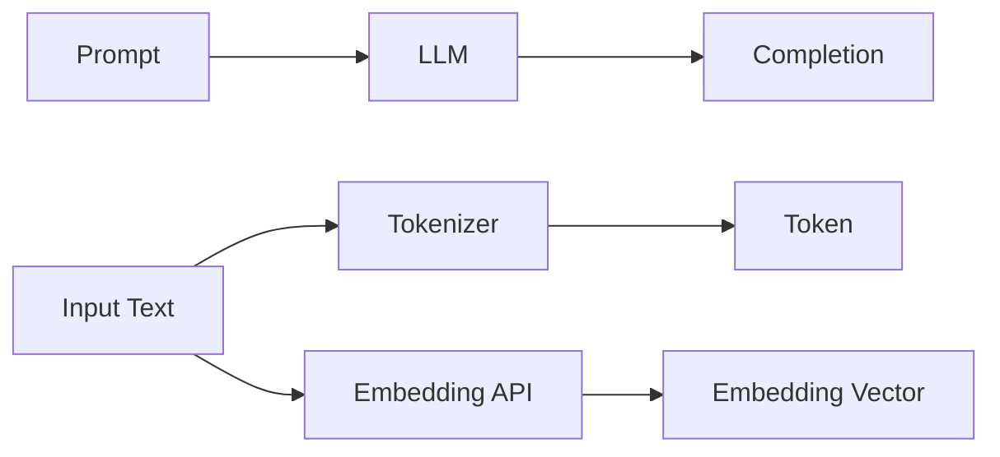

# 大语言模型应用指南：Assistants API整体执行过程

## 1. 背景介绍

### 1.1 大语言模型的发展历程

近年来,自然语言处理(NLP)领域取得了长足的进步,尤其是以Transformer为代表的大语言模型(Large Language Model, LLM)的出现,极大地推动了NLP技术的发展。从GPT、BERT到GPT-3,再到最新的GPT-4、PaLM等模型,LLM在理解和生成自然语言方面展现出了惊人的能力,为构建更加智能化的对话系统和知识服务平台奠定了基础。

### 1.2 Assistants API的应运而生

随着LLM的日益成熟,各大科技公司纷纷推出了基于LLM的Assistants API服务,如OpenAI的ChatGPT API、Anthropic的Claude API、Google的PaLM API等。这些API将LLM的能力进行了封装,使得开发者无需关注底层模型的复杂性,即可方便地调用API来构建各种智能应用,大大降低了开发门槛。

### 1.3 Assistants API的应用场景

Assistants API具有广泛的应用前景,可以应用于客服对话、智能问答、内容创作、代码生成、数据分析等诸多领域。利用Assistants API,开发者可以快速搭建起功能强大的智能助手系统,为用户提供高效、准确、个性化的服务。

## 2. 核心概念与关联

要深入理解Assistants API的工作原理,需要先了解其中涉及的几个核心概念:

### 2.1 Prompt 

Prompt是指输入给LLM的文本序列,用于指导模型生成所需的输出。设计优质的Prompt是有效利用LLM能力的关键。

### 2.2 Completion

Completion是LLM根据输入的Prompt生成的文本输出。Completion的质量很大程度上取决于Prompt的设计。

### 2.3 Token

Token是将文本切分成的最小单元。Assistants API通常会对输入输出的文本进行Tokenize,并根据消耗的Token数量来计费。

### 2.4 Embedding

Embedding是将文本转换为数值向量表示的过程。Assistants API提供了Embedding接口,可以将文本映射到高维语义空间,便于进行语义搜索、文本聚类、文本分类等下游任务。

这些核心概念之间的关系如下图所示:



## 3. 核心算法原理与操作步骤

### 3.1 Transformer 编码器-解码器架构

Assistants API 底层的大语言模型大多基于 Transformer 的编码器-解码器架构。编码器负责将输入文本转换为隐向量表示,解码器则根据隐向量生成输出文本。

Transformer的核心是自注意力机制(Self-Attention),它能够捕捉文本中的长距离依赖关系。具体来说,Self-Attention的计算过程如下:

1. 将输入文本X通过三个线性变换得到Query矩阵Q、Key矩阵K和Value矩阵V。
2. 计算Q与K的点积并除以 $\sqrt{d_k}$ 得到Attention Scores矩阵。
3. 对Attention Scores进行Softmax归一化。
4. 将Softmax后的Scores与V相乘并求和,得到输出矩阵。

多头注意力机制在此基础上引入了多个并行的Attention子层,增强了模型的表达能力。

### 3.2 预训练与微调

大语言模型通常采用预训练+微调的范式。预训练阶段在超大规模语料上以自监督的方式训练模型,使其学会语言的基本规律。微调阶段则在下游任务的标注数据上对模型进行调优,使其适应特定任务。

Assistants API底层的模型大多经过了大规模多任务指令微调(Instruction Tuning),使其能够理解自然语言指令并给出相应输出。

### 3.3 Prompt设计与优化

设计优质的Prompt是充分发挥Assistants API能力的关键。一个好的Prompt应具备以下特点:

1. 明确、具体地描述任务目标,避免歧义。
2. 提供必要的背景知识和上下文信息。
3. 通过少样本示例让模型快速理解任务。
4. 适当引导模型的生成方向,控制输出的风格、语气等。
5. 设置恰当的终止条件,避免生成冗余信息。

优化Prompt是一个需要不断实践和迭代的过程。开发者可以通过实验对比不同的Prompt设计,持续提升模型的效果。

## 4. 数学模型与公式详解

### 4.1 Transformer的数学形式

Transformer的编码器和解码器都由若干个相同的子层堆叠而成,每个子层包含两个部分:Multi-Head Attention和Feed Forward Network。

Multi-Head Attention的数学表达为:

$$
\text{MultiHead}(Q, K, V) = \text{Concat}(\text{head}_1, ..., \text{head}_h)W^O \\
\text{head}_i = \text{Attention}(QW_i^Q, KW_i^K, VW_i^V)
$$

其中$W_i^Q \in \mathbb{R}^{d_{\text{model}} \times d_k}$,$W_i^K \in \mathbb{R}^{d_{\text{model}} \times d_k}$,$W_i^V \in \mathbb{R}^{d_{\text{model}} \times d_v}$,$W^O \in \mathbb{R}^{hd_v \times d_{\text{model}}}$为可学习的参数矩阵。

Feed Forward Network包含两层全连接网络,数学表达为:

$$\text{FFN}(x) = \max(0, xW_1 + b_1)W_2 + b_2$$

其中$W_1 \in \mathbb{R}^{d_{\text{model}} \times d_{\text{ff}}}$,$W_2 \in \mathbb{R}^{d_{\text{ff}} \times d_{\text{model}}}$,$b_1 \in \mathbb{R}^{d_{\text{ff}}}$,$b_2 \in \mathbb{R}^{d_{\text{model}}}$为可学习参数。

### 4.2 自注意力的直观解释

自注意力机制可以看作是一种加权求和的过程。对于输入序列的每个位置,模型会计算该位置与其他所有位置的相关性权重,然后将这些权重与对应位置的表示向量相乘并求和,得到该位置的新表示。

直观地说,自注意力让模型能够在编码每个位置时都参考序列中的所有位置,捕捉到全局的依赖关系。多头注意力则让模型可以从不同的子空间角度来看待这些依赖关系。

### 4.3 Embedding的数学原理

Embedding是将离散变量(如单词)映射为连续向量表示的一种方法。常见的Embedding学习方法包括Word2Vec、GloVe等。

以Word2Vec的Skip-Gram模型为例,其目标是最大化给定中心词 $w_c$ 生成上下文词 $w_o$ 的概率:

$$\arg\max_\theta \prod_{(w_c, w_o) \in D} P(w_o | w_c; \theta)$$

其中$\theta$为模型参数,$D$为语料库中所有的中心词-上下文词对。Skip-Gram采用Softmax将中心词向量$v_c$与上下文词向量$u_o$的内积转化为概率:

$$P(w_o | w_c) = \frac{\exp(u_o^\top v_c)}{\sum_{w=1}^V \exp(u_w^\top v_c)}$$

训练完成后,中心词向量$v_c$即为词$w_c$的Embedding表示。

## 5. 代码实例详解

下面以OpenAI的GPT-3.5 API为例,演示如何使用Python调用Assistants API。

### 5.1 安装openai库

```bash
pip install openai
```

### 5.2 设置API Key

```python
import openai
openai.api_key = "your-api-key"
```

### 5.3 调用Chat Completion接口

```python
def chat_with_gpt3(prompt):
    response = openai.ChatCompletion.create(
        model="gpt-3.5-turbo",
        messages=[
            {"role": "system", "content": "You are a helpful assistant."},
            {"role": "user", "content": prompt}
        ],
        temperature=0.7,
        max_tokens=2048,
        top_p=1,
        frequency_penalty=0,
        presence_penalty=0
    )
    return response.choices[0].message['content'].strip()

prompt = "What is the capital of France?"
response = chat_with_gpt3(prompt)
print(response)
```

输出:
```
The capital of France is Paris.
```

在上面的代码中,我们首先创建了一个`chat_with_gpt3`函数,它接受一个Prompt作为输入,调用GPT-3.5的Chat Completion接口,并返回Assistant生成的回复。

调用`openai.ChatCompletion.create`方法时,需要指定使用的模型(如"gpt-3.5-turbo")、Prompt消息列表、生成参数(如temperature、max_tokens等)。

消息列表中可以包含多轮对话,每条消息需要指定角色("system"、"user"或"assistant")和内容。

### 5.4 调用Embedding接口

```python
def get_embedding(text):
    response = openai.Embedding.create(
        model="text-embedding-ada-002",
        input=text
    )
    return response['data'][0]['embedding']

text = "The food was delicious and the waiter was very friendly."
embedding = get_embedding(text)
print(len(embedding))  # 1536
```

在上面的代码中,我们定义了一个`get_embedding`函数,它接受一段文本作为输入,调用Ada-002的Embedding接口,并返回文本的向量表示。

生成的Embedding是一个长度为1536的浮点数向量,可以用于各种语义相关的下游任务。

## 6. 实际应用场景

Assistants API可以应用于多种场景,下面列举几个典型的应用方向:

### 6.1 智能客服

利用Assistants API,可以搭建一个智能客服系统,自动解答用户的常见问题,提供个性化的服务建议。当遇到无法回答的问题时,再转交人工客服处理。

### 6.2 知识库问答

将结构化或非结构化的知识库文档通过Embedding接口进行向量化,然后利用语义搜索技术,就可以实现一个智能的知识库问答系统。用户输入问题,系统自动从知识库中找出最相关的答案片段。

### 6.3 内容创作辅助

Assistants API强大的语言生成能力可以为内容创作者提供灵感和素材。比如根据标题或大纲自动生成文章片段,或者对文章进行自动续写、改写、压缩等。

### 6.4 代码智能辅助

类似Github Copilot,利用Assistants API可以开发一个代码智能辅助工具。它可以根据注释或文档字符串自动生成代码,或者对代码片段进行解释、优化、调试等。

### 6.5 数据分析洞察

将Assistants API与数据分析工具相结合,可以实现数据洞察的自动生成。比如输入数据集和分析目标,让模型自动生成数据分析报告,提取关键信息和洞察。

## 7. 工具和资源推荐

### 7.1 Prompt编写指南与示例库
- [OpenAI Examples](https://platform.openai.com/examples) 
- [Prompt Engineering Guide](https://github.com/dair-ai/Prompt-Engineering-Guide)
- [Awesome ChatGPT Prompts](https://github.com/f/awesome-chatgpt-prompts)

### 7.2 开源的Prompt优化工具
- [OpenPrompt](https://github.com/thunlp/OpenPrompt) 
- [LMFlow](https://github.com/OptimalScale/LMFlow)

### 7.3 支持Embedding语义搜索的向量数据库
- [Milvus](https://milvus.io/)
- [Faiss](https://github.com/facebookresearch/faiss)
- [Weaviate](https://weaviate.io/)

### 7.4 开源的LLM模型
- [BLOOM](https://huggingface.co/bigscience/bloom)
- [OPT](https://github.com/facebookresearch/metaseq)
- [GLM](https://github.com/THUDM/GLM)

## 8. 总结与展望

### 8.1 Assistants API的优势与局限

Assistants API极大地降低了构建智能对话系统的门槛,使得开发者无需训练和部署大型语言模型,即可实现强大的自然语言处理功能。

同时我们也要认