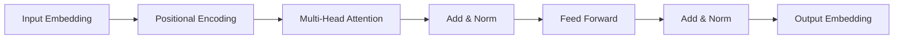

# 大语言模型应用指南：Gemini简介

## 1. 背景介绍
### 1.1 大语言模型概述
#### 1.1.1 大语言模型的定义与特点
大语言模型(Large Language Model, LLM)是一类基于海量文本数据训练的语言模型,通过学习文本数据中的词语、句法、语义等各种语言知识,构建对自然语言的深层理解能力。与传统的语言模型相比,大语言模型具有参数量大、语言理解能力强等特点。

#### 1.1.2 大语言模型的发展历程
大语言模型的发展可以追溯到2018年GPT-1的诞生,此后各大科技公司和研究机构纷纷开展大语言模型的研究,代表性的模型包括OpenAI的GPT系列、Google的BERT、T5等。近年来,随着算力的提升和训练数据的扩充,大语言模型的性能不断刷新纪录,呈现出参数量大幅增长、语言理解能力显著提升的趋势。

### 1.2 大语言模型的应用现状
#### 1.2.1 自然语言处理领域的应用
大语言模型在自然语言处理(NLP)领域得到了广泛应用,包括文本分类、命名实体识别、关系抽取、机器翻译、文本摘要、问答系统等任务。大语言模型强大的语言理解和生成能力,极大地提升了这些任务的性能表现。

#### 1.2.2 知识图谱构建与应用
大语言模型蕴含着丰富的世界知识和常识性知识,可以用于辅助知识图谱的构建。通过大语言模型,可以从非结构化文本中抽取实体、关系等知识要素,减少知识获取的人力成本。同时,大语言模型也可以用于知识图谱的补全、问答等下游应用任务。

#### 1.2.3 交互式AI系统
得益于大语言模型出色的语言理解和生成能力,一些创新性的交互式AI系统开始涌现。比如智能对话系统、AI写作助手、代码生成助手等,这些系统能够与人进行自然流畅的交互,极大提升了人机交互的体验。

### 1.3 Gemini模型简介
Gemini是由OpenAI开发的一个大规模多语言预训练模型,旨在实现高质量的跨语言迁移学习。Gemini使用了100多种语言的海量语料进行预训练,构建了强大的跨语言语义表示能力。Gemini不仅在英语上有优异表现,在许多低资源语言上也取得了不错的效果,为构建多语言NLP应用提供了新的思路。

## 2. 核心概念与联系
### 2.1 Transformer架构
#### 2.1.1 Transformer的提出与特点
Transformer是一种基于自注意力机制的神经网络架构,由Vaswani等人在2017年提出。与此前广泛使用的RNN、CNN等架构相比,Transformer抛弃了递归和卷积操作,完全依靠注意力机制来建模序列数据。Transformer的特点包括:
- 采用自注意力机制,可以并行计算,大幅提升训练效率
- 引入位置编码,使模型能够捕捉序列中的位置信息  
- 使用多头注意力,增强模型的表达能力
- 采用残差连接和层归一化,加速模型收敛

#### 2.1.2 Transformer的编码器-解码器结构
Transformer采用了编码器-解码器(Encoder-Decoder)的结构,如下图所示:



编码器由若干个相同的层堆叠而成,每一层包含两个子层:多头自注意力层和前馈神经网络层。解码器的结构与编码器类似,但在编码器的基础上增加了一个多头注意力层,用于关注编码器的输出。

Transformer在机器翻译任务上取得了重大突破,此后被广泛应用于NLP的各个任务中,也成为大语言模型的主流架构选择。

### 2.2 预训练与微调
#### 2.2.1 预训练的概念与意义
预训练(Pre-training)是指在大规模无监督数据上训练通用的语言表示模型,然后将其应用到下游的NLP任务中。预训练的意义在于:
- 从海量无监督数据中学习语言的通用表示,捕捉词汇、句法、语义等多层次的语言知识
- 降低对标注数据的依赖,减少人力标注成本
- 提供良好的模型初始化,加速下游任务的训练过程
- 实现更广泛的迁移学习,提升低资源任务的性能

#### 2.2.2 微调的概念与方法
微调(Fine-tuning)是指在预训练模型的基础上,使用任务特定的标注数据对模型进行进一步训练,使其适应具体的应用场景。微调的一般步骤如下:
1. 在预训练模型的顶部添加任务特定的输出层
2. 使用较小的学习率,对整个模型进行端到端的训练
3. 在开发集上进行调参,选择最优模型
4. 在测试集上评估模型性能

微调使得预训练模型能够快速适应新任务,充分利用预训练阶段学到的语言知识,在少量标注数据的情况下也能取得不错的效果。

### 2.3 Zero-shot与Few-shot学习
#### 2.3.1 Zero-shot学习
Zero-shot学习是指在没有任何标注数据的情况下,直接使用预训练模型进行推理预测。大语言模型蕴含了丰富的世界知识和常识性知识,具备一定的语言理解和逻辑推理能力,使得Zero-shot学习成为可能。

Zero-shot学习可以用于一些常见的NLP任务,如情感分类、文本蕴含、实体识别等。研究人员通过精心设计输入的提示(Prompt),引导模型输出所需的结果。例如对于情感分类任务,可以设计如下的提示:

```
输入:这部电影太棒了,我强烈推荐!
问题:上述句子的情感倾向是什么?
回答:
```

模型能够根据提示中的问题,输出"积极"或"正面"的情感倾向。Zero-shot学习极大地拓展了预训练模型的应用范围,无需标注数据就能实现多种NLP任务。

#### 2.3.2 Few-shot学习
Few-shot学习是指在少量标注数据(如每个类别10个样本)的情况下,对预训练模型进行快速适应。与传统的微调方式相比,Few-shot学习的样本效率更高,对标注数据的需求更少。

Few-shot学习的关键是提示工程(Prompt Engineering),即如何设计输入的提示,让模型快速理解任务并给出正确的输出。一种常见的思路是将任务转化为语言建模问题,通过在输入中添加必要的指令和少量示例,让模型在上下文的引导下输出答案。例如对于情感分类任务,可以设计如下的Few-shot提示:

```
输入:这部电影太棒了,我强烈推荐!
问题:上述句子的情感倾向是什么?
示例1:
句子:这家餐厅的服务太差了,再也不会来了。
情感:消极
示例2:
句子:今天的天气真不错,心情大好!
情感:积极
示例3:
句子:这次考试发挥失常,有点失望。 
情感:消极
回答:
```

模型通过示例来理解情感分类任务的规则,在新样本上给出正确的预测。Few-shot学习进一步提升了预训练模型的泛化能力,使其能够快速适应新任务。

## 3. 核心算法原理与具体步骤
### 3.1 Gemini的预训练过程
#### 3.1.1 数据准备
Gemini使用了100多种语言的海量语料进行预训练,语料来源包括书籍、新闻、社交媒体等。为了保证数据质量,需要对语料进行一系列清洗和过滤,主要步骤如下:
1. 去除重复和低质量的文本
2. 统一文本格式,处理编码问题
3. 对文本进行分词、词性标注等预处理
4. 平衡不同语言的数据量,防止数据偏斜

#### 3.1.2 预训练目标与损失函数
Gemini采用了Masked Language Modeling(MLM)和Translation Language Modeling(TLM)两种预训练目标:
- MLM:随机Mask掉句子中的部分Token,让模型根据上下文预测被Mask掉的Token。MLM能够帮助模型学习词汇、句法等语言知识。
- TLM:将不同语言的平行句对作为输入,随机Mask掉某些Token,让模型根据源语言和目标语言的上下文预测被Mask掉的Token。TLM能够帮助模型学习不同语言之间的对齐关系,建立跨语言的语义表示。

MLM和TLM的损失函数都是交叉熵损失,即最小化预测分布与真实分布之间的差异:

$$
L_{MLM}=-\sum_{i\in M}log P(x_i|x_{\backslash M})
$$

$$
L_{TLM}=-\sum_{i\in M}log P(x_i|x_{\backslash M},y)
$$

其中$M$表示被Mask的Token集合,$x_{\backslash M}$表示未被Mask的Token,$y$表示另一种语言的句子。

#### 3.1.3 训练策略
为了提升模型的性能和泛化能力,Gemini在预训练阶段采用了以下策略:
- 动态Masking:每次迭代动态生成Mask,增加输入的多样性
- 子词粒度的Masking:在词粒度和字符粒度之间随机Mask,兼顾不同语言的特点
- 大批量训练:使用2048个样本的大Batch进行训练,加速收敛过程
- 梯度累积:在每个Batch中累积多次梯度,然后再进行参数更新,节约显存开销
- 学习率预热和衰减:在训练初期使用较小的学习率,然后逐渐提高并最终衰减,有助于模型收敛

### 3.2 下游任务微调
#### 3.2.1 输入表示
对于特定的下游任务,需要将任务输入转化为Gemini可以处理的格式。以文本分类任务为例,可以将样本转化为如下形式:

```
[CLS] 文本 [SEP] [EOS]
```

其中`[CLS]`表示分类标记,用于提取整个句子的表示,`[SEP]`表示句子之间的分隔符,`[EOS]`表示句子的结束标记。

#### 3.2.2 输出表示
在Gemini的顶部添加一个线性分类器,将`[CLS]`位置的向量表示作为整个句子的语义表示,输入到分类器中进行分类。分类器的输出为每个类别的概率分布:

$$
P(c|x)=softmax(W\cdot h_{[CLS]}+b)
$$

其中$h_{[CLS]}$表示`[CLS]`位置的向量表示,$W$和$b$为分类器的参数。

#### 3.2.3 微调过程
将预训练的Gemini模型和任务特定的分类器组合成完整的模型,使用标注数据进行端到端的微调。微调的目标是最小化交叉熵损失:

$$
L=-\sum_{i=1}^N log P(y_i|x_i)
$$

其中$N$为训练样本数,$y_i$为样本$i$的真实标签。

在微调过程中,一般使用以下策略:
- 较小的学习率(如2e-5),避免破坏预训练的参数
- 较小的Batch Size(如16或32),减少显存占用
- 早停机制,防止过拟合
- 对不同的任务进行超参数调优,如学习率、Batch Size、训练轮数等

微调后的模型可以直接用于对新样本进行预测,完成下游任务。

## 4. 数学模型与公式详解
### 4.1 Transformer的核心公式
#### 4.1.1 自注意力机制
自注意力机制是Transformer的核心组件,用于捕捉序列内部的依赖关系。对于一个长度为$n$的输入序列$X\in \mathbb{R}^{n\times d}$,自注意力的