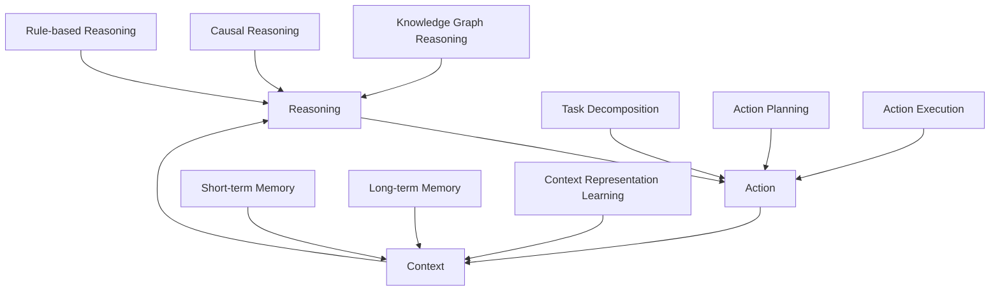

# 大语言模型应用指南：ReAct 框架

## 1. 背景介绍
### 1.1 大语言模型的发展历程
### 1.2 大语言模型面临的挑战
### 1.3 ReAct框架的提出背景

## 2. 核心概念与联系  
### 2.1 大语言模型的定义与特点
#### 2.1.1 定义
#### 2.1.2 特点
### 2.2 ReAct框架的核心理念
#### 2.2.1 基于Reasoning的交互式对话
#### 2.2.2 基于Action的任务完成
#### 2.2.3 基于Context的上下文理解
### 2.3 ReAct框架与传统大语言模型的区别
#### 2.3.1 交互方式的差异
#### 2.3.2 任务完成能力的差异
#### 2.3.3 上下文理解能力的差异

## 3. 核心算法原理具体操作步骤
### 3.1 ReAct框架的整体架构
### 3.2 Reasoning模块
#### 3.2.1 基于知识图谱的推理
#### 3.2.2 基于因果关系的推理
#### 3.2.3 基于逻辑规则的推理
### 3.3 Action模块 
#### 3.3.1 任务分解
#### 3.3.2 动作规划
#### 3.3.3 动作执行
### 3.4 Context模块
#### 3.4.1 短期记忆机制
#### 3.4.2 长期记忆机制
#### 3.4.3 上下文表示学习

## 4. 数学模型和公式详细讲解举例说明
### 4.1 Reasoning模块的数学建模
#### 4.1.1 知识图谱嵌入模型
#### 4.1.2 马尔可夫逻辑网络
### 4.2 Action模块的数学建模
#### 4.2.1 马尔可夫决策过程
#### 4.2.2 层次化强化学习
### 4.3 Context模块的数学建模  
#### 4.3.1 记忆增强神经网络
#### 4.3.2 动态记忆网络

## 5. 项目实践：代码实例和详细解释说明
### 5.1 ReAct框架的代码实现
#### 5.1.1 Reasoning模块的代码实现
#### 5.1.2 Action模块的代码实现
#### 5.1.3 Context模块的代码实现
### 5.2 基于ReAct框架的对话系统Demo
#### 5.2.1 Demo功能介绍
#### 5.2.2 Demo的交互实例展示
#### 5.2.3 Demo背后的技术解析

## 6. 实际应用场景
### 6.1 智能客服
#### 6.1.1 客户意图理解
#### 6.1.2 个性化问题解答
#### 6.1.3 客户满意度提升
### 6.2 智能助手
#### 6.2.1 日程管理
#### 6.2.2 信息检索
#### 6.2.3 任务自动化执行
### 6.3 知识问答
#### 6.3.1 领域知识库构建
#### 6.3.2 问题理解与分析
#### 6.3.3 答案生成与优化

## 7. 工具和资源推荐
### 7.1 ReAct框架的开源实现
### 7.2 相关论文与学习资料
### 7.3 开发工具与环境配置指南

## 8. 总结：未来发展趋势与挑战
### 8.1 ReAct框架的优势总结
### 8.2 面临的技术挑战 
#### 8.2.1 推理能力的进一步提升
#### 8.2.2 任务规划的智能优化
#### 8.2.3 上下文理解的鲁棒性
### 8.3 未来的发展方向
#### 8.3.1 多模态信息的融合处理
#### 8.3.2 人机协同互动
#### 8.3.3 个性化用户建模

## 9. 附录：常见问题与解答
### 9.1 ReAct框架与GPT-3的区别？
### 9.2 ReAct框架能否支持多轮对话？
### 9.3 ReAct框架对计算资源的要求高吗？
### 9.4 如何评估ReAct框架的性能表现？
### 9.5 ReAct框架能否适用于垂直领域？

大语言模型（Large Language Model，LLM）作为自然语言处理领域的重要里程碑，展现了令人惊叹的语言理解和生成能力。然而，传统的大语言模型在实际应用中仍然面临诸多挑战，如缺乏推理能力、难以完成复杂任务、对上下文理解能力有限等。为了突破这些瓶颈，ReAct框架应运而生。

ReAct框架是一种全新的大语言模型应用范式，它的核心理念是将"Reasoning（推理）"、"Action（行动）"和"Context（上下文）"三个模块有机结合，赋予大语言模型更强大的智能化能力。通过Reasoning模块，ReAct框架可以基于知识图谱、因果关系和逻辑规则进行深度推理，生成更加合理、连贯的回复。Action模块则负责对用户需求进行任务分解、动作规划和执行，使得大语言模型能够完成一些实际的任务，如信息检索、数据分析等。Context模块通过短期记忆和长期记忆机制，持续学习和更新对话上下文的表示，增强了大语言模型对上下文的理解能力。

在算法原理方面，ReAct框架巧妙地融合了多种先进的人工智能技术。Reasoning模块采用知识图谱嵌入和马尔可夫逻辑网络等方法，将结构化的知识表示与概率推理相结合。Action模块则借鉴了强化学习领域的马尔可夫决策过程和层次化学习策略，实现了任务的自主规划与执行。Context模块则使用记忆增强神经网络和动态记忆网络等技术，动态捕捉和存储对话过程中的关键信息。

为了让读者更直观地理解ReAct框架的工作原理，本文提供了详细的代码实例和解释说明。通过一个基于ReAct框架的对话系统Demo，读者可以切身体验ReAct框架在实际应用中的优异表现。无论是智能客服、个人助理还是知识问答，ReAct框架都能够提供更加智能、高效、人性化的服务。

展望未来，ReAct框架还有许多值得探索的方向。如何进一步提升推理能力、优化任务规划策略、增强上下文理解的鲁棒性等，都是亟待攻克的难题。此外，如何将视觉、语音等多模态信息与文本信息深度融合，实现人机协同互动，也是一个充满想象力的研究课题。随着ReAct框架的不断发展和完善，相信它必将在智能对话、知识服务等领域开辟出广阔的应用前景。

作为开发者和研究者，我们应该积极拥抱ReAct框架带来的机遇与挑战。通过不断学习和实践，深入理解ReAct框架的内在原理，并将其应用到实际的项目中去。让我们携手并进，共同推动人工智能技术的发展，创造更加美好的未来！

作者：禅与计算机程序设计艺术 / Zen and the Art of Computer Programming