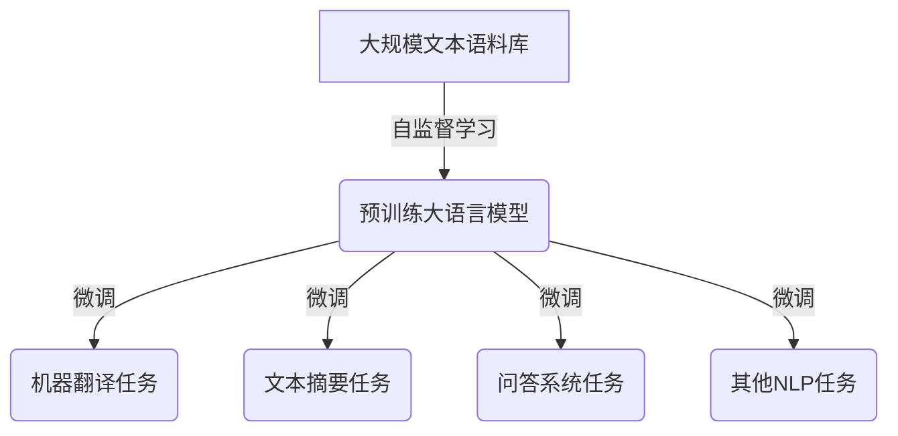

# 大语言模型应用指南：入门

## 1. 背景介绍

### 1.1 什么是大语言模型?

大语言模型(Large Language Model, LLM)是一种基于深度学习的自然语言处理(NLP)模型,它能够通过训练大量文本数据来学习人类语言的模式和结构。这些模型具有惊人的语言生成能力,可以产生看似人类写作的连贯、流畅的文本输出。

大语言模型的出现源于transformer模型架构的发展,尤其是自注意力机制和自回归语言模型的结合。自注意力机制使模型能够有效地捕捉长距离依赖关系,而自回归语言模型则允许模型根据先前生成的文本来预测下一个单词或标记。

### 1.2 大语言模型的重要性

大语言模型在自然语言处理领域引起了广泛关注,因为它们展示了令人印象深刻的语言理解和生成能力。这些模型可以应用于各种任务,如机器翻译、文本摘要、问答系统、内容生成等。它们还被用于提高其他人工智能系统的性能,例如通过提供上下文理解来增强对话代理的能力。

大语言模型的出现标志着人工智能在自然语言处理方面取得了重大进展。它们的强大能力引发了对人工智能系统可能达到"人工通用智能"(Artificial General Intelligence, AGI)的讨论和探索。

## 2. 核心概念与联系

### 2.1 自监督学习

大语言模型通常采用自监督学习(Self-Supervised Learning)的方式进行训练。与监督学习不同,自监督学习不需要人工标注的数据集,而是利用原始文本数据本身作为监督信号。

常见的自监督学习任务包括:

- **掩码语言模型(Masked Language Modeling, MLM)**: 随机掩码部分输入词元,模型需要预测被掩码的词元。
- **下一句预测(Next Sentence Prediction, NSP)**: 给定两个句子,模型需要预测它们是否连续出现。
- **因果语言模型(Causal Language Modeling, CLM)**: 模型需要根据先前的词元预测下一个词元。

通过这些任务,大语言模型可以学习到文本中的语义和语法模式,从而获得强大的语言理解和生成能力。

### 2.2 transformer架构

transformer是大语言模型中广泛采用的核心架构。它完全基于注意力机制,不依赖于循环神经网络(RNN)或卷积神经网络(CNN)。transformer的主要组件包括:

- **编码器(Encoder)**: 处理输入序列,生成其表示。
- **解码器(Decoder)**: 基于编码器的输出和先前生成的输出,生成目标序列。
- **多头注意力(Multi-Head Attention)**: 允许模型同时关注输入序列的不同位置。
- **位置编码(Positional Encoding)**: 注入序列位置信息,因为transformer没有内在的位置信息。

transformer架构的优势在于并行计算能力强、能够有效地捕捉长距离依赖关系,以及避免梯度消失或爆炸的问题。这使得transformer成为训练大型语言模型的理想选择。

### 2.3 预训练与微调

大语言模型通常采用两阶段训练过程:

1. **预训练(Pre-training)**: 在大规模文本语料库上进行自监督学习,获得通用的语言表示能力。
2. **微调(Fine-tuning)**: 在特定任务的标注数据集上进行监督学习,将预训练模型调整以适应目标任务。

预训练阶段允许模型从海量数据中学习丰富的语言知识,而微调阶段则使模型专门化以解决特定任务。这种"先学会语言,再学习任务"的范式已被证明在各种NLP任务中非常有效。

## 3. 核心算法原理具体操作步骤

### 3.1 transformer编码器

transformer编码器的核心是多头注意力机制。它允许模型同时关注输入序列的不同位置,捕捉它们之间的依赖关系。具体操作步骤如下:

1. **嵌入层(Embedding Layer)**: 将输入词元映射到连续的向量空间。
2. **位置编码(Positional Encoding)**: 将位置信息编码到嵌入向量中,使transformer能够捕捉序列的顺序信息。
3. **多头注意力(Multi-Head Attention)**: 计算查询(Query)、键(Key)和值(Value)之间的注意力分数,并根据分数对值向量进行加权求和,得到注意力输出。
4. **残差连接(Residual Connection)**: 将注意力输出与输入相加,以保留原始信息。
5. **层归一化(Layer Normalization)**: 对残差连接的输出进行归一化,加速训练过程。
6. **前馈网络(Feed-Forward Network)**: 对归一化后的输出应用全连接前馈网络,进一步提取特征。
7. **重复步骤3-6**: 编码器由多个相同的子层堆叠而成,每个子层重复上述步骤。

通过这一过程,transformer编码器可以生成输入序列的上下文化表示,捕捉到序列中的长距离依赖关系。

### 3.2 transformer解码器

transformer解码器的工作原理与编码器类似,但增加了一些额外的机制来处理序列生成任务。具体操作步骤如下:

1. **嵌入层(Embedding Layer)**: 将输入词元映射到连续的向量空间。
2. **掩码多头注意力(Masked Multi-Head Attention)**: 计算查询、键和值之间的注意力分数,但掩码掉未来位置的信息,以保证自回归属性。
3. **编码器-解码器注意力(Encoder-Decoder Attention)**: 计算解码器的查询与编码器输出的键和值之间的注意力分数,将编码器的上下文信息融入解码器。
4. **残差连接(Residual Connection)**: 将注意力输出与输入相加,以保留原始信息。
5. **层归一化(Layer Normalization)**: 对残差连接的输出进行归一化,加速训练过程。
6. **前馈网络(Feed-Forward Network)**: 对归一化后的输出应用全连接前馈网络,进一步提取特征。
7. **输出层(Output Layer)**: 根据前馈网络的输出,预测下一个词元的概率分布。
8. **重复步骤2-7**: 解码器由多个相同的子层堆叠而成,每个子层重复上述步骤。

通过这一过程,transformer解码器可以自回归地生成序列输出,同时利用编码器的上下文信息来指导生成过程。

### 3.3 预训练任务

大语言模型通常在以下两种预训练任务中的一种或两种上进行训练:

1. **掩码语言模型(Masked Language Modeling, MLM)**: 随机掩码部分输入词元,模型需要预测被掩码的词元。这个任务可以让模型学习到双向的语言表示。

2. **因果语言模型(Causal Language Modeling, CLM)**: 模型需要根据先前的词元预测下一个词元。这个任务可以让模型学习到单向的语言表示,适用于序列生成任务。

在预训练过程中,模型会在大规模文本语料库上反复执行这些任务,最小化预测误差,从而学习到通用的语言表示能力。

### 3.4 微调

经过预训练后,大语言模型可以在特定的下游任务上进行微调(Fine-tuning),以适应目标任务的需求。微调的具体操作步骤如下:

1. **准备任务数据集**: 收集并准备好目标任务的训练数据集,包括输入和标签。
2. **设计任务格式**: 将任务数据转换为transformer可以处理的格式,例如将问答任务转换为序列到序列的形式。
3. **初始化模型参数**: 使用预训练好的大语言模型作为初始化参数。
4. **添加任务特定头(Task-Specific Head)**: 在transformer的输出层之后添加任务特定的头部,用于预测目标任务的输出。
5. **训练模型**: 在任务数据集上训练模型,最小化任务损失函数。
6. **评估模型**: 在任务的验证集或测试集上评估模型的性能。
7. **模型部署**: 根据需要将微调后的模型部署到生产环境中。

通过微调,预训练的大语言模型可以将其通用的语言表示能力转移到特定的下游任务上,从而提高任务性能。

## 4. 数学模型和公式详细讲解举例说明

### 4.1 自注意力机制

自注意力机制是transformer的核心组件之一。它允许模型同时关注输入序列的不同位置,捕捉它们之间的依赖关系。

给定一个输入序列 $X = (x_1, x_2, \dots, x_n)$,其中 $x_i \in \mathbb{R}^{d_\text{model}}$ 是 $d_\text{model}$ 维的向量表示,自注意力机制的计算过程如下:

1. 计算查询(Query)、键(Key)和值(Value)向量:

$$
\begin{aligned}
Q &= XW^Q \\
K &= XW^K \\
V &= XW^V
\end{aligned}
$$

其中 $W^Q, W^K, W^V \in \mathbb{R}^{d_\text{model} \times d_k}$ 是可学习的权重矩阵,用于将输入向量映射到查询、键和值空间。

2. 计算注意力分数:

$$
\text{Attention}(Q, K, V) = \text{softmax}\left(\frac{QK^\top}{\sqrt{d_k}}\right)V
$$

注意力分数 $\alpha_{ij}$ 表示查询向量 $q_i$ 对键向量 $k_j$ 的注意力权重,计算方式如下:

$$
\alpha_{ij} = \frac{\exp(q_i^\top k_j / \sqrt{d_k})}{\sum_{l=1}^n \exp(q_i^\top k_l / \sqrt{d_k})}
$$

其中 $\sqrt{d_k}$ 是一个缩放因子,用于防止内积值过大导致梯度消失或爆炸。

3. 加权求和值向量:

$$
\text{Attention}(Q, K, V) = \sum_{j=1}^n \alpha_{ij}v_j
$$

注意力输出是所有值向量的加权和,其中权重由注意力分数决定。

通过自注意力机制,transformer可以动态地捕捉输入序列中任意两个位置之间的依赖关系,而不受序列长度的限制。

### 4.2 多头注意力

为了进一步提高模型的表示能力,transformer采用了多头注意力(Multi-Head Attention)机制。多头注意力将注意力机制独立运行多次,每次关注输入序列的不同子空间表示,然后将这些子空间的表示进行拼接。

具体来说,给定查询 $Q$、键 $K$ 和值 $V$,多头注意力的计算过程如下:

1. 将查询、键和值分别线性投影到 $h$ 个子空间:

$$
\begin{aligned}
Q_i &= QW_i^Q & K_i &= KW_i^K & V_i &= VW_i^V & \text{for } i = 1, \dots, h
\end{aligned}
$$

其中 $W_i^Q, W_i^K, W_i^V \in \mathbb{R}^{d_\text{model} \times d_k}$ 是可学习的权重矩阵。

2. 在每个子空间中计算自注意力:

$$
\text{head}_i = \text{Attention}(Q_i, K_i, V_i) \quad \text{for } i = 1, \dots, h
$$

3. 将所有子空间的注意力输出拼接:

$$
\text{MultiHead}(Q, K, V) = \text{Concat}(\text{head}_1, \dots, \text{head}_h)W^O
$$

其中 $W^O \in \mathbb{R}^{hd_k \times d_\text{model}}$ 是可学习的权重矩阵,用于将拼接后的向量投影回 $d_\text{model}$ 维空间。

通过多头注意力机制,transformer可以从不同的子空间中捕捉不同的