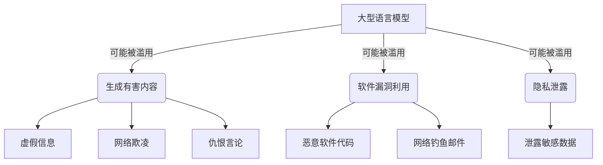
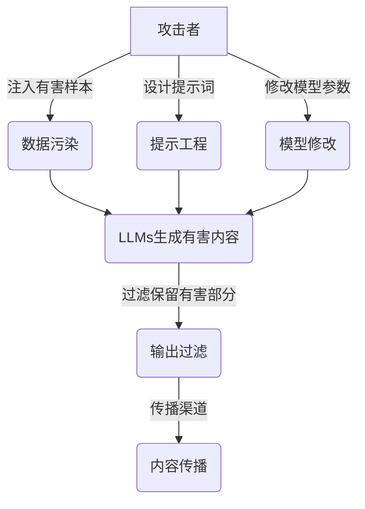
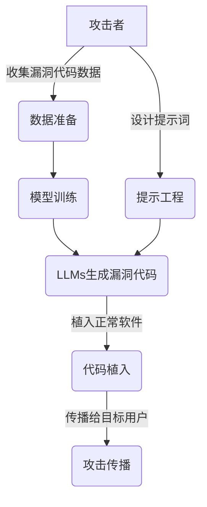
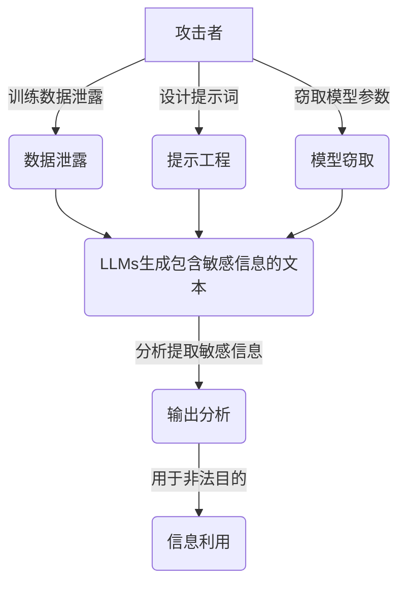

# 大语言模型应用指南：攻击策略

## 1. 背景介绍

随着人工智能技术的快速发展,大型语言模型(Large Language Models, LLMs)已经成为当前最具影响力的人工智能技术之一。LLMs是一种基于深度学习的自然语言处理模型,能够从海量文本数据中学习语言模式和知识,并用于各种自然语言处理任务,如机器翻译、文本摘要、问答系统等。

近年来,LLMs的性能不断提高,模型规模也在不断扩大。以GPT-3为代表的大型语言模型展现出了惊人的语言生成能力,可以生成看似人类水平的文本。这些模型在自然语言处理领域取得了突破性进展,但也引发了一些安全和隐私方面的担忧。

其中,LLMs被滥用于生成有害内容(如虚假信息、网络欺凌、仇恨言论等)是一个值得重视的问题。由于LLMs可以生成逼真的文本,这使得有心人士能够利用它们来制造虚假信息和宣传,从而误导公众舆论、破坏社会秩序。此外,LLMs也可能被用于生成恶意软件代码、网络钓鱼邮件等,对网络安全和个人隐私构成威胁。

为了应对这些挑战,我们需要研究LLMs在不同场景下的攻击面,并制定相应的防御策略。本文将重点探讨LLMs在生成有害内容、软件漏洞利用、隐私泄露等方面的潜在威胁,并提出一些缓解措施和最佳实践。

## 2. 核心概念与联系

### 2.1 大型语言模型(LLMs)

大型语言模型是一种基于深度学习的自然语言处理模型,通过从海量文本数据中学习语言模式和知识,从而获得强大的语言生成能力。LLMs通常采用transformer架构,包含数十亿甚至数万亿个参数,能够捕捉复杂的语言结构和语义关系。

著名的LLMs包括GPT-3、BERT、XLNet、RoBERTa等。这些模型在机器翻译、文本摘要、问答系统等自然语言处理任务中表现出色,并展现出惊人的语言生成能力。

### 2.2 有害内容生成

有害内容是指那些可能对个人或社会造成伤害的内容,包括虚假信息、网络欺凌、仇恨言论、色情内容等。由于LLMs能够生成逼真的文本,因此存在被滥用于生成有害内容的风险。

例如,恶意行为者可以利用LLMs生成虚假新闻、宣传信息等,误导公众舆论;也可能生成网络欺凌、仇恨言论等有害言论,伤害他人;还可能生成色情内容等令人反感的内容。

### 2.3 软件漏洞利用

除了文本生成,LLMs也可能被用于生成恶意软件代码、网络钓鱼邮件等,对网络安全和个人隐私构成威胁。

恶意行为者可以利用LLMs生成包含漏洞的软件代码,并将其植入正常软件中,从而获取系统控制权限。他们还可以生成看似合法的网络钓鱼邮件,诱使用户泄露敏感信息。

### 2.4 隐私泄露

LLMs在训练过程中会吸收大量文本数据,这些数据可能包含个人隐私信息、商业机密等敏感内容。如果LLMs在生成文本时泄露了这些信息,将会给个人和企业带来隐私和安全风险。

此外,LLMs也可能被用于生成个人身份信息(如身份证号、银行账号等),从而被滥用于身份盗窃等违法犯罪活动。

上述这些LLMs的攻击面都与其强大的语言生成能力密切相关。因此,我们需要研究LLMs在不同场景下的潜在威胁,并制定相应的防御策略,以确保这项技术的安全可靠应用。

## 3. 核心算法原理具体操作步骤

### 3.1 生成有害内容的攻击原理

LLMs生成有害内容的攻击原理可以概括为以下几个步骤:

1. **数据污染**: 攻击者可以在LLMs的训练数据中注入有害样本(如虚假信息、仇恨言论等),使模型在生成文本时倾向于产生有害内容。

2. **提示工程**: 攻击者可以精心设计提示词(prompt),引导LLMs生成特定类型的有害内容。例如,使用"写一篇关于XXX的虚假新闻"作为提示词,就可能诱使模型生成虚假信息。

3. **模型修改**: 攻击者还可以直接修改LLMs的模型参数,使其在生成文本时遵循特定的有害模式。

4. **输出过滤**: 由于LLMs生成的原始输出可能包含一些有害内容,攻击者需要对输出进行过滤,保留有害部分,删除无关部分。

5. **内容传播**: 最后,攻击者会通过各种渠道(如社交媒体、论坛等)传播生成的有害内容,达到误导舆论、破坏秩序等目的。

### 3.2 软件漏洞利用的攻击原理

利用LLMs进行软件漏洞利用的攻击原理主要包括以下几个步骤:

1. **数据准备**: 攻击者需要收集包含已知软件漏洞代码的数据集,用于训练LLMs生成具有相似漏洞的代码。

2. **模型训练**: 使用准备好的数据集训练LLMs,使其能够生成包含特定漏洞的代码。

3. **提示工程**: 设计合适的提示词,引导LLMs生成期望的漏洞代码。例如,使用"生成一个XXX漏洞的代码示例"作为提示词。

4. **代码生成**: 利用训练好的LLMs生成包含漏洞的恶意代码。

5. **代码植入**: 将生成的恶意代码植入正常软件中,以实现对系统的控制或执行其他恶意操作。

6. **攻击传播**: 将含有恶意代码的软件传播给目标用户,实现大规模攻击。

### 3.3 隐私泄露的攻击原理

利用LLMs导致隐私泄露的攻击原理可以分为以下几个步骤:

1. **数据泄露**: 在LLMs的训练数据中可能包含了敏感信息,如个人隐私、商业机密等。如果这些信息被模型学习并在生成文本时泄露出来,就会导致隐私泄露。

2. **提示工程**: 攻击者可以设计特定的提示词,诱使LLMs生成包含敏感信息的文本。例如,使用"生成一份包含XX公司机密的报告"作为提示词。

3. **模型窃取**: 攻击者还可以尝试从LLMs中窃取模型参数,并基于这些参数重建模型,从而获取模型中存储的敏感信息。

4. **输出分析**: 攻击者需要对LLMs生成的文本输出进行分析,识别和提取出其中的敏感信息。

5. **信息利用**: 最后,攻击者可以将获取的敏感信息用于各种非法目的,如身份盗窃、内幕交易等。

上述攻击原理揭示了LLMs在生成有害内容、软件漏洞利用和隐私泄露等方面的潜在威胁。攻击者可以通过多种手段滥用LLMs的强大语言生成能力,实现各种恶意目的。因此,我们需要制定有效的防御策略,确保LLMs的安全可靠应用。

## 4. 数学模型和公式详细讲解举例说明

### 4.1 LLMs的基本数学模型

大型语言模型(LLMs)通常基于transformer架构,使用自注意力(Self-Attention)机制来捕捉输入序列中的长程依赖关系。transformer的核心思想是将序列建模问题转化为序列到序列(Sequence-to-Sequence)的映射问题,通过编码器(Encoder)和解码器(Decoder)两个模块实现。

编码器的作用是将输入序列映射到一个连续的表示(Representation),而解码器则根据这个表示生成目标序列。在自然语言处理任务中,输入序列通常是源语言的文本,而目标序列则是目标语言的文本(如机器翻译)或者其他任务的输出(如文本摘要、问答等)。

transformer模型中的自注意力机制可以用数学公式表示如下:

$$
\mathrm{Attention}(Q, K, V) = \mathrm{softmax}\left(\frac{QK^T}{\sqrt{d_k}}\right)V
$$

其中:

- $Q$是查询(Query)向量,用于计算注意力权重
- $K$是键(Key)向量,也用于计算注意力权重
- $V$是值(Value)向量,代表要关注的信息
- $d_k$是缩放因子,用于防止点积过大导致的梯度消失问题

自注意力机制的核心思想是通过计算查询向量$Q$与所有键向量$K$的相似性(点积),得到一个注意力权重向量,然后将这个权重向量与值向量$V$相乘,从而获得加权后的表示。这种机制使transformer能够自适应地为每个位置分配注意力权重,捕捉输入序列中的长程依赖关系。

在LLMs中,transformer架构被广泛应用,并通过增加模型规模(如GPT-3)和改进注意力机制(如Longformer、Reformer等),显著提高了模型的性能和泛化能力。

### 4.2 LLMs的生成过程

LLMs通过语言模型(Language Model)的方式来生成文本。语言模型的目标是估计一个文本序列$X=\{x_1, x_2, \ldots, x_n\}$的概率$P(X)$,其中$x_i$表示序列中的第$i$个token(如单词或子词)。

根据链式法则,序列的概率可以分解为:

$$
P(X) = \prod_{i=1}^n P(x_i | x_1, \ldots, x_{i-1})
$$

也就是说,生成第$i$个token的概率取决于之前生成的所有token。

在LLMs中,上述条件概率通常由transformer模型来估计,模型的输出是一个概率向量,表示生成每个可能token的概率。在生成文本时,模型会根据这个概率向量采样(或选择概率最大的token),作为下一个token的输出。

具体来说,设$h_i$表示